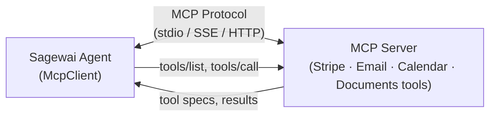

export const metadata = {
  title: 'MCP protocol reference — Model Context Protocol in Sagewai',
  description:
    'Sagewai\'s MCP client and server implementation. Discover tools from MCP servers; expose Sagewai agents as MCP tools to Claude Code, Cursor, and others.',
  alternates: { canonical: 'https://docs.sagewai.ai/docs/api-reference/mcp' },
};

# MCP Protocol Reference

The Model Context Protocol (MCP) is an open standard for connecting AI agents to external tools and data sources. Sagewai ships both an MCP client — to discover and call tools from any MCP server — and MCP server hosting, so you can expose Sagewai agents as MCP tools to Claude Code, Cursor, or any other MCP-capable client.

## Overview



---

## McpClient

### Connecting to MCP Servers

Sagewai's `McpClient` supports three transport mechanisms:

#### Stdio Transport

The most common transport. Launches an MCP server as a subprocess and communicates over stdin/stdout using JSON-RPC.

```python
from sagewai.mcp.client import McpClient

# Connect to an MCP server binary
tools = await McpClient.connect(["python", "-m", "mcp_stripe"])

# With environment variables
tools = await McpClient.connect(
    ["node", "mcp-server-email"],
    env={"SMTP_HOST": "mail.example.com"},
)

# With working directory
tools = await McpClient.connect(
    ["./my-mcp-server"],
    cwd="/opt/mcp-servers",
)
```

#### SSE Transport

Connect to a remote MCP server over Server-Sent Events (HTTP/2).

```python
tools = await McpClient.connect_sse("http://localhost:8080/sse")

# With authentication header
tools = await McpClient.connect_sse(
    "https://mcp.example.com/sse",
    headers={"Authorization": "Bearer token-123"},
)
```

#### Streamable HTTP Transport

Connect to a remote MCP server over standard HTTP with streaming support.

```python
tools = await McpClient.connect_http("http://localhost:8080/mcp")

# With authentication
tools = await McpClient.connect_http(
    "https://mcp.example.com/mcp",
    headers={"Authorization": "Bearer token-123"},
)
```

### Using Discovered Tools

All `connect*` methods return a `list[ToolSpec]` that plugs directly into any agent:

```python
# Discover tools from multiple MCP servers
stripe_tools = await McpClient.connect(["python", "-m", "mcp_stripe"])
email_tools = await McpClient.connect(["node", "mcp-email"])

# Combine and use with an agent
all_tools = stripe_tools + email_tools

agent = UniversalAgent(
    name="operations-agent",
    model="gpt-4o",
    tools=all_tools,
)

result = await agent.chat("Send a receipt for the last payment to the customer")
```

---

## MCP Server Hosting

Expose Sagewai agents as MCP servers for other tools and agents to discover and call.

```python
from sagewai.mcp.server import create_mcp_server

# Create an MCP server from an agent
server = create_mcp_server(
    agent=my_agent,
    name="research-server",
    description="AI research agent available as MCP tool",
)

# Run as stdio server (for subprocess transport)
await server.run_stdio()

# Or run as SSE server (for network transport)
await server.run_sse(port=8080)
```

---

## Tool Schema

MCP tools use JSON Schema for parameter definitions. When Sagewai discovers tools from an MCP server, each tool is converted to a `ToolSpec`:

```json
{
  "name": "stripe_create_charge",
  "description": "Create a new charge in Stripe",
  "parameters": {
    "type": "object",
    "properties": {
      "amount": {
        "type": "integer",
        "description": "Amount in cents"
      },
      "currency": {
        "type": "string",
        "description": "Three-letter currency code (e.g., usd)"
      },
      "customer_id": {
        "type": "string",
        "description": "Stripe customer ID"
      }
    },
    "required": ["amount", "currency"]
  }
}
```

The `ToolSpec` includes:
- **name** — Tool identifier (must be unique within an agent)
- **description** — Human-readable description (sent to the LLM)
- **parameters** — JSON Schema defining accepted parameters
- **handler** — Function that executes when the tool is called

---

## Available MCP Servers

The Sagewai monorepo includes 9 pre-built MCP servers:

| Server | Tools | Description |
|--------|-------|-------------|
| `knowledge-graph` | 12 | Graph queries, entity management, relation CRUD |
| `payments` | 14 | Stripe: charges, customers, invoices, subscriptions |
| `email` | 12 | Send, receive, search, drafts, attachments |
| `documents` | 14 | CRUD, search, folders, sharing, versioning |
| `calendar` | 12 | Event CRUD, scheduling, availability, reminders |
| `slack` | 14 | Channels, messages, threads, notifications |
| `commerce` | 14 | Products, orders, inventory, shipping |
| `travel` | 12 | Destinations, flights, hotels, bookings, itineraries |
| `admin` | 8 | Agent management, run control, health checks |

### Using a Built-in Server

```python
# Connect to the payments MCP server
tools = await McpClient.connect(
    ["python", "-m", "mcp_servers.payments"],
    env={"STRIPE_API_KEY": "sk_test_..."},
)

agent = UniversalAgent(
    name="billing-agent",
    model="gpt-4o",
    tools=tools,
)

result = await agent.chat("Create an invoice for customer cus_123 for $50")
```

---

## Protocol Details

### JSON-RPC Messages

MCP uses JSON-RPC 2.0 over the chosen transport. Key methods:

| Method | Direction | Description |
|--------|-----------|-------------|
| `initialize` | Client -> Server | Establish connection, negotiate capabilities |
| `tools/list` | Client -> Server | Discover available tools |
| `tools/call` | Client -> Server | Execute a tool with arguments |
| `notifications/initialized` | Client -> Server | Client is ready |

### Tool Call Flow

```
1. Agent needs to call a tool
2. McpClient sends tools/call request:
   {
     "jsonrpc": "2.0",
     "id": 1,
     "method": "tools/call",
     "params": {
       "name": "stripe_create_charge",
       "arguments": {"amount": 5000, "currency": "usd"}
     }
   }

3. MCP server executes the tool and returns:
   {
     "jsonrpc": "2.0",
     "id": 1,
     "result": {
       "content": [
         {"type": "text", "text": "Charge ch_abc123 created successfully"}
       ]
     }
   }

4. Result is converted to ToolResult and added to agent conversation
```

---

## Best Practices

1. **Use stdio transport for local servers** — lower latency, simpler setup, no network configuration.

2. **Use SSE/HTTP transport for shared servers** — multiple agents can connect to the same server instance.

3. **Combine tools from multiple servers** — agents are easier to reason about when each tool set is focused on a single domain.

4. **Set timeouts for remote servers** — pass `timeout=30` to `connect_sse` or `connect_http` to avoid blocking on unresponsive servers.

5. **Monitor tool usage** — use the analytics API to track call frequency and success rates per tool.
