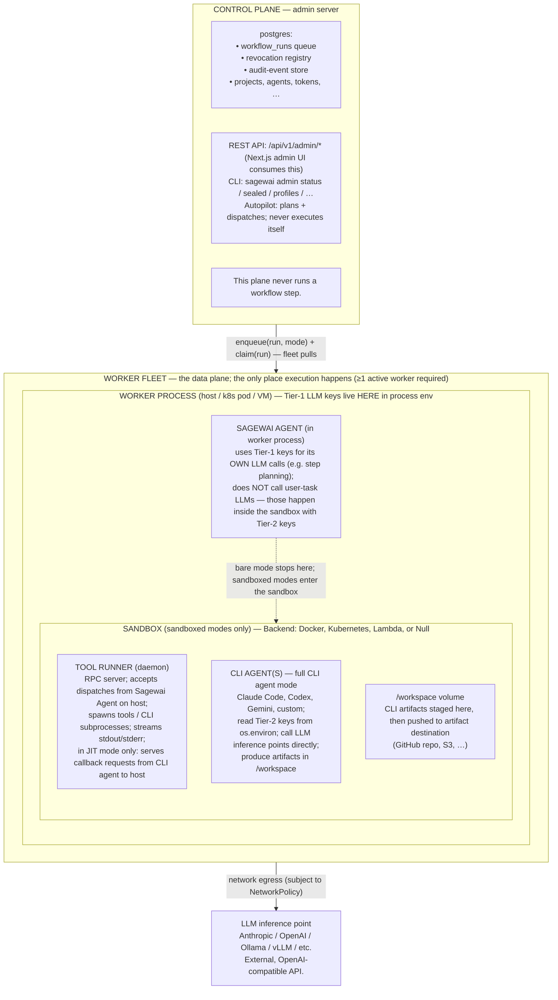

import { TechArticleJsonLd } from '@/components/structured-data';

export const metadata = {
  title: 'Runtime topology — how a Sagewai workflow run executes',
  description:
    'How Sagewai is laid out across processes: control plane plans and persists; worker fleet executes; sandbox is the trust boundary. End-to-end runtime model for operators and integrators.',
  alternates: { canonical: 'https://docs.sagewai.ai/docs/architecture/runtime-topology' },
};

<TechArticleJsonLd
  name="Sagewai runtime topology"
  description="How Sagewai is laid out across the control plane, worker fleet, and sandbox — the end-to-end runtime model."
  path="/docs/architecture/runtime-topology"
  articleSection="Architecture"
/>

# Runtime topology

This page walks through how a Sagewai workflow run executes from end to end. If you're deploying Sagewai, integrating with it, or evaluating it for production, this is the picture you need: which processes exist, what each owns, and what they refuse to do. Everything else in the architecture section (security tiers, execution modes, sandbox backends) sits on top of this topology.

## Before you start

Useful background:

- A working Sagewai install ([getting started](/docs/get-started/quickstart)).
- A rough sense of the [execution modes](/docs/architecture/execution-modes) — bare, sandboxed, identity, full CLI agent.

## The shape in three sentences

Sagewai is a **control plane** plus a **worker fleet** plus a **sandbox** per run.

- The control plane plans, persists, queries, and dispatches. It never runs a workflow step.
- The worker fleet executes. Workers register, advertise capabilities, claim runs, and run the agent loop.
- The sandbox is the trust boundary in any mode beyond `bare` — by design, secrets and CLI agents live inside it and the worker host never sees them in cleartext. Sandbox isolation and the CLI-agent path ship today; the Sealed runtime secret-injection path that places Tier-2 values inside the sandbox is experimental and not yet wired into the default worker (see the Sealed status note under property 3).

The sections below detail each box and the contracts between them.

## Three properties the topology guarantees

These are the load-bearing properties — every other architecture choice in Sagewai assumes them.

### 1. The worker is the only executor

The control plane never runs a workflow step. It writes rows to Postgres, exposes audit and query APIs, and dispatches work onto the queue. A separate fleet of worker processes pulls those rows, claims them atomically, and runs the agent loop.

The practical consequence: planning is cheap. The control plane can plan a million runs without saturating execution capacity. Execution is bounded — worker count caps concurrency independently from planning throughput. A saturated fleet does not stall planning, and a stalled control plane does not corrupt in-flight execution. You can scale, drain, or replace the worker fleet through Kubernetes without ever touching the admin server.

### 2. Execution mode is per-step, not per-deployment

A single workflow run can execute step 1 inline on the worker (`bare` mode), step 2 in an isolated sandbox with no credentials (`sandboxed`), step 3 in a sandbox with a customer's identity injected, and step 4 with a CLI agent like Claude Code in the sandbox. Each step's mode is selected by the workflow author, by the autopilot, or by runtime escalation logic — independently.

You don't pay sandbox cost for a cheap planning step, and you don't lose isolation for a sensitive one. A "build a portfolio site, then summarise what you built" workflow is wasteful if the summarise step also runs full-CLI-agent with customer credentials in scope, and unsafe if the build step runs `bare` with no isolation. The correct shape is mixed; the topology makes mixed the cheap default.

### 3. The sandbox is the trust boundary (when present)

When a step runs in any sandboxed mode, the container is the security boundary. By design, secret values exist inside it, env-injected from the Identity backend at sandbox-start; the worker host knows secret KEY NAMES (persisted on the run row) but never holds plaintext values, and the control plane has access to neither plaintext secrets nor the running sandbox. Today the worker resolves the Sealed Identity cascade and persists those key names at enqueue time — that part ships. The runtime step that injects the resolved Tier-2 values into a live sandbox is the experimental Sealed runtime path: the `SealedSecretProvider` is `None` on the default worker, so live injection (and the redaction, per-key ACL filtering, replay-safe injection, and mid-run revocation that build on it) is not yet wired into the default execution path.

> **Sealed runtime enforcement status.** The per-workload identity model, the external secret backend (HashiCorp Vault), admin profile/secret controls, enqueue-time cascade resolution, and fail-closed revocation checks at enqueue all ship today. Live secret injection into the running sandbox, redaction at the RPC boundary, per-key/per-CLI ACL filtering, replay-safe injection, and mid-run (hard-revoke) abort exist as tested components but do not run in the default worker path — treat them as experimental / maturing. The trust-boundary properties below describe the designed end-state, not a shipped runtime guarantee.

This is what the design lets one worker fleet do: serve many tenants safely. A bug or compromise inside a sandbox is bounded to the sandbox; it cannot reach the worker process, the control plane, or another tenant's sandbox (modulo backend-escape vulnerabilities, which are the backend vendor's problem). The per-run cleanup hook scrubs the env when a sandbox is released to the warm-pool, and the pool discards any sandbox where cleanup fails. The full credential model is in [Security tiers](/docs/architecture/security-tiers).

## Topology

Workers register, get approved, advertise capability labels (`sandbox.backend`, `models_supported`, `project_id`, …), and pull runs whose requirements they match.

**Inside the Sagewai Agent (per claimed run):**

1. Claims run; reads execution mode.
2. Resolves the Identity cascade IF the mode needs customer credentials. Persists key NAMES on the run row. Never sees plaintext values. (Cascade resolution and key-name persistence ship today.)
3. Acquires a sandbox from the pool IF the mode needs isolation.
4. Runs the agent loop appropriate to the mode:
   - **bare** — inline on worker
   - **sandboxed** — via tool runner in sandbox (empty env, isolation only)
   - **+ identity** — designed to add customer keys to the sandbox env (Tier-2 keys, behavior knobs); this runtime injection is the experimental Sealed path and is not wired into the default worker yet
   - **+ CLI agent** — + Claude Code / Codex / … (CLI agent runtime + creds)
   - **+ JIT** — designed to add a bidirectional callback for just-in-time credentials; experimental Sealed path, not in the default worker
5. Persists audit + step state.
6. Releases sandbox (cleanup scrubs env).

LLM calls the Sagewai Agent makes for ITSELF (e.g. step planning) use Tier-1 keys from the worker env; it does NOT call user-task LLMs — those happen inside the sandbox using Tier-2 keys.

## Components

| Component | Where | Owns | Does NOT |
|---|---|---|---|
| **Control plane** (admin server) | host process; the operator's "console" | persistence, planning, dispatch, audit query | execute workflow steps |
| **Worker fleet** | logical: a set of worker processes | capacity scheduling, capability advertisement, run dispatch | hold credentials itself |
| **Worker** | host (Kubernetes pod / VM / bare metal) | claims runs, resolves identity, manages sandbox lifecycle, hosts the Sagewai Agent | hold Tier-2 plaintext secrets |
| **Sagewai Agent** | inside the worker process | reads task + mode, dispatches accordingly; uses Tier-1 keys for its OWN LLM calls | run user-task LLM calls (those happen inside the sandbox with Tier-2 keys) |
| **Sandbox** | Docker container / Kubernetes pod / Lambda invocation | isolation: network policy, filesystem, env, identity | exist in `bare` mode |
| **Tool runner** | inside sandbox; daemon | RPC dispatch, CLI subprocess management, stdout/stderr streaming | hold persistent state across runs (the warm-pool wipes env between runs) |
| **CLI agent** | inside sandbox; subprocess of tool runner | the actual user-task work — code generation, editing, deployment | persist beyond the run |
| **Identity profile** | data, env-injected into sandbox | per-customer/per-workflow Tier-2 keys + behavior knobs | exist outside the sandbox after injection |
| **Artifact destination** | external (GitHub repo / S3 / mounted folder) | receive CLI agent outputs | be readable by the worker host (creds are sandbox-side) |
| **LLM inference point** | external | model weights | execute tools (the model returns tool-call requests; the tool runner inside the sandbox executes them) |

## Per-mode data flow

The run-level lifecycle is constant: a caller enqueues a run; the control plane writes a `workflow_runs` row with status `pending`, the security profile reference (if any), effective key names from the cascade, sandbox mode, image, and network policy. A worker matching the run's requirements claims the row, the Sagewai Agent dispatches by mode, and on completion the row moves to `completed` or `failed` while audit events flow to the audit store.

What changes per mode:

- **Bare** — no sandbox, no identity. The Sagewai Agent runs the task inline on the worker using Tier-1 keys. Step results write straight to Postgres. Cheap and fast for planning and other steps that touch no customer data.

- **Sandboxed (no identity)** — the agent acquires a sandbox from the warm-pool with empty env, dispatches tool calls via the tool runner's RPC, and pipes outputs back to Postgres. The sandbox provides isolation only — there are no Tier-2 keys, so the step cannot reach customer systems. Right shape for untrusted code or network-isolated computation.

- **Sandboxed + identity** — the agent re-resolves the Identity cascade at sandbox-start so any rotation between enqueue and dispatch is picked up. In the designed runtime path, Tier-2 env is injected when the container starts and tools read `os.environ` for credentials, so the sandbox can call the customer's systems with their keys while the worker host still never sees plaintext. The cascade resolution ships; the live injection step is the experimental Sealed runtime path (`SealedSecretProvider` is `None` on the default worker) and is not yet enabled by default.

- **Full CLI agent** — same as the previous mode plus the tool runner spawns a CLI agent (Claude Code, Codex, Gemini, or a custom variant) as a subprocess inside the sandbox. The CLI agent reads its LLM key from sandbox env, calls the inference point directly, writes artifacts to `/workspace`, and the artifact upload (`git push`, `aws s3 sync`, mounted-folder copy) runs at the end with credentials that are also sandbox-side. The CLI-agent and artifact path ship; the Sealed-driven injection of Tier-2 credentials into that sandbox is the same experimental runtime path noted above.

- **Full CLI agent + JIT callback** — adds a bidirectional channel back to the host. By design, the CLI agent or tool runner can request a credential it doesn't have ("I need write access to repo X"); the Sagewai Agent on the host evaluates the request against policy, auto-approves, denies, or surfaces a human-in-the-loop gate, and approved credentials are env-injected at runtime. This JIT-credential flow is an experimental Sealed component, not wired into the default worker. See [Just-in-time credential callback](/docs/architecture/execution-modes#mode-3b--full-with-jit-credential-callback).

The run-level lifecycle (enqueue, claim, agent dispatches by mode, audit + step state persists, sandbox returns to pool, status flips to terminal) is identical across all five modes — only the body of the execution step changes. For the per-mode walkthrough, see [Execution modes](/docs/architecture/execution-modes).

## Common pitfalls

These are the violations to flag in code review or design review:

1. **Tool execution on the LLM inference point.** The inference point is just a model — it cannot execute tools. The model returns tool-call requests; the tool runner inside the sandbox executes them. Code that calls itself a "tool runner" or "function executor" and runs on the LLM side is misnamed.

2. **Workflow step execution on the control plane.** The admin server, autopilot, and CLI never run workflow steps. They write rows; workers read them.

3. **Tier-2 secrets on the worker host (when a sandbox is in scope).** In any sandboxed mode, Tier-2 secrets must never touch the worker process env. They flow from the Identity backend into the sandbox container env. The worker only sees key names on the run row.

4. **Single mode for an entire workflow when steps differ in cost or risk.** Steps have independent modes — pick the cheapest mode that still satisfies the isolation each step needs.

5. **Skipping the worker entirely.** There is no `Workflow.run_inline()` API on the control plane. Even quick tasks go through the queue plus a worker (which may execute `bare`, but it's still a worker). Skipping the queue silently breaks audit, replay, and capacity accounting.

6. **Long-running state inside the tool runner.** The tool runner is per-run, or pooled with reset. Nothing persists across runs except artifacts written to the destination. State that must outlive a run lives in Postgres, not in tool-runner memory or on the sandbox filesystem.

## Why this topology

Decoupling planning from execution gives Sagewai its operational characteristics:

- **Planning is cheap.** The control plane can plan a million workflow runs without saturating execution capacity. Autopilot, batch enqueues, and scheduled jobs all flow through the queue.
- **Execution is bounded.** Worker count caps concurrency, capability labels route work to capable executors, and a worker pool can scale via Kubernetes without touching the admin server.
- **Security is bounded.** The sandbox is where blast radius lives — secrets, tool execution, and CLI agents all run inside it, so a bug or compromise inside the sandbox cannot reach the worker host or the control plane.
- **Observability is uniform.** Every step emits the same audit event shape regardless of mode, and logs and metrics flow through one OTel pipeline regardless of backend.
- **Replay is decidable.** Step inputs, mode, and the identity key names at enqueue time are persisted, so a replay can reproduce what was — not what is now. (Persisting this enqueue-time state ships; the replay-safe *secret injection* that rehydrates the matching values into a sandbox is part of the experimental Sealed runtime path.)

## What this page does not specify

This page describes the runtime structure. It does not pick:

- **Which LLM Tier-1 uses.** The operator picks. Local Ollama for cheap planning is common.
- **Which sandbox backend.** Each deployment picks one (or runs a heterogeneous fleet with capability-routed dispatch). See [Sandbox backends](/docs/architecture/sandbox-backends).
- **Which Identity backend.** The builtin file-based store is the default; HashiCorp Vault is the one external backend that ships today (config-gated). The backend interface is pluggable, with 1Password, AWS Secrets Manager, SOPS, and Bitwarden on the roadmap rather than implemented. See [Vault backend](/docs/guides/sealed-vault).
- **Workflow definition syntax.** Workflows are Python-defined today (`DurableWorkflow` plus steps). YAML-defined workflows are a possible future API; the topology is unchanged.
- **What CLI agents are available.** The image variant catalog (`sagewai/sandbox-claude-code`, `sagewai/sandbox-codex`, …) is operator-curated. New CLIs are added by extending the catalog, not the topology.

## See also

- [Self-hosted setup](/docs/guides/self-hosted) — how to deploy the control plane and a worker.
- [Fleet architecture](/docs/guides/fleet-architecture) — deeper look at the worker fleet.
- [Security tiers](/docs/architecture/security-tiers) — Tier 1 vs Tier 2 credential split.
- [Execution modes](/docs/architecture/execution-modes) — the per-mode walk-through.
- [Sandbox backends](/docs/architecture/sandbox-backends) — Docker, Kubernetes, Lambda decision guide.
