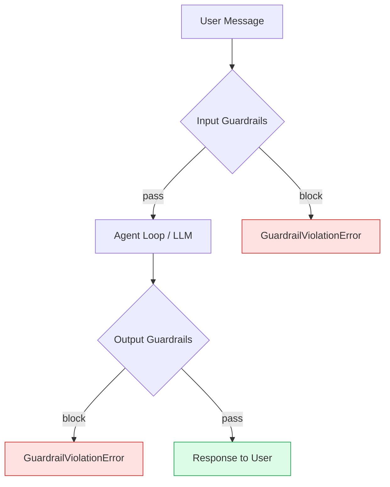

import { TechArticleJsonLd } from '@/components/structured-data';

export const metadata = {
  title: 'Guardrails — input and output safety boundaries',
  description:
    'PII detection, hallucination guards, content filters, token budgets. Run automatically before messages reach the LLM and before responses reach the user.',
  alternates: { canonical: 'https://docs.sagewai.ai/docs/core-concepts/guardrails' },
};

<TechArticleJsonLd
  name="Sagewai Guardrails"
  description="Input and output guardrails for AI agents — PII redaction, hallucination detection, content filters, token budgets."
  path="/docs/core-concepts/guardrails"
  articleSection="Core concepts"
/>

# Guardrails

Guardrails protect your agents at the input and output boundaries. They run automatically before messages reach the LLM (input guardrails) and before responses reach the user (output guardrails).

## How Guardrails Work



Each guardrail has three possible actions:
- **`block`** — Reject the message, raise `GuardrailViolationError`
- **`warn`** — Log the violation but allow the message through
- **`escalate`** — Emit a `GUARDRAIL_ESCALATION` event, allow the message

Guardrails are applied to all entry points: `chat()`, `chat_with_history()`, and `chat_stream()`.

---

## PIIGuard

Detect and handle personally identifiable information (PII) in agent inputs and outputs. Supports 7 entity types with regex-based detection.

```python
from sagewai.safety.pii import PIIGuard, PIIEntityType
from sagewai.engines.universal import UniversalAgent

agent = UniversalAgent(
    name="safe-agent",
    model="gpt-4o",
    guardrails=[
        PIIGuard(
            action="redact",
            entity_types=[
                PIIEntityType.EMAIL,
                PIIEntityType.PHONE,
                PIIEntityType.SSN,
                PIIEntityType.CREDIT_CARD,
            ],
        ),
    ],
)
```

### Supported Entity Types

| Entity Type | Pattern | Redaction Label |
|------------|---------|-----------------|
| `EMAIL` | `user@example.com` | `[REDACTED_EMAIL]` |
| `PHONE` | `(555) 123-4567` | `[REDACTED_PHONE]` |
| `SSN` | `123-45-6789` | `[REDACTED_SSN]` |
| `CREDIT_CARD` | `4111 1111 1111 1111` | `[REDACTED_CARD]` |
| `IBAN` | `DE89370400440532013000` | `[REDACTED_IBAN]` |
| `IP_ADDRESS` | `192.168.1.1` | `[REDACTED_IP]` |
| `PASSPORT` | `AB1234567` | `[REDACTED_PASSPORT]` |

### Actions

| Action | Input Behavior | Output Behavior |
|--------|---------------|-----------------|
| `block` | Raise `GuardrailViolationError` | Raise `GuardrailViolationError` |
| `redact` | Replace PII with labels, then block | Replace PII with labels, then block |
| `warn` | Log violation, allow through | Log violation, allow through |
| `escalate` | Emit event, allow through | Emit event, allow through |
| `log_only` | Log, treat as warning | Log, treat as warning |

### Direct Usage

You can also use `PIIGuard` outside of an agent for standalone PII detection:

```python
guard = PIIGuard(action="redact")

# Detect PII
findings = guard.detect("Contact me at john@example.com or 555-123-4567")
# Returns: [(PIIEntityType.EMAIL, "john@example.com"), (PIIEntityType.PHONE, "555-123-4567")]

# Redact PII
clean_text = guard.redact("Contact me at john@example.com or 555-123-4567")
# Returns: "Contact me at [REDACTED_EMAIL] or [REDACTED_PHONE]"
```

---

## HallucinationGuard

Check if LLM output is grounded in the provided RAG context. Uses keyword overlap scoring as a lightweight alternative to semantic similarity — no additional LLM calls required.

```python
from sagewai.safety.hallucination import HallucinationGuard

agent = UniversalAgent(
    name="grounded-agent",
    model="gpt-4o",
    memory=rag_engine,
    guardrails=[
        HallucinationGuard(
            threshold=0.3,  # Minimum grounding score (0-1)
            action="warn",  # warn, block, or escalate
        ),
    ],
)
```

### How It Works

1. The agent generates a response based on RAG context
2. `HallucinationGuard` compares the response against the RAG context
3. It calculates a **grounding score** (0.0 to 1.0) based on keyword overlap
4. If the score falls below the threshold, the configured action triggers

### Configuration

| Parameter | Type | Default | Description |
|-----------|------|---------|-------------|
| `threshold` | `float` | `0.3` | Minimum grounding score. Lower = more permissive |
| `action` | `str` | `"warn"` | `"block"`, `"warn"`, or `"escalate"` |

> **Note:** The hallucination guard only triggers when RAG context is available (via the `rag_context` key in the guardrail context dict). Without RAG context, it always passes.

### Tuning the Threshold

- **0.1 - 0.2**: Very permissive. Only flags responses with almost no overlap with context.
- **0.3 - 0.5**: Balanced. Good default for most applications.
- **0.6 - 0.8**: Strict. May flag valid responses that paraphrase context heavily.
- **0.9+**: Very strict. Only accepts near-verbatim responses.

---

## ContentFilter

Block messages containing specific words or patterns:

```python
from sagewai.safety.guardrails import ContentFilter

agent = UniversalAgent(
    name="filtered-agent",
    model="gpt-4o",
    guardrails=[
        ContentFilter(
            blocklist=["password", "secret", "confidential"],
            patterns=[r"\d{3}-\d{2}-\d{4}"],  # SSN pattern
            action="block",
        ),
    ],
)
```

The `ContentFilter` checks both the blocklist (exact word match) and regex patterns. If any match is found, the configured action triggers.

---

## TokenBudgetGuard

Prevent agents from exceeding a cost budget per request:

```python
from sagewai.safety.guardrails import TokenBudgetGuard

agent = UniversalAgent(
    name="budget-agent",
    model="gpt-4o",
    guardrails=[
        TokenBudgetGuard(max_usd=1.0),
    ],
)
```

The `TokenBudgetGuard` tracks estimated token costs during the agent loop and blocks further processing when the budget is exceeded.

---

## OutputSchemaGuard

Validate that the agent's output matches a specific JSON schema:

```python
from sagewai.safety.guardrails import OutputSchemaGuard

schema = {
    "type": "object",
    "required": ["title", "body"],
    "properties": {
        "title": {"type": "string"},
        "body": {"type": "string"},
    },
}

agent = UniversalAgent(
    name="structured-agent",
    model="gpt-4o",
    guardrails=[OutputSchemaGuard(schema=schema)],
)
```

---

## Combining Guardrails

Guardrails are applied in order. You can combine multiple guardrails for defense-in-depth:

```python
agent = UniversalAgent(
    name="production-agent",
    model="gpt-4o",
    guardrails=[
        PIIGuard(action="redact", entity_types=[
            PIIEntityType.EMAIL,
            PIIEntityType.SSN,
            PIIEntityType.CREDIT_CARD,
        ]),
        ContentFilter(blocklist=["DROP TABLE", "DELETE FROM"]),
        HallucinationGuard(threshold=0.3, action="warn"),
        TokenBudgetGuard(max_usd=2.0),
    ],
)
```

Order matters:
1. **PIIGuard** first — redact sensitive data before it reaches the LLM
2. **ContentFilter** — block injection attacks
3. **HallucinationGuard** — check output grounding
4. **TokenBudgetGuard** — prevent runaway costs

---

## Custom Guardrails

Create your own guardrail by implementing the `Guardrail` abstract class:

```python
from sagewai.safety.guardrails import Guardrail, GuardrailResult

class CustomGuardrail(Guardrail):
    async def check_input(self, message: str, context: dict) -> GuardrailResult:
        if "forbidden_word" in message.lower():
            return GuardrailResult(
                passed=False,
                violation="Forbidden word detected",
                action="block",
            )
        return GuardrailResult(passed=True)

    async def check_output(self, response: str, context: dict) -> GuardrailResult:
        return GuardrailResult(passed=True)  # No output check
```

Both `check_input` and `check_output` must be async methods that return a `GuardrailResult`.
