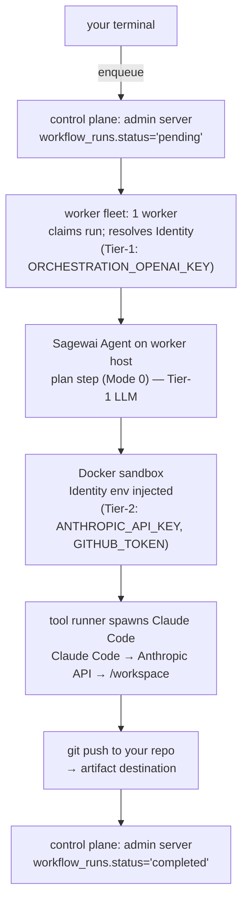

import { HowToJsonLd, SoftwareApplicationJsonLd } from '@/components/structured-data';

export const metadata = {
  title: 'Quickstart — build an agent in 15 minutes',
  description:
    'Install the Sagewai SDK, create a Sealed Identity, and run a Claude Code agent inside an isolated sandbox. End-to-end production-shape quickstart.',
  alternates: { canonical: 'https://docs.sagewai.ai/docs/get-started/quickstart' },
  openGraph: {
    title: 'Sagewai Quickstart — production-shape agents in 15 minutes',
    description:
      'Pip-install, scaffold an admin server, store credentials in a Sealed Identity, and dispatch Claude Code into an isolated sandbox.',
    url: 'https://docs.sagewai.ai/docs/get-started/quickstart',
  },
};

<HowToJsonLd
  name="Build a production-shape Sagewai agent in 15 minutes"
  description="Install the SDK, create a Sealed Identity, define a workflow that runs Claude Code inside an isolated Docker sandbox, and ship the artifact to GitHub."
  path="/docs/get-started/quickstart"
  totalTime="PT15M"
  steps={[
    {
      name: 'Install the SDK and bring up an admin server',
      text: 'Install the SDK with uv pip install sagewai (the admin server is included in the base install), then run sagewai admin serve to start the local control plane on http://localhost:8000.',
    },
    {
      name: 'Create a Sealed Identity for your customer',
      text: 'Use the admin UI or sagewai sealed create to store an Anthropic API key and a GitHub personal access token under a single isolated identity.',
    },
    {
      name: 'Define a workflow with a Claude Code step',
      text: 'Write a Python module that registers a workflow with one execution-mode-3 step pointing at your portfolio repo as the artifact target.',
    },
    {
      name: 'Trigger the workflow and watch the artifact land',
      text: 'Run sagewai run portfolio-site. The worker dispatches Claude Code inside an isolated sandbox, resolving credentials from the Sealed Identity (live runtime injection is experimental — see the status note); the result is committed back to GitHub.',
    },
  ]}
/>
<SoftwareApplicationJsonLd />

# Quickstart — Build a portfolio site with Claude Code

This quickstart takes about 15 minutes. You will:

1. Install the SDK and bring up an admin server.
2. Create a Sealed Identity holding your Anthropic and GitHub
   credentials.
3. Define a workflow that dispatches **Claude Code** inside an
   isolated Docker sandbox to build a portfolio site.
4. Trigger the workflow and watch the artifact commit to GitHub.

If you want a hello-world agent with no sandbox or per-customer
credentials, start with [Minimal Setup](/docs/get-started/minimal-setup) instead.
This page exercises the full stack.

> **What happens, in one sentence:** Sagewai's worker dispatches a CLI
> agent (Claude Code) inside an identity-isolated Docker sandbox, with
> your customer's credentials resolved from their Sealed Identity. See
> [Architecture: Execution modes — Mode 3](/docs/architecture/execution-modes#mode-3--full-cli-agent)
> for the full topology.
>
> **Status note.** This quickstart walks through the *designed* Sealed
> flow. The identity model, the Vault backend, and the admin profile
> controls ship today, and the Identity's key names resolve at
> enqueue time. The runtime enforcement that the prose below
> describes — live secret injection into the running sandbox and
> scrubbing on release — is **experimental and not yet wired into the
> default worker path** (the secret provider is unset by default). See
> the [Security tiers](/docs/architecture/security-tiers) page and the
> SDK README's Sealed section for what to rely on today.

---

## Prerequisites

- Python 3.10 or later (`uv` recommended for venv management)
- Docker installed and running (the default sandbox backend)
- An Anthropic API key (Claude Code uses this — Tier-2 in
  Sagewai terminology)
- A GitHub personal access token with `repo` scope (artifact upload
  uses this — also Tier-2)
- A target GitHub repository to receive the generated site
  (an empty repo is fine)
- An operator-side LLM key for orchestration (the "Tier-1" key —
  see [Security tiers](/docs/architecture/security-tiers)). For this
  quickstart, set `ORCHESTRATION_OPENAI_KEY` or use a local Ollama URL.

---

## 1. Install Sagewai

```bash
# uv (recommended) — creates the environment and installs in one step:
uv venv && uv pip install 'sagewai[postgres]'

# OR with pip — create a virtualenv first (a system-wide install is blocked on
# macOS/Homebrew and many Linux distros with 'externally-managed-environment'):
python3 -m venv .venv && source .venv/bin/activate
pip install 'sagewai[postgres]'
```

The admin server is part of the base install — no extra needed. By
default Sagewai persists all state to SQLite at `~/.sagewai/db/sagewai.db`
(zero setup, durable across restarts). The `postgres` extra adds asyncpg
and Alembic for production-scale or multi-process deployments.

---

## 2. Bring up the admin server + a worker

In one terminal, start the admin server:

```bash
sagewai admin serve --host 0.0.0.0 --port 8000
```

Open http://localhost:8000 in a browser and complete the first-time
setup wizard (org name, admin email, admin password — see the
[Admin Panel guide](/docs/guides/admin-panel)). This creates the
operator account.

In a second terminal, start a worker with the Docker sandbox backend:

```bash
export ORCHESTRATION_OPENAI_KEY=sk-...   # Tier-1 — orchestration brain

sagewai worker start \
    --pool default \
    --sandbox-mode per_run \
    --sandbox-backend docker \
    --sandbox-image ghcr.io/sagewai/sandbox-claude-code:latest \
    --sandbox-network egress-only
```

The worker registers with the admin server, advertises capability
labels (`sandbox.backend=docker`, `sandbox.image_variants=claude-code`),
and is ready to claim runs.

---

## 3. Create a Sealed Identity for your customer credentials

A **Sealed Identity** is a named bundle of Tier-2 credentials and
behavior knobs. Claude Code reads its API key from `os.environ`
inside the sandbox; the env values come from the Identity at
sandbox-start time.

In the admin panel, go to **Sealed → Profiles → Create**. Name the
profile `portfolio-customer-X` and add:

```
ANTHROPIC_API_KEY=sk-ant-...     ← Claude Code uses this
GITHUB_TOKEN=ghp_...              ← git push uses this
```

The profile is stored encrypted at rest (Fernet) in
`~/.sagewai/profiles.json`. The admin server holds the master key;
the worker host and control plane never see the plaintext values
again. See [Security tiers](/docs/architecture/security-tiers) for
the trust boundary.

---

## 4. Define the workflow

> **Note on the code below.** The decorator API for per-step modes
> is still stabilising — the canonical reference is the
> [Execution modes architecture page](/docs/architecture/execution-modes#mixing-modes-within-a-workflow).
> The example here matches the shape that page commits to. If a
> parameter name has evolved by the time you read this, the
> [Workflows reference](/docs/api-reference/workflows) is the
> authoritative API.

Create `build_portfolio.py`:

```python
import asyncio
from sagewai import DurableWorkflow, UniversalAgent
from sagewai.core.stores.postgres import PostgresStore
from sagewai.sandbox import SandboxMode

store = PostgresStore(database_url="postgresql://localhost/sagewai")

planner = UniversalAgent(
    name="planner",
    model="gpt-4o-mini",  # Tier-1 LLM — operator pays
)

wf = DurableWorkflow(name="portfolio-builder", store=store)

@wf.step("plan")
async def plan(brief: str) -> dict:
    """Mode 0 — pure orchestration on the worker."""
    result = await planner.chat(
        f"Extract structured requirements from this portfolio brief: {brief}"
    )
    return {"brief": brief, "requirements": result}

@wf.step(
    "build_site",
    sandbox_mode=SandboxMode.PER_RUN,
    sandbox_image="ghcr.io/sagewai/sandbox-claude-code:latest",
    security_profile_ref="portfolio-customer-X",
    cli_agent="claude-code",
    artifact_destination={
        "kind": "github",
        "repo": "your-org/portfolio-site",
        "branch": "main",
    },
)
async def build_site(plan: dict) -> str:
    """Mode 3 — Claude Code in a sandbox, push to GitHub."""
    return await wf.dispatch_cli_agent(
        prompt=f"Scaffold a Next.js portfolio site per this brief: {plan['requirements']}",
        workdir="/workspace",
    )

@wf.step("summarise")
async def summarise(artifact_url: str) -> str:
    """Mode 0 — orchestration."""
    result = await planner.chat(
        f"Write a one-paragraph completion message for site at {artifact_url}"
    )
    return result

async def main():
    await store.initialize()
    run_id = await wf.enqueue(input_data={"brief": "Modern minimal portfolio for a senior product designer named Sam Park."})
    print(f"Enqueued: {run_id}")

asyncio.run(main())
```

Three steps, three modes:

| Step | Mode | Why |
|---|---|---|
| `plan` | 0 (Bare) | Pure orchestration; Tier-1 LLM call on the worker. |
| `build_site` | 3 (Full + CLI agent) | Claude Code does the actual work, with customer credentials injected into the sandbox env. |
| `summarise` | 0 (Bare) | Tier-1 again. No sandbox cost for a one-line summary. |

Selecting mode per-step keeps sandbox costs where they are justified — see
[Execution modes — Mixing modes within a workflow](/docs/architecture/execution-modes#mixing-modes-within-a-workflow).

---

## 5. Run it

```bash
python build_portfolio.py
```

Watch the admin panel's **Runs** view. You'll see:

1. `plan` step completes in ~500ms (Mode 0 — Tier-1 LLM call).
2. `build_site` enters `running`. The worker acquires a Docker
   sandbox, injects the `portfolio-customer-X` Identity, and spawns
   Claude Code as a subprocess. Claude Code edits files in
   `/workspace`, then `git push`s to your repo using `GITHUB_TOKEN`.
   This typically takes 5–15 minutes.
3. `summarise` completes in ~500ms.

Check your GitHub repo — there's a portfolio site there. Check the
admin **Audit** view — every secret-injection, cascade-resolution,
and pool-reset event is recorded.

---

## What happened



Three things to note:

1. **Your Tier-2 credentials never reached the worker host.** They
   were injected into the sandbox env directly from the Sealed
   profile and scrubbed on sandbox release.
2. **The control plane never executed a workflow step.** It persisted,
   scheduled, and queried state — workers did the actual work.
3. **Mode selection was per-step.** The cheap orchestration steps ran
   on the worker; only the CLI-agent step paid the sandbox-startup cost.

---

## What to read next

### Learn the model

- **[Architecture: Runtime topology](/docs/architecture/runtime-topology)** —
  how a workflow run executes end-to-end.
- **[Architecture: Security tiers](/docs/architecture/security-tiers)** —
  Tier-1 vs Tier-2, the trust boundary, what Sagewai promises.
- **[Architecture: Execution modes](/docs/architecture/execution-modes)** —
  the five modes a step can run in, with the same portfolio-site
  example walked through.
- **[Architecture: Sandbox backends](/docs/architecture/sandbox-backends)** —
  Docker, Kubernetes, Lambda, and how to pick.

### Go deeper on the SDK

- **[Minimal Setup](/docs/get-started/minimal-setup)** — the
  no-sandbox, no-Identity flow if you want to start from a
  hello-world agent first.
- **[Agents](/docs/core-concepts/agents)** — UniversalAgent,
  composition patterns.
- **[Workflows](/docs/core-concepts/workflows)** — durable workflows,
  approval gates.
- **[Sandboxing handbook](/docs/guides/sandboxing)** — operator-level
  sandbox configuration (CLI flags, fallbacks, debugging).

### Operate

- **[Self-Hosted Deployment](/docs/guides/self-hosted)** — production
  install.
- **[Fleet Architecture](/docs/guides/fleet-architecture)** — multi-worker
  topology.
- **[Hardware Requirements](/docs/get-started/prerequisites)** —
  sizing.
