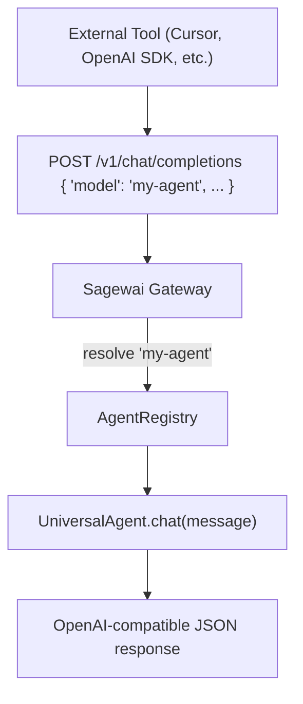

export const metadata = {
  title: 'OpenAI-compatible API — connect external tools to Sagewai',
  description:
    'Sagewai exposes /v1/chat/completions and /v1/models. Point any OpenAI-compatible client (Cursor, Claude Desktop, Open WebUI, custom) at Sagewai.',
  alternates: { canonical: 'https://docs.sagewai.ai/docs/guides/external-access' },
};

# Connecting External Tools to Sagewai

The Sagewai gateway exposes `/v1/chat/completions` and `/v1/models` — the same interface as the OpenAI Chat Completions API. Any tool that speaks the OpenAI protocol can route to your Sagewai agents with a one-line URL change.

## How it works

The gateway maps each registered agent to a model name. When a chat completion request arrives, it resolves the model name to the agent and runs it.



## Starting the gateway

```bash
# Start the admin backend, which includes the gateway
sagewai admin serve --port 8000
# or via justfile:
just dev-all
```

The gateway listens at `http://localhost:8000/v1/`.

## Authentication

Generate an API token:

```bash
sagewai token create --agent my-agent --scopes chat
```

Pass it as `Authorization: Bearer <token>` on every request.

## Verify with curl

```bash
# List available agents (each appears as a model)
curl http://localhost:8000/v1/models \
  -H "Authorization: Bearer <token>"

# Chat with an agent
curl http://localhost:8000/v1/chat/completions \
  -H "Authorization: Bearer <token>" \
  -H "Content-Type: application/json" \
  -d '{
    "model": "knowledge-agent",
    "messages": [{"role": "user", "content": "What were last week'\''s key decisions?"}]
  }'
```

## OpenAI Python SDK

Any application using the OpenAI Python SDK can connect directly:

```python
from openai import OpenAI

client = OpenAI(
    base_url="http://localhost:8000/v1",
    api_key="your-sagewai-token",
)

# Each agent appears as a model ID
models = client.models.list()
for m in models.data:
    print(m.id)  # e.g. "knowledge-agent", "research-agent"

# Chat with an agent
response = client.chat.completions.create(
    model="research-agent",
    messages=[
        {"role": "system", "content": "You are a research assistant."},
        {"role": "user", "content": "Find recent papers on transformer architectures"},
    ],
)
print(response.choices[0].message.content)

# Streaming
stream = client.chat.completions.create(
    model="research-agent",
    messages=[{"role": "user", "content": "Explain attention mechanisms"}],
    stream=True,
)
for chunk in stream:
    if chunk.choices[0].delta.content:
        print(chunk.choices[0].delta.content, end="")
```

## Cursor IDE

In Cursor settings, add a custom model provider:

- **Base URL**: `http://localhost:8000/v1`
- **API Key**: your Sagewai token
- **Model Name**: the agent name from `/v1/models`

Cursor will use that agent for code completions and chat.

## Claude Code

Claude Code uses the Anthropic API directly, not the OpenAI-compatible endpoint. To reach Sagewai agents from Claude Code, use the MCP server (see below) or call the gateway from a custom tool:

```python
import httpx

response = httpx.post(
    "http://localhost:8000/v1/chat/completions",
    headers={"Authorization": "Bearer your-sagewai-token"},
    json={
        "model": "knowledge-agent",
        "messages": [{"role": "user", "content": "What were last week's decisions?"}],
    },
)
print(response.json()["choices"][0]["message"]["content"])
```

For deeper integration, expose agents as callable MCP tools via the [Sagewai MCP Server](/docs/guides/mcp-server) so they appear in Claude Code's tool list.

## ChatGPT Custom GPT

When creating a Custom GPT, use the Actions feature:

1. Set the API endpoint to `http://your-server:8000/v1/chat/completions`.
2. Add Bearer token authentication.

The GPT can then query your Sagewai agents.

## LiteLLM Proxy

Add Sagewai as a provider in your LiteLLM config:

```yaml
model_list:
  - model_name: sagewai/knowledge-agent
    litellm_params:
      model: openai/knowledge-agent
      api_base: http://localhost:8000/v1
      api_key: your-sagewai-token
```

## MCP Server

For deeper integration, use the MCP server to expose agents as tools rather than chat models. Claude Code and Cursor can then invoke specific agents as part of their tool-calling flow.

```python
from sagewai.mcp.server import McpServer

server = McpServer(name="sagewai-tools")

server.register_agent(knowledge_agent)
server.register_agent(research_agent)

await server.serve_stdio()
```

## Available Endpoints

| Endpoint | Method | Description |
|----------|--------|-------------|
| `/v1/models` | GET | List all registered agents |
| `/v1/chat/completions` | POST | Chat with an agent |
| `/v1/chat/completions` (stream) | POST | Streaming chat (`stream: true`) |

## Troubleshooting

### "Connection refused"

Check that the gateway is running:

```bash
sagewai admin serve
# or
just dev-all
```

### "401 Unauthorized"

List your tokens and verify the one you are using:

```bash
sagewai token list
```

### Agent not appearing in `/v1/models`

The agent must be registered in the registry first:

```bash
sagewai agent list
```

### Streaming not working

Pass `"stream": true` in the request body. The gateway supports Server-Sent Events for streaming.

---

## Next steps

- [Your First Agent](/docs/get-started/first-agent) — build an agent to expose via the gateway
- [Admin Panel](/docs/guides/admin-panel) — monitor agent usage and costs
- [Tools and MCP](/docs/api-reference/tools) — expose agents as MCP tools
- [REST API Reference](/docs/api-reference/rest-api) — full API documentation
