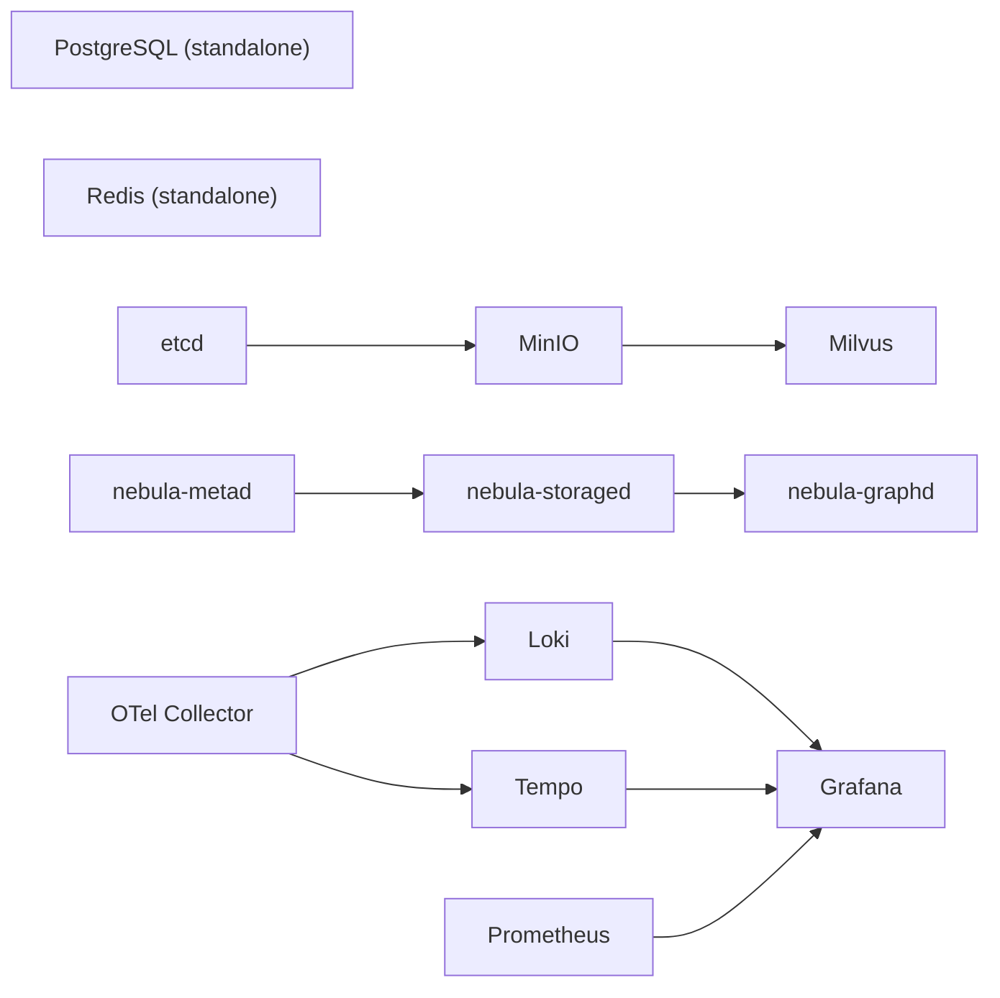

export const metadata = {
  title: 'Infrastructure management — container lifecycle and data management',
  description:
    'Start, stop, monitor, and maintain Sagewai infrastructure. Covers Docker, Podman, native setup, data volumes, migrations, and graceful degradation.',
  alternates: { canonical: 'https://docs.sagewai.ai/docs/guides/infrastructure' },
};

# Infrastructure Management

This guide covers the full lifecycle of Sagewai's infrastructure services: starting and stopping containers, monitoring health, managing data volumes, running database migrations, and running without containers when needed.

## Service dependency graph

Services start in dependency order. If a dependency is not healthy, downstream services will not start correctly.



PostgreSQL and Redis have no dependencies and start independently. Milvus requires etcd and MinIO to be healthy first. NebulaGraph services must start in order: metad, then storaged, then graphd. All observability data flows into Grafana.

## Starting services

```bash
# Full stack (all services + observability)
make infra

# Core only (PostgreSQL + Redis, ~200 MB RAM)
make infra-core

# Full stack with containerized application backends
make dev-up
```

## Stopping services

```bash
# Stop all containers, keep data volumes
make down
# equivalent to:
docker compose down

# Stop and delete all data volumes (fresh start)
docker compose down -v
```

## Monitoring

```bash
# Check running containers and health status
docker compose ps

# Follow logs for one service
docker compose logs -f milvus

# Follow logs for all services
docker compose logs -f

# Check health endpoints
curl http://localhost:8000/api/v1/health/summary   # Admin API summary
curl http://localhost:8000/api/v1/health/detailed  # Detailed infrastructure health
```

## Common operations

```bash
# Restart one service without rebuilding
docker compose restart milvus

# Rebuild and restart one service
docker compose up -d --build admin

# Scale workers horizontally
docker compose up -d --scale worker=3

# Check per-container resource usage
docker stats
```

## Compose Specification compatibility

Sagewai's `docker-compose.yml` targets the [Compose Specification](https://compose-spec.io/), so it works with multiple container runtimes:

| Runtime | Command | Notes |
|---------|---------|-------|
| Docker Compose V2 | `docker compose up -d` | Default on modern Docker Desktop |
| Podman Compose | `podman-compose up -d` | Drop-in replacement |
| nerdctl (containerd) | `nerdctl compose up -d` | Lightweight alternative |

The `version:` field is optional in the Compose Spec and may be omitted.

## Podman alternative

[Podman](https://podman.io) is a rootless, daemonless runtime that works as a drop-in replacement for Docker.

**Install:**

```bash
# macOS
brew install podman podman-compose
podman machine init
podman machine start

# Linux (Ubuntu/Debian)
sudo apt install podman podman-compose

# Alias for Makefile compatibility
alias docker=podman
alias docker-compose=podman-compose
```

**Key differences from Docker:**

| Feature | Docker | Podman |
|---------|--------|--------|
| Daemon | Requires dockerd | Daemonless |
| Root access | Root by default | Rootless by default |
| Socket | `/var/run/docker.sock` | User-level socket |
| Compose | `docker compose` | `podman-compose` |
| GPU support | `--gpus all` | `--device nvidia.com/gpu=all` |

**Start Sagewai with Podman:**

```bash
podman-compose -f docker-compose.yml up -d

# With the alias set above, Makefile targets work unchanged:
make infra
```

**Volume permissions:** Podman runs rootless by default. If you are on SELinux, add the `:Z` suffix to volume mounts:

```yaml
volumes:
  - ./data:/var/lib/postgresql/data:Z
```

## Native setup (no containers)

Use this when containers are not available or not practical.

### PostgreSQL

```bash
# macOS
brew install postgresql@15
brew services start postgresql@15
createdb sagewai

# Ubuntu/Debian
sudo apt install postgresql-15
sudo -u postgres createdb sagewai
```

Set the connection string:

```bash
export DATABASE_URL=postgresql://localhost:5432/sagewai
```

### Redis

```bash
# macOS
brew install redis
brew services start redis

# Ubuntu/Debian
sudo apt install redis-server
sudo systemctl start redis
```

```bash
export REDIS_URL=redis://localhost:6379
```

### Milvus (optional)

Required for vector search. Without it, Sagewai falls back to in-memory vectors, which is fine for development.

**Option A: Standalone binary**

```bash
curl -sfL https://raw.githubusercontent.com/milvus-io/milvus/master/scripts/standalone_embed.sh | bash
```

**Option B: Zilliz Cloud (managed)**

Sign up at [cloud.zilliz.com](https://cloud.zilliz.com) and set:

```bash
export MILVUS_HOST=your-cluster.zillizcloud.com
export MILVUS_PORT=19530
```

### NebulaGraph (optional)

Required for knowledge graphs. Without it, Sagewai falls back to in-memory graphs, which is sufficient for development. Download from [nebula-graph.io](https://nebula-graph.io).

## Data volume management

### Where data lives

| Service | Volume name | Contents |
|---------|-------------|----------|
| PostgreSQL | `sagewai_postgres_data` | Workflows, runs, workers, audit logs |
| Milvus | `sagewai_milvus_data` | Vector embeddings |
| MinIO | `sagewai_minio_data` | Milvus object storage |
| etcd | `sagewai_etcd_data` | Milvus metadata |
| NebulaGraph | `sagewai_nebula_*` | Graph data and metadata |
| Redis | In-memory | Cache only (no persistence by default) |

### Backup

```bash
# Plain SQL dump
docker compose exec postgres pg_dump -U sagewai sagewai > backup.sql

# Compressed custom-format dump
docker compose exec postgres pg_dump -U sagewai -Fc sagewai > backup.dump
```

### Restore

```bash
# From plain SQL dump
docker compose exec -T postgres psql -U sagewai sagewai < backup.sql

# From compressed dump
docker compose exec -T postgres pg_restore -U sagewai -d sagewai < backup.dump
```

### Full reset

```bash
docker compose down -v
make infra
make db-upgrade
make db-seed  # optional: load demo data
```

Or use the combined shortcut:

```bash
make db-fresh  # drop + migrate + seed in one command
```

## Database migrations

Migrations are managed by Alembic. Migration files live in `sagewai/db/migrations/versions/`.

```bash
# Apply pending migrations
make db-upgrade

# Drop schema, recreate, and migrate
make db-reset

# Seed with demo data
make db-seed

# Drop + migrate + seed in one step
make db-fresh
```

## Graceful degradation

Sagewai continues to function when optional services are absent:

| Missing service | Fallback | Limitation |
|----------------|----------|------------|
| Milvus | In-memory vectors | Data lost on restart — development only |
| NebulaGraph | In-memory graph | Data lost on restart — development only |
| Redis | Direct database queries | Slower response times, no caching |
| LocalStack | Local filesystem | No S3-compatible archival |
| Observability stack | No dashboards | Agents still run; no metrics or tracing |

**Minimum viable deployment:** PostgreSQL only.

```bash
make infra-core    # starts PostgreSQL + Redis (~200 MB)
make db-upgrade    # apply migrations
make dev-native APP=admin  # start admin backend
```
