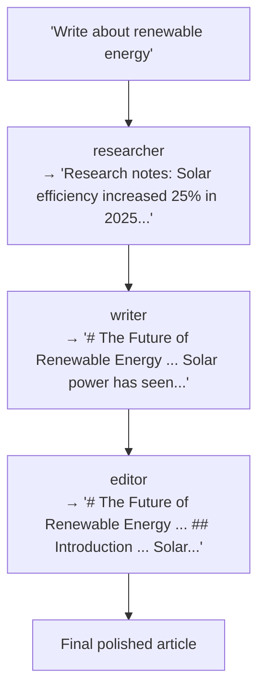
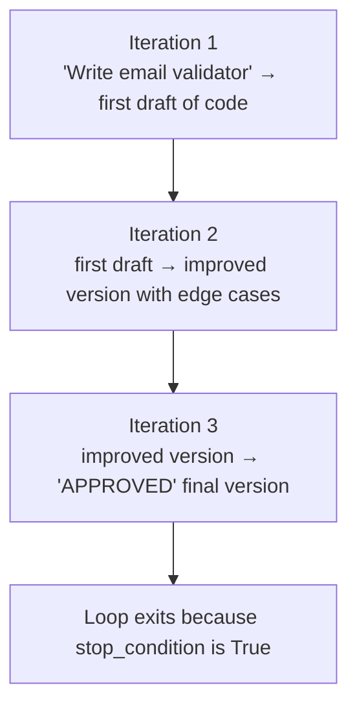

export const metadata = {
  title: 'Multi-agent workflows — sequential, parallel, iterative',
  description:
    'Compose Sagewai agents into workflows. Three patterns: sequential pipelines, parallel fan-out, iterative refinement. Each agent uses its own LLM.',
  alternates: { canonical: 'https://docs.sagewai.ai/docs/guides/multi-agent' },
};

# Multi-Agent Workflows

This guide shows you how to compose multiple agents into workflows. You will build three patterns: sequential pipelines, parallel fan-out, and iterative refinement. Each agent in a workflow runs its own LLM and system prompt — you pick the model that fits the task.

**Prerequisites:** Complete [First Agent](/docs/get-started/first-agent) before starting here.

## When to use multi-agent workflows

Reach for multi-agent workflows when:

- A task has distinct phases that benefit from different models or prompts.
- Multiple independent analyses should run at the same time.
- Output needs iterative refinement from a critic agent.
- You want deterministic execution order rather than LLM-decided routing.

---

## Pattern 1: Sequential pipeline

Agents run one after another. Each agent receives the previous agent's output as its input.

### Example: article writing pipeline

```python
from sagewai.engines.universal import UniversalAgent
from sagewai.core.workflows import SequentialAgent

# Stage 1: gather raw information with a fast, cheap model
researcher = UniversalAgent(
    name="researcher",
    model="gpt-4o-mini",
    system_prompt=(
        "You are a research specialist. Given a topic, gather key facts, "
        "statistics, and recent developments. Return raw research notes."
    ),
    tools=[web_search],
)

# Stage 2: write polished prose with a stronger model
writer = UniversalAgent(
    name="writer",
    model="claude-3-5-sonnet-20241022",
    system_prompt=(
        "You are a professional writer. Given research notes, write a "
        "well-structured article with an introduction, body, and conclusion. "
        "Use clear language and cite sources from the research notes."
    ),
)

# Stage 3: review for accuracy and style
editor = UniversalAgent(
    name="editor",
    model="gpt-4o",
    system_prompt=(
        "You are a senior editor. Review the article for accuracy, "
        "clarity, and style. Return the improved version with your edits. "
        "Fix grammar, improve flow, and ensure factual accuracy."
    ),
)

# Compose into a pipeline
pipeline = SequentialAgent(
    name="article-pipeline",
    agents=[researcher, writer, editor],
)

result = await pipeline.chat("Write about the future of renewable energy")
print(result)
```

### Data flow



Each agent receives the previous agent's output as its input message. Execution is fully deterministic — agents always run in the order you specify.

---

## Pattern 2: Parallel fan-out

All agents receive the same input and run at the same time. Use this when you need multiple independent analyses of the same document.

### Example: multi-perspective document review

```python
from sagewai.core.workflows import ParallelAgent

legal_reviewer = UniversalAgent(
    name="legal-reviewer",
    model="gpt-4o",
    system_prompt=(
        "You are a legal compliance reviewer. Analyze the document for "
        "legal risks, regulatory compliance issues, and contractual concerns. "
        "Flag any potential liabilities."
    ),
)

financial_reviewer = UniversalAgent(
    name="financial-reviewer",
    model="gpt-4o",
    system_prompt=(
        "You are a financial analyst. Review the document for financial "
        "accuracy, projections, and risk factors. Verify calculations "
        "and highlight any discrepancies."
    ),
)

style_reviewer = UniversalAgent(
    name="style-reviewer",
    model="gpt-4o-mini",
    system_prompt=(
        "You are a technical writer. Review the document for clarity, "
        "grammar, consistency, and readability. Suggest improvements."
    ),
)

# All three run simultaneously
review_panel = ParallelAgent(
    name="review-panel",
    agents=[legal_reviewer, financial_reviewer, style_reviewer],
)

contract_text = "This agreement between Acme Corp and..."
result = await review_panel.chat(contract_text)
print(result)
# Output includes all three reviews, labeled by agent name
```

### Performance

`ParallelAgent` uses `asyncio.gather()` internally. If each review takes 5 seconds, the total wall-clock time is ~5 seconds rather than 15.

---

## Pattern 3: Iterative refinement loop

Run an agent repeatedly until its output meets a condition, or until a maximum iteration count is reached.

### Example: code generation with self-review

```python
from sagewai.core.workflows import LoopAgent

code_generator = UniversalAgent(
    name="code-generator",
    model="gpt-4o",
    system_prompt=(
        "You are an expert Python developer. Given a task (or previous code "
        "with review feedback), write or improve the code. When the code is "
        "complete and needs no more changes, end your response with APPROVED."
    ),
)

# Exit when the agent outputs "APPROVED", or after 5 iterations
refinement_loop = LoopAgent(
    name="code-refiner",
    agent=code_generator,
    max_iterations=5,
    stop_condition=lambda response: "APPROVED" in response,
)

result = await refinement_loop.chat(
    "Write a Python function that validates email addresses using regex. "
    "Include error handling and comprehensive docstring."
)
print(result)
```

### Loop execution



Always set `max_iterations`. Without a ceiling the loop runs indefinitely if the stop condition is never satisfied.

---

## Combining patterns

Nest patterns to match the structure of your task:

```python
# Inner parallel: research from multiple sources simultaneously
web_researcher = UniversalAgent(name="web", model="gpt-4o-mini", tools=[web_search])
db_researcher = UniversalAgent(name="db", model="gpt-4o-mini", tools=[db_query])

research = ParallelAgent(
    name="multi-source-research",
    agents=[web_researcher, db_researcher],
)

# Sequential: research -> write
writer = UniversalAgent(name="writer", model="claude-3-5-sonnet-20241022")
draft_pipeline = SequentialAgent(
    name="draft-pipeline",
    agents=[research, writer],
)

# Loop: draft and refine
critic = UniversalAgent(
    name="critic",
    model="gpt-4o",
    system_prompt="Review and improve. Say DONE when satisfied.",
)
quality_loop = LoopAgent(
    name="quality-loop",
    agent=critic,
    max_iterations=3,
    stop_condition=lambda r: "DONE" in r,
)

# Full pipeline: research -> write -> refine
full_pipeline = SequentialAgent(
    name="full-pipeline",
    agents=[draft_pipeline, quality_loop],
)

result = await full_pipeline.chat("Write a market analysis report on AI startups")
```

---

## Making workflows durable

For workflows that take more than a few seconds, enable checkpointing. If the process crashes after `researcher` completes, the next run resumes from `writer` rather than the beginning.

```python
from sagewai.core.durability import DurabilityMode
from sagewai.core.stores import PostgresStore

store = PostgresStore(database_url="postgresql://localhost/sagewai")
await store.initialize()

pipeline = SequentialAgent(
    name="durable-article-pipeline",
    agents=[researcher, writer, editor],
    durability=DurabilityMode.CHECKPOINT,
    store=store,
)

result = await pipeline.chat("Write about quantum computing")
```

---

## Choosing a model per agent

Assign the cheapest model that can do the job for each stage.

| Task | Recommended model | Why |
|------|-------------------|-----|
| Research / data gathering | `gpt-4o-mini` | Fast and cost-effective at following tool instructions |
| Creative writing | `claude-3-5-sonnet-20241022` | Strong prose quality |
| Code generation | `gpt-4o` | Strong reasoning and code output |
| Review / editing | `gpt-4o` | Good at analysis and critique |
| Summarization | `gpt-4o-mini` | Efficient at compression |
| Style checking | `gpt-4o-mini` | Pattern matching and grammar rules |

```python
researcher = UniversalAgent(name="researcher", model="gpt-4o-mini")
writer = UniversalAgent(name="writer", model="claude-3-5-sonnet-20241022")
reviewer = UniversalAgent(name="reviewer", model="gpt-4o")
```

---

## Best practices

1. **Keep system prompts narrow.** Each agent should have a single, well-defined role. Broad prompts produce unfocused output and make debugging harder.

2. **Assign cheaper models to simpler tasks.** Research gathering and style checks do not need the most capable model.

3. **Always set `max_iterations` on `LoopAgent`.** A missing ceiling means an infinite loop if the stop condition is never met.

4. **Monitor costs.** Use the analytics API to track per-agent spend and find where to optimize.

5. **Test each agent in isolation** before composing it into a workflow. A bug that is obvious in a unit test becomes hard to trace inside a pipeline.

6. **Enable durable workflows** for any pipeline that runs for more than a few seconds. This prevents restarting from scratch after a crash.
