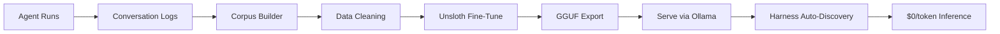
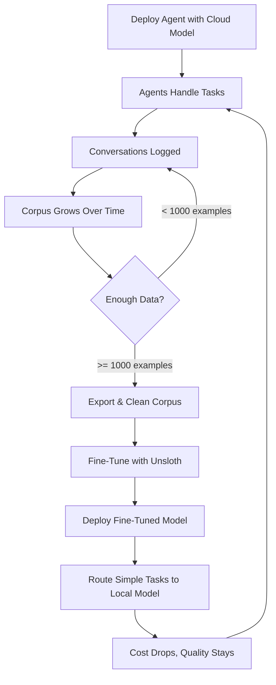

import { TechArticleJsonLd, SoftwareApplicationJsonLd } from '@/components/structured-data';

export const metadata = {
  title: 'Train your own model in a weekend — Sagewai training loop',
  description:
    'Capture production runs with the Curator, fine-tune via Unsloth on Colab/RunPod/Vast.ai, deploy via Ollama. End-to-end fine-tuning under $5.',
  alternates: { canonical: 'https://docs.sagewai.ai/docs/guides/training' },
  openGraph: {
    title: 'Sagewai training loop — fine-tune local LLMs in a weekend',
    description:
      'Capture, train, deploy, cost-down. The training loop that takes Opus traffic to a local model you own.',
    url: 'https://docs.sagewai.ai/docs/guides/training',
  },
};

<TechArticleJsonLd
  name="Sagewai training & fine-tuning"
  description="The Sagewai training loop: Curator captures production runs, Unsloth fine-tunes, Promoter promotes, Ollama deploys. Cost-down to zero per token."
  path="/docs/guides/training"
  articleSection="Training Loop"
/>
<SoftwareApplicationJsonLd />

# Training & Fine-Tuning

Build domain-specific LLMs from your agent conversations. Sagewai captures every agent run as structured training data, then uses Unsloth to fine-tune open-source models on your corporate data — entirely within your infrastructure.

## The Training Pipeline



## Why This Matters

Every time your agents run, Sagewai logs the full conversation — inputs, outputs, tool calls, reasoning steps, and outcomes. This is high-quality, domain-specific training data that no public dataset can match.

**The value chain:**
1. Agents converse using cloud models (GPT-4o, Claude) — expensive but high quality
2. Conversations are logged as structured corpus data
3. Corpus is cleaned, deduplicated, and formatted for training
4. Unsloth fine-tunes an open-source base model (Llama, Mistral) on your corpus
5. The fine-tuned model is served locally via Ollama
6. Harness auto-discovers it and routes appropriate tasks at $0/token
7. Over time, more conversations = better model = less cloud API spend

**Enterprise use cases:**
- **Legal firms**: Train on contract review conversations → specialist legal LLM
- **Healthcare**: Train on medical Q&A → domain medical assistant
- **Maintenance**: Train on equipment troubleshooting → field technician AI
- **Finance**: Train on compliance checks → regulatory analysis model
- **Customer support**: Train on resolved tickets → automated response agent

## How Conversation Logging Works

Every Sagewai agent automatically logs runs to the admin store. Each run captures:

```python
# Automatic — no configuration needed
agent = UniversalAgent(
    name="legal-reviewer",
    model="gpt-4o",
    system_prompt="You review contracts for compliance issues.",
)

# This run is automatically logged with full conversation history
result = await agent.chat("Review clause 7.3 of the NDA for non-compete issues")
```

**What gets logged per run:**
- Agent name, model, strategy
- Full message history (system prompt, user input, assistant response)
- Tool calls and results
- Token usage and cost
- Timestamps and duration
- Project context (for multi-tenant isolation)

## Few-Shot and One-Shot Learning

Before fine-tuning, Sagewai uses logged conversations as few-shot examples to improve agent prompts immediately:

```python
from sagewai import UniversalAgent
from sagewai.core.session import SessionStore

store = SessionStore()

agent = UniversalAgent(
    name="support-agent",
    model="gpt-4o",
    system_prompt="You handle customer support tickets.",
    session_store=store,  # Enables conversation logging
    auto_learn=True,      # Auto-extracts successful patterns
)
```

With `auto_learn=True`, the agent:
1. Tracks which responses led to positive outcomes
2. Stores successful interaction patterns in memory
3. Retrieves relevant examples as few-shot context for similar future queries
4. Measurably improves response quality over time

## Building the Training Corpus

### Step 1: Collect Conversations

```python
from sagewai.admin.analytics import AnalyticsStore

analytics = AnalyticsStore()

# Get all completed runs for a specific agent
runs = await analytics.list_runs(
    agent_name="legal-reviewer",
    status="completed",
    limit=10000,
)

print(f"Collected {len(runs)} conversation records")
```

### Step 2: Export as Training Data

```python
from sagewai.tools.ml import export_training_corpus

# Export conversations in Alpaca format (instruction/input/output)
corpus = await export_training_corpus(
    runs=runs,
    format="alpaca",          # or "chatml", "sharegpt"
    output_path="corpus/legal_training.jsonl",
    min_quality_score=0.7,    # Filter low-quality conversations
    deduplicate=True,         # Remove near-duplicate conversations
    strip_pii=True,           # Remove PII before training
)

print(f"Exported {corpus.num_examples} training examples")
print(f"Removed {corpus.duplicates_removed} duplicates")
print(f"PII instances redacted: {corpus.pii_redacted}")
```

**Output format (Alpaca):**
```json
{
  "instruction": "Review clause 7.3 of the NDA for non-compete issues",
  "input": "Clause 7.3: Employee agrees not to engage in any competing business...",
  "output": "This non-compete clause has three potential issues: 1) The geographic scope is unreasonably broad..."
}
```

### Step 3: Clean and Validate

The corpus builder automatically handles:
- **Deduplication**: Semantic similarity check (cosine > 0.95 = duplicate)
- **PII redaction**: Removes emails, phone numbers, SSNs before training
- **Quality filtering**: Filters out conversations with errors, timeouts, or low token counts
- **Format validation**: Ensures all examples have proper instruction/output pairs
- **Length normalization**: Trims overly long responses, pads short ones

### Step 4: Archive to Storage

```python
# Archive corpus to S3 or local filesystem
await corpus.archive(
    backend="s3",             # or "local", "gcs"
    bucket="sagewai-training-data",
    prefix="legal/v1/",
)
```

## Fine-Tuning with Unsloth

### Prerequisites

```bash
pip install "sagewai[training]"
# Includes: unsloth, datasets, trl
```

**Hardware**: GPU with 6+ GB VRAM (RTX 3060 for 7B models, RTX 3090+ for 13B)

### Run Fine-Tuning

```python
from sagewai.tools.ml import fine_tune_model

result = await fine_tune_model(
    base_model="unsloth/llama-3.1-8b-instruct",
    corpus_path="corpus/legal_training.jsonl",
    output_dir="models/legal-llm-v1",

    # Training config
    epochs=3,
    batch_size=4,
    learning_rate=2e-4,
    max_seq_length=2048,

    # QLoRA config (4-bit quantization)
    quantization="4bit",
    lora_rank=16,
    lora_alpha=16,
)

print(f"Training complete in {result.duration_minutes:.1f} minutes")
print(f"Final loss: {result.final_loss:.4f}")
```

### Export to GGUF

```python
from sagewai.tools.ml import export_to_gguf

gguf_path = await export_to_gguf(
    model_dir="models/legal-llm-v1",
    output_path="models/legal-llm-v1.gguf",
    quantization="q4_K_M",  # Good balance of quality and speed
)

print(f"GGUF model saved to: {gguf_path}")
print(f"Model size: {gguf_path.stat().st_size / 1e9:.1f} GB")
```

## Serving the Fine-Tuned Model

### Option A: Ollama (Recommended)

```bash
# Create an Ollama modelfile
cat > Modelfile << 'EOF'
FROM models/legal-llm-v1.gguf

PARAMETER temperature 0.7
PARAMETER num_ctx 2048

SYSTEM """You are a legal document reviewer specialized in contract analysis,
compliance checking, and risk assessment."""
EOF

# Import into Ollama
ollama create legal-llm -f Modelfile

# Test it
ollama run legal-llm "Review this indemnification clause..."
```

### Option B: llama-server

```bash
llama-server -m models/legal-llm-v1.gguf --port 8001
```

### Auto-Discovery

Once your model is running, the Sagewai harness auto-discovers it:

```bash
# Harness probes these ports on startup:
# 11434 (Ollama) — finds "legal-llm"
# 8001  (Unsloth/llama-server) — finds the GGUF model
# 8000  (vLLM) — finds vLLM-served models

sagewai harness start
# Output: "Discovered local backend: legal-llm on localhost:11434 ($0.00/token)"
```

### Route Tasks to Your Model

```python
from sagewai import UniversalAgent, providers

# Use your fine-tuned model directly
agent = UniversalAgent(
    name="legal-reviewer-v2",
    **providers.ollama("legal-llm"),
)

# Or let the harness route based on complexity
# Simple contract reviews → your local model ($0)
# Complex multi-jurisdictional analysis → GPT-4o (paid)
```

## The Continuous Improvement Loop



**The flywheel effect:**
1. Start with cloud models (expensive, high quality)
2. Conversations accumulate as training data
3. Fine-tune local model every quarter (or on-demand)
4. Route more tasks to local model as quality improves
5. Cloud API spend decreases over time
6. Each fine-tuning iteration improves the model further

## Data Privacy & Security

**All training happens locally:**
- Conversation data never leaves your infrastructure
- PII is redacted before corpus export
- Training runs on your GPU (or cloud GPU you control)
- Fine-tuned models are served from your servers
- No data shared with model providers

**Per-project isolation:**
- Each project's conversations are isolated
- Training corpus can be scoped to specific projects
- Fine-tuned models can be restricted to specific worker pools

## Complete Example

See `sagewai/examples/17_unsloth_finetune.py` for a runnable end-to-end example:

```python
import asyncio
from sagewai import UniversalAgent, providers
from sagewai.tools.ml import (
    export_training_corpus,
    fine_tune_model,
    export_to_gguf,
)

async def main():
    # 1. Generate training data with a cloud model
    teacher = UniversalAgent(name="teacher", model="gpt-4o")

    questions = [
        "What are the key risks in this indemnification clause?",
        "Is this non-compete enforceable in California?",
        # ... hundreds more domain-specific questions
    ]

    for q in questions:
        await teacher.chat(q)  # Logged automatically

    # 2. Export conversations as training corpus
    corpus = await export_training_corpus(
        agent_name="teacher",
        format="alpaca",
        output_path="corpus/legal.jsonl",
    )

    # 3. Fine-tune with Unsloth
    result = await fine_tune_model(
        base_model="unsloth/llama-3.1-8b-instruct",
        corpus_path="corpus/legal.jsonl",
        output_dir="models/legal-v1",
    )

    # 4. Export to GGUF and serve
    await export_to_gguf(
        model_dir="models/legal-v1",
        output_path="models/legal-v1.gguf",
    )

    # 5. Use via Ollama (after: ollama create legal-v1 -f Modelfile)
    student = UniversalAgent(
        name="legal-specialist",
        **providers.ollama("legal-v1"),
    )

    response = await student.chat("Review this non-compete clause...")
    print(response)  # Domain-expert quality at $0/token

asyncio.run(main())
```

## What's Next

- **[Local Inference](/docs/guides/local-inference)** — Set up Ollama, vLLM, LM Studio for serving
- **[Fleet Architecture](/docs/guides/fleet-enterprise)** — Deploy workers with local models at scale
- **[Cost Management](/docs/guides/cost-management)** — Track savings from local inference
- **[Hardware Requirements](/docs/guides/hardware-requirements)** — GPU specs for training and serving
