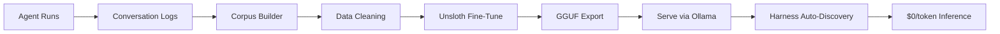
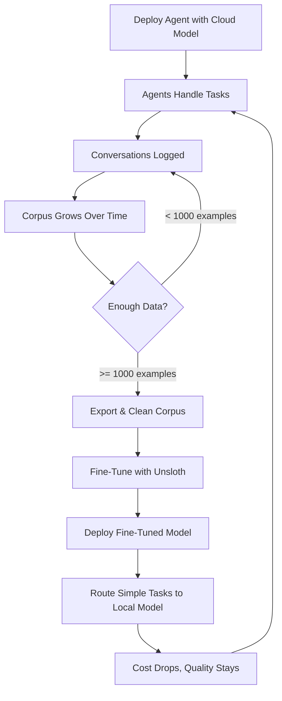

import { TechArticleJsonLd, SoftwareApplicationJsonLd } from '@/components/structured-data';

export const metadata = {
  title: 'Train your own model in a weekend — Sagewai training loop',
  description:
    'Capture production runs with the Curator, fine-tune via Unsloth on Colab/RunPod/Vast.ai, deploy via Ollama. End-to-end fine-tuning under $5.',
  alternates: { canonical: 'https://docs.sagewai.ai/docs/guides/training' },
  openGraph: {
    title: 'Sagewai training loop — fine-tune local LLMs in a weekend',
    description:
      'Capture, train, deploy, cost-down. The training loop that takes Opus traffic to a local model you own.',
    url: 'https://docs.sagewai.ai/docs/guides/training',
  },
};

<TechArticleJsonLd
  name="Sagewai training & fine-tuning"
  description="The Sagewai training loop: Curator captures production runs, Unsloth fine-tunes, Promoter promotes, Ollama deploys. Cost-down to zero per token."
  path="/docs/guides/training"
  articleSection="Training Loop"
/>
<SoftwareApplicationJsonLd />

# Training and fine-tuning

This page walks you through the full training loop: capturing agent runs as structured training data, fine-tuning an open-source model with Unsloth, and deploying it via Ollama — entirely within your own infrastructure.

**Prerequisites:** a working Sagewai setup (see [prerequisites](/docs/get-started/prerequisites)) and a GPU with 6+ GB VRAM for fine-tuning (RTX 3060 handles 7B models; RTX 3090+ for 13B). You can run training on Colab, RunPod, or Vast.ai if you do not have a local GPU.

## Pipeline overview



## How this works

Every agent run logs the full conversation — inputs, outputs, tool calls, reasoning steps, and outcomes. That log is your training data. No public dataset matches it for your specific domain.

The process is:

1. Agents run against cloud models (GPT-4o, Claude) — expensive but high quality
2. Conversations are logged as structured corpus data
3. The corpus is cleaned, deduplicated, and formatted for training
4. Unsloth fine-tunes an open-source base model (Llama, Mistral) on your corpus
5. The fine-tuned model is served locally via Ollama
6. The harness auto-discovers it and routes appropriate tasks at $0/token
7. More runs produce more training data, which improves the next fine-tuning iteration

**Some domain examples:**
- Legal firms: train on contract review conversations to get a specialist legal LLM
- Healthcare: train on medical Q&A for a domain-specific assistant
- Maintenance: train on equipment troubleshooting transcripts for field technician support
- Finance: train on compliance-check runs for regulatory analysis
- Customer support: train on resolved tickets for automated response agents

## How conversation logging works

Every Sagewai agent logs runs to the admin store automatically — no extra configuration:

```python
# Automatic — no configuration needed
agent = UniversalAgent(
    name="legal-reviewer",
    model="gpt-4o",
    system_prompt="You review contracts for compliance issues.",
)

# This run is automatically logged with full conversation history
result = await agent.chat("Review clause 7.3 of the NDA for non-compete issues")
```

Each run record includes:
- Agent name, model, strategy
- Full message history (system prompt, user input, assistant response)
- Tool calls and results
- Token usage and cost
- Timestamps and duration
- Project context (for multi-tenant isolation)

## Few-shot learning before fine-tuning

Before you have enough data to fine-tune, you can use logged conversations as few-shot examples to improve agent responses immediately:

```python
from sagewai import UniversalAgent, SessionStore

store = SessionStore()

agent = UniversalAgent(
    name="support-agent",
    model="gpt-4o",
    system_prompt="You handle customer support tickets.",
    session_store=store,  # Enables conversation logging
    auto_learn=True,      # Auto-extracts successful patterns
)
```

With `auto_learn=True`, the agent tracks which responses led to positive outcomes, stores successful interaction patterns in memory, and retrieves relevant examples as few-shot context for similar future queries.

## Building the training corpus

### Step 1: Collect conversations

```python
from sagewai.admin.analytics import AnalyticsStore

analytics = AnalyticsStore()

# Get all completed runs for a specific agent
runs = await analytics.list_runs(
    agent_name="legal-reviewer",
    status="completed",
    limit=10000,
)

print(f"Collected {len(runs)} conversation records")
```

### Step 2: Export as training data

```python
from sagewai.tools.ml import export_training_corpus

# Export conversations in Alpaca format (instruction/input/output)
corpus = await export_training_corpus(
    runs=runs,
    format="alpaca",          # or "chatml", "sharegpt"
    output_path="corpus/legal_training.jsonl",
    min_quality_score=0.7,    # Filter low-quality conversations
    deduplicate=True,         # Remove near-duplicate conversations
    strip_pii=True,           # Remove PII before training
)

print(f"Exported {corpus.num_examples} training examples")
print(f"Removed {corpus.duplicates_removed} duplicates")
print(f"PII instances redacted: {corpus.pii_redacted}")
```

Output format (Alpaca):
```json
{
  "instruction": "Review clause 7.3 of the NDA for non-compete issues",
  "input": "Clause 7.3: Employee agrees not to engage in any competing business...",
  "output": "This non-compete clause has three potential issues: 1) The geographic scope is unreasonably broad..."
}
```

### Step 3: Cleaning and validation

The corpus builder handles these automatically:
- **Deduplication**: semantic similarity check (cosine &gt; 0.95 = duplicate)
- **PII redaction**: removes emails, phone numbers, SSNs before training
- **Quality filtering**: drops conversations with errors, timeouts, or low token counts
- **Format validation**: ensures all examples have proper instruction/output pairs
- **Length normalisation**: trims overly long responses, pads short ones

### Step 4: Archive to storage

```python
# Archive corpus to S3 or local filesystem
await corpus.archive(
    backend="s3",             # or "local", "gcs"
    bucket="sagewai-training-data",
    prefix="legal/v1/",
)
```

## Fine-tuning with Unsloth

### Install the training extra

```bash
pip install "sagewai[training]"
# Includes: unsloth, datasets, trl
```

### Run fine-tuning

```python
from sagewai.tools.ml import fine_tune_model

result = await fine_tune_model(
    base_model="unsloth/llama-3.1-8b-instruct",
    corpus_path="corpus/legal_training.jsonl",
    output_dir="models/legal-llm-v1",

    # Training config
    epochs=3,
    batch_size=4,
    learning_rate=2e-4,
    max_seq_length=2048,

    # QLoRA config (4-bit quantization)
    quantization="4bit",
    lora_rank=16,
    lora_alpha=16,
)

print(f"Training complete in {result.duration_minutes:.1f} minutes")
print(f"Final loss: {result.final_loss:.4f}")
```

### Export to GGUF

```python
from sagewai.tools.ml import export_to_gguf

gguf_path = await export_to_gguf(
    model_dir="models/legal-llm-v1",
    output_path="models/legal-llm-v1.gguf",
    quantization="q4_K_M",  # Good balance of quality and speed
)

print(f"GGUF model saved to: {gguf_path}")
print(f"Model size: {gguf_path.stat().st_size / 1e9:.1f} GB")
```

## Serving the fine-tuned model

### Option A: Ollama (recommended)

```bash
# Create an Ollama modelfile
cat > Modelfile << 'EOF'
FROM models/legal-llm-v1.gguf

PARAMETER temperature 0.7
PARAMETER num_ctx 2048

SYSTEM """You are a legal document reviewer specialized in contract analysis,
compliance checking, and risk assessment."""
EOF

# Import into Ollama
ollama create legal-llm -f Modelfile

# Test it
ollama run legal-llm "Review this indemnification clause..."
```

### Option B: llama-server

```bash
llama-server -m models/legal-llm-v1.gguf --port 8001
```

### Auto-discovery

Once your model is running, the harness discovers it automatically:

```bash
# Harness probes these ports on startup:
# 11434 (Ollama) — finds "legal-llm"
# 8001  (Unsloth/llama-server) — finds the GGUF model
# 8000  (vLLM) — finds vLLM-served models

sagewai harness start
# Output: "Discovered local backend: legal-llm on localhost:11434 ($0.00/token)"
```

### Route tasks to your model

```python
from sagewai import UniversalAgent, providers

# Use your fine-tuned model directly
agent = UniversalAgent(
    name="legal-reviewer-v2",
    **providers.ollama("legal-llm"),
)

# Or let the harness route based on complexity
# Simple contract reviews → your local model ($0)
# Complex multi-jurisdictional analysis → GPT-4o (paid)
```

## The iteration cycle



Start with cloud models for quality. As conversations accumulate, fine-tune a local model every quarter (or on demand). Route more tasks to the local model as quality improves. Cloud API spend drops over each iteration. The next fine-tuning run starts from a larger, better-curated corpus.

## Data privacy

All training runs inside your infrastructure:
- Conversation data does not leave your network
- PII is redacted before corpus export
- Training runs on your GPU or a cloud GPU you control
- Fine-tuned models are served from your servers
- No data is shared with model providers

Per-project isolation means each project's conversations are kept separate. Training corpora can be scoped to specific projects, and fine-tuned models can be restricted to specific worker pools.

## Complete example

See [Example 38](https://github.com/sagewai/platform/blob/main/packages/sdk/sagewai/examples/38_unsloth_finetune.py) for a runnable end-to-end example:

```python
import asyncio
from sagewai import UniversalAgent, providers
from sagewai.tools.ml import (
    export_training_corpus,
    fine_tune_model,
    export_to_gguf,
)

async def main():
    # 1. Generate training data with a cloud model
    teacher = UniversalAgent(name="teacher", model="gpt-4o")

    questions = [
        "What are the key risks in this indemnification clause?",
        "Is this non-compete enforceable in California?",
        # ... hundreds more domain-specific questions
    ]

    for q in questions:
        await teacher.chat(q)  # Logged automatically

    # 2. Export conversations as training corpus
    corpus = await export_training_corpus(
        agent_name="teacher",
        format="alpaca",
        output_path="corpus/legal.jsonl",
    )

    # 3. Fine-tune with Unsloth
    result = await fine_tune_model(
        base_model="unsloth/llama-3.1-8b-instruct",
        corpus_path="corpus/legal.jsonl",
        output_dir="models/legal-v1",
    )

    # 4. Export to GGUF and serve
    await export_to_gguf(
        model_dir="models/legal-v1",
        output_path="models/legal-v1.gguf",
    )

    # 5. Use via Ollama (after: ollama create legal-v1 -f Modelfile)
    student = UniversalAgent(
        name="legal-specialist",
        **providers.ollama("legal-v1"),
    )

    response = await student.chat("Review this non-compete clause...")
    print(response)  # Domain-specific quality at $0/token

asyncio.run(main())
```

## What to read next

- [Local Inference](/docs/guides/local-inference) — set up Ollama, vLLM, and LM Studio for serving
- [Fleet Architecture](/docs/guides/fleet-architecture) — deploy workers with local models at scale
- [Cost Management](/docs/guides/cost-management) — track savings from local inference
- [Hardware Requirements](/docs/get-started/prerequisites) — GPU specs for training and serving
