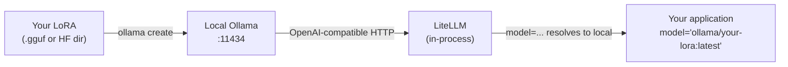

# Deploy locally

This is where the cost-down arc closes. You started with Opus in
Q1, captured answers via the Curator, fine-tuned a LoRA on free
Colab CUDA or rented RunPod, and now the LoRA sits on your laptop
or your inference server. *"Never pay per-token again"* is the
tagline. This page is what *"never"* actually means in operational
terms.

## What's the situation?

You have a `.gguf` file (or a Hugging Face directory, or an MLX
model) that contains your fine-tuned weights. You have an
application that today calls `claude-opus-4-7` for $15/1M output
tokens. You want that application to call your local model
instead, with no application-code change, no per-call dollars,
and no vendor in the loop.

Two pieces of infrastructure carry this:

- **Ollama** (or LM Studio, or `mlx_lm.server`) serves the model
  as a local OpenAI-compatible HTTP endpoint
- **LiteLLM** routes any OpenAI-compatible model name to that
  endpoint, so application code keeps using the same `model=...`
  string surface

Sagewai uses LiteLLM internally for every LLM call. *"OpenAI
compatibility"* is not a marketing phrase here — it is the
contract that lets your fine-tuned LoRA drop into the same
application code that called Opus yesterday.

## What's the recommended path?



The deployment is one `ollama create` invocation. The application
swap is changing one string. Total wall-clock between *"LoRA
exists"* and *"production traffic on local model"* is under 30
minutes for a workload that already has a clean model-string
swap.

## Show me a runnable thing

```bash
# 1. Install Ollama (if not already)
curl -fsSL https://ollama.com/install.sh | sh

# 2. Create an Ollama model from your LoRA's .gguf file
cat > Modelfile <<'EOF'
FROM ./my-finetune.gguf
TEMPLATE """{{ .Prompt }}"""
PARAMETER temperature 0.2
EOF

ollama create my-finetune -f Modelfile

# 3. Verify it serves
curl http://127.0.0.1:11434/api/generate \
    -d '{"model": "my-finetune", "prompt": "Hello"}'

# 4. Swap the model string in your Sagewai code
#    Before:
#      agent = Agent(name="triage", model="claude-opus-4-7", ...)
#    After:
#      agent = Agent(name="triage", model="ollama/my-finetune:latest", ...)
```

That is the cost-down endpoint in four steps. Sagewai's [Example
38](https://github.com/sagewai/platform/blob/main/packages/sdk/sagewai/examples/38_unsloth_finetune.py)
is the canonical end-to-end demo of the Unsloth fine-tune followed
by the Ollama deploy step. The same example also covers the
before-vs-after cost numbers using the [Observatory cost
dashboard](/docs/platform/observatory).

For Apple Silicon laptops where Ollama's Metal backend isn't yet
optimal for your model shape, swap Ollama for `mlx_lm.server` —
see [Example 38a](https://github.com/sagewai/platform/blob/main/packages/sdk/sagewai/examples/38a_mlx_lm_server_deploy.py)
for the same deployment shape with MLX.

## What "never pay per-token again" actually means

Honest version of the tagline:

| Cost | Before (Opus) | After (local Ollama) |
|---|---|---|
| **Per-call** | $0.005-0.020 (varies by tokens) | $0 |
| **Per-month inference compute** | $500-2000 (typical SaaS) | $0 (your laptop / server) |
| **Hardware cost (one-time)** | $0 | $0 if laptop; $200-2000 if dedicated server |
| **Maintenance time** | $0 | A few hours per quarter for retraining |

You did not eliminate cost; you converted **per-call API spend**
into **fixed compute spend**. That is the entire point. Per-call
spend grows with usage; fixed compute does not. At any meaningful
scale, fixed wins.

The other thing you eliminated: **vendor risk**. Anthropic raising
prices 10×, deprecating a model, throttling your account, or having
an outage no longer hurts your product. That is the optionality
Sagewai sells.

## Bring your own endpoint

If you already run inference on a vendor we do not ship — Together,
Replicate, Anyscale, your in-house vLLM cluster — wire it as a
custom endpoint via [Example 46](https://github.com/sagewai/platform/blob/main/packages/sdk/sagewai/examples/46_custom_inference_as_tool.py).
The pattern is the same: any OpenAI-compatible HTTP endpoint plugs
in as a Sagewai LLM backend or as a tool. The framework is
bring-your-own; we do not lock you in.

## What would I do next?

1. Run [Example 38](https://github.com/sagewai/platform/blob/main/packages/sdk/sagewai/examples/38_unsloth_finetune.py)
   to see the full Unsloth → Ollama loop.
2. Take your own LoRA from
   [Free CUDA via Colab](/docs/inference/free-cuda-via-colab) or
   [Rent when you grow](/docs/inference/rent-when-you-grow) and
   run the four-step deploy above.
3. Swap the model string in one application code path. Run
   end-to-end.
4. Open the [Observatory cost dashboard](/docs/platform/observatory) and
   watch the per-call API spend on that path drop to zero.
5. Repeat for the next workload.

## Anti-patterns

1. **Deploying to Ollama before measuring quality.** A LoRA that
   hits 70% of Opus's accuracy on your task is a downgrade you
   should not ship. Run [Example 36](https://github.com/sagewai/platform/blob/main/packages/sdk/sagewai/examples/36_autopilot_training_loop.py)'s
   eval pass first; deploy only when the LoRA clears your quality
   bar.

2. **Running Ollama inside Docker on macOS.** macOS Docker has no
   Metal access; the model silently falls back to CPU. Run Ollama
   natively on the laptop (via `brew install ollama` or the
   installer). Docker is the right answer on Linux + CUDA, not
   Apple Silicon.

3. **Treating local deploy as the end of the story.** The Curator
   keeps capturing fresh training data after deploy. Plan for a
   re-fine-tune every few weeks (hours of work, not weeks) so the
   local model tracks new failure modes as they appear.

4. **Hiding vendor switching behind feature flags.** The Sagewai
   model-string surface is the swap point. Application code does
   not need to know which model is in flight. Wire one Observatory
   panel per model string, not a feature-flag matrix.

## Cross-references

- [Example 38 — Unsloth fine-tune](https://github.com/sagewai/platform/blob/main/packages/sdk/sagewai/examples/38_unsloth_finetune.py) — the canonical full Unsloth → Ollama loop
- [Example 38a — mlx_lm.server deploy](https://github.com/sagewai/platform/blob/main/packages/sdk/sagewai/examples/38a_mlx_lm_server_deploy.py) — Apple Silicon path
- [Example 46 — custom inference as tool](https://github.com/sagewai/platform/blob/main/packages/sdk/sagewai/examples/46_custom_inference_as_tool.py) — bring-your-own endpoint
- [Observatory](/docs/platform/observatory) — where the before-and-after numbers come from
- [Start with juggernauts](/docs/inference/start-with-juggernauts) — the start of this arc
