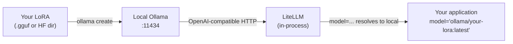

# Deploy locally

You have a `.gguf` file (or a Hugging Face directory, or an MLX
model) from a Colab or RunPod fine-tune. Your application currently
calls `claude-opus-4-7` at $15/1M output tokens. This page shows
you how to serve that fine-tuned model as a local endpoint and swap
your application's `model=` string to point at it — no application
code change beyond that one string.

## What you need

- A fine-tuned model file (`.gguf`, HF directory, or MLX model).
- [Ollama](https://ollama.com/) installed locally (or `mlx_lm.server`
  on Apple Silicon, covered below).
- Your existing Sagewai application code.

Two pieces carry this:

- **Ollama** (or `mlx_lm.server`) serves your model as a local
  OpenAI-compatible HTTP endpoint.
- **LiteLLM**, which Sagewai uses internally for every LLM call,
  routes any OpenAI-compatible model name to that endpoint. Your
  application keeps using the same `model=...` string surface.

## How it fits together



The deployment is one `ollama create` invocation. The application
swap is changing one string. End-to-end from "LoRA exists" to
"production traffic on local model" takes under 30 minutes when the
application already uses a clean model-string swap.

## Run it

```bash
# 1. Install Ollama (if not already)
curl -fsSL https://ollama.com/install.sh | sh

# 2. Create an Ollama model from your LoRA's .gguf file
cat > Modelfile <<'EOF'
FROM ./my-finetune.gguf
TEMPLATE """{{ .Prompt }}"""
PARAMETER temperature 0.2
EOF

ollama create my-finetune -f Modelfile

# 3. Verify it serves
curl http://127.0.0.1:11434/api/generate \
    -d '{"model": "my-finetune", "prompt": "Hello"}'

# 4. Swap the model string in your Sagewai code
#    Before:
#      agent = Agent(name="triage", model="claude-opus-4-7", ...)
#    After:
#      agent = Agent(name="triage", model="ollama/my-finetune:latest", ...)
```

Sagewai's [Example 38](https://github.com/sagewai/platform/blob/main/packages/sdk/sagewai/examples/38_unsloth_finetune.py)
is the canonical end-to-end demo of the Unsloth fine-tune followed
by the Ollama deploy step. It also covers before-vs-after cost
numbers using the [Observatory cost dashboard](/docs/platform/observatory).

For Apple Silicon laptops where Ollama's Metal backend doesn't suit
your model shape, use `mlx_lm.server` instead — see [Example 38a](https://github.com/sagewai/platform/blob/main/packages/sdk/sagewai/examples/38a_mlx_lm_server_deploy.py)
for the same deployment shape with MLX.

## What the cost shift actually looks like

You don't eliminate cost; you convert per-call API spend into fixed
compute spend. Per-call spend grows with usage; fixed compute does not.
At any meaningful scale, fixed wins.

| Cost | Before (Opus) | After (local Ollama) |
|---|---|---|
| **Per-call** | $0.005–0.020 (varies by tokens) | $0 |
| **Per-month inference compute** | $500–2000 (typical SaaS) | $0 (your laptop / server) |
| **Hardware cost (one-time)** | $0 | $0 if laptop; $200–2000 if dedicated server |
| **Maintenance time** | $0 | A few hours per quarter for retraining |

The other shift: vendor dependency. Provider price increases, model
deprecations, throttling, and outages no longer affect your product.
Your model runs on hardware you control.

## Bring your own endpoint

If you already run inference on a provider Sagewai doesn't ship —
Together, Replicate, Anyscale, your own vLLM cluster — wire it as a
custom endpoint via [Example 46](https://github.com/sagewai/platform/blob/main/packages/sdk/sagewai/examples/46_custom_inference_as_tool.py).
Any OpenAI-compatible HTTP endpoint plugs in as a Sagewai LLM backend
or tool. The framework doesn't lock you to a specific vendor.

## Steps to follow

1. Run [Example 38](https://github.com/sagewai/platform/blob/main/packages/sdk/sagewai/examples/38_unsloth_finetune.py)
   to see the full Unsloth → Ollama loop.
2. Take your own LoRA from [Free CUDA via Colab](/docs/inference/free-cuda-via-colab)
   or [Rent when you grow](/docs/inference/rent-when-you-grow) and
   run the four-step deploy above.
3. Swap the model string in one application code path. Run end-to-end.
4. Open the [Observatory cost dashboard](/docs/platform/observatory)
   and watch the per-call API spend on that path drop to zero.
5. Repeat for the next workload.

## Anti-patterns

1. **Deploying before measuring quality.** A LoRA that hits 70% of
   Opus's accuracy is a downgrade you should not ship. Run
   [Example 36](https://github.com/sagewai/platform/blob/main/packages/sdk/sagewai/examples/36_autopilot_training_loop.py)'s
   eval pass first; deploy only when the LoRA clears your quality bar.

2. **Running Ollama inside Docker on macOS.** Docker on macOS has no
   Metal access; the model silently falls back to CPU. Run Ollama
   natively (via `brew install ollama` or the installer). Docker is
   the right answer on Linux + CUDA, not Apple Silicon.

3. **Treating local deploy as a one-time event.** The Curator keeps
   capturing fresh training data after deploy. Plan for a re-fine-tune
   every few weeks — hours of work, not weeks — so the local model
   tracks new failure modes as they appear.

4. **Hiding vendor switching behind feature flags.** The Sagewai
   model-string surface is the swap point. Application code does not
   need to know which model is in flight. Wire one Observatory panel
   per model string, not a feature-flag matrix.

## Cross-references

- [Example 38 — Unsloth fine-tune](https://github.com/sagewai/platform/blob/main/packages/sdk/sagewai/examples/38_unsloth_finetune.py) — the canonical full Unsloth → Ollama loop
- [Example 38a — mlx_lm.server deploy](https://github.com/sagewai/platform/blob/main/packages/sdk/sagewai/examples/38a_mlx_lm_server_deploy.py) — Apple Silicon path
- [Example 46 — custom inference as tool](https://github.com/sagewai/platform/blob/main/packages/sdk/sagewai/examples/46_custom_inference_as_tool.py) — bring-your-own endpoint
- [Observatory](/docs/platform/observatory) — before-and-after cost numbers
- [Start with the big providers](/docs/inference/start-with-juggernauts) — the start of this arc
