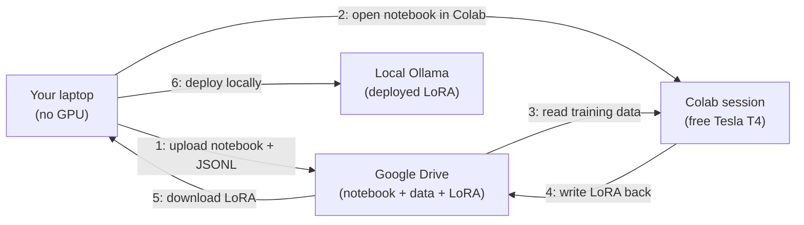

# Free CUDA via Colab

You can fine-tune a model on a free Tesla T4, without a credit card,
without leaving the Sagewai surface. This page walks through the
setup. Prerequisites: a Google account and training data in JSONL
format.

## What you need

You have training data — maybe the Curator harvested several thousand
input-output pairs from your Q1 Opus runs, or you exported a JSONL
of customer-support transcripts from your existing ticketing system.
You want to fine-tune a small open-source model on that data and
verify the result before renting paid hardware.

Google Colab gives you a Tesla T4 (16 GB) for free. Session limit is
about 12 hours. A T4 can fine-tune a 3B base model with QLoRA in two
to three hours. The constraint is wall-clock, not money.

## How it works

Sagewai's [Example 44](https://github.com/sagewai/platform/blob/main/packages/sdk/sagewai/examples/44_colab_free_cuda.py)
orchestrates Colab via Drive-sync. Here is the shape:



The orchestrator handles steps 1, 5, and 6. You handle step 2 (one
click in your browser). Colab handles steps 3 and 4 on the free T4.

The integration uses Drive-sync via `pydrive2` (not `colab-cli`,
which is unmaintained as of 2026 and whose auth flow no longer
matches Google's current OAuth surface). `pydrive2` targets the
standard Drive API and is supported and documented.

## Run it

```bash
# 1. Set up Drive OAuth (one-time, ~5 minutes)
#    - Create a Google Cloud project at console.cloud.google.com
#    - Enable Drive API
#    - Download the OAuth client JSON to ~/.sagewai/google-drive-oauth.json

# 2. Run the example
pip install sagewai pydrive2 python-dotenv
python packages/sdk/sagewai/examples/44_colab_free_cuda.py

# 3. The example prints a Drive URL. Open it in Colab. Click
#    "Runtime > Run all". Wait 2-3 hours. The orchestrator polls
#    Drive for the LoRA artefact, downloads it, and deploys it
#    via Ollama.
```

That is the full path: install, run, one browser click, wait, done.
Stub mode runs end-to-end without Drive credentials so you can
verify the wiring before doing the OAuth setup:

```bash
python packages/sdk/sagewai/examples/44_colab_free_cuda.py
# → "Stub mode — set ~/.sagewai/google-drive-oauth.json to enable live runs."
```

The example's [companion README](https://github.com/sagewai/platform/blob/main/packages/sdk/sagewai/examples/44_colab_free_cuda.md)
walks through the OAuth setup with screenshots.

## What the LoRA gives you

Trained on a few thousand support-triage pairs, a 3B base model with
QLoRA on a T4 typically reaches 88–92% of Opus's classification
accuracy on the same task. That is a routine outcome for narrow,
well-specified classification tasks, not a research result.

What the LoRA does not do: replace Opus on open-ended generation,
multi-step reasoning, or any task where the input distribution is
wider than your training data. Local SLMs win on narrow tasks —
and narrow tasks are where most production AI features actually live.

## Cost

| Item | Cost |
|---|---|
| Colab T4 GPU time | $0 |
| Google Drive storage (~5 GB) | $0 |
| Drive API quota | $0 |
| Your laptop's CPU during orchestration | $0 |
| **Total** | **$0** |

If your fine-tune takes longer than 12 hours, Colab will disconnect
the session and you will lose the run. For fine-tunes that size, see
[Rent when you grow](/docs/inference/rent-when-you-grow). Everything
that fits in 12 hours on a T4 — which covers most narrow-task QLoRA
fine-tunes of base models up to 7B — is handled here.

## Steps to follow

1. Run Example 44's stub mode to verify the wiring.
2. Set up the Drive OAuth (one-time, 5 min).
3. Export training data via the Curator (if you've been capturing)
   or from your existing data source.
4. Run the live mode. Come back in 3 hours.
5. The orchestrator deploys the LoRA via Ollama; test it locally.
6. When the LoRA passes your quality bar, swap `model="claude-opus-4-7"`
   to `model="ollama/your-lora:latest"` in your application code.
7. Open the [Observatory cost dashboard](/docs/platform/observatory)
   to see the per-call API spend drop.

## Anti-patterns

1. **Trying to fine-tune a 70B model on a T4.** It won't fit.
   Match model size to GPU memory. 3B–7B base models with QLoRA fit
   on 16 GB; larger models need larger GPUs (see
   [Rent when you grow](/docs/inference/rent-when-you-grow)).

2. **Treating Colab as a long-running service.** Colab disconnects
   idle sessions and caps wall-clock at ~12 hours. Use it for training
   runs only. Deploy via Ollama on your laptop or a server you control.

3. **Deferring the OAuth setup.** Stub mode is a verification path,
   not a substitute for the live run. The 5-minute OAuth setup unlocks
   every subsequent fine-tune.

## Cross-references

- [Example 44 — Colab free CUDA](https://github.com/sagewai/platform/blob/main/packages/sdk/sagewai/examples/44_colab_free_cuda.py) — the runnable companion
- [Example 38 — Unsloth fine-tune](https://github.com/sagewai/platform/blob/main/packages/sdk/sagewai/examples/38_unsloth_finetune.py) — the fine-tune step Colab runs
- [Deploy locally](/docs/inference/deploy-locally) — what happens after the LoRA lands on your laptop
