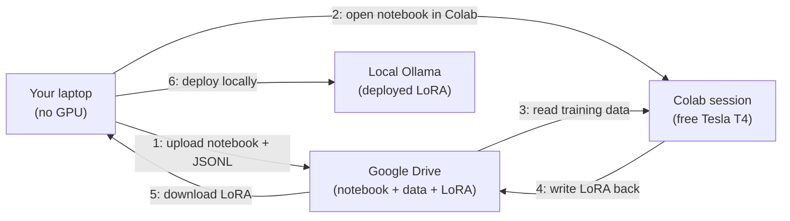

# Free CUDA via Colab

This is the most important page in this section. If you have never
fine-tuned a model before, by the end of this page you will know
that you can do it on your lunch break, on a free Tesla T4, without
a credit card and without leaving the Sagewai surface.

That sentence is the whole democratisation pitch in one breath.
Either it is true and Sagewai is the platform that taught the
audience how to use open models, or it is false and we are just
another framework that says nice things about open models in its
README. Read this page; decide for yourself.

## What's the situation?

You have training data. Maybe the Curator harvested several
thousand input-output pairs from your Q1 Opus runs, or maybe you
exported a JSONL of customer-support transcripts from your existing
ticketing system. You want to fine-tune a small open-source model
on that data and prove that the result is good enough to deploy.

You do not have a GPU. You will not put a $2,000 RTX 4090 on the
corporate card to *prove that fine-tuning works*. You will not
spin up an AWS p3 instance because the IAM ceremony alone is a
half-day. You want a runway between *"I have data"* and *"I have
a deployed model"* that is **measured in minutes and zero dollars**.

That runway is Google Colab. Anyone with a Google account gets a
Tesla T4 (16GB) for free, with a session limit of about 12 hours.
A T4 is enough to fine-tune a 3B base model with QLoRA in two to
three hours. The constraint is wall-clock, not money.

## What's the recommended path?

Sagewai's [Example 44](https://github.com/sagewai/platform/blob/main/packages/sdk/sagewai/examples/44_colab_free_cuda.py)
orchestrates Colab via Drive-sync. Here is the shape:



The orchestrator handles steps 1, 5, and 6. You handle step 2 (one
click in your browser). Colab handles steps 3 and 4 on the free T4.

The reason it is Drive-sync and not the older `colab-cli` PyPI
package is that `colab-cli` is unmaintained as of 2026 and its
auth flow no longer matches Google's current OAuth surface.
Drive-sync uses `pydrive2` against the standard Drive API, which
is supported, documented, and stable.

## Show me a runnable thing

```bash
# 1. Set up Drive OAuth (one-time, ~5 minutes)
#    - Create a Google Cloud project at console.cloud.google.com
#    - Enable Drive API
#    - Download the OAuth client JSON to ~/.sagewai/google-drive-oauth.json

# 2. Run the example
pip install sagewai pydrive2 python-dotenv
python packages/sdk/sagewai/examples/44_colab_free_cuda.py

# 3. The example prints a Drive URL. Open it in Colab. Click
#    "Runtime > Run all". Wait 2-3 hours. The orchestrator polls
#    Drive for the LoRA artefact, downloads it, and deploys it
#    via Ollama.
```

That is the full path. Six commands plus one browser click. The
orchestrator's stub mode runs end-to-end without any Drive
credentials so you can sanity-check the wiring before you do the
OAuth setup:

```bash
python packages/sdk/sagewai/examples/44_colab_free_cuda.py
# → "Stub mode — set ~/.sagewai/google-drive-oauth.json to enable live runs."
```

The example's [companion README](https://github.com/sagewai/platform/blob/main/packages/sdk/sagewai/examples/44_colab_free_cuda.md)
walks through the OAuth setup with screenshots.

## What does the LoRA do?

Trained on a few thousand support-triage pairs, a 3B base model
with QLoRA on a T4 typically reaches 88-92% of Opus's
classification accuracy on the same task. That is not a
research result; it is a routine outcome for narrow,
well-specified classification tasks.

What the LoRA *does not* do: replace Opus on open-ended generation,
multi-step reasoning, or any task where the input distribution is
broader than your training data. Match the model to the job —
narrow tasks are where local SLMs win, and narrow tasks are also
where most production AI features actually live.

## What it costs

| Item | Cost |
|---|---|
| Colab T4 GPU time | $0 |
| Google Drive storage (~5GB) | $0 |
| Drive API quota | $0 |
| Your laptop's CPU during orchestration | $0 |
| **Total** | **$0** |

The honest version: if your fine-tune takes longer than 12 hours,
Colab will disconnect the session and you will lose the run. For
fine-tunes that big, see [Rent when you grow](/docs/inference/rent-when-you-grow).
For everything that fits in 12 hours on a T4 — which is
*"most narrow-task QLoRA fine-tunes of base models up to 7B"* —
Colab is the answer.

## What would I do next?

1. Run Example 44's stub mode to verify the wiring.
2. Set up the Drive OAuth (one-time, 5 min).
3. Export training data via the Curator (if you have been
   capturing) or from your existing data source.
4. Run the live mode. Walk away. Come back in 3 hours.
5. The orchestrator deploys the LoRA via Ollama; test it locally.
6. When the LoRA passes your quality bar, swap your application
   code's `model="claude-opus-4-7"` to `model="ollama/your-lora:latest"`.
7. Watch the [Observatory cost dashboard](/docs/observatory) tell
   you the bill dropped.

## Anti-patterns

1. **Trying to fine-tune a 70B on a T4.** Won't fit. Match the
   model size to the GPU memory. 3B-7B base models with QLoRA fit
   on 16GB; bigger models need bigger GPUs (see [Rent when you
   grow](/docs/inference/rent-when-you-grow)).

2. **Treating Colab as a long-running service.** Colab disconnects
   idle sessions and caps wall-clock at ~12 hours. It is for
   training runs, not deployment. Deploy via Ollama on your laptop
   or on a server you control.

3. **Skipping the OAuth setup *"because I'll do it later"*.** Stub
   mode is a verification path, not a substitute for the live run.
   The 5-minute OAuth setup unlocks every subsequent fine-tune.

## Cross-references

- [Example 44 — Colab free CUDA](https://github.com/sagewai/platform/blob/main/packages/sdk/sagewai/examples/44_colab_free_cuda.py) — the runnable companion
- [Example 38 — Unsloth fine-tune](https://github.com/sagewai/platform/blob/main/packages/sdk/sagewai/examples/38_unsloth_finetune.py) — the fine-tune step Colab runs
- [Deploy locally](/docs/inference/deploy-locally) — what happens after the LoRA lands on your laptop
