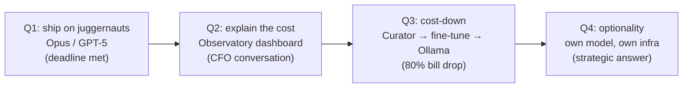

# Start with juggernauts

If you ship your Q1 AI feature on Opus or GPT-5, you have done the
right thing — not the wrong one. This page exists because the
*"open-source LLMs and SLMs"* pitch reads, to anyone who has ever
shipped under deadline, like an implicit *"and you should not be
using Anthropic"*. We are not saying that. Anthropic and OpenAI
shipping is fine. We adore them. The point is to make sure you
always have the **option** to leave them when their pricing or
priorities change.

## What's the situation?

You have one quarter. Your boss expects an AI feature in the
product by quarter-end. Your performance review depends on it.
You have a budget measured in hundreds of dollars per month, not
thousands. You have no research team. You will not get one.

Reach for the cheapest open model first and you will burn two
weeks debugging context windows, one week tuning prompts, and
ship a triage agent that flags ham as spam in 8% of cases. By
Q1 close you have a beta nobody trusts and a slipping timeline.

Reach for Opus or GPT-5 first and you ship a working triage agent
in 10 days. Quality is a known quantity. The bill is real, but the
bill is also the reason your boss says yes to Q2 work — *"the
feature works; can we make it cheaper?"* is a much easier
conversation than *"the feature does not work yet; can we have
more time?"*

## What's the recommended path?

The Sagewai Training Loop is structured around exactly this arc:



Each quarter is a checkpoint, not a phase change. The work you do
in Q1 is what makes Q3 possible — the Curator captures every
juggernaut response as training data, automatically, without
changing your application code.

## Show me a runnable thing

Here is the smallest possible juggernaut-bootstrap loop:

```python
import asyncio
from sagewai.core import Agent

async def main():
    agent = Agent(
        name="support-triage",
        model="claude-opus-4-7",  # The juggernaut
        system_prompt="Categorise the support ticket as: refund, "
                      "technical, account, or other.",
    )
    result = await agent.run("My order #1234 never arrived")
    print(result.output)

asyncio.run(main())
```

Three lines that matter, plus an `await`. To swap to GPT-5 later,
change one string:

```python
agent = Agent(name="support-triage", model="gpt-5", ...)
```

To run the same code on local Ollama (Q3, after the fine-tune), one
more swap:

```python
agent = Agent(name="support-triage", model="ollama/my-finetuned-llama:latest", ...)
```

That is the LLM-agnostic surface. Application code does not change
across the arc. See [Example 18 — local LLM
routing](https://github.com/sagewai/platform/blob/main/packages/sdk/sagewai/examples/18_local_llm_routing.py)
for the full swap demonstration across Claude, GPT, and Ollama.

## Capture as you go

The Q3 cost-down does not work if you have not been capturing
training data the whole time. Sagewai's Curator does this
automatically: every successful agent run becomes a candidate
training sample, scored by user feedback (thumbs-up / thumbs-down)
or by an LLM-judge classifier you configure.

```python
from sagewai.curator import Curator

curator = Curator(
    project_id="acme-support",
    quality_filter="user_rating >= 4 AND human_override == False",
)
```

By Q3, the Curator has captured several thousand high-quality
input-output pairs from your Opus runs — more than enough to
fine-tune a 3B local model that hits 90%+ of Opus's quality on
*your specific task* at 1% of the cost-per-call.

For the full Curator → JSONL → Unsloth → Ollama loop, see
[Example 36 — autopilot training loop](https://github.com/sagewai/platform/blob/main/packages/sdk/sagewai/examples/36_autopilot_training_loop.py)
and [Example 38 — Unsloth fine-tune](https://github.com/sagewai/platform/blob/main/packages/sdk/sagewai/examples/38_unsloth_finetune.py).

## What would I do next?

1. Ship Q1 on Opus or GPT-5. Stop second-guessing the choice.
2. Wire the Curator from day one — it costs nothing and it is the
   reason Q3 will work.
3. Wire the [Observatory cost dashboard](/docs/observatory) — by Q2
   you will need to point at it during the CFO conversation.
4. Read [Free CUDA via Colab](/docs/inference/free-cuda-via-colab)
   ahead of Q3 so you already know how the fine-tune works before
   the cost-down ask lands.

## Anti-patterns

1. **Optimising before you have a product.** The cheapest LLM is the
   one that ships your feature on time. That is almost never the
   smallest open model in week one.

2. **Skipping the Curator.** Training data has to exist before you
   can fine-tune. Capturing retroactively from logs is a week of
   pain; capturing prospectively from the Curator is a one-line
   wire-up.

3. **Treating Q3 cost-down as a 10-week project.** With the
   Sagewai Training Loop, the same engineer can ship an Unsloth
   fine-tune on a free Colab T4 over a weekend. See
   [Free CUDA via Colab](/docs/inference/free-cuda-via-colab).

## Cross-references

- [Example 03 — multi-model](https://github.com/sagewai/platform/blob/main/packages/sdk/sagewai/examples/03_multi_model.py)
- [Example 13 — model routing](https://github.com/sagewai/platform/blob/main/packages/sdk/sagewai/examples/13_model_routing.py)
- [Example 18 — local LLM routing](https://github.com/sagewai/platform/blob/main/packages/sdk/sagewai/examples/18_local_llm_routing.py)
- [Example 36 — autopilot training loop](https://github.com/sagewai/platform/blob/main/packages/sdk/sagewai/examples/36_autopilot_training_loop.py)
