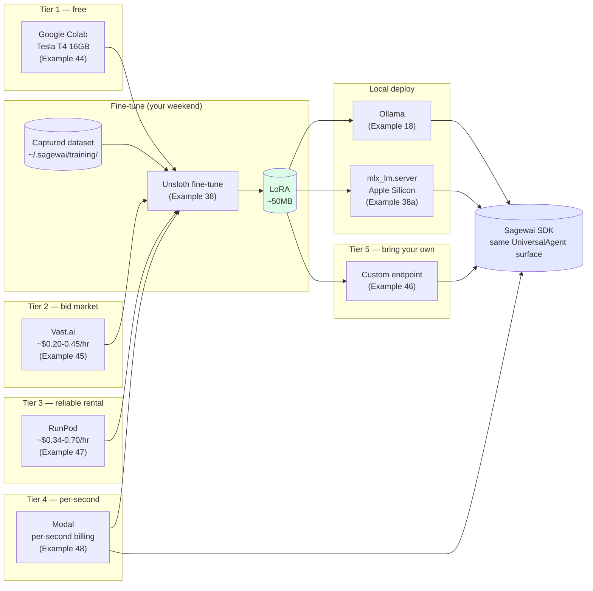

# Inference deployment — five tiers, your choice, our wiring

> *"Bring your own GPU, your own endpoint, your own model. We provide the wiring."*

The Training Loop pillar's claim is *"never pay per-token again."* That claim is verifiable only if a senior engineer with no GPU and a $500/month budget can actually go from *"I have training data"* to *"I have my own deployed model"* without leaving Sagewai's surface. This page walks the five inference tiers that make it real.

Companion to [Train your own model](/docs/lighthouse/train-your-own-model) — that page is about the loop end-to-end (capture → fine-tune → deploy). This page zooms into the *deploy* half: which tier wins for which job, with shipped examples per tier.

## What this proves

Five invariants the audience-pin person needs before they trust this in front of real production traffic:

1. **The free path works.** Example 44 fine-tunes on a free Tesla T4 via Colab Drive-sync. $0 cost, 12-hour session limit, real LoRA at the end.
2. **The cheap-but-reliable path works.** Examples 45 (Vast.ai bid market) and 47 (RunPod reliable rental) cover the $0.20-$0.70/hr range, with cleanup-on-failure and reliability scoring respectively.
3. **The serverless path works.** Example 48 deploys to Modal with per-second billing — pay only when the model is hot. Real run: 10.10s for $0.002147 on a T4 once five Modal SDK gotchas were resolved (documented in `example-build-conventions.md`).
4. **The bring-your-own path works.** Example 46 wraps any HTTP completion endpoint as a Sagewai-callable tool. Customer-hosted, on-prem, or air-gapped — same SDK surface.
5. **The local-deploy path works.** Example 38a deploys via `mlx_lm.server` for Apple Silicon; Ollama everywhere else. Example 18 demonstrates the Ollama swap as a foundation primitive.

## Architecture



## When each tier wins

| Tier | When it wins | Cost | Companion example |
|---|---|---|---|
| **Tier 0 — local laptop** | Development, dev-mode inference, *make me forget I'm not on Anthropic* | Free (existing hardware) | [18](https://github.com/sagewai/platform/blob/main/packages/sdk/sagewai/examples/18_local_llm_routing.py) |
| **Tier 1 — Colab T4** | First fine-tune, no GPU at home, no vendor account | $0 | [44](https://github.com/sagewai/platform/blob/main/packages/sdk/sagewai/examples/44_colab_free_cuda.py) |
| **Tier 2 — Vast.ai bid** | Cost-sensitive iterations, willing to handle interruptions | ~$0.20-0.45/hr | [45](https://github.com/sagewai/platform/blob/main/packages/sdk/sagewai/examples/45_vastai_marketplace_bid.py) |
| **Tier 3 — RunPod rental** | Production fine-tunes, you want SLA + cleanup-on-failure | ~$0.34-0.70/hr | [47](https://github.com/sagewai/platform/blob/main/packages/sdk/sagewai/examples/47_runpod_finetune_orchestration.py) |
| **Tier 4 — Modal serverless** | Bursty inference traffic, pay only when hot | Per-second (~$0.0006/s A10G) | [48](https://github.com/sagewai/platform/blob/main/packages/sdk/sagewai/examples/48_modal_serverless_inference.py) |
| **Tier 5 — bring your own** | On-prem, air-gapped, customer-hosted, vendor lock-out | Varies | [46](https://github.com/sagewai/platform/blob/main/packages/sdk/sagewai/examples/46_custom_inference_as_tool.py) |
| **Local deploy: Ollama** | Production serving on commodity hardware | Free (existing VPS) | [18](https://github.com/sagewai/platform/blob/main/packages/sdk/sagewai/examples/18_local_llm_routing.py) |
| **Local deploy: mlx-lm** | Production serving on Apple Silicon Mac shops | Free (existing hardware) | [38a](https://github.com/sagewai/platform/blob/main/packages/sdk/sagewai/examples/38a_mlx_lm_server_deploy.py) |

For the long-form tier comparison with vendor analysis, see the [Inference education section](/docs/inference) — five MDX pages walking the spectrum.

## Run it

Each tier example runs standalone. Pick the one closest to your reality:

### Free path — Colab T4

```bash
python 44_colab_free_cuda.py
```

The script Drive-syncs the dataset to a Colab notebook, fine-tunes on the free T4, and Drive-syncs the LoRA back. No vendor account needed.

### Cheapest path — Vast.ai bid

```bash
export VASTAI_API_KEY=...
python 45_vastai_marketplace_bid.py
```

The script bids the cheapest A10G with reliability scoring; preempted-host risk is in the output.

### Reliable path — RunPod

```bash
export RUNPOD_API_KEY=...
python 47_runpod_finetune_orchestration.py
```

24GB GPU, cleanup-on-failure, SLA-grade. The orchestration script idempotently brings up the pod, runs the fine-tune, downloads the LoRA, and tears the pod down.

### Serverless path — Modal

```bash
modal token new
python 48_modal_serverless_inference.py
```

Per-second billing, cold-start ~9s on T4 once the function image caches. Five SDK gotchas documented in `example-build-conventions.md` are handled in the example.

### Bring-your-own — custom endpoint

```bash
python 46_custom_inference_as_tool.py
```

Wraps an arbitrary HTTP completion endpoint (your Modal deploy, your on-prem TGI, your customer's vLLM cluster) as a Sagewai-callable tool. Same `UniversalAgent` surface.

### Apple Silicon deploy — mlx-lm

```bash
pip install mlx-lm
python 38a_mlx_lm_server_deploy.py
```

`mlx_lm.server` for Mac shops with Apple Silicon. The example serves the fine-tuned LoRA from Example 38 and exercises the LiteLLM-compatible OpenAI endpoint.

## Real-world use cases

The pattern in this lighthouse — *one SDK surface across five GPU tiers and three deploy paths* — is what a senior engineer at a 50-500-person SaaS reaches for when their CFO asks for the cost-down plan and they need to commit to specific vendors. Five domains:

### 1. Solo founder fine-tuning their first model

You're at a 50-person Series A. You need to prove the loop works before the VP of Eng greenlights a real GPU budget.

| Concern | How this pattern solves it |
|---|---|
| You don't have a vendor account and can't get one this week | Example 44 needs a Google account; that's it |
| You need a real LoRA at the end, not a tutorial blog post | The example saves a working LoRA you can deploy locally |
| Your laptop has no GPU | Colab T4 has 16GB; that's plenty for a 3B fine-tune |

### 2. Mid-size SaaS productionising a Q1 prototype

Your AI feature shipped on Opus in Q1. Now in Q3 you need to cost-down without breaking it.

| Concern | How this pattern solves it |
|---|---|
| You want SLA-grade infrastructure for the production fine-tune | Example 47 (RunPod) — cleanup-on-failure, reliable rental |
| You want to compare a fine-tuned model against the cloud baseline | Example 38 prints per-call cost delta against the original Opus baseline |
| Your CFO wants a vendor relationship, not "we found this on Hacker News" | RunPod, Modal, and Vast.ai all have enterprise contracts available |

### 3. On-prem-first SaaS (regulated industries)

Your customers run on-prem. They want fine-tuning to happen on their hardware, not yours.

| Concern | How this pattern solves it |
|---|---|
| Customer's training data must never leave their VPC | Example 46 (custom endpoint) is the BYO pattern; their on-prem TGI fronts the model, your code calls it |
| You don't want to certify each customer's hardware | Same SDK surface; if the endpoint is OpenAI-compatible, Sagewai talks to it |
| Customer's IT wants to revoke any time | The endpoint URL is a config value; revoke it and the agent fails closed |

### 4. Bursty B2C app with unpredictable load

Your app's AI feature handles 100x peak vs trough traffic. Reserved capacity means paying for trough.

| Concern | How this pattern solves it |
|---|---|
| You don't want to pay for idle GPU time at trough | Example 48 (Modal serverless) — per-second, only pay when hot |
| Cold-start must be tolerable | T4 cold-start is ~9s; warm calls are 281ms (real number from Example 48's run) |
| You want to scale to zero overnight | Modal scales to zero by default |

### 5. Apple-shop developer team

Your team is all on M-series Macs. You don't have CUDA hardware in the office.

| Concern | How this pattern solves it |
|---|---|
| You want to fine-tune locally on Apple Silicon | Use Example 44 (Colab) for the fine-tune; the LoRA is base-architecture-agnostic |
| You want to deploy locally on Apple Silicon | Example 38a uses `mlx_lm.server`; Metal acceleration, no Docker (Docker on macOS has no Metal access — see the lessons doc) |
| You want the same model on dev Macs and Linux CI | The Ollama path (Example 18) runs on both; your CI uses Ollama, your devs use mlx-lm |

## Companion examples

| # | Example | What it adds |
|---|---|---|
| 18 | [local_llm_routing](https://github.com/sagewai/platform/blob/main/packages/sdk/sagewai/examples/18_local_llm_routing.py) | Foundation — Ollama + LM Studio swap |
| 38 | [unsloth_finetune](https://github.com/sagewai/platform/blob/main/packages/sdk/sagewai/examples/38_unsloth_finetune.py) | Real Unsloth fine-tune |
| 38a | [mlx_lm_server_deploy](https://github.com/sagewai/platform/blob/main/packages/sdk/sagewai/examples/38a_mlx_lm_server_deploy.py) | Apple Silicon deploy via `mlx_lm.server` |
| 44 | [colab_free_cuda](https://github.com/sagewai/platform/blob/main/packages/sdk/sagewai/examples/44_colab_free_cuda.py) | Free Tesla T4 via Drive-sync |
| 45 | [vastai_marketplace_bid](https://github.com/sagewai/platform/blob/main/packages/sdk/sagewai/examples/45_vastai_marketplace_bid.py) | Bid-cheapest aggregator with reliability scoring |
| 46 | [custom_inference_as_tool](https://github.com/sagewai/platform/blob/main/packages/sdk/sagewai/examples/46_custom_inference_as_tool.py) | Bring-your-own endpoint |
| 47 | [runpod_finetune_orchestration](https://github.com/sagewai/platform/blob/main/packages/sdk/sagewai/examples/47_runpod_finetune_orchestration.py) | RunPod reliable rental, cleanup-on-failure |
| 48 | [modal_serverless_inference](https://github.com/sagewai/platform/blob/main/packages/sdk/sagewai/examples/48_modal_serverless_inference.py) | Modal per-second serverless |

## What to read next

- **Primary pillar:** [Training Loop](/docs/pillars/training-loop) — the capture → fine-tune → deploy arc.
- **Sibling lighthouse:** [Train your own model](/docs/lighthouse/train-your-own-model) — the loop end-to-end. This page is the deploy zoom; that page is the loop.
- **Sibling lighthouse:** [Observability and cost](/docs/lighthouse/observability-and-cost) — the cost-down measurement surface.
- **Inference education:** [Inference — overview](/docs/inference) — the five-tier comparison with vendor analysis.
- **Prerequisite foundation:** [Example 18 — local LLM routing](https://github.com/sagewai/platform/blob/main/packages/sdk/sagewai/examples/18_local_llm_routing.py).
- **Inference deep-dive pages:** [Free CUDA via Colab](/docs/inference/free-cuda-via-colab), [Rent when you grow](/docs/inference/rent-when-you-grow), [Deploy locally](/docs/inference/deploy-locally).
