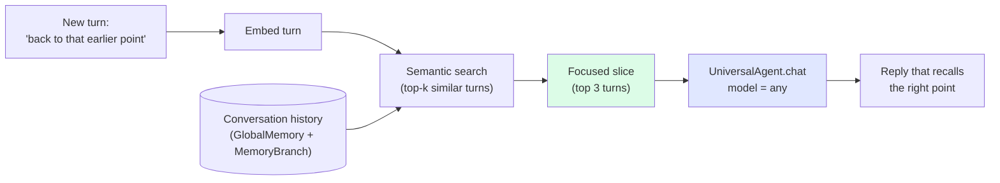
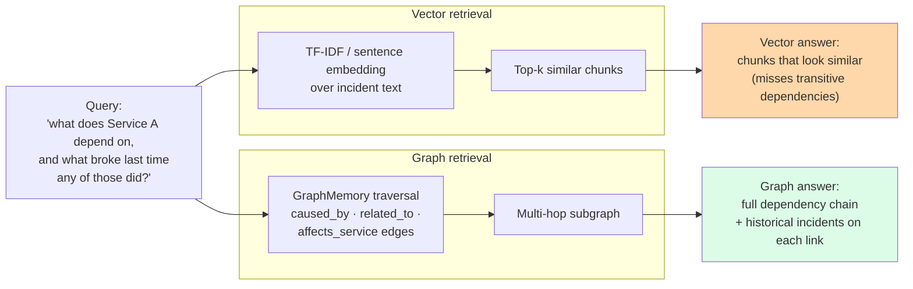

# Memory and retrieval — weak LLMs feel like Opus

> *"You don't pay per token if your local LLM never sees the whole conversation. Here's how we make a 7B model hold the thread as well as Opus does."*

Two patterns live on this page:

- **Semantic checkpoint recall** — vague human references like *"back to that earlier point"* or *"our real business"* get resolved into the right slice of prior context. Same code, same conversation, runs identically on `claude-opus`, `gpt-4o-mini`, and `ollama/llama3:8b`. The 7B model holds the thread because it never sees the whole thread, just the relevant slice.
- **Graph beats vector** — multi-hop reasoning across incident dependencies, where vector chunking loses. Side-by-side comparison: same query, vector finds *similar text*, graph finds *related incidents that share root causes*.

Together these are the cleanest single proof of two of Sagewai's biggest LLM-agnostic claims: *works with the cheapest LLM* and *production-ready memory + RAG*.

## What this proves

Five invariants the audience-pin person needs before they trust this in front of real chat or incident-response surfaces:

1. **Topic-anchored conversation recall is wired in.** Example 37 builds a multi-turn conversation, fires a vague reference, embeds the new turn, semantic-searches the history, and passes only the focused slice to the LLM. The substrate (RAG engine, GlobalMemory, embeddings, MemoryBranch) is shipped.
2. **The same code runs on Opus, GPT, and Ollama.** Example 37 cycles through all three and prints per-LLM agreement on the recalled slice. The 7B local model holds the thread.
3. **Graph wins where vector loses.** Example 41 issues four query types — single-hop, multi-hop, temporal, constraint propagation — and produces side-by-side comparisons with vector-only retrieval. Publishable numbers: avg traversal depth, answer-completeness vs vector, p50/p99 latency.
4. **The graph substrate is production-real.** `GraphMemory`, `NebulaGraphMemory`, the `QueryRouter` auto-relational classifier — all shipped, all tested, all behind one Sagewai-shaped API.
5. **The cost story is honest.** Local Ollama ($0/call) holding the thread as well as Opus ($0.03/call) is the cleanest concrete proof that *"Sagewai is independent of the LLM"* is a fact, not a slide.

## Architecture

### Semantic checkpoint recall



### Graph beats vector



## Run it

### Semantic checkpoint recall (free path)

```bash
pip install sagewai
ollama pull llama3.2
python 37_semantic_checkpoint_recall.py
```

The script builds a 12-turn conversation about a fictional product launch, fires a deliberately vague *"let's get back to our real business"* turn, retrieves the focused slice, and compares per-LLM responses. Real numbers from a clean-machine run print at the end.

### Graph memory: graph vs vector

```bash
python 41_graph_memory_incident_dependency.py
```

The script seeds 15-20 incidents and 5-10 services with realistic root-cause edges, issues four query types, and prints the side-by-side. Optional `--backend nebula` toggle exercises the production NebulaGraph path.

### Foundation memory examples

If you want to learn the storage and retrieval primitives before reading the lighthouse work:

- [Example 04 — memory_agent](https://github.com/sagewai/platform/blob/main/packages/sdk/sagewai/examples/04_memory_agent.py) — basic memory.
- [Example 29 — memory_strategies](https://github.com/sagewai/platform/blob/main/packages/sdk/sagewai/examples/29_memory_strategies.py) — strategy-based extraction (AgentCore-style branching).
- [Example 32 — global_shared_memory](https://github.com/sagewai/platform/blob/main/packages/sdk/sagewai/examples/32_global_shared_memory.py) — cross-agent shared knowledge.

## Real-world use cases

The patterns on this page — *embed the latest turn, retrieve the focused slice, only send that to the LLM* and *graph traversal over typed relations* — are what a senior engineer at a 50-500-person SaaS reaches for when their first agent starts losing the thread or when their RAG pipeline returns *"chunks that look similar but don't actually answer the question."* Four domains:

### 1. Customer-support chatbot for a long-running session

Your support bot handles multi-turn conversations where customers walk it through reproducing a bug. Sessions can hit 30 turns. Opus is fine but expensive at scale; Haiku loses context.

| Concern | How this pattern solves it |
|---|---|
| You want a cheap model to hold a 30-turn thread without losing the early context | Example 37's pattern: embed each new turn, retrieve top-3 most-relevant history turns, pass only that slice |
| The customer asks *"can you re-check what I said about the staging environment?"* mid-conversation | Semantic search resolves the vague reference into the actual staging-environment turn from 18 messages back |
| You want to swap from Opus to Haiku to local without rewriting | Same code; Example 37 demonstrates it works on all three |

### 2. On-call / incident-response with cross-incident reasoning

Your platform team is on the hook for "did this break before?" questions. Today the on-call tool RAGs over the incident wiki and returns chunks; the human still has to follow the dependency chain.

| Concern | How this pattern solves it |
|---|---|
| Vector retrieval finds *similar-sounding* incidents but misses transitive dependencies | Example 41's graph traversal walks `affects_service` and `caused_by` edges; finds the actual root cause across hops |
| The CTO wants explainability — *why* did the bot suggest this is the same root cause? | Graph retrieval emits the path; "Service A → caused_by → Service B → previous_incident → INC-1234" is a sentence, not a vibe |
| You're already running NebulaGraph in production for service maps | The same example code switches to `--backend nebula`; no new infra |

### 3. Compliance-document Q&A with multi-hop reasoning

Your platform team built a RAG bot over the 5K-page compliance corpus. It returns chunks. Auditors ask *"if Section 5.2 changes, which downstream policies need a review?"* and the bot can't answer.

| Concern | How this pattern solves it |
|---|---|
| Multi-hop questions like *"which Y depend on X, and what's the latest update to each?"* fail with vector | Graph retrieval over typed edges (`depends_on`, `references`, `superseded_by`) walks the chain |
| You want to explain answers in court if it comes to it | The graph path is the audit trail; print it next to the answer |
| The corpus updates weekly | Re-extract the graph nightly; embedding-based vector RAG isn't sufficient on its own |

### 4. Scribe app for primary-care physicians

Your scribe summarises a 45-minute consultation. The doctor says *"go back to what they said about the rash"* halfway through writing the summary.

| Concern | How this pattern solves it |
|---|---|
| HIPAA forbids sending full transcripts to GPT-4o without a BAA | Local model + semantic-checkpoint pattern: only the rash-relevant slice goes to the LLM, transcript stays on-prem |
| 7B local models lose the thread on long consultations | They don't if they only see the relevant slice — that's the whole point |
| Doctor wants to verify the bot's recall | Print the slice next to the summary; the doctor reads it and signs off |

## Companion examples

| # | Example | What it adds |
|---|---|---|
| 37 | [semantic_checkpoint_recall](https://github.com/sagewai/platform/blob/main/packages/sdk/sagewai/examples/37_semantic_checkpoint_recall.py) | Topic-anchored conversation recall, per-LLM agreement |
| 41 | [graph_memory_incident_dependency](https://github.com/sagewai/platform/blob/main/packages/sdk/sagewai/examples/41_graph_memory_incident_dependency.py) | Graph vs vector side-by-side, four query types |
| 04 | [memory_agent](https://github.com/sagewai/platform/blob/main/packages/sdk/sagewai/examples/04_memory_agent.py) | Foundation — basic memory |
| 29 | [memory_strategies](https://github.com/sagewai/platform/blob/main/packages/sdk/sagewai/examples/29_memory_strategies.py) | Strategy-based extraction |
| 32 | [global_shared_memory](https://github.com/sagewai/platform/blob/main/packages/sdk/sagewai/examples/32_global_shared_memory.py) | Cross-agent shared knowledge |
| 31 | [grounded_multi_model](https://github.com/sagewai/platform/blob/main/packages/sdk/sagewai/examples/31_grounded_multi_model.py) | Multi-LLM grounded retrieval |

## What to read next

- **Primary pillar:** [SDK](/docs/pillars/sdk) — memory, RAG, embeddings, the substrate this lighthouse exercises.
- **Sibling lighthouse:** [Train your own model](/docs/lighthouse/train-your-own-model) — the cost-down story that pairs naturally with semantic-checkpoint (cheap LLM + smart retrieval).
- **Sibling lighthouse:** [Production multitenancy](/docs/lighthouse/production-multitenancy) — the on-call agent's full Sealed boundary.
- **Prerequisite foundation:** [Example 04 — memory_agent](https://github.com/sagewai/platform/blob/main/packages/sdk/sagewai/examples/04_memory_agent.py).
- **Concept page:** [Memory and RAG](/docs/core-concepts/memory) — the API surface.
