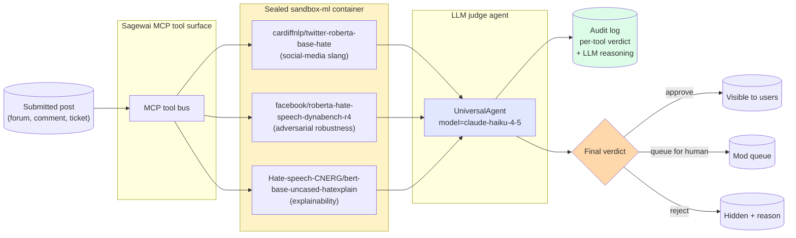

# Moderation and classification — ML and LLM, both first-class

> *"Three HuggingFace classifiers carry the deterministic half. A cheap LLM judges the boundary cases. Sandbox keeps the workload boundaries clean."*

This page is the cleanest single proof of three Sagewai claims at once: **ML and LLM are both first-class** (three transformers classifiers run in a sealed container, not just LLM calls), **sealed containers protect production workloads** (the ML and the agent run with scoped credentials, no cross-tenant leak), and **cheap LLMs hold their own** (the judge is Haiku or `gpt-4o-mini` or local Ollama, not Opus).

The pattern: pre-trained classifiers carry the deterministic half of the decision; an LLM agent reasons over their structured output and resolves the boundary cases. Audit trail per call. Local + rented modes.

## What this proves

Four invariants the audience-pin person needs before they trust this in front of real user-generated content:

1. **The classifiers run on commodity hardware.** Three HuggingFace transformers (under 500MB total) run inside a sealed `sandbox-ml` container on laptop CPU for development, on Vast.ai when production load arrives.
2. **The LLM is cheap.** The judge model is Haiku, `gpt-4o-mini`, or local Ollama — it's evaluating structured classifier output, not generating from scratch. Cost per moderated post is in the sub-cent range.
3. **The audit trail is per-classifier.** Every flagged post records each classifier's verdict, the per-tool latency, the per-tool cost, and the LLM's final reasoning. The community team sees *why*, not just *that*.
4. **Context-sensitivity is demonstrated.** The example includes test cases where the classifiers vote one way but the LLM disagrees with reasoning — sarcasm, reclaimed language, in-group/out-group framing.

## Architecture



## Run it

### On a clean machine (free path, laptop CPU)

```bash
pip install sagewai
python 49_community_moderation.py
```

The example pulls the three HuggingFace classifiers (one-time, ~500MB), runs them on a small set of representative posts on laptop CPU, and dispatches the final judgement to local Ollama. No paid spend.

### Full live path (rented GPU + paid LLM)

```bash
export VASTAI_API_KEY=...
export ANTHROPIC_API_KEY=sk-ant-...
python 49_community_moderation.py --live
```

The classifiers spin up on a Vast.ai GPU pod (paired with [Example 45](https://github.com/sagewai/platform/blob/main/packages/sdk/sagewai/examples/45_vastai_marketplace_bid.py)'s orchestration); the LLM judge stays on Haiku for the cost-conscious half of the demo.

### Triage variant: support-ticket triage

The same pattern in a different shape — the classifier ensemble is replaced by a single LLM call doing tier+reason+draft. Strict JSON output, swap-proof across LLMs:

```bash
python 42_support_triage_agent.py
```

## Real-world use cases

The pattern in this lighthouse — *classifier ensemble inside a sealed boundary, surfaced as MCP tools, judged by a cheap LLM, audit per call* — is what a senior engineer at a 50-500-person SaaS reaches for when they need a moderation or classification surface that's both **defensible to compliance** and **affordable at scale**. Five domains:

### 1. Community-moderation for a SaaS forum

You run the community surface for a developer-tools SaaS. 800 posts a day. Today a part-time moderator reads every one.

| Concern | How this pattern solves it |
|---|---|
| Posts must not leave the boundary (privacy, GDPR) | Three classifiers run in a sealed container; the LLM judge is local Ollama; the post text never reaches a third-party API |
| Moderators want to see *why* a post was flagged | The audit log records each classifier's verdict and the LLM's reasoning sentence; click any flag, see the full chain |
| Sarcasm and reclaimed language must not get auto-rejected | The LLM judge can override the classifier ensemble with reasoning; the test suite includes adversarial cases |

### 2. Customer-support triage (drop-in for tonight)

You have 200 tickets a day. Half are the same five questions. You're personally on the hook.

| Concern | How this pattern solves it |
|---|---|
| The CTO wants AI-shipped this quarter; the CFO wants the cost capped | Example 42 ships a single LLM call returning strict JSON — tier, reason, draft. Soaked at 100% JSON validity across 150 calls on three local 7B models |
| Auto-responding to a P0 by accident is the worst outcome | The router never auto-responds to P0/P1; tier semantics are pinned in the system prompt |
| You want to start cheap and only escalate if quality slips | Run Ollama as primary; promote to Haiku only for the boundary cases the soak identifies |

### 3. Sales-lead qualification from a contact form

Your marketing site fires off 100-300 contact-form submissions a week, mostly junk plus a few real deals.

| Concern | How this pattern solves it |
|---|---|
| AEs spend the day clicking through 80% obvious junk | Re-label tiers: P0 = "real deal, has budget"; P3 = "spam / wrong fit"; the router does the routing |
| You want to trial frontier models then move to a cheaper one | Run Haiku week 1, GPT-4o-mini week 2, compare swap-proof agreement numbers — pick cheaper if 95%+ agreement |
| Qualified leads need response in under a minute | Sub-10s p50 on Haiku, sub-1s on local llama3.2 — the latency block is your SLA evidence |

### 4. GitHub-issue triage on an OSS repo

You maintain an open-source project with 10-50 incoming issues a week. Most are duplicates, doc questions, or feature requests.

| Concern | How this pattern solves it |
|---|---|
| Maintainer time gets eaten by re-asking for repro on every "doesn't work" issue | The auto-respond pile asks for repro politely in your voice; you only see issues with repro already in hand |
| Keep the human in the loop on judgement calls | P0/P1 always escalate; the agent does the boring 80% |
| Don't pay anything for OSS tooling | Ollama path is $0/month |

### 5. Internal IT helpdesk

Your "submit a ticket" portal at HQ gets 30-60 tickets a day asking for password resets, software access, and *"it's slow."*

| Concern | How this pattern solves it |
|---|---|
| L1 work is mostly *click reset password* | Auto-respond drains the password-reset and software-access pile with grounded drafts; L1 reviews and clicks send |
| Compliance forbids employee data going to a third-party LLM | Pin `--primary ollama/llama3.2:latest`; data never leaves the machine |
| You need an audit trail of every triage decision | Every triage has a `reason` string; log it next to the email ID and the tier |

## Companion examples

| # | Example | What it adds |
|---|---|---|
| 49 | [community_moderation](https://github.com/sagewai/platform/blob/main/packages/sdk/sagewai/examples/49_community_moderation.py) | Three classifiers + LLM judge, sealed sandbox |
| 42 | [support_triage_agent](https://github.com/sagewai/platform/blob/main/packages/sdk/sagewai/examples/42_support_triage_agent.py) | Single-LLM triage with strict JSON, cost forecast, swap-proof |
| 06 | [guardrails](https://github.com/sagewai/platform/blob/main/packages/sdk/sagewai/examples/06_guardrails.py) | Foundation — safety filters before exposing an agent to users |
| 08 | [directives](https://github.com/sagewai/platform/blob/main/packages/sdk/sagewai/examples/08_directives.py) | Foundation — directive library, the *harness any LLM* moat |

## What to read next

- **Primary pillar:** [SDK](/docs/pillars/sdk) — `UniversalAgent`, tools, MCP, directives, the surface this lighthouse exercises.
- **Sibling lighthouse:** [Production multitenancy](/docs/lighthouse/production-multitenancy) — the Sealed-spine story Example 49 leans on.
- **Sibling lighthouse:** [Inference deployment](/docs/lighthouse/inference-deployment) — the bring-your-own-endpoint pattern Example 49 uses for the GPU half.
- **Prerequisite foundation:** [Example 06 — guardrails](https://github.com/sagewai/platform/blob/main/packages/sdk/sagewai/examples/06_guardrails.py) and [Example 08 — directives](https://github.com/sagewai/platform/blob/main/packages/sdk/sagewai/examples/08_directives.py).
- **Soak data:** the directive-library soak in `_soaks/directives_soak.py` reports JSON validity and swap-agreement across LLMs — paste it into the model-selection slide.
