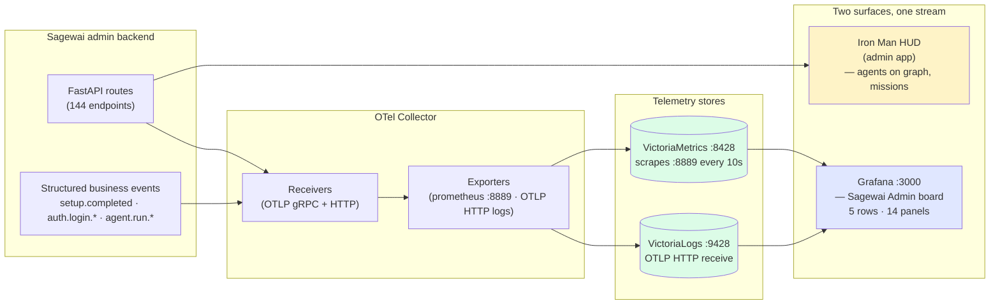

# Observability and cost — show your CFO where the money goes

> *"AI infrastructure spending without a dashboard is finance malpractice. Here's what good looks like."*

Two surfaces, one telemetry stream:

- **Iron Man HUD** — agents on the graph, missions in flight, fleet posture across the top. The mission-control surface for the demo, the all-hands, the CEO walkthrough.
- **Grafana board** — request rates, p95 latencies, status-code distributions, OpenTelemetry pipeline health, structured logs you can query. The SRE surface.

Both read the same telemetry stream so neither lies and they never disagree. The dashboards are rendered from a real run of [Example 43](https://github.com/sagewai/platform/blob/main/packages/sdk/sagewai/examples/43_observatory_live.py) — not pre-canned, not synthesised. Run the example and your dashboards come to life in three minutes.

## What this proves

Five invariants the audience-pin person needs before they trust this in front of their CFO:

1. **The cost story is per-tenant.** Every span is tagged with `sagewai.project_id`; the Grafana board has per-project rollups. The CFO can see *which feature for which customer cost what*.
2. **The metrics are real.** `http_server_duration_milliseconds` (histogram), `http_server_active_requests` (gauge), `http_server_response_size_bytes` (histogram) — emitted by the admin backend, scraped by VictoriaMetrics, visible in Grafana. 25 metrics shipped in v1.0.
3. **The pipeline is correct.** Sagewai uses the `prometheus` exporter + VM scraping, not `prometheusremotewrite` (which silently drops histograms and counters — see [Issue #66](https://github.com/sagewai/platform/issues/66) for the fix). Your dashboards aren't lying to you.
4. **Health-check noise is filtered.** Logs pipeline excludes the health-probe spam so the operator-readable signal stays signal.
5. **The HUD shows live state.** Iron Man HUD streams agent state from the same admin backend; mission state, fleet posture, and active runs update in real time as Example 40 fires synthetic load through the system.

## Architecture



## Run it

### Live telemetry → live dashboards

```bash
docker compose -f docker-compose.observability.yml up -d --build
python 43_observatory_live.py
```

The example fires a mixed-tenant workload at the admin backend (real HTTP traffic, real OTel spans), and within three minutes the Grafana board at `http://localhost:3000` and the Iron Man HUD at `http://localhost:3001/hud` both show real numbers. Login `admin/admin`.

### Per-tenant cost tracking

```bash
python 34_observatory_cost_tracking.py
```

The script emits cost-tagged spans across two tenants and prints a per-project rollup. Output ends with the line your CFO needs: *"Project A spent $X.XX, Project B spent $Y.YY this run."*

### Fleet under load + HUD

```bash
python 40_fleet_under_load.py
```

20+ workers, mixed workload, Iron Man HUD live state. The script generates a screen-recording-quality run for the marketing surface — heavy enough to stress the dispatcher, sparse enough to be readable on the graph.

### Budget enforcement (foundation)

```bash
python 12_budget_enforcement.py
```

Per-user, per-team, per-project budget caps. The Observatory pillar's foundation companion.

## Real-world use cases

The pattern in this lighthouse — *OTel pipeline → VM + VL → Grafana board → per-project rollup* — is what a senior engineer at a 50-500-person SaaS reaches for when their AI feature ships and the CFO starts asking *"why did the API bill quadruple?"* Five domains:

### 1. SaaS finance team needs the AI cost broken down by customer

Your CFO knows the total Anthropic bill. They don't know which customers drove which slice of it.

| Concern | How this pattern solves it |
|---|---|
| Customer-attribution must come out of telemetry, not a manual reconciliation | Spans are tagged with `sagewai.project_id`; the Grafana board has the per-project breakdown built in |
| Finance wants the breakdown monthly without engineering effort | The dashboard URL is the deliverable; nothing to build in finance's BI tool |
| The CTO wants to forecast next quarter from the current trend | The histogram + retention defaults give 30-day windows; trendline and forecast panels are stock Grafana |

### 2. SRE team running a 24/7 AI feature

Your platform team is on the hook for keeping the agent surface up. Pages must fire on real degradation, not log noise.

| Concern | How this pattern solves it |
|---|---|
| You need p95 latency by route to spot performance regressions | `http_server_duration_milliseconds` is a proper histogram; p95/p99 panels are stock Grafana |
| Health-probe spam in the logs hides the real signal | Health checks are filtered out of the logs pipeline; the operator-readable signal stays signal |
| You already have Datadog or Grafana Cloud — don't make me set up another stack | Sagewai emits standard OTLP; point it at your existing collector instead of the bundled stack |

### 3. Compliance review of an AI feature pre-launch

The compliance committee wants evidence that you can audit the AI feature's behaviour at scale.

| Concern | How this pattern solves it |
|---|---|
| Auditor asks "show me the audit trail for last Tuesday at 3pm" | Structured business events (`agent.created`, `agent.run.*`, `auth.login.*`) land in VictoriaLogs with the timestamp and the project_id tag |
| Reviewer wants to see the credential boundary in action | The Audit view in the admin app is the primary surface; events are queryable from VL too |
| Regulator asks "if a tenant's data leaked, would you know?" | Cross-tenant query attempts produce structured events; alert rules fire on those |

### 4. Sales engineering walkthrough (the demo surface)

Your sales engineering team demos the AI feature to enterprise prospects. The prospect's CTO asks *"how do you know it works at scale?"*

| Concern | How this pattern solves it |
|---|---|
| You need a visual demo that doesn't require explanation | The Iron Man HUD shows agents on a graph in real time; missions stream across as workers claim them |
| The prospect's SRE asks for the metrics, not the demo | Switch tabs to the Grafana board; same telemetry, SRE-readable |
| Prospect wants to A/B compare against their current LangChain stack | Both Grafana and the HUD read OTel; point them at their LangChain spans for the comparison |

### 5. Engineering OKR tracking for AI features

Your platform team has an OKR for "ship AI feature with measurable customer adoption." Measurement = telemetry.

| Concern | How this pattern solves it |
|---|---|
| You need adoption numbers (active customers per week) without instrumenting yourself | Project-scoped active-run counts come from `agent.run.*` events |
| You need quality numbers (success rate per customer) without rebuilding it | Status-code distributions per project are a stock Grafana panel; success rate falls out |
| Quarterly business review wants charts | The Grafana board exports PNG; paste them into the QBR slide |

## Companion examples

| # | Example | What it adds |
|---|---|---|
| 34 | [observatory_cost_tracking](https://github.com/sagewai/platform/blob/main/packages/sdk/sagewai/examples/34_observatory_cost_tracking.py) | Per-tenant cost tracking, the CFO line |
| 43 | [observatory_live](https://github.com/sagewai/platform/blob/main/packages/sdk/sagewai/examples/43_observatory_live.py) | Real telemetry → real dashboards in three minutes |
| 40 | [fleet_under_load](https://github.com/sagewai/platform/blob/main/packages/sdk/sagewai/examples/40_fleet_under_load.py) | 20+ workers, Iron Man HUD live state |
| 12 | [budget_enforcement](https://github.com/sagewai/platform/blob/main/packages/sdk/sagewai/examples/12_budget_enforcement.py) | Per-user/team/project budget caps |

## What to read next

- **Primary pillar:** [Observatory](/docs/pillars/observatory) — capability deep-dive.
- **Sibling lighthouse:** [Production multitenancy](/docs/lighthouse/production-multitenancy) — the per-project tagging that makes per-tenant cost rollups possible.
- **Sibling lighthouse:** [Train your own model](/docs/lighthouse/train-your-own-model) — once you have the cost line, you have the cost-down target.
- **Concept page:** [Observatory overview](/docs/observatory) — Iron Man HUD + Grafana, in detail.
- **Operations page:** [Admin Panel](/docs/guides/admin-panel) — the surface where Audit, Runs, and Profiles live.
- **Prerequisite foundation:** [Example 12 — budget_enforcement](https://github.com/sagewai/platform/blob/main/packages/sdk/sagewai/examples/12_budget_enforcement.py).
