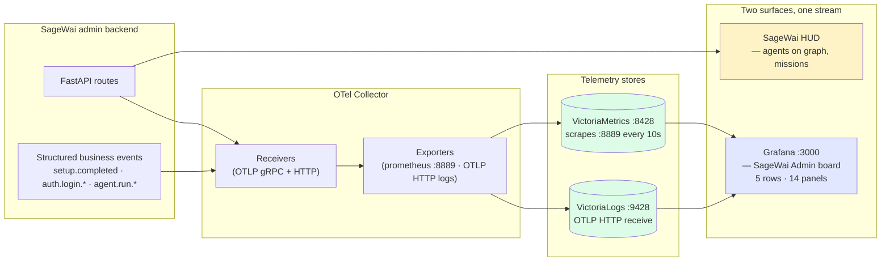

# Observability and cost — see what your AI feature is doing and what it costs

This page walks you through bringing up SageWai's observability stack and reading the two dashboards that ship with it. After following it you'll have live metrics and logs flowing from the admin backend into Grafana, a real-time mission view in the SageWai HUD, and per-customer cost rollups your finance team can use without engineering help.

## Before you start

- Docker (or compatible runtime) and `docker compose`.
- A working SageWai SDK install — `pip install sagewai` or a local checkout.
- The admin backend reachable on `localhost`. If you've never run it before, see the [Admin Panel guide](/docs/guides/admin-panel).
- About three minutes for the dashboards to fill once you start driving load.

## What you'll have running

SageWai exposes telemetry through one OpenTelemetry pipeline that feeds two surfaces:

- **The SageWai HUD** — a mission-control view of agents on a graph, missions in flight, and fleet posture. Use it for demos, all-hands, and at-a-glance status.
- **A Grafana board** — request rates, p95 latencies, status-code distributions, OpenTelemetry pipeline health, and structured logs. Use it for SRE work and alerting.

Both read the same telemetry stream, so they can never disagree.



## Turn on observability

Start the bundled stack and a load-driver example. The dashboards fill within three minutes.

```bash
docker compose -f docker-compose.observability.yml up -d --build
python 43_observatory_live.py
```

The example ([source](https://github.com/sagewai/platform/blob/main/packages/sdk/sagewai/examples/43_observatory_live.py)) fires a mixed-tenant workload at the admin backend — real HTTP traffic, real OpenTelemetry spans. Open Grafana at `http://localhost:3000` (login `admin/admin`) and the HUD at `http://localhost:3001/hud`.

## Trace cost per customer

Every span SageWai emits is tagged with `sagewai.project_id`, so you can break the bill down by tenant without manual reconciliation. To see the rollup end to end:

```bash
python 34_observatory_cost_tracking.py
```

The script ([source](https://github.com/sagewai/platform/blob/main/packages/sdk/sagewai/examples/34_observatory_cost_tracking.py)) emits cost-tagged spans across two tenants and prints a per-project rollup. The last line is the one to put in front of finance: `Project A spent $X.XX, Project B spent $Y.YY this run.`

The same per-project breakdown is built into the Grafana board, so once you've run any workload, the dashboard URL is the deliverable — no work in your BI tool required.

## Watch the fleet under load

For a heavier demo — 20+ workers, mixed workload, the HUD live across the whole graph:

```bash
python 40_fleet_under_load.py
```

This example ([source](https://github.com/sagewai/platform/blob/main/packages/sdk/sagewai/examples/40_fleet_under_load.py)) produces a screen-recording-quality run: heavy enough to stress the dispatcher, sparse enough to stay readable on the graph.

## Cap spend with budgets

Cost dashboards tell you what happened. Budgets stop runaway spend before it does. Per-user, per-team, and per-project caps are wired into the SDK:

```bash
python 12_budget_enforcement.py
```

The script ([source](https://github.com/sagewai/platform/blob/main/packages/sdk/sagewai/examples/12_budget_enforcement.py)) shows the foundation API. See the [Cost management guide](/docs/guides/cost-management) for the full configuration surface.

## What the Grafana board shows

The board has five rows. Top to bottom, the story flows from "is the platform healthy" through "where is the latency" to "show me the actual log lines."

| Row | Panels | Use it when |
|---|---|---|
| 1 — System Health | Request Rate · Error Rate (5xx) · Active Requests · Avg Latency | "Is anything red right now?" |
| 2 — HTTP Performance | Per-route request rate · per-route p95 latency | Hunting a slow route |
| 3 — Requests by Status | Stacked status-code distribution · response-size p95 | Tracking 4xx/5xx mix |
| 4 — OTel Pipeline Health | Spans processed · log records sent · log queue size | Diagnosing missing telemetry |
| 5 — Application Logs | Live tail of structured admin events | Reading audit trail |

Row 5 doubles as an audit feed because the admin backend emits business events as structured logs: `agent.created`, `agent.run.*`, `auth.login.*`, `setup.completed`, `provider.test.*`. Filter by `project_id` in the panel query box to scope to one tenant.

The metrics flowing into rows 1–4 are standard OTel HTTP server instrumentation: `http_server_duration_milliseconds` (histogram), `http_server_active_requests` (gauge), `http_server_response_size_bytes` (histogram). Each one is labelled with `http_target` (the route), `http_status_code`, and `service_name="sagewai-admin"`.

## Use your existing observability stack

The bundled compose file is a batteries-included setup, but the OpenTelemetry collector is the only fixed seam. If you already run Datadog, Grafana Cloud, or your own Prometheus + Loki, point your collector at SageWai's `http_server_*` metrics on `:8889` and the dashboards work unchanged. The provisioning files in `observability/grafana/` import directly into Grafana Cloud.

SageWai does not host an observability tier. Your telemetry stays on your infrastructure unless you route it elsewhere.

## How SageWai keeps the dashboards honest

- **One pipeline, two surfaces.** The HUD and Grafana read the same OTel stream. There is no shadow data path or demo-only feed.
- **Health-check noise filtered.** Liveness probes are excluded from the logs pipeline so the operator-readable signal stays signal.
- **Histograms preserved end-to-end.** SageWai exports metrics through the OTel collector's Prometheus exporter on `:8889`, scraped by VictoriaMetrics every 10 seconds. Histograms and counters arrive intact.

## What you're responsible for

- **Retention and storage sizing.** VictoriaMetrics and VictoriaLogs default to local volumes. Configure retention and disk for your traffic.
- **Authentication on Grafana.** The bundled compose file enables anonymous read access for convenience. Lock it down before exposing externally.
- **Alerting rules.** SageWai ships dashboards, not paging policy. Build alerts on the panels that matter for your SLOs.
- **Tagging hygiene.** Per-tenant cost rollups depend on `sagewai.project_id` being set on every request. Use the project selector or set the `X-Project-ID` header on API calls.

## Common issues

- **Metrics missing in Grafana but the OTel collector logs look fine.** If you swapped the exporter to `prometheusremotewrite`, switch back. That exporter silently drops histograms and counters; SageWai's pipeline relies on the Prometheus exporter on `:8889` plus VictoriaMetrics scraping.
- **HUD shows no agents but Grafana has traffic.** The HUD reads the admin REST API directly, not the OTel stream. Confirm the admin backend is reachable from your browser.
- **Per-project numbers all roll up under "unscoped".** Spans aren't being tagged. Set `X-Project-ID` on the API client or pick a project in the admin sidebar before driving traffic.
- **Custom metrics aren't in the dashboards.** Emit them through OTLP, not a sidecar Prometheus. The collector is the only seam the dashboards read.

## See also

- [Observatory overview](/docs/observatory) — the HUD and Grafana surfaces in detail.
- [Cost management guide](/docs/guides/cost-management) — budget caps, meters, and per-team attribution.
- [Production multitenancy](/docs/lighthouse/production-multitenancy) — the per-project tagging that powers cost rollups.
- [Train your own model](/docs/lighthouse/train-your-own-model) — once cost is visible, it's a target you can shrink.
- [Admin Panel](/docs/guides/admin-panel) — where Audit, Runs, and Profiles live.
