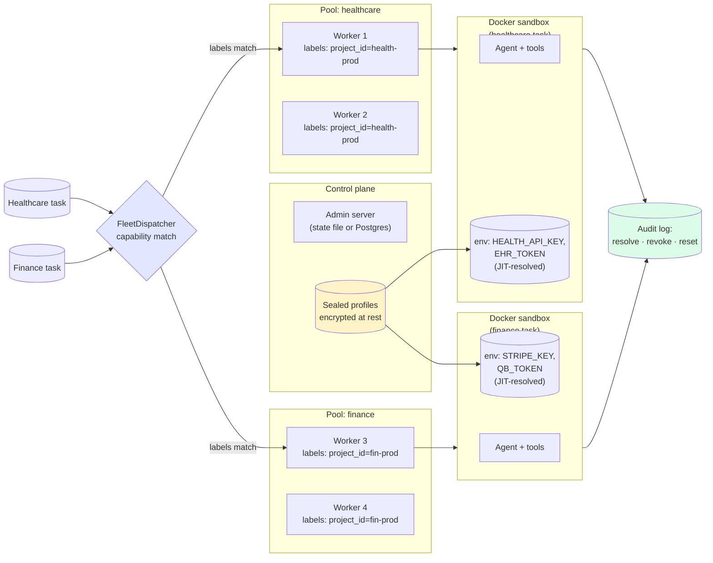

# Production multitenancy — Sealed-spine, isolated workers, no cross-tenant leak

> *"Healthcare worker can't claim finance tasks. Sandbox credentials never touch the worker host. Audit trail across the boundary."*

This is the page a security reviewer reads. The full Sealed-spine story: per-CLI workload identity (Sealed I), externalised secret backends with JIT credentials (Sealed II), per-CLI secret allowlist (Sealed III-D), audit trail at the boundary. Plus the Fleet enforcement: workers are scoped by `project_id` and `pool` labels; the dispatcher refuses cross-tenant claims.

What you ship: a multi-tenant agent platform where a "healthcare" worker physically cannot see "finance" tasks; vendor credentials are injected into a containerised agent at sandbox-start time and scrubbed on release; every credential resolution and pool reset is in the audit log.

## What this proves

Five invariants the audience-pin person needs before they trust this in front of customer credentials:

1. **The boundary is real, not policy.** Tenant credentials live in the Sealed profile store, encrypted at rest with Fernet. They're injected into the sandbox env at sandbox-start and scrubbed on release. The worker host process never sees them.
2. **Fleet dispatch enforces scope.** Workers register with `project_id` in their capability labels; the dispatcher matches tasks against capability labels, not just model and pool. A healthcare worker is unreachable from a finance task. Example 26 ships the dispatch matcher; Example 33 ships the full integration.
3. **Per-CLI workload identity is shipped.** Each agent run has a verifiable, scoped identity — not a shared `OPENAI_API_KEY` lifted from the parent process. Sealed Phase I has been merged into v1.0.
4. **JIT credentials work with HashiCorp Vault, AWS Secrets Manager, AgentCore Identity.** Externalised secret backends mean credentials resolve at the moment of need, not at process start. Sealed Phase II has been merged into v1.0.
5. **Every secret-injection event is in the audit log.** The admin **Audit** view records cascade resolutions, identity revocations, and pool resets. The compliance team can read the trail.

## Architecture



## Run it

### Multi-tenant fleet integration

```bash
pip install sagewai
python 33_fleet_sealed_integration.py
```

The script seeds two tenants (healthcare, finance), registers four workers (two per tenant) with scoped capability labels, enqueues mixed-tenant tasks, and proves the dispatcher refuses cross-tenant claims. Output prints the cross-tenant attempt being rejected at the dispatch boundary.

### Sandbox + scoped credentials

```bash
python 39_sandbox_scoped_credentials.py
```

The script runs an agent inside a sandbox container with credentials provided by Sealed, calls a third-party API, and proves the credential bytes are unreachable from the worker host. The `_smoke_test_credential_leak` block confirms the scrub.

### Agent governance (approval flows + audit)

```bash
python 16_agent_governance.py
```

Foundation-level companion: agent approval flow with audit trail before exposing the agent to users.

## Real-world use cases

The pattern in this lighthouse — *Sealed profiles per tenant, capability-scoped Fleet workers, sandbox credential injection at run time, audit at the boundary* — is what a senior engineer at a 50-500-person SaaS reaches for when their first multi-tenant feature lands and the security review starts. Five domains:

### 1. Healthcare SaaS with HIPAA-bound customers

You serve 30 clinics. Each has a separate EHR token. PHI cannot leak across clinic boundaries.

| Concern | How this pattern solves it |
|---|---|
| HIPAA forbids tenant A's PHI being readable from tenant B's process space | Each clinic has a Sealed profile; the healthcare worker pool runs only healthcare tasks; sandbox env is per-task, scrubbed on release |
| BAA auditor wants to see the credential boundary | The Audit view shows every credential resolution and revocation with timestamps; that's the BAA evidence |
| Compliance forbids credentials in source code or env files on the host | Credentials live encrypted at rest in `~/.sagewai/profiles.json`; resolved JIT at sandbox start; never in process memory long |

### 2. Multi-tenant fintech with PCI scope

Your AI feature runs across 50 finance customers. Each customer's Stripe and QB tokens must stay scoped to their own AI runs. PCI scope must be minimised.

| Concern | How this pattern solves it |
|---|---|
| PCI scope expands if any non-payment process can read the Stripe key | Stripe key lives in the customer's Sealed profile, injected only into their sandbox; non-finance workers can't see it |
| You need to revoke a customer's keys instantly when they cancel | Sealed Phase III-A (revocation, cascading where needed) ships in v1.0 as experimental |
| Auditor asks "show me the path of this credential from your secret store to the customer's running agent" | The architecture page on Security tiers documents the path; the Audit view records each step |

### 3. Enterprise SaaS with customer-specific Anthropic keys

Your customer wants to bring their own Anthropic key (cost attribution, vendor relationship). You need to honour it without leaking other customers' keys.

| Concern | How this pattern solves it |
|---|---|
| Customer A's `ANTHROPIC_API_KEY` must reach Claude Code in customer A's sandbox, no further | Sealed profile holds it; sandbox-start injects it into env; sandbox-release scrubs it |
| Customer wants their bill to come from their account, not yours | The Anthropic call uses customer A's key; the bill goes there |
| Cross-customer pollution would be career-ending | Capability labels enforce per-customer worker pools; the dispatcher refuses cross-customer claims |

### 4. SaaS-with-on-prem-customers ("hybrid SaaS")

Some of your customers run agents on their own VPC. Their credentials never leave their network.

| Concern | How this pattern solves it |
|---|---|
| Customer's vendor keys must never leave their VPC | Sealed profile is on-prem; the worker on-prem reads it; the control plane sees the run, not the credentials |
| Centralised observability without centralising secrets | The control plane sees telemetry events; redacted; secrets stay in the customer profile |
| Onboarding a new on-prem customer must not require code changes | Drop in a new Sealed profile; register a worker with the right capability labels; you're done |

### 5. Internal multi-team platform at a 500-person SaaS

Your platform team runs a shared agent platform for engineering, customer success, and sales. Each team has different vendor accounts.

| Concern | How this pattern solves it |
|---|---|
| Engineering's GitHub token must not be reachable from a customer-success agent | Per-team profile; per-team worker pool with capability labels; cross-team claim refused |
| You want one shared cost dashboard with per-team rollups | Observatory pillar tags every span with `sagewai.project_id`; the Grafana board has per-project rollups |
| Audit committee wants to see who used what when | The Audit view records resolution, identity, run ID, timestamp — the per-team usage report drops out |

## Companion examples

| # | Example | What it adds |
|---|---|---|
| 33 | [fleet_sealed_integration](https://github.com/sagewai/platform/blob/main/packages/sdk/sagewai/examples/33_fleet_sealed_integration.py) | Multi-tenant fleet + Sealed boundary, full integration |
| 39 | [sandbox_scoped_credentials](https://github.com/sagewai/platform/blob/main/packages/sdk/sagewai/examples/39_sandbox_scoped_credentials.py) | Sandbox + scoped creds, credential-leak smoke test |
| 16 | [agent_governance](https://github.com/sagewai/platform/blob/main/packages/sdk/sagewai/examples/16_agent_governance.py) | Approval flow + audit trail |
| 26 | [fleet_scoped_dispatch](https://github.com/sagewai/platform/blob/main/packages/sdk/sagewai/examples/26_fleet_scoped_dispatch.py) | Capability-based dispatch, project-scoped routing |
| 20 | [fleet_workers](https://github.com/sagewai/platform/blob/main/packages/sdk/sagewai/examples/20_fleet_workers.py) | Foundation — distributed worker registration |

## What to read next

- **Primary pillar:** [Fleet](/docs/pillars/fleet) — workers, dispatch, scoped routing.
- **Sealed spine:** [Security — five pillars, one spine](/docs/security) — the cross-cutting Sealed architecture.
- **Sibling lighthouse:** [Observability and cost](/docs/lighthouse/observability-and-cost) — the audit and per-tenant cost rollup that pairs with this story.
- **Sibling lighthouse:** [Moderation and classification](/docs/lighthouse/moderation-and-classification) — the sealed sandbox-ml pattern, same boundary, different workload.
- **Prerequisite foundation:** [Example 20 — fleet_workers](https://github.com/sagewai/platform/blob/main/packages/sdk/sagewai/examples/20_fleet_workers.py).
- **Architecture pages:** [Security tiers](/docs/architecture/security-tiers), [Sandbox backends](/docs/architecture/sandbox-backends), [Execution modes](/docs/architecture/execution-modes).
