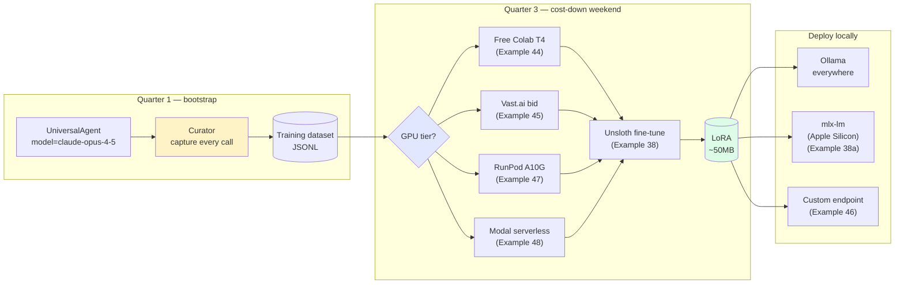

# Train your own model — the $5 weekend training loop

> *"Anthropic raised prices 10x. We were fine — we already had our own model."*

This is the company's reason to be in one page. Bootstrap with Opus or GPT-5 in Q1. Capture every answer through the Curator. Fine-tune a 3B base model on the captured dataset using Unsloth on a free Colab T4 or a $0.34/hr RunPod A10G. Deploy the resulting LoRA via Ollama or mlx-lm. Serve real traffic at zero per-token cost.

End-to-end the loop costs under $5 and a weekend. By Q3 your CFO has a credible answer to *"why did the API bill quadruple?"*: it didn't.

## What this proves

Four invariants the audience-pin person needs before they trust this in front of their actual customers:

1. **The capture step is invisible.** The Curator wraps every agent call so you don't have to instrument anything. Examples 25 and 36 ship the capture loop.
2. **The fine-tune step is honest.** Example 38 runs a real Unsloth fine-tune of `Qwen2.5-3B-Instruct` on a real dataset, prints real loss curves, and deploys the resulting LoRA. No synthetic numbers.
3. **The deploy step is portable.** mlx-lm on Apple Silicon (Example 38a), Ollama everywhere else. Same captured dataset, two backends, one swap.
4. **The cost-down is forecastable.** Each inference-tier example prints a $/call comparison against the cloud baseline. You point at it and the CFO line falls out.

## Architecture

## Run it

The training loop is composed of shipped examples, each runnable on its own. Read them in this order:

1. **[Example 25 — training data pipeline](https://github.com/sagewai/platform/blob/main/packages/sdk/sagewai/examples/25_training_data_pipeline.py)** — the Curator capture surface. Run a few agent calls, see the JSONL accumulate at `~/.sagewai/training/`.
2. **[Example 36 — autopilot training loop](https://github.com/sagewai/platform/blob/main/packages/sdk/sagewai/examples/36_autopilot_training_loop.py)** — the loop closes: capture triggers a `FineTuneJob` when the dataset crosses the threshold.
3. **Pick a GPU tier:**
   - **[Example 44 — free CUDA via Colab](https://github.com/sagewai/platform/blob/main/packages/sdk/sagewai/examples/44_colab_free_cuda.py)** — Tesla T4 for free, Drive-sync the LoRA back. $0 cost, 12-hour session limit.
   - **[Example 45 — Vast.ai marketplace bid](https://github.com/sagewai/platform/blob/main/packages/sdk/sagewai/examples/45_vastai_marketplace_bid.py)** — bid the cheapest A10G with reliability scoring. Around $0.20-$0.45/hr.
   - **[Example 47 — RunPod reliable rental](https://github.com/sagewai/platform/blob/main/packages/sdk/sagewai/examples/47_runpod_finetune_orchestration.py)** — $0.34-$0.70/hr for 24GB, with cleanup-on-failure.
4. **[Example 38 — real Unsloth fine-tune](https://github.com/sagewai/platform/blob/main/packages/sdk/sagewai/examples/38_unsloth_finetune.py)** — runs the actual fine-tune on the chosen tier, prints loss curves, saves the LoRA.
5. **Deploy:**
   - **[Example 38a — mlx-lm on Apple Silicon](https://github.com/sagewai/platform/blob/main/packages/sdk/sagewai/examples/38a_mlx_lm_server_deploy.py)** — `mlx_lm.server` for Mac shops.
   - **[Example 46 — bring-your-own endpoint](https://github.com/sagewai/platform/blob/main/packages/sdk/sagewai/examples/46_custom_inference_as_tool.py)** — any HTTP completion endpoint becomes a Sagewai-callable tool.

Total wall-clock for a weekend developer: ~2 hours dev time, ~30-60 minutes fine-tuning, ~$0-5 in compute depending on the tier.

## Real-world use cases

The pattern in this loop — *Curator captures, JSONL accumulates, Unsloth fine-tunes, Ollama deploys* — is what a senior engineer at a 50-500-person SaaS reaches for once they've shipped the AI feature in Q1 and the CFO is asking the Q3 question. Four domains:

### 1. SaaS support-triage cost-down

You've shipped Example 42's triage agent in Q1 on Claude Haiku. By Q3 you're triaging 12,000 emails a month at $0.0007 per call.

| Concern | How this pattern solves it |
|---|---|
| The CFO wants the API bill cut in half | Fine-tune `Qwen2.5-3B-Instruct` on the 12K captured triage decisions; deploy via Ollama on a $40/month VPS; per-call cost drops to zero |
| Quality must not regress on the P0/P1 cases | Curator records every triage; the fine-tune sees real production data, not synthetic; the soak harness in `_soaks/directives_soak.py` grades the candidate model before promotion |
| The CTO wants to see the receipts | Example 38 prints the loss curve, the eval dataset accuracy, and the $/call delta — paste it into the OKR doc |

### 2. E-commerce product description generation

Your catalogue has 50K SKUs. You've been generating descriptions on GPT-4o at $0.0024 per SKU, which is $120/month and growing as the catalogue does.

| Concern | How this pattern solves it |
|---|---|
| Description quality must match the brand voice | Capture 1K human-edited descriptions, fine-tune Mistral-7B on them, the LoRA learns the voice |
| You want to add more categories without re-fine-tuning | The captured dataset stays in `~/.sagewai/training/`; the next fine-tune trains on the merged corpus |
| Catalogue ingestion runs nightly and can't depend on a flaky third-party | Ollama runs on the same machine as the ingestion job; no network call leaves the box |

### 3. Healthcare-compliant note summarisation

Your scribe app summarises clinical notes for primary-care physicians. HIPAA forbids sending PHI to OpenAI without a BAA — and the BAA cost is on top of the API spend.

| Concern | How this pattern solves it |
|---|---|
| Compliance forbids PHI leaving the boundary | The fine-tuned model runs on a HIPAA-eligible Modal endpoint or on-prem; PHI never touches a third-party LLM |
| The audit committee wants a model card | Example 38 emits the training-set hash, eval-set accuracy, and the LoRA SHA; that's the model card |
| You want to upgrade the base model when a new one ships | The Curator dataset is base-model-agnostic; re-run Example 38 against `Llama-3.2-3B` instead of `Qwen2.5-3B` and compare |

### 4. Internal knowledge-base Q&A on engineering wikis

Your platform team is on the hook for "why is X failing?" questions across 200 services and a 5K-page Confluence. You've been pointing GPT-4o at it via RAG and the bill is $300/month.

| Concern | How this pattern solves it |
|---|---|
| The cost is unjustifiable for an internal tool | Fine-tune a 3B model on captured Q&A pairs; deploy on a $40/month VPS; the cost line vanishes |
| The team writes new runbooks every week | Curator captures Q&A from the live tool; the next fine-tune trains on the latest corpus |
| You want self-hosted to avoid vendor risk on internal data | Same as healthcare — Ollama on-prem, no PHI/IP leaves the boundary |

## Companion examples

| # | Example | What it adds |
|---|---|---|
| 25 | [training_data_pipeline](https://github.com/sagewai/platform/blob/main/packages/sdk/sagewai/examples/25_training_data_pipeline.py) | The Curator capture surface |
| 36 | [autopilot_training_loop](https://github.com/sagewai/platform/blob/main/packages/sdk/sagewai/examples/36_autopilot_training_loop.py) | The loop closes — capture triggers `FineTuneJob` |
| 38 | [unsloth_finetune](https://github.com/sagewai/platform/blob/main/packages/sdk/sagewai/examples/38_unsloth_finetune.py) | Real Unsloth fine-tune, real numbers |
| 38a | [mlx_lm_server_deploy](https://github.com/sagewai/platform/blob/main/packages/sdk/sagewai/examples/38a_mlx_lm_server_deploy.py) | Apple Silicon deploy via `mlx_lm.server` |
| 44 | [colab_free_cuda](https://github.com/sagewai/platform/blob/main/packages/sdk/sagewai/examples/44_colab_free_cuda.py) | Free Tesla T4 via Drive-sync |
| 45 | [vastai_marketplace_bid](https://github.com/sagewai/platform/blob/main/packages/sdk/sagewai/examples/45_vastai_marketplace_bid.py) | Bid-cheapest aggregator with reliability scoring |
| 46 | [custom_inference_as_tool](https://github.com/sagewai/platform/blob/main/packages/sdk/sagewai/examples/46_custom_inference_as_tool.py) | Bring-your-own endpoint |
| 47 | [runpod_finetune_orchestration](https://github.com/sagewai/platform/blob/main/packages/sdk/sagewai/examples/47_runpod_finetune_orchestration.py) | RunPod reliable rental |
| 48 | [modal_serverless_inference](https://github.com/sagewai/platform/blob/main/packages/sdk/sagewai/examples/48_modal_serverless_inference.py) | Per-second serverless inference |

## What to read next

- **Primary pillar:** [Training Loop](/docs/pillars/training-loop) — the capability deep-dive.
- **Sibling lighthouse:** [Inference deployment](/docs/lighthouse/inference-deployment) — the five inference tiers in detail.
- **Sibling lighthouse:** [Observability and cost](/docs/lighthouse/observability-and-cost) — *show your CFO where the money goes* — the sibling page that quantifies the cost-down.
- **Prerequisite foundation:** [Example 18 — local LLM routing](https://github.com/sagewai/platform/blob/main/packages/sdk/sagewai/examples/18_local_llm_routing.py) and [Example 03 — multi-model](https://github.com/sagewai/platform/blob/main/packages/sdk/sagewai/examples/03_multi_model.py).
- **Inference education:** [Inference — overview](/docs/inference) walks the five tiers with explicit *when to pick which* guidance.
