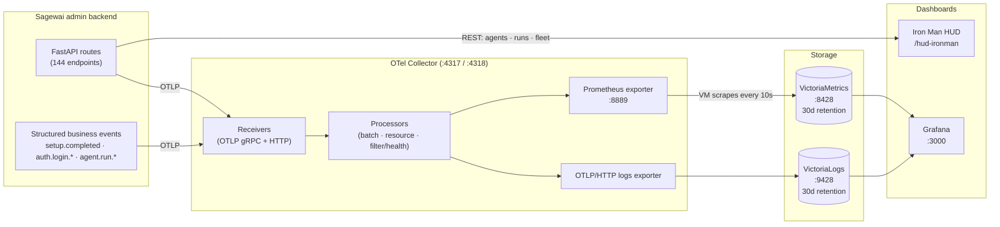

import { HowToJsonLd, SoftwareApplicationJsonLd } from '@/components/structured-data';

export const metadata = {
  title: 'Show your CFO where the AI money goes — Observatory',
  description:
    'Track AI agent costs, latency, and runs in real time with OpenTelemetry, VictoriaMetrics, Grafana, and the Iron Man HUD. Self-hosted, no Sagewai-tier needed.',
  alternates: { canonical: 'https://docs.sagewai.ai/docs/platform/observatory' },
  openGraph: {
    title: 'Sagewai Observatory — cost dashboards and real telemetry',
    description:
      'Two surfaces, one OTel pipeline. Iron Man HUD for demos, Grafana for SRE work. Reproduce every screenshot in three minutes.',
    url: 'https://docs.sagewai.ai/docs/platform/observatory',
    images: ['/observatory/hud-overview.png'],
  },
};

<HowToJsonLd
  name="Show your CFO where the AI money goes with Sagewai Observatory"
  description="Bring up an OpenTelemetry + VictoriaMetrics + Grafana stack and an Iron Man HUD to track agent cost, latency, and runs in three minutes."
  path="/docs/platform/observatory"
  totalTime="PT3M"
  steps={[
    {
      name: 'Start the observability stack',
      text: 'docker compose -f docker-compose.observability.yml up -d brings up OTel collector, VictoriaMetrics, VictoriaLogs, and Grafana.',
    },
    {
      name: 'Run an instrumented admin backend',
      text: 'sagewai admin serve --host 127.0.0.1 --port 8000 emits OTLP to the collector on every HTTP request and business event.',
    },
    {
      name: 'Drive realistic load',
      text: 'python packages/sdk/sagewai/examples/43_observatory_live.py runs a mixed-tenant workload that fills every dashboard panel.',
    },
    {
      name: 'Read the dashboards',
      text: 'Open http://localhost:3000 for Grafana, /hud-ironman in the admin frontend for the Iron Man HUD. Both read the same telemetry stream.',
    },
  ]}
/>
<SoftwareApplicationJsonLd />

# Observatory

Sagewai ships with two dashboards because two different people will ask
"what is the platform doing right now?" and they want very different
answers. The **Iron Man HUD** is mission control for the demo, the
all-hands, the CEO walkthrough — agents on the graph, missions in
flight, fleet posture across the top. The **Grafana board** is the
SRE surface — request rates, p95 latencies, status-code distributions,
OTel pipeline health, and structured logs you can query. Both read
from the same telemetry stream, so neither lies and they never
disagree.

The dashboards on this page are **rendered from a real run of
[Example 43](https://github.com/sagewai/platform/blob/main/packages/sdk/sagewai/examples/43_observatory_live.py)**
— not pre-canned, not synthesised. Every panel is sourced from real
HTTP traffic against a real admin backend. To reproduce them yourself,
run the example: it brings the dashboards to life in about three
minutes on a clean machine.

## Two surfaces, one telemetry stream



The HUD reads from the live REST API for the immediate state of
agents, missions, and fleet. The Grafana board reads from
VictoriaMetrics (metrics, scraped from the OTel collector's Prometheus
endpoint every 10 seconds) and VictoriaLogs (logs, exported via OTLP).
The same OTel collector serves both — no shadow pipeline, no
demo-only data path.

## Bring the stack up + drive load

Three commands in three terminals. The first two bring the stack up;
the third drives the realistic mixed-tenant load that produced the
screenshots below.

```bash
# Terminal 1 — observability
docker compose -f docker-compose.observability.yml up -d

# Terminal 2 — admin backend (instrumented FastAPI)
sagewai admin serve --host 127.0.0.1 --port 8000

# Terminal 3 — drive load (Tuesday morning at a 200-person SaaS)
python packages/sdk/sagewai/examples/43_observatory_live.py
```

That gives you:

- **Grafana** at `http://localhost:3000` (admin / admin, anonymous viewing enabled)
- **VictoriaMetrics** at `http://localhost:8428` (Prometheus-compatible query API)
- **VictoriaLogs** at `http://localhost:9428`
- **OTel Collector** at `localhost:4317` (gRPC) / `localhost:4318` (HTTP)

For the Iron Man HUD, additionally start the admin frontend
(`just admin-dev`) and visit `/hud-ironman`. The HUD is admin-only;
the Grafana board is anonymous by default for read access.

## The Iron Man HUD — mission control surface

The HUD is the dashboard you put on the projector. 1920×1080
canvas — agents on the graph, missions in flight, fleet posture across
the top, an event ticker down the side. Mode badge in the topbar
says `LIVE` when the backend is reachable, `DEMO · BACKEND OFFLINE`
when it isn't, so you can never confuse a screen recording for a
live system.


The captured screenshot above shows Example 43 mid-run: the agent
roster lists Acme Support's four agents and Globex Code Review's
agents, the inspector pane on the right shows the model + temperature
+ tools for the selected `acme-support-triager`, and the project bar
across the top lets you switch tenants.

The topbar carries five KPIs that are pre-attentive — visible from
across a meeting room:


## The Grafana board — SRE surface

Five rows. Top to bottom, the story flows from "is the platform
healthy" → "where is the latency" → "what's failing" → "is the
telemetry pipeline itself OK" → "show me the actual log lines."

### Row 1 — System Health

Four stat panels: Request Rate, Error Rate (5xx), Active Requests,
Avg Latency. The "is anything red right now" view.


### Row 2 — HTTP Performance

Per-route request rate and p95 latency. One line per route — the
example exercises 14 different admin endpoints, all of which show
up here.


### Row 3 — Requests by Status

Stacked status-code distribution + response-size p95. The example
deliberately fires a few 401/404 probes so the Status Code panel
has more than one band.


### Row 4 — OTel Pipeline Health

Spans processed, log records sent, log queue size. The "is the
telemetry pipeline itself the problem" view — when data goes missing,
this row is where the answer lives.


### Row 5 — Application Logs

Live-tail of structured admin events. Sagewai backends emit business
events as logs, so this panel doubles as an audit feed:
`agent.created`, `agent.run.*`, `auth.login.*`, `setup.completed`,
`provider.test.*`. Filter by `project_id` in the panel query box to
see only one tenant's activity.


## When to look at which

| You are about to | Open this |
|---|---|
| Demo Sagewai to a non-engineer (CEO, customer, all-hands) | Iron Man HUD |
| Investigate a slow request or a 5xx spike | Grafana Dashboard |
| Check whether a specific project's run is making progress | Iron Man HUD — switch the project bar |
| Build an alerting rule for production | Grafana Dashboard — copy the panel's PromQL |
| Audit which routes are getting hammered | Grafana Dashboard — Request Rate by Route panel |
| Watch a Fleet under load (Example 40) | Both — HUD for the picture, Grafana for the numbers |

## Bring your own observability stack

The compose stack is a complete batteries-included setup, but most
of the audience this is built for already pays for Datadog, Grafana
Cloud, or runs their own Prometheus/Loki. The OTel collector is the
only fixed seam — point your existing endpoint at the
`http_server_*` metrics it exposes on `:8889` and the dashboards work
unchanged. The provisioning files in `observability/grafana/` are
runnable locally and copy-pastable into Grafana Cloud's import flow.

There is no Sagewai-hosted observability tier. Your telemetry never
leaves your infrastructure unless you explicitly route it somewhere.

## Anti-patterns

1. **Treating the HUD as the alerting surface.** The HUD is a live picture; it has no history, no PromQL, no alerts. Use Grafana for "wake me up at 3am" rules.

2. **Treating Grafana as the demo surface.** Grafana is honest but not photogenic. Don't try to win a CEO with a panel of timeseries charts; that's what the HUD is for.

3. **Wiring custom metrics to a sidecar Prometheus.** The OTel collector is the seam. New metrics should be emitted via OTLP and picked up by the existing pipeline, not exported on a side channel that the dashboards don't see.

4. **Using `prometheusremotewrite` to ship to VictoriaMetrics.** Known footgun — silently drops histograms and counters. The shipped pipeline uses the Prometheus exporter on `:8889` + VM scraping, not remote-write. Don't change this without reading the comment in `observability/otel-collector/config.yaml`.

## Cross-references

**On this docs site (Observatory pillar siblings + foundation):**

- [Cost management guide](/docs/guides/cost-management) — Foundation. How budget caps, cost meters, and per-team attribution are wired in the SDK.
- [Sagewai vs LangChain vs LlamaIndex](/docs/guides/vs-alternatives) — How Sagewai's observability surface compares to the alternatives.
- [Fleet enterprise architecture](/docs/guides/fleet-architecture) — Fleet pillar lighthouse. The multi-tenant story the dashboards are scoped to.
- [Architecture overview](/docs/architecture) — The control-plane / fleet split that produces the telemetry stream this page renders.

**Runnable lighthouse examples on GitHub:**

- [Example 43 — Observatory live](https://github.com/sagewai/platform/blob/main/packages/sdk/sagewai/examples/43_observatory_live.py) — the load driver that produced every screenshot on this page.
- [Example 34 — Observatory cost tracking](https://github.com/sagewai/platform/blob/main/packages/sdk/sagewai/examples/34_observatory_cost_tracking.py) — the cost story this dashboard surfaces.
- [Example 40 — Fleet under load](https://github.com/sagewai/platform/blob/main/packages/sdk/sagewai/examples/40_fleet_under_load.py) — generates pure fleet-dispatch load (no admin backend required).
