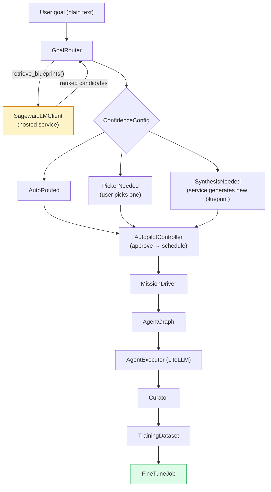

import { TechArticleJsonLd, SoftwareApplicationJsonLd } from '@/components/structured-data';

export const metadata = {
  title: 'Autopilot — describe the goal, ship the agent',
  description:
    'State the goal in plain English. Autopilot designs the agent graph, extracts slots, schedules a mission, drives execution, and self-heals on failure.',
  alternates: { canonical: 'https://docs.sagewai.ai/docs/platform/autopilot' },
  openGraph: {
    title: 'Sagewai Autopilot — describe-the-goal agent automation',
    description:
      'Plain-English goal in, blueprint out, mission running. Hosted blueprint service that learns; private fine-tuning at any time.',
    url: 'https://docs.sagewai.ai/docs/platform/autopilot',
  },
};

<TechArticleJsonLd
  name="Autopilot — describe the goal, ship the agent"
  description="Sagewai Autopilot lets you state a goal in plain English and have the platform design, provision, run, and improve the agents that deliver it."
  path="/docs/platform/autopilot"
  articleSection="Autopilot"
/>
<SoftwareApplicationJsonLd />

# Autopilot

State a goal in plain English; Sagewai designs the agent graph, instantiates the mission, and runs it. As missions complete, the Curator captures successful answers as training data — closing the loop with the [Training Loop](/docs/platform/training-loop) when the dataset crosses a threshold and the local model takes over.

The hosted blueprint service (`sagewai-llm`) handles goal-to-blueprint translation; the local controller, missions, and Curator are open-source and ship in the SDK. Autopilot still works manually without the hosted service — the loop just doesn't auto-close.

**Prerequisites:** the [SDK](/docs/platform/sdk) installed, an LLM API key, and optionally the admin backend running (`sagewai admin serve`) for the API routes.

---

## Architecture



---

## What you can do with it

- **Hand it a goal** like *"triage support tickets, escalate the hard ones, draft replies for the easy ones"* and get back a runnable mission.
- **Run a long-lived mission** that decomposes into steps, picks tools, captures the trace, and reports progress.
- **Capture every answer** as JSONL training data automatically — no manual instrumentation.
- **Heal automatically** when a mission step fails: the controller detects, isolates, and retries with adjusted parameters.
- **Trigger a fine-tune** when the captured corpus crosses a configurable size threshold.

---

## Quick start

### 1. Enable Autopilot

```python
import httpx

httpx.post("http://localhost:8000/api/v1/autopilot/enable", json={"tier": "anonymous"})
```

Or via CLI:

```bash
sagewai autopilot enable --tier anonymous
```

### 2. Submit a goal

```python
resp = httpx.post(
    "http://localhost:8000/api/v1/autopilot/goal",
    json={"goal": "run daily competitive research on 3 vendors"},
    headers={"X-Project-ID": "my-project"},
)
data = resp.json()
print(data["kind"])   # "auto_routed" | "picker_needed" | "synthesis_needed"
print(data["preview"])
```

Or via CLI:

```bash
sagewai autopilot goal "run daily competitive research on 3 vendors" \
  --project my-project
```

### 3. Approve and monitor

Once you receive an `auto_routed` result, approve the mission:

```python
httpx.post(
    "http://localhost:8000/api/v1/autopilot/missions/{mission_id}/approve",
    headers={"X-Project-ID": "my-project"},
)
```

Then monitor progress:

```bash
sagewai autopilot missions --project my-project
```

---

## API reference

All routes are under `/api/v1/autopilot` and require the `sagewai_auth` cookie (or a `Bearer` token). Use the `X-Project-ID` header for project-scoped isolation.

### `GET /api/v1/autopilot/status`

Return the current autopilot configuration.

**Response**

```json
{
  "enabled": true,
  "tier": "anonymous",
  "instance_id": "a3f1..."
}
```

---

### `POST /api/v1/autopilot/enable`

Enable autopilot for the current instance.

**Request body**

```json
{ "tier": "anonymous" }
```

`tier` values: `anonymous`, `free`, `skip` (skip = bypass service, use synthesis only).

**Response**: `200 OK` with `{"ok": true}`.

---

### `POST /api/v1/autopilot/disable`

Disable autopilot. Running missions are not affected.

**Response**: `200 OK` with `{"ok": true}`.

---

### `POST /api/v1/autopilot/goal`

Route a plain-English goal to a blueprint.

**Request body**

```json
{ "goal": "run daily competitive research on 3 vendors" }
```

**Response — `auto_routed`**

```json
{
  "kind": "auto_routed",
  "mission_id": "ms-abc123",
  "blueprint_id": "SYNTHETIC_scheduled_research",
  "preview": "Schedule: 0 9 * * 1-5\nVendors: 3 URLs\n...",
  "slots": { "vendors": [], "schedule": "0 9 * * 1-5" }
}
```

**Response — `picker_needed`**

```json
{
  "kind": "picker_needed",
  "candidates": [
    { "blueprint_json": "{...}", "score": 0.72 },
    { "blueprint_json": "{...}", "score": 0.68 }
  ]
}
```

**Response — `synthesis_needed`**

```json
{
  "kind": "synthesis_needed",
  "goal": "run daily competitive research on 3 vendors"
}
```

---

### `GET /api/v1/autopilot/missions`

List all missions for the current project.

**Response**

```json
[
  {
    "mission_id": "ms-abc123",
    "blueprint_id": "scheduled_research",
    "status": "scheduled",
    "project_id": "my-project",
    "created_at": "2026-04-15T09:00:00Z"
  }
]
```

---

### `POST /api/v1/autopilot/missions/{mission_id}/approve`

Approve a draft mission and advance it to `SCHEDULED`.

**Response**: `200 OK` with the updated mission object.

---

### `DELETE /api/v1/autopilot/missions/{mission_id}`

Cancel a mission. Has no effect if the mission is already `COMPLETED` or `FAILED`.

**Response**: `200 OK` with `{"cancelled": true}`.

---

## CLI commands

```bash
# Show autopilot status
sagewai autopilot status [--host localhost] [--port 8000] [--token TOKEN]

# Enable autopilot
sagewai autopilot enable [--tier anonymous] [--host localhost] [--port 8000]

# Disable autopilot
sagewai autopilot disable [--host localhost] [--port 8000]

# Route a goal and see the result
sagewai autopilot goal "your goal text" [--project PROJECT_ID]

# List active missions
sagewai autopilot missions [--project PROJECT_ID]
```

---

## Configuration

Autopilot behaviour can be tuned via environment variables without changing code.

| Variable | Default | Description |
|---|---|---|
| `AUTOPILOT_AUTO_ROUTE_THRESHOLD` | `0.85` | Minimum score for automatic blueprint selection. |
| `AUTOPILOT_PICKER_THRESHOLD` | `0.65` | Minimum score to show the user a picker. |
| `AUTOPILOT_CACHE_TTL` | `3600` | Blueprint cache TTL in seconds. |
| `SAGEWAI_LLM_BASE_URL` | `https://api.sagewai.ai` | Base URL for the hosted blueprint service. |

**Example** — lower the auto-route threshold in a test environment:

```bash
export AUTOPILOT_AUTO_ROUTE_THRESHOLD=0.70
export AUTOPILOT_PICKER_THRESHOLD=0.50
sagewai autopilot goal "..."
```

---

## Routing autopilot through the LLM Harness

By default, `AgentExecutor` calls `litellm.acompletion` directly — convenient for development but bypassing the LLM Harness's budget enforcement, classification, routing, policy, audit, and cost tracking.

To route autopilot through the harness, construct a `HarnessProxy` and pass it to `ExecutorConfig`:

```python
from sagewai.autopilot.controller.executor import ExecutorConfig
from sagewai.autopilot.controller.driver import MissionDriver
from sagewai.harness.proxy import HarnessProxy
from sagewai.harness.models import HarnessIdentity, HarnessConfig
from sagewai.harness.router import HarnessRouter
from sagewai.harness.store import InMemoryHarnessStore
from sagewai.harness.backend import AnthropicBackend

store = InMemoryHarnessStore()
router = HarnessRouter(...)  # configure with your tier/policy/budget setup
proxy = HarnessProxy(
    store=store,
    router=router,
    backends={"anthropic": AnthropicBackend(api_key="...")},
    config=HarnessConfig(),
)

identity = HarnessIdentity(key_id="autopilot-default", user_id="autopilot")
executor_cfg = ExecutorConfig(
    harness_proxy=proxy,
    harness_identity=identity,
)

driver = MissionDriver(executor_config=executor_cfg)
result = await driver.execute(mission)
```

When the harness path is taken, every `StepResult` carries:

- `output` — full LLM response content (not the 200-char preview)
- `messages` — the full system + user + assistant conversation tuple
- `telemetry` — `StepTelemetry` with `cost_usd`, `input_tokens`, `output_tokens`, `model_used`, `latency_ms`

Curator uses `step.output` directly when available, producing real training samples instead of preview-derived ones. The `telemetry` block reports `cost_usd`, `input_tokens`, `output_tokens`, `model_used`, and `latency_ms` for each step, so you can compare a fine-tuned model's runs against a frontier-model baseline and measure exactly how much cheaper each step gets.

---

## End-to-end tutorials

### Closing the loop

[**Train your own model**](/docs/tutorials/train-your-own-model) walks through the full autopilot loop closing: state a goal, run missions, the Curator captures the answers, the dataset crosses the threshold, a fine-tune kicks off, the LoRA deploys, and subsequent missions re-route to the local model. End-to-end, real numbers, real cost-down.

### Hosted-service round trip

[**Example 35 — `autopilot_hosted_service`**](https://github.com/sagewai/platform/blob/main/packages/sdk/sagewai/examples/35_autopilot_hosted_service.py) — state a goal, get a blueprint back, instantiate the mission, run it.

### Without an LLM key

[**Example 28 — `autopilot_quickstart`**](https://github.com/sagewai/platform/blob/main/packages/sdk/sagewai/examples/28_autopilot_quickstart.py) — the cheapest demonstration of the framework. Useful for reading through the autopilot lifecycle without paying for a single token.

---

## See also

- **[Training Loop](/docs/platform/training-loop)** — the loop Autopilot closes when the captured corpus crosses the threshold.
- **[Security overview](/docs/platform/security)** — the credential model that lets Autopilot run with vendor keys safely.
- **[Admin Panel guide](/docs/guides/admin-panel)** — the operator surface where missions, blueprints, and goals live.
- **[All products](/docs/platform)** — the other components.
