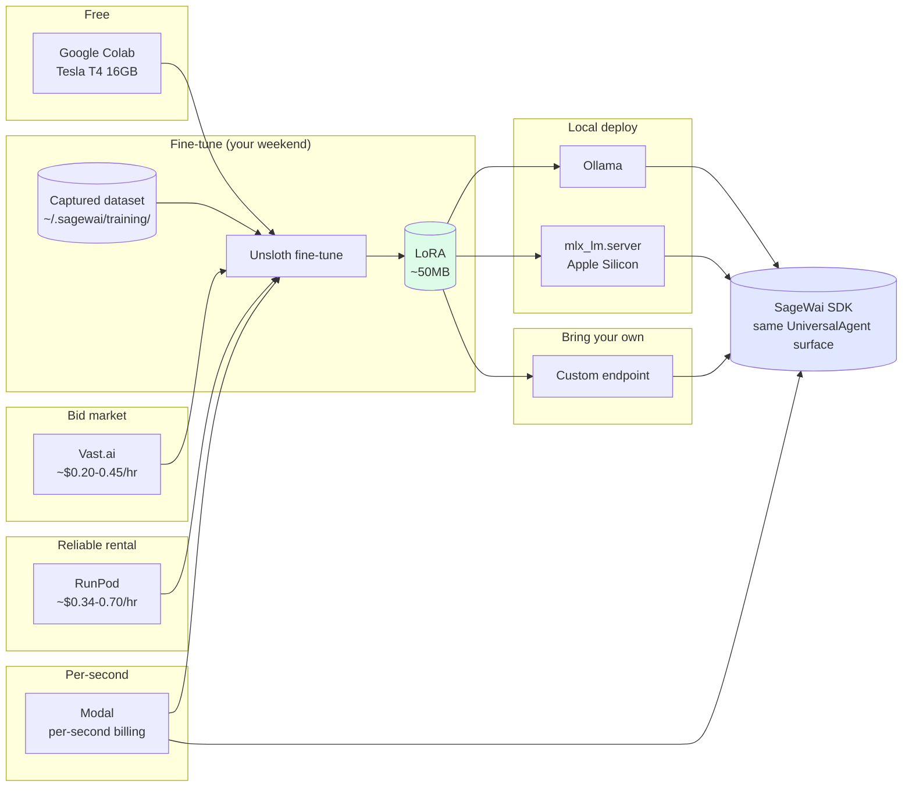

# Inference deployment — pick a GPU path that fits your job

This page helps you pick how and where to run a SageWai-trained model in production. After reading, you will know which GPU path matches your workload (free, bid-priced, reliable rental, serverless, bring-your-own, or local), and you will have a runnable example for each one.

It pairs with [Train your own model](/docs/tutorials/train-your-own-model), which walks the full capture-to-deploy loop. This page focuses on the deploy half: which path wins for which job, and what each one costs.

## Before you start

- A working SageWai install (`pip install sagewai`).
- A captured training dataset under `~/.sagewai/training/` if you plan to fine-tune. See [Train your own model](/docs/tutorials/train-your-own-model).
- Vendor accounts only for the paths you actually use (Google for Colab, Vast.ai, RunPod, or Modal). The local and bring-your-own paths need none.

## How the paths fit together

Every path produces the same artifact — a LoRA adapter — and feeds the same SageWai SDK surface (`UniversalAgent`). Pick a path by job shape, not by vendor brand.



## Pick a path

| Path | When it wins | Cost | Companion example |
|---|---|---|---|
| **Local laptop** | Development, local-mode inference, identical SDK surface to cloud | Free (existing hardware) | [18 — local LLM routing](https://github.com/sagewai/platform/blob/main/packages/sdk/sagewai/examples/18_local_llm_routing.py) |
| **Free Colab T4** | First fine-tune, no GPU at home, no vendor account | $0 | [44 — Colab free CUDA](https://github.com/sagewai/platform/blob/main/packages/sdk/sagewai/examples/44_colab_free_cuda.py) |
| **Vast.ai bid** | Cost-sensitive iterations, willing to handle interruptions | ~$0.20-0.45/hr | [45 — Vast.ai marketplace bid](https://github.com/sagewai/platform/blob/main/packages/sdk/sagewai/examples/45_vastai_marketplace_bid.py) |
| **RunPod rental** | Production fine-tunes, you want SLA + cleanup-on-failure | ~$0.34-0.70/hr | [47 — RunPod orchestration](https://github.com/sagewai/platform/blob/main/packages/sdk/sagewai/examples/47_runpod_finetune_orchestration.py) |
| **Modal serverless** | Bursty inference traffic, pay only when hot | Per-second (~$0.0006/s A10G) | [48 — Modal serverless inference](https://github.com/sagewai/platform/blob/main/packages/sdk/sagewai/examples/48_modal_serverless_inference.py) |
| **Bring your own** | On-prem, air-gapped, customer-hosted, vendor lock-out | Varies | [46 — custom inference as tool](https://github.com/sagewai/platform/blob/main/packages/sdk/sagewai/examples/46_custom_inference_as_tool.py) |
| **Local Ollama** | Production serving on commodity hardware | Free (existing VPS) | [18 — local LLM routing](https://github.com/sagewai/platform/blob/main/packages/sdk/sagewai/examples/18_local_llm_routing.py) |
| **Local mlx-lm** | Production serving on Apple Silicon Mac shops | Free (existing hardware) | [38a — mlx_lm.server deploy](https://github.com/sagewai/platform/blob/main/packages/sdk/sagewai/examples/38a_mlx_lm_server_deploy.py) |

For longer-form vendor analysis, see the [Inference education section](/docs/inference) — a five-page walkthrough of the spectrum.

## Run a path end-to-end

Each example below runs standalone. Each has a stub mode that prints the orchestration plan without provisioning anything, so you can sanity-check before spending money. Pick the one closest to your reality.

### Free path — Colab T4

```bash
python 44_colab_free_cuda.py
```

The script Drive-syncs the dataset to a Colab notebook, fine-tunes on the free T4, and Drive-syncs the LoRA back. No vendor account beyond a Google login. Sessions disconnect at ~12 hours, and T4 memory caps the model size at ~7B.

### Cheapest path — Vast.ai bid

```bash
export VASTAI_API_KEY=...
python 45_vastai_marketplace_bid.py
```

The script bids the cheapest A10G with a reliability filter and prints the preempted-host risk. Always filter `reliability>0.9` before renting — the marketplace includes hosts that disappear mid-job.

### Reliable path — RunPod

```bash
export RUNPOD_API_KEY=...
python 47_runpod_finetune_orchestration.py
```

24GB GPU, cleanup-on-failure, SLA-grade. The script idempotently brings up the pod, runs the fine-tune, downloads the LoRA, and tears the pod down. A typical 4-hour fine-tune on a 4090 costs about $1.36.

### Serverless path — Modal

```bash
modal token new
python 48_modal_serverless_inference.py
```

Per-second billing on an A10G. Cold-start is around 9s on T4 once the function image caches; warm calls are around 281ms. A real run logged 10.10s for $0.002147 on a T4. Use Modal for serving, not for long batch fine-tunes — per-second billing on a 12-hour batch is the worst of both worlds.

### Bring-your-own — custom endpoint

```bash
python 46_custom_inference_as_tool.py
```

Wraps any HTTP completion endpoint (your Modal deploy, your on-prem TGI, your customer's vLLM cluster) as a SageWai-callable tool. The endpoint URL is a config value — revoke it and the agent fails closed.

### Apple Silicon deploy — mlx-lm

```bash
pip install mlx-lm
python 38a_mlx_lm_server_deploy.py
```

`mlx_lm.server` for Mac shops with Apple Silicon. Serves the LoRA from Example 38 over a LiteLLM-compatible OpenAI endpoint. Don't try to dockerize this on macOS — Docker on macOS has no Metal access, and the server silently falls back to CPU.

## Real-world use cases

The pattern — *one SDK surface across multiple GPU paths and three deploy backends* — fits five common situations.

### 1. Solo founder fine-tuning their first model

You're at a Series A. You need to prove the loop works before the VP of Eng greenlights a real GPU budget.

| Concern | What to use |
|---|---|
| You don't have a vendor account and can't get one this week | Example 44 — needs only a Google login |
| You need a real LoRA at the end, not a tutorial blog post | The example saves a working LoRA you can deploy locally |
| Your laptop has no GPU | Colab T4 has 16GB; that's plenty for a 3B fine-tune |

### 2. Mid-size SaaS productionising a Q1 prototype

Your AI feature shipped on Opus in Q1. Now in Q3 you need to cost-down without breaking it.

| Concern | What to use |
|---|---|
| You want SLA-grade infrastructure for the production fine-tune | Example 47 (RunPod) — cleanup-on-failure, reliable rental |
| You want to compare a fine-tuned model against the cloud baseline | Example 38 prints per-call cost delta against the original Opus baseline |
| Your CFO wants a vendor relationship, not "we found this on Hacker News" | RunPod, Modal, and Vast.ai all offer enterprise contracts |

### 3. On-prem-first SaaS (regulated industries)

Your customers run on-prem. They want fine-tuning to happen on their hardware, not yours.

| Concern | What to use |
|---|---|
| Customer's training data must never leave their VPC | Example 46 — their on-prem TGI fronts the model, your code calls it |
| You don't want to certify each customer's hardware | Same SDK surface; if the endpoint is OpenAI-compatible, SageWai talks to it |
| Customer's IT wants to revoke any time | The endpoint URL is a config value; revoke it and the agent fails closed |

### 4. Bursty B2C app with unpredictable load

Your app's AI feature handles 100x peak vs trough traffic. Reserved capacity means paying for trough.

| Concern | What to use |
|---|---|
| You don't want to pay for idle GPU time at trough | Example 48 (Modal serverless) — per-second, pay only when hot |
| Cold-start must be tolerable | T4 cold-start is around 9s; warm calls around 281ms |
| You want to scale to zero overnight | Modal scales to zero by default |

### 5. Apple-shop developer team

Your team is all on M-series Macs. You don't have CUDA hardware in the office.

| Concern | What to use |
|---|---|
| You want to fine-tune | Use Example 44 (Colab) — the LoRA is base-architecture-agnostic |
| You want to deploy locally on Apple Silicon | Example 38a uses `mlx_lm.server` with Metal acceleration |
| You want the same model on dev Macs and Linux CI | The Ollama path (Example 18) runs on both — CI uses Ollama, devs use mlx-lm |

## How SageWai protects your deploy

- **Same SDK surface across every path.** A `UniversalAgent` configured for a Modal endpoint, a RunPod-trained Ollama deploy, or a customer's on-prem cluster looks identical in your code. You can swap paths without touching agent logic.
- **Cleanup-on-failure on rental paths.** The RunPod and Vast.ai examples tear the pod down when the script exits, even on error. A stuck pod cannot silently drain your budget.
- **Stub-mode for every cloud path.** Run any cloud example with no API key set and it prints the orchestration plan instead of provisioning. Use this to verify the wiring before spending.
- **Endpoint URLs are config, not code.** Bring-your-own and customer-hosted paths revoke at the config layer — pull the URL and the agent fails closed.

## What you're responsible for

- **Set vendor API keys** as environment variables or in `~/.sagewai/.env`. The examples read from there.
- **Filter Vast.ai by reliability** (`reliability>0.9` or higher) before renting. The marketplace includes hosts that disappear mid-job.
- **Don't dockerize MLX on macOS.** Docker on macOS has no Metal access. Use `mlx_lm.server` directly via launchd or `brew services`.
- **Match the path to the workload.** Modal for serving, RunPod or Vast.ai for training. Per-second billing on a 12-hour batch fine-tune is the worst of both worlds.
- **Watch the cost dashboard.** Verify spend matches the estimate after the first live run — see [Observability and cost](/docs/tutorials/observability-and-cost).

## Companion examples

| # | Example | What it adds |
|---|---|---|
| 18 | [local_llm_routing](https://github.com/sagewai/platform/blob/main/packages/sdk/sagewai/examples/18_local_llm_routing.py) | Foundation — Ollama + LM Studio swap |
| 38 | [unsloth_finetune](https://github.com/sagewai/platform/blob/main/packages/sdk/sagewai/examples/38_unsloth_finetune.py) | Real Unsloth fine-tune with cost delta |
| 38a | [mlx_lm_server_deploy](https://github.com/sagewai/platform/blob/main/packages/sdk/sagewai/examples/38a_mlx_lm_server_deploy.py) | Apple Silicon deploy via `mlx_lm.server` |
| 44 | [colab_free_cuda](https://github.com/sagewai/platform/blob/main/packages/sdk/sagewai/examples/44_colab_free_cuda.py) | Free Tesla T4 via Drive-sync |
| 45 | [vastai_marketplace_bid](https://github.com/sagewai/platform/blob/main/packages/sdk/sagewai/examples/45_vastai_marketplace_bid.py) | Bid-cheapest aggregator with reliability filter |
| 46 | [custom_inference_as_tool](https://github.com/sagewai/platform/blob/main/packages/sdk/sagewai/examples/46_custom_inference_as_tool.py) | Bring-your-own endpoint |
| 47 | [runpod_finetune_orchestration](https://github.com/sagewai/platform/blob/main/packages/sdk/sagewai/examples/47_runpod_finetune_orchestration.py) | RunPod reliable rental, cleanup-on-failure |
| 48 | [modal_serverless_inference](https://github.com/sagewai/platform/blob/main/packages/sdk/sagewai/examples/48_modal_serverless_inference.py) | Modal per-second serverless |

## Next steps

- [Train your own model](/docs/tutorials/train-your-own-model) — the full capture-to-deploy loop. This page is the deploy zoom; that page is the loop.
- [Rent when you grow](/docs/inference/rent-when-you-grow) — long-form vendor comparison for RunPod, Vast.ai, and Modal.
- [Free CUDA via Colab](/docs/inference/free-cuda-via-colab) — the free path in detail.
- [Deploy locally](/docs/inference/deploy-locally) — Ollama and mlx-lm deploy paths.
- [Observability and cost](/docs/tutorials/observability-and-cost) — verify your deploy spend matches the estimate.
