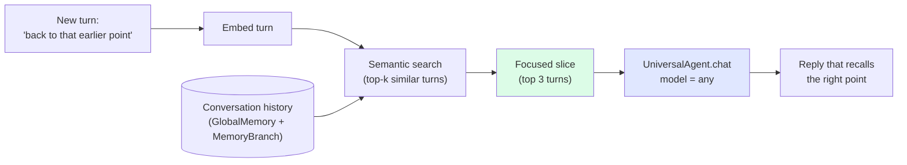
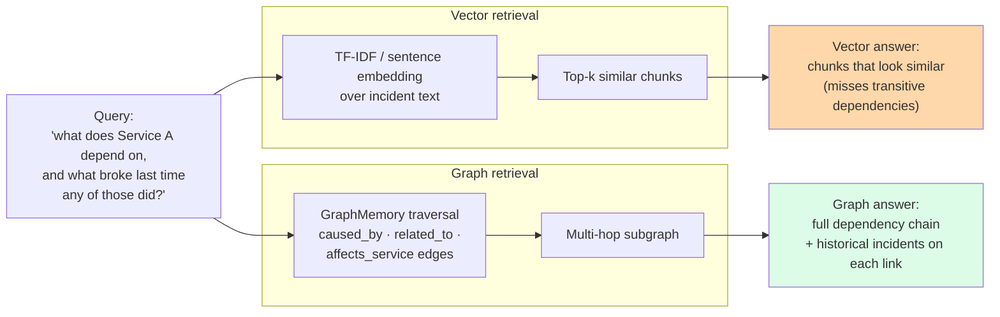

# Memory and retrieval — make a cheap LLM hold the thread

This page shows you how to give a small or local LLM the same conversational memory and multi-hop reasoning that a frontier model gets for free. After reading, you will know which retrieval pattern to reach for (semantic checkpoint recall, graph-over-vector, or both), and you will have runnable examples for each.

It is for engineers building chat, support, scribe, or incident-response surfaces who want to swap Opus or GPT-4o for Haiku, Llama 3, or Mistral without losing context.

## Before you start

- A working SageWai install (`pip install sagewai`).
- One LLM you can call. Any of these works: an Anthropic key, an OpenAI key, or a local [Ollama](https://ollama.ai) install with `llama3.2` pulled.
- For the graph-retrieval example, optionally a NebulaGraph instance if you want to run the production backend instead of the in-memory one.

## Pick a pattern

The two retrieval patterns on this page solve different problems. Pick by the question your application asks.

| Pattern | When it wins | Companion example |
|---|---|---|
| **Semantic checkpoint recall** | Long multi-turn conversations where vague references like *"back to that earlier point"* must resolve to the right history slice. Lets a 7B local model behave like a frontier model on long sessions. | [37 — semantic checkpoint recall](https://github.com/sagewai/platform/blob/main/packages/sdk/sagewai/examples/37_semantic_checkpoint_recall.py) |
| **Graph-over-vector retrieval** | Multi-hop questions over typed relations (*"what depends on X, and what broke last time any of those did?"*). Vector chunking finds similar text; graph traversal finds the actual chain. | [41 — graph memory incident dependency](https://github.com/sagewai/platform/blob/main/packages/sdk/sagewai/examples/41_graph_memory_incident_dependency.py) |

Most production apps end up wanting both: vector for *"what did we say about X?"*, graph for *"what depends on X?"*.

## How semantic checkpoint recall works

You embed each new turn, semantically search the conversation history, and pass only the focused slice to the LLM. The model never sees the full thread, so a small model can keep up with a long one.



The same code runs on `claude-opus`, `gpt-4o-mini`, and `ollama/llama3:8b`. The example cycles through all three and prints the per-LLM agreement on the recalled slice.

### Run it

```bash
pip install sagewai
ollama pull llama3.2
python 37_semantic_checkpoint_recall.py
```

The script builds a 12-turn conversation about a fictional product launch, fires a deliberately vague *"let's get back to our real business"* turn, retrieves the focused slice, and compares per-LLM responses. Real numbers from a clean-machine run print at the end.

## How graph-over-vector retrieval works

For questions that walk typed relations — *"which services depend on Service A, and which of those have caused incidents in the last 90 days?"* — vector retrieval returns chunks that look similar to the query but miss transitive structure. Graph traversal walks the edges and returns the actual chain.



`GraphMemory` ships with both an in-memory backend and a NebulaGraph backend behind one API. `QueryRouter` auto-classifies a query as relational vs lexical and dispatches to the right store.

### Run it

```bash
python 41_graph_memory_incident_dependency.py
```

The script seeds 15 to 20 incidents and 5 to 10 services with realistic root-cause edges, issues four query types (single-hop, multi-hop, temporal, constraint propagation), and prints a side-by-side against vector retrieval. It reports average traversal depth, answer completeness vs vector, and p50/p99 latency.

To exercise the production NebulaGraph backend instead of the in-memory one:

```bash
python 41_graph_memory_incident_dependency.py --backend nebula
```

You will need a reachable NebulaGraph instance. The example reads its connection settings from environment variables — see the script header.

## Use cases

The patterns above are what a senior engineer reaches for when their first agent starts losing the thread, or when their RAG pipeline returns *"chunks that look similar but don't actually answer the question."* Four common shapes:

### 1. Customer-support chatbot for long sessions

A support bot handles multi-turn conversations where customers walk it through reproducing a bug. Sessions can hit 30 turns. Opus is fine but expensive at scale; Haiku loses context.

| Concern | How this pattern solves it |
|---|---|
| You want a cheap model to hold a 30-turn thread without losing the early context | Embed each new turn, retrieve the top-3 most-relevant history turns, pass only that slice |
| The customer asks *"can you re-check what I said about the staging environment?"* mid-conversation | Semantic search resolves the vague reference into the actual staging-environment turn from 18 messages back |
| You want to swap from Opus to Haiku to local without rewriting | Same code; the example demonstrates it works on all three |

### 2. On-call / incident response with cross-incident reasoning

A platform team is on the hook for *"did this break before?"* questions. The on-call tool RAGs over the incident wiki and returns chunks; the human still has to follow the dependency chain.

| Concern | How this pattern solves it |
|---|---|
| Vector retrieval finds *similar-sounding* incidents but misses transitive dependencies | Graph traversal walks `affects_service` and `caused_by` edges; finds the actual root cause across hops |
| The CTO wants explainability — *why* did the bot suggest this is the same root cause? | Graph retrieval emits the path; *"Service A → caused_by → Service B → previous_incident → INC-1234"* is a sentence, not a vibe |
| You already run NebulaGraph in production for service maps | The same example code switches to `--backend nebula`; no new infra |

### 3. Compliance-document Q&A with multi-hop reasoning

A platform team built a RAG bot over a 5K-page compliance corpus. It returns chunks. Auditors ask *"if Section 5.2 changes, which downstream policies need a review?"* and the bot can't answer.

| Concern | How this pattern solves it |
|---|---|
| Multi-hop questions like *"which Y depend on X, and what's the latest update to each?"* fail with vector | Graph retrieval over typed edges (`depends_on`, `references`, `superseded_by`) walks the chain |
| You want to explain answers in court if it comes to it | The graph path is the audit trail; print it next to the answer |
| The corpus updates weekly | Re-extract the graph nightly; embedding-based vector RAG is not sufficient on its own |

### 4. Scribe app for primary-care physicians

A scribe summarises a 45-minute consultation. The doctor says *"go back to what they said about the rash"* halfway through writing the summary.

| Concern | How this pattern solves it |
|---|---|
| HIPAA forbids sending full transcripts to a frontier API without a BAA | Local model + semantic-checkpoint pattern: only the rash-relevant slice goes to the LLM, the transcript stays on-prem |
| 7B local models lose the thread on long consultations | They don't if they only see the relevant slice — that's the whole point |
| Doctor wants to verify the bot's recall | Print the slice next to the summary; the doctor reads it and signs off |

## Foundation memory examples

If you want to learn the storage and retrieval primitives before reading the lighthouse work:

| # | Example | What it adds |
|---|---|---|
| 04 | [memory_agent](https://github.com/sagewai/platform/blob/main/packages/sdk/sagewai/examples/04_memory_agent.py) | Basic agent memory |
| 29 | [memory_strategies](https://github.com/sagewai/platform/blob/main/packages/sdk/sagewai/examples/29_memory_strategies.py) | Strategy-based extraction (semantic facts, preferences, summaries) |
| 31 | [grounded_multi_model](https://github.com/sagewai/platform/blob/main/packages/sdk/sagewai/examples/31_grounded_multi_model.py) | Multi-LLM grounded retrieval |
| 32 | [global_shared_memory](https://github.com/sagewai/platform/blob/main/packages/sdk/sagewai/examples/32_global_shared_memory.py) | Cross-agent shared knowledge |

## See also

- **Concept page:** [Memory and RAG](/docs/core-concepts/memory) — the API surface for `RAGEngine`, `VectorMemory`, `GraphMemory`, and `MemoryBranch`.
- **Primary pillar:** [SDK](/docs/platform/sdk) — the substrate this lighthouse exercises.
- **Sibling lighthouse:** [Train your own model](/docs/tutorials/train-your-own-model) — pairs naturally with semantic-checkpoint recall (cheap LLM plus smart retrieval).
- **Sibling lighthouse:** [Production multitenancy](/docs/tutorials/production-multitenancy) — the on-call agent's full Sealed boundary.
