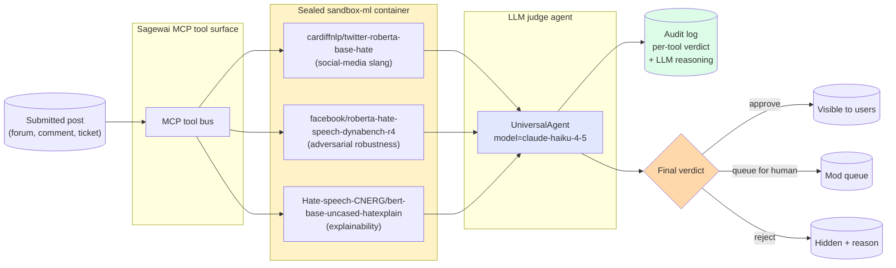

# Moderation and classification

This tutorial shows you how to build a content-moderation or classification pipeline with Sagewai. You will run three pre-trained transformer classifiers inside a sealed sandbox and use a cheap LLM as the final judge for boundary cases. By the end you will know how to run the reference example, adapt it to triage, lead-qualification, or helpdesk routing, and read the per-call audit trail.

## Before you start

- Python 3.10+ and `pip install sagewai`.
- Local-only path: [Ollama](https://ollama.com) running a chat model (`ollama run llama3.2`).
- Cloud path (optional): an `ANTHROPIC_API_KEY` for the LLM judge, and a `VASTAI_API_KEY` to run the classifiers on a rented GPU.
- About 500 MB of disk for the three HuggingFace classifiers on first run.

## How the pattern works

Three pre-trained classifiers vote on each input. A cheap LLM agent reads the structured votes, applies your policy, and produces a final verdict with a one-sentence reason. Every call is recorded — per-classifier verdicts, per-tool latency, per-tool cost, and the LLM's reasoning sentence — so a moderator can click any flagged post and see exactly why it was flagged.

| Layer | What it does | Where it runs |
|---|---|---|
| Three transformer classifiers | Deterministic vote (toxic, hateful, harassment) | Sealed sandbox container, CPU or rented GPU |
| LLM judge | Reads the votes, applies policy, writes a one-sentence reason | Local Ollama or a hosted cheap model (Haiku, `gpt-4o-mini`) |
| Audit log | Records the per-call chain end to end | Sagewai admin **Audit** view |

The classifiers used in the reference example:

- `cardiffnlp/twitter-roberta-base-hate` — social-media slang.
- `facebook/roberta-hate-speech-dynabench-r4` — adversarial robustness.
- `Hate-speech-CNERG/bert-base-uncased-hatexplain` — explainability.

All three run under 500 MB on laptop CPU for development.

## Architecture



## Run the reference example

### Local-only path (laptop CPU, no paid spend)

```bash
pip install sagewai
python 49_community_moderation.py
```

The example downloads the three classifiers on first run (about 500 MB), runs them on a small set of representative posts, and sends the final judgement to local Ollama. No third-party API is called; post text never leaves the machine.

### Cloud path (rented GPU + hosted LLM judge)

```bash
export VASTAI_API_KEY=...
export ANTHROPIC_API_KEY=sk-ant-...
python 49_community_moderation.py --live
```

The classifiers run on a Vast.ai GPU pod; the judge uses Haiku to keep per-call cost low. Cost per moderated post lands in the sub-cent range.

### Triage variant (single LLM, strict JSON)

If you do not need a classifier ensemble — for example, support-ticket triage where one LLM call returning `{tier, reason, draft}` is enough — run the triage example instead:

```bash
python 42_support_triage_agent.py
```

It produces strict JSON output and is swap-tested across local and hosted models.

## Adapt the pattern to your domain

The same shape — classifiers in a sealed boundary, surfaced as MCP tools, judged by a cheap LLM, audit per call — covers a wide range of routing and classification jobs.

### Community moderation for a SaaS forum

You run the community surface for a developer-tools SaaS. Around 800 posts a day. A part-time moderator reads every one today.

| Concern | How the pattern solves it |
|---|---|
| Posts must not leave the boundary (privacy, GDPR) | Classifiers run in a sealed container; the LLM judge is local Ollama; post text never reaches a third-party API |
| Moderators want to see *why* a post was flagged | The audit log records each classifier's verdict and the LLM's reasoning sentence; click any flag, see the full chain |
| Sarcasm and reclaimed language must not auto-reject | The LLM judge can override the classifier ensemble with reasoning; the test suite includes adversarial cases |

### Customer-support triage

You have ~200 tickets a day. Half are the same five questions.

| Concern | How the pattern solves it |
|---|---|
| Need AI in production this quarter at a capped cost | Example 42 ships a single LLM call returning strict JSON — tier, reason, draft; validates 100% across 150 calls on three local 7B models |
| Auto-responding to a P0 by accident is the worst outcome | The router never auto-responds to P0/P1; tier semantics are pinned in the system prompt |
| Start cheap, escalate only if quality slips | Run Ollama as primary; promote to Haiku only for the boundary cases your soak identifies |

### Sales-lead qualification from a contact form

Your marketing site gets 100–300 contact-form submissions a week — mostly junk plus a few real deals.

| Concern | How the pattern solves it |
|---|---|
| AEs spend the day clicking through 80% obvious junk | Re-label tiers: P0 = "real deal, has budget"; P3 = "spam / wrong fit"; the router handles the routing |
| Trial frontier models, then move to a cheaper one | Run Haiku week 1, GPT-4o-mini week 2, compare swap-agreement numbers — pick the cheaper one if 95%+ agreement |
| Qualified leads need a response in under a minute | Sub-10s p50 on Haiku, sub-1s on local llama3.2 — latency numbers double as SLA evidence |

### GitHub-issue triage on an OSS repo

You maintain an open-source project with 10–50 incoming issues a week. Most are duplicates, doc questions, or feature requests.

| Concern | How the pattern solves it |
|---|---|
| Maintainer time gets eaten re-asking for repro | The auto-respond queue asks for repro in your voice; you only see issues with repro already provided |
| Keep the human in the loop on judgement calls | P0/P1 always escalate; the agent handles the routine 80% |
| No spend for OSS tooling | The Ollama path is $0/month |

### Internal IT helpdesk

Your helpdesk portal gets 30–60 tickets a day for password resets, software access, and performance reports.

| Concern | How the pattern solves it |
|---|---|
| L1 work is mostly clicking "reset password" | Auto-respond handles password-reset and software-access tickets with grounded drafts; L1 reviews and sends |
| Compliance forbids employee data going to a third-party LLM | Pin `--primary ollama/llama3.2:latest`; data never leaves the machine |
| You need an audit trail of every triage decision | Every triage has a `reason` string; log it next to the email ID and the tier |

## How Sagewai protects your moderation pipeline

- **The classifier workload is sandboxed.** The three transformers run inside a sealed container. The agent process itself never holds the model weights or the raw post text in its address space.
- **Credentials are scoped.** Each agent run uses its own scoped credentials, not a shared environment variable lifted from the host.
- **The audit trail is per-call.** Every flagged post records each classifier's verdict, per-tool latency, per-tool cost, and the LLM judge's reasoning. The community team or a compliance reviewer can replay any decision.
- **The cheap path is real.** Using Ollama as the judge model means user content never crosses your tenant boundary.

## What you're responsible for

- **Choose where the judge runs.** Local Ollama keeps content in-house but is slower. A hosted model is faster but content leaves your boundary — confirm that is acceptable for your data class.
- **Version the policy in the system prompt.** The tier semantics ("never auto-respond to P0/P1", "reclaimed language is not a flag") live in your prompt; treat them like any other policy artifact.
- **Calibrate the test suite for your domain.** Add adversarial cases from your surface — sarcasm, in-group/out-group framing, reclaimed slurs — and re-run when you swap models.
- **Staff the human-review queue.** The agent's "queue for human" verdict only helps if a human actually reads the queue.

## See also

- [SDK overview](/docs/platform/sdk) — `UniversalAgent`, tools, MCP, and directives.
- [Production multitenancy](/docs/tutorials/production-multitenancy) — how sealed profiles and per-run identity work for tenant isolation.
- [Inference deployment](/docs/tutorials/inference-deployment) — bringing your own GPU or hosted endpoint, used by the cloud path above.
- Example 49 — [community_moderation](https://github.com/sagewai/platform/blob/main/packages/sdk/sagewai/examples/49_community_moderation.py) — three classifiers + LLM judge.
- Example 42 — [support_triage_agent](https://github.com/sagewai/platform/blob/main/packages/sdk/sagewai/examples/42_support_triage_agent.py) — single-LLM triage with strict JSON.
- Example 06 — [guardrails](https://github.com/sagewai/platform/blob/main/packages/sdk/sagewai/examples/06_guardrails.py) — safety filters before exposing an agent to users.
- Example 08 — [directives](https://github.com/sagewai/platform/blob/main/packages/sdk/sagewai/examples/08_directives.py) — directive library for swap-proof prompts.
