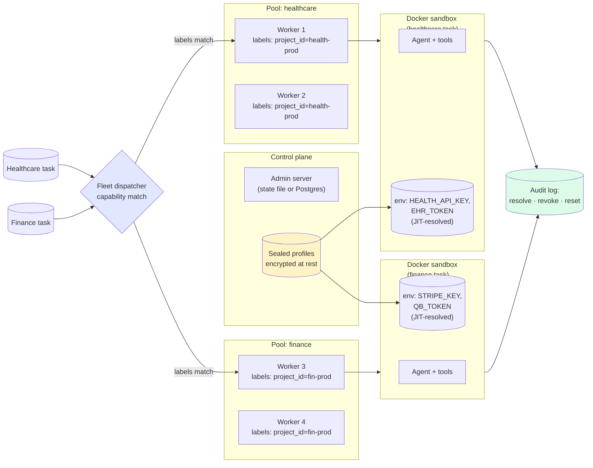

# Production multitenancy

This walkthrough shows you what Sagewai enforces when you put it in front of multiple tenants' credentials: a healthcare worker cannot reach finance tasks at the dispatch layer, each tenant's credentials live in an encrypted, per-workload Sealed profile resolved at enqueue time, and every credential resolution and pool reset lands in the audit log. Sealed's designed end state goes further — injecting vendor credentials into a containerised agent at sandbox start and scrubbing them on release so the worker host never holds them — and this page is explicit about which parts of that run today versus which are still maturing.

Read this page if you are evaluating Sagewai for a production security review, or if you are building the first multi-tenant feature on top of the platform and need to map the controls to what your security team will ask about.

## Five guarantees this walkthrough exercises

1. **The boundary is identity, not policy — and live injection is maturing.** Tenant credentials live in encrypted Sealed profiles, bound to a per-workload identity and resolved to a project-scoped dispatch at enqueue time. That much ships today. The designed end state injects those credentials into the sandbox env at sandbox start and scrubs them on release, so the worker host process never sees them — but that runtime injection/scrub-on-release is Sealed runtime enforcement, which is experimental and not yet wired into the default worker path (`SealedSecretProvider` is `None` by default). Treat the live-injection boundary as the target, not as something the default worker enforces today.
2. **Fleet dispatch enforces scope at the boundary.** Workers register with `project_id` in their capability labels; the dispatcher matches tasks against those labels. A healthcare worker is unreachable from a finance task. Example 26 ships the dispatch matcher; Example 33 ships the full integration.
3. **Per-CLI workload identity.** Each agent run has a verifiable, scoped identity — not a shared `OPENAI_API_KEY` lifted from the parent process.
4. **Vault-backed credentials.** Sagewai resolves secrets from HashiCorp Vault or the encrypted built-in store. (Additional backends such as AWS Secrets Manager are on the roadmap.)
5. **Every secret-injection event is in the audit log.** The admin **Audit** view records cascade resolutions, identity revocations, and pool resets. Compliance reads the trail directly.

## Architecture



## Run it

### Multi-tenant fleet integration

```bash
pip install sagewai
python 33_fleet_sealed_integration.py
```

The script seeds two tenants (healthcare, finance), registers four workers (two per tenant) with scoped capability labels, enqueues mixed-tenant tasks, and proves the dispatcher refuses cross-tenant claims. The output shows the cross-tenant attempt being rejected at the dispatch boundary.

### Sandbox and scoped credentials

```bash
python 39_sandbox_scoped_credentials.py
```

Exercises the Sealed runtime-injection path: it runs an agent inside a sandbox container with credentials provided by the Sealed Identity layer, calls a third-party API, and the `_smoke_test_credential_leak` block asserts the credential bytes are unreachable from the worker host. This is the experimental runtime-enforcement path, not the default worker path — it demonstrates the designed injection/scrub behaviour that is still maturing toward the default.

### Agent governance (approval flow and audit)

```bash
python 16_agent_governance.py
```

Foundation-level companion: agent approval flow with audit trail before exposing the agent to users.

## Where you'd use this

The pattern here — Sealed profiles per tenant, capability-scoped Fleet workers, enqueue-time scoped resolution with sandbox credential injection as the maturing runtime end state, audit at the boundary — is what you reach for when your first multi-tenant feature ships and the security review starts.

### Healthcare SaaS with HIPAA-bound customers

You serve 30 clinics. Each has a separate EHR token. PHI cannot leak across clinic boundaries.

| Concern | How this pattern solves it |
|---|---|
| HIPAA forbids tenant A's PHI being readable from tenant B's process space | Each clinic has a Sealed profile and the healthcare worker pool runs only healthcare tasks (both ship today); the per-task sandbox env injected and scrubbed on release is the maturing Sealed runtime-enforcement end state |
| BAA auditor wants to see the credential boundary | The Audit view shows every credential resolution and revocation with timestamps |
| Compliance forbids credentials in source code or env files on the host | Credentials live encrypted at rest in `~/.sagewai/profiles.json` and are resolved per workload at enqueue time (ships today); JIT injection at sandbox start, keeping them out of host process memory, is the maturing runtime-enforcement step |

### Multi-tenant fintech with PCI scope

Your AI feature runs across 50 finance customers. Each customer's Stripe and QB tokens must stay scoped to their own AI runs. PCI scope must be minimised.

| Concern | How this pattern solves it |
|---|---|
| PCI scope expands if any non-payment process can read the Stripe key | The Stripe key lives in the customer's Sealed profile and only finance-pool workers are dispatched their tasks (ships today); injecting it solely into their sandbox is the maturing runtime-enforcement end state |
| You need to revoke a customer's keys instantly when they cancel | Sealed has a revocation API and future enqueues fail closed against it today; mid-run (hard-revoke) abort of an in-flight run is part of the maturing runtime enforcement |
| Auditor asks "show me the path of this credential from your secret store to the customer's running agent" | The [Security tiers](/docs/architecture/security-tiers) page documents the path; the Audit view records each step |

### Enterprise SaaS with customer-specific Anthropic keys

Your customer wants to bring their own Anthropic key for cost attribution. You need to honour it without leaking other customers' keys.

| Concern | How this pattern solves it |
|---|---|
| Customer A's `ANTHROPIC_API_KEY` must reach Claude Code in customer A's sandbox, no further | Sealed profile holds it and it resolves to customer A's scoped dispatch today; sandbox-start injection into env and scrub on release is the maturing Sealed runtime-enforcement step |
| Customer wants their bill to come from their own account | The Anthropic call uses customer A's key; the bill goes there |
| Cross-customer pollution would be a critical incident | Capability labels enforce per-customer worker pools; the dispatcher refuses cross-customer claims |

### Hybrid SaaS with on-prem customers

Some of your customers run agents on their own VPC. Their credentials must never leave their network.

| Concern | How this pattern solves it |
|---|---|
| Customer's vendor keys must never leave their VPC | Sealed profile is on-prem; the worker on-prem reads it; the control plane sees the run, not the credentials |
| Centralised observability without centralising secrets | Secrets stay in the on-prem customer profile rather than in the control plane; secret redaction at the telemetry/RPC boundary is part of Sealed's maturing runtime enforcement |
| Onboarding a new on-prem customer must not require code changes | Drop in a new Sealed profile; register a worker with the right capability labels; done |

### Internal multi-team platform

Your platform team runs a shared agent platform for engineering, customer success, and sales. Each team has different vendor accounts.

| Concern | How this pattern solves it |
|---|---|
| Engineering's GitHub token must not be reachable from a customer-success agent | Per-team profile; per-team worker pool with capability labels; cross-team claim refused |
| You want one shared cost dashboard with per-team rollups | Observatory tags every span with `sagewai.project_id`; the Grafana board has per-project rollups |
| Audit committee wants to see who used what when | The Audit view records resolution, identity, run ID, timestamp |

## Companion examples

| # | Example | What it adds |
|---|---|---|
| 33 | [fleet_sealed_integration](https://github.com/sagewai/platform/blob/main/packages/sdk/sagewai/examples/33_fleet_sealed_integration.py) | Multi-tenant fleet + Sealed boundary, full integration |
| 39 | [sandbox_scoped_credentials](https://github.com/sagewai/platform/blob/main/packages/sdk/sagewai/examples/39_sandbox_scoped_credentials.py) | Sandbox + scoped creds, credential-leak smoke test |
| 16 | [agent_governance](https://github.com/sagewai/platform/blob/main/packages/sdk/sagewai/examples/16_agent_governance.py) | Approval flow + audit trail |
| 26 | [fleet_scoped_dispatch](https://github.com/sagewai/platform/blob/main/packages/sdk/sagewai/examples/26_fleet_scoped_dispatch.py) | Capability-based dispatch, project-scoped routing |
| 20 | [fleet_workers](https://github.com/sagewai/platform/blob/main/packages/sdk/sagewai/examples/20_fleet_workers.py) | Foundation — distributed worker registration |

## See also

- **Fleet:** [Fleet](/docs/platform/fleet) — workers, dispatch, and scoped routing.
- **Security model:** [Security overview](/docs/platform/security) — the cross-cutting credential, redaction, replay, and audit story.
- **Related tutorial:** [Observability and cost](/docs/tutorials/observability-and-cost) — the audit and per-tenant cost rollup that pairs with this one.
- **Related tutorial:** [Moderation and classification](/docs/tutorials/moderation-and-classification) — the same boundary applied to a different workload.
- **Prerequisite foundation:** [Example 20 — fleet_workers](https://github.com/sagewai/platform/blob/main/packages/sdk/sagewai/examples/20_fleet_workers.py).
- **Architecture pages:** [Security tiers](/docs/architecture/security-tiers), [Sandbox backends](/docs/architecture/sandbox-backends), [Execution modes](/docs/architecture/execution-modes).
