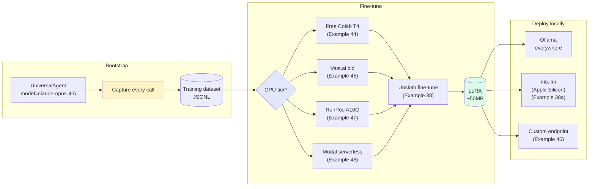

# Train your own model — the weekend training loop

By the end of this tutorial you will have captured production traffic from a running agent, fine-tuned a 3B open-source model on it, and deployed the result on your own hardware. The fine-tune itself is a short GPU job — free on Colab, or a few dollars of rental time elsewhere; what decides whether the model is any good is the data you capture and how you evaluate it. A model served locally has no per-token API bill.

## Before you start

- A Sagewai project with at least one running agent — the [first agent guide](/docs/get-started/first-agent) gets you there in ten minutes.
- A Hugging Face account (free) — Unsloth pulls the base model from HF.
- Access to one GPU tier:
  - A Google account for free Colab T4, **or**
  - A Vast.ai, RunPod, or Modal account (~$0.20–0.70/hr), **or**
  - An Apple Silicon Mac with 16 GB+ RAM for the mlx-lm path.
- Python 3.10+ and `pip install "sagewai[training]"`.

## How the loop works

Your agent calls a cloud LLM in production. Sagewai records each call as a structured JSONL record. Once you have around 1,000 records, run an Unsloth fine-tune on that JSONL. Unsloth finishes in 30–60 minutes on any of the GPU tiers listed above and saves a LoRA adapter (~50 MB) to `models/`. Load that adapter into Ollama or `mlx_lm.server` and point your agent at the local endpoint. The cloud spend stops growing.



## Step 1 — Capture production traffic

Run [Example 25 — training data pipeline](https://github.com/sagewai/platform/blob/main/packages/sdk/sagewai/examples/25_training_data_pipeline.py). It fires a few agent calls and writes each one to `~/.sagewai/training/<agent-name>.jsonl`. Confirm the output looks right:

```bash
head -1 ~/.sagewai/training/your-agent.jsonl | jq .
```

Each record contains the instruction, input, output, model name, and timestamp. Let the agent run in production for a week or two until you have at least 1,000 records — that is the minimum for a fine-tune worth deploying.

## Step 2 — Close the loop (optional)

To trigger fine-tuning automatically once the dataset reaches a threshold, run [Example 36 — autopilot training loop](https://github.com/sagewai/platform/blob/main/packages/sdk/sagewai/examples/36_autopilot_training_loop.py). It watches the dataset and kicks off a fine-tune job when the threshold is crossed. Skip this step if you prefer to trigger fine-tunes manually.

## Step 3 — Pick a GPU tier

| Tier | When it wins | Cost | Example |
|---|---|---|---|
| **Free Colab T4** | First fine-tune, no GPU at home, OK with 12-hour session limit | $0 | [44](https://github.com/sagewai/platform/blob/main/packages/sdk/sagewai/examples/44_colab_free_cuda.py) |
| **Vast.ai bid** | Cost-sensitive iterations, OK handling interruptions | ~$0.20–0.45/hr | [45](https://github.com/sagewai/platform/blob/main/packages/sdk/sagewai/examples/45_vastai_marketplace_bid.py) |
| **RunPod reliable rental** | Need 24 GB VRAM and cleanup-on-failure | ~$0.34–0.70/hr | [47](https://github.com/sagewai/platform/blob/main/packages/sdk/sagewai/examples/47_runpod_finetune_orchestration.py) |
| **Modal serverless** | Pay-per-second, only when the model is hot | ~$0.0002/call on T4 | [48](https://github.com/sagewai/platform/blob/main/packages/sdk/sagewai/examples/48_modal_serverless_inference.py) |

Each example provisions the GPU, syncs the dataset, and tears down on completion or failure.

## Step 4 — Run the fine-tune

Run [Example 38 — Unsloth fine-tune](https://github.com/sagewai/platform/blob/main/packages/sdk/sagewai/examples/38_unsloth_finetune.py). It fine-tunes `Qwen2.5-3B-Instruct` on your captured dataset, prints the loss curve, and saves a LoRA adapter to `models/`.

Expected wall-clock on the GPU tiers above: 30–60 minutes for ~1,000 examples, 3 epochs.

## Step 5 — Deploy locally

Pick your deploy target:

- **Anywhere — Ollama.** Convert the LoRA to GGUF, write a Modelfile, and run `ollama create`. Sagewai's harness auto-discovers Ollama on startup.
- **Apple Silicon — mlx-lm.** Run [Example 38a](https://github.com/sagewai/platform/blob/main/packages/sdk/sagewai/examples/38a_mlx_lm_server_deploy.py). `mlx_lm.server` uses Metal directly; no Docker layer needed.
- **Custom endpoint.** Run [Example 46](https://github.com/sagewai/platform/blob/main/packages/sdk/sagewai/examples/46_custom_inference_as_tool.py) to wrap any HTTP completion endpoint as a Sagewai-callable tool — on-prem, customer-hosted, or air-gapped.

Once the local model is running, point your agent at it:

```python
from sagewai import UniversalAgent, providers

agent = UniversalAgent(
    name="legal-reviewer-v2",
    **providers.ollama("legal-llm"),
)

response = await agent.chat("Review this non-compete clause...")
```

Cloud handles novel queries; the local model handles the patterns it has seen before.

## Where you'd use this

The capture-accumulate-fine-tune-deploy loop suits four common situations.

### SaaS support triage

You shipped a triage agent on Claude Haiku. By Q2 you're triaging 12,000 emails a month at $0.0007 per call.

| Concern | What to do |
|---|---|
| Cut the API bill in half | Fine-tune `Qwen2.5-3B-Instruct` on the 12K captured triage decisions; deploy via Ollama on a $40/month VPS; per-call cost drops to zero |
| Quality must not regress on P0/P1 cases | The fine-tune trains on real production data; the soak harness in `_soaks/directives_soak.py` grades the candidate before promotion |
| Prove the cost delta | Example 38 prints the loss curve, eval-set accuracy, and $/call delta |

### E-commerce product description generation

Your catalogue has 50K SKUs. You're generating descriptions on GPT-4o at $0.0024 per SKU — $120/month and climbing.

| Concern | What to do |
|---|---|
| Match the brand voice | Capture 1K human-edited descriptions; fine-tune Mistral-7B on them; the LoRA learns the voice |
| Add categories without re-fine-tuning | The dataset accumulates in `~/.sagewai/training/`; the next fine-tune trains on the merged corpus |
| No flaky third-party dependency | Ollama runs on the same machine as the ingestion job; no outbound network call |

### Healthcare-compliant note summarisation

Your scribe app summarises clinical notes. HIPAA forbids sending PHI to OpenAI without a BAA.

| Concern | What to do |
|---|---|
| PHI must not leave the boundary | The fine-tuned model runs on a HIPAA-eligible Modal endpoint or on-prem; PHI never reaches a third-party LLM |
| Produce a model card | Example 38 emits the training-set hash, eval-set accuracy, and the LoRA SHA |
| Upgrade the base model when a new one ships | Re-run Example 38 against `Llama-3.2-3B` and compare; the captured dataset is base-model-agnostic |

### Internal knowledge-base Q&A on engineering wikis

Your platform team answers "why is X failing?" questions across 200 services and a 5K-page Confluence. Cloud LLM via RAG costs $300/month.

| Concern | What to do |
|---|---|
| Internal tooling cost is hard to justify | Fine-tune a 3B model on captured Q&A pairs; deploy on a $40/month VPS; the cost line vanishes |
| New runbooks land every week | Captured Q&A from the live tool feeds the next fine-tune automatically |
| Keep internal data self-hosted | Ollama on-prem — no IP leaves the boundary |

## How Sagewai protects your training data

- Capture writes to `~/.sagewai/training/` on the host you control. Conversations never leave your infrastructure.
- The fine-tune runs on a GPU you rent or own. The dataset is uploaded to that GPU and torn down with it.
- Per-project isolation: each project's captured dataset is scoped to its project ID. Agents in project A cannot read training data from project B.
- The deployed model is served from your own Ollama, mlx-lm, or custom endpoint. No data crosses to a model provider after deployment.

## What you're responsible for

- Redact PII before fine-tuning if your dataset contains regulated data. The export step has a `strip_pii=True` flag — verify it removed what you expect.
- Watch the GPU rental meter. Vast.ai and RunPod bill until you tear the pod down. The example scripts include cleanup-on-failure, but a hung process will still accumulate charges.
- Check the base model licence. Llama, Mistral, and Qwen have different commercial-use terms.
- Back up the LoRA file (~50 MB). It is the only artifact you need to redeploy.

## Companion examples

| # | Example | What it adds |
|---|---|---|
| 25 | [training_data_pipeline](https://github.com/sagewai/platform/blob/main/packages/sdk/sagewai/examples/25_training_data_pipeline.py) | Capture surface for production traffic |
| 36 | [autopilot_training_loop](https://github.com/sagewai/platform/blob/main/packages/sdk/sagewai/examples/36_autopilot_training_loop.py) | Auto-trigger fine-tune when dataset crosses threshold |
| 38 | [unsloth_finetune](https://github.com/sagewai/platform/blob/main/packages/sdk/sagewai/examples/38_unsloth_finetune.py) | Real Unsloth fine-tune, real loss curves |
| 38a | [mlx_lm_server_deploy](https://github.com/sagewai/platform/blob/main/packages/sdk/sagewai/examples/38a_mlx_lm_server_deploy.py) | Apple Silicon deploy via `mlx_lm.server` |
| 44 | [colab_free_cuda](https://github.com/sagewai/platform/blob/main/packages/sdk/sagewai/examples/44_colab_free_cuda.py) | Free Tesla T4 via Colab Drive-sync |
| 45 | [vastai_marketplace_bid](https://github.com/sagewai/platform/blob/main/packages/sdk/sagewai/examples/45_vastai_marketplace_bid.py) | Bid-cheapest aggregator with reliability scoring |
| 46 | [custom_inference_as_tool](https://github.com/sagewai/platform/blob/main/packages/sdk/sagewai/examples/46_custom_inference_as_tool.py) | Bring-your-own HTTP endpoint |
| 47 | [runpod_finetune_orchestration](https://github.com/sagewai/platform/blob/main/packages/sdk/sagewai/examples/47_runpod_finetune_orchestration.py) | RunPod reliable rental with cleanup-on-failure |
| 48 | [modal_serverless_inference](https://github.com/sagewai/platform/blob/main/packages/sdk/sagewai/examples/48_modal_serverless_inference.py) | Per-second serverless inference |

## See also

- [Training & fine-tuning guide](/docs/guides/training) — the full SDK reference for capture, export, fine-tune, and serve.
- [Inference deployment](/docs/tutorials/inference-deployment) — the deployment paths in detail, with a decision table for each one.
- [Observability and cost](/docs/tutorials/observability-and-cost) — measure the $/call delta after the local model is live.
- [Local LLM routing](https://github.com/sagewai/platform/blob/main/packages/sdk/sagewai/examples/18_local_llm_routing.py) and [multi-model](https://github.com/sagewai/platform/blob/main/packages/sdk/sagewai/examples/03_multi_model.py) — foundation primitives for routing between cloud and local.
- [Inference overview](/docs/inference) — when each GPU path wins, with explicit decision guidance.
