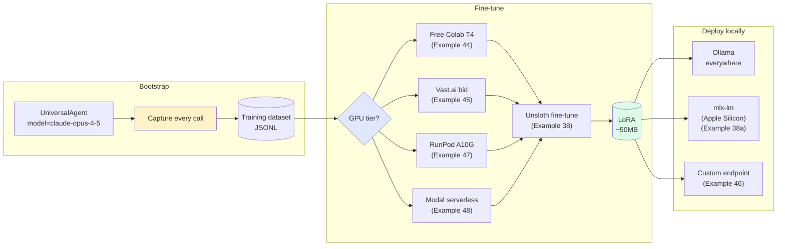

# Train your own model — the $5 weekend training loop

This page walks you through replacing your cloud-LLM bill with a model you own. After reading and running the linked examples, you'll have captured production traffic, fine-tuned an open-source 3B model on it, and deployed the result locally — end-to-end under $5 and a weekend of work.

It's aimed at a senior engineer who already shipped an AI feature on Claude or GPT-5 and now wants the per-token cost to stop growing with usage.

## Before you start

- A Sagewai project with at least one running agent (so there's traffic to capture). The [first agent guide](/docs/get-started/first-agent) gets you there in 10 minutes.
- A Hugging Face account (free) — Unsloth pulls the base model from HF.
- Access to **one** GPU tier:
  - A Google account (free Colab T4), **or**
  - A Vast.ai / RunPod / Modal account (~$0.20–0.70/hr), **or**
  - An Apple Silicon Mac with 16GB+ RAM (mlx-lm path).
- Python 3.10+ and `pip install "sagewai[training]"` for the fine-tune step.

## How the loop works

You run cloud LLMs in production today. Sagewai records every call as structured JSONL on disk. Once you have enough samples (~1,000+), you fine-tune an open-source base model on that JSONL. Unsloth runs the fine-tune in a few minutes on a small GPU. The output is a ~50MB LoRA adapter you load into Ollama or `mlx_lm.server` and serve from your own box. From there your agents call the local endpoint and the cloud bill stops growing.



## Step 1 — Capture production traffic

Wrap your agent calls so each one is written to `~/.sagewai/training/<agent-name>.jsonl`. You don't have to instrument anything; the capture surface ships with the SDK.

Run [Example 25 — training data pipeline](https://github.com/sagewai/platform/blob/main/packages/sdk/sagewai/examples/25_training_data_pipeline.py). It runs a few agent calls and shows the JSONL accumulating. Inspect the file to see the shape:

```bash
head -1 ~/.sagewai/training/your-agent.jsonl | jq .
```

You'll see one JSON record per call — instruction, input, output, model, timestamp. That's your dataset. Let it run in production for a week or two until you have at least 1,000 records.

## Step 2 — Close the loop (optional)

If you want fine-tuning to trigger automatically once the dataset is large enough, run [Example 36 — autopilot training loop](https://github.com/sagewai/platform/blob/main/packages/sdk/sagewai/examples/36_autopilot_training_loop.py). It watches the dataset and kicks off a fine-tune job when the threshold is crossed. Skip this step if you'd rather trigger fine-tunes manually.

## Step 3 — Pick a GPU tier

Match the tier to your situation:

| Tier | When it wins | Cost | Example |
|---|---|---|---|
| **Free Colab T4** | First fine-tune, no GPU at home, OK with 12-hour session limit | $0 | [44](https://github.com/sagewai/platform/blob/main/packages/sdk/sagewai/examples/44_colab_free_cuda.py) |
| **Vast.ai bid** | Cost-sensitive iterations, OK handling interruptions | ~$0.20–0.45/hr | [45](https://github.com/sagewai/platform/blob/main/packages/sdk/sagewai/examples/45_vastai_marketplace_bid.py) |
| **RunPod reliable rental** | Need 24GB VRAM and cleanup-on-failure | ~$0.34–0.70/hr | [47](https://github.com/sagewai/platform/blob/main/packages/sdk/sagewai/examples/47_runpod_finetune_orchestration.py) |
| **Modal serverless** | Pay-per-second, only when the model is hot | ~$0.0002/call on T4 | [48](https://github.com/sagewai/platform/blob/main/packages/sdk/sagewai/examples/48_modal_serverless_inference.py) |

Each example provisions the GPU, syncs the dataset, and tears down on completion or failure. Pick one and follow its README.

## Step 4 — Run the fine-tune

Run [Example 38 — Unsloth fine-tune](https://github.com/sagewai/platform/blob/main/packages/sdk/sagewai/examples/38_unsloth_finetune.py). It does a real Unsloth fine-tune of `Qwen2.5-3B-Instruct` on the captured dataset, prints the loss curve, and saves a LoRA adapter (~50MB) to `models/`.

Expected wall-clock on the GPU tiers above: 30–60 minutes for ~1,000 examples, 3 epochs.

## Step 5 — Deploy locally

Pick your deploy target:

- **Anywhere — Ollama.** Convert the LoRA to GGUF, write a Modelfile, run `ollama create`. Ollama auto-discovery means the Sagewai harness picks it up on the next start.
- **Apple Silicon — mlx-lm.** Run [Example 38a — mlx-lm server](https://github.com/sagewai/platform/blob/main/packages/sdk/sagewai/examples/38a_mlx_lm_server_deploy.py). `mlx_lm.server` uses Metal directly; no Docker layer.
- **Bring your own endpoint.** Run [Example 46 — custom inference as tool](https://github.com/sagewai/platform/blob/main/packages/sdk/sagewai/examples/46_custom_inference_as_tool.py) to wrap any HTTP completion endpoint as a Sagewai-callable tool. Customer-hosted, on-prem, or air-gapped — same SDK surface.

Once the local model is up, point your agent at it:

```python
from sagewai import UniversalAgent, providers

agent = UniversalAgent(
    name="legal-reviewer-v2",
    **providers.ollama("legal-llm"),
)

response = await agent.chat("Review this non-compete clause...")
```

That's the loop closed. Cloud calls for novel queries; local model for the patterns it has learned.

## Real-world patterns

The pattern — *capture, accumulate JSONL, fine-tune with Unsloth, deploy via Ollama* — fits four common situations.

### SaaS support-triage cost-down

You shipped a triage agent in production on Claude Haiku. By the second quarter you're triaging 12,000 emails a month at $0.0007 per call.

| Concern | How this pattern solves it |
|---|---|
| The CFO wants the API bill cut in half | Fine-tune `Qwen2.5-3B-Instruct` on the 12K captured triage decisions; deploy via Ollama on a $40/month VPS; per-call cost drops to zero |
| Quality must not regress on the P0/P1 cases | Capture records every triage; the fine-tune sees real production data, not synthetic; the soak harness in `_soaks/directives_soak.py` grades the candidate model before promotion |
| The CTO wants to see the receipts | Example 38 prints the loss curve, the eval-set accuracy, and the $/call delta — paste it into the OKR doc |

### E-commerce product description generation

Your catalogue has 50K SKUs. You've been generating descriptions on GPT-4o at $0.0024 per SKU, which is $120/month and growing as the catalogue does.

| Concern | How this pattern solves it |
|---|---|
| Description quality must match the brand voice | Capture 1K human-edited descriptions, fine-tune Mistral-7B on them, the LoRA learns the voice |
| You want to add more categories without re-fine-tuning | The captured dataset stays in `~/.sagewai/training/`; the next fine-tune trains on the merged corpus |
| Catalogue ingestion runs nightly and can't depend on a flaky third-party | Ollama runs on the same machine as the ingestion job; no network call leaves the box |

### Healthcare-compliant note summarisation

Your scribe app summarises clinical notes for primary-care physicians. HIPAA forbids sending PHI to OpenAI without a BAA — and the BAA cost is on top of the API spend.

| Concern | How this pattern solves it |
|---|---|
| Compliance forbids PHI leaving the boundary | The fine-tuned model runs on a HIPAA-eligible Modal endpoint or on-prem; PHI never touches a third-party LLM |
| The audit committee wants a model card | Example 38 emits the training-set hash, eval-set accuracy, and the LoRA SHA; that's the model card |
| You want to upgrade the base model when a new one ships | The captured dataset is base-model-agnostic; re-run Example 38 against `Llama-3.2-3B` instead of `Qwen2.5-3B` and compare |

### Internal knowledge-base Q&A on engineering wikis

Your platform team is on the hook for "why is X failing?" questions across 200 services and a 5K-page Confluence. You've been pointing GPT-4o at it via RAG and the bill is $300/month.

| Concern | How this pattern solves it |
|---|---|
| The cost is unjustifiable for an internal tool | Fine-tune a 3B model on captured Q&A pairs; deploy on a $40/month VPS; the cost line vanishes |
| The team writes new runbooks every week | Capture records Q&A from the live tool; the next fine-tune trains on the latest corpus |
| You want self-hosted to avoid vendor risk on internal data | Same as healthcare — Ollama on-prem, no PHI/IP leaves the boundary |

## How Sagewai protects your training data

- Capture writes to `~/.sagewai/training/` on the host you control. Conversations never leave your infrastructure.
- The fine-tune runs on a GPU you rent (or own); the dataset is uploaded only to that GPU and torn down with it.
- Per-project isolation: each project's captured dataset is scoped to its project ID; agents in project A can't read training data from project B.
- The deployed model is served from your own Ollama / mlx-lm / custom endpoint. No data crosses to a model provider after deployment.

## What you're responsible for

- Redacting PII before fine-tuning if your dataset contains regulated data (the export step has a `strip_pii=True` flag — verify it removed what you expect).
- Keeping the GPU rental tier inside your budget — Vast.ai and RunPod meters keep running until you tear the pod down. The example scripts include cleanup-on-failure, but a hung process will still bill you.
- Choosing a base model whose licence permits your use case (Llama, Mistral, Qwen all have different commercial-use terms — check before you ship).
- Backing up the LoRA file (~50MB). It's the only artifact you need to redeploy.

## Companion examples

| # | Example | What it adds |
|---|---|---|
| 25 | [training_data_pipeline](https://github.com/sagewai/platform/blob/main/packages/sdk/sagewai/examples/25_training_data_pipeline.py) | Capture surface for production traffic |
| 36 | [autopilot_training_loop](https://github.com/sagewai/platform/blob/main/packages/sdk/sagewai/examples/36_autopilot_training_loop.py) | Auto-trigger fine-tune when dataset crosses threshold |
| 38 | [unsloth_finetune](https://github.com/sagewai/platform/blob/main/packages/sdk/sagewai/examples/38_unsloth_finetune.py) | Real Unsloth fine-tune, real loss curves |
| 38a | [mlx_lm_server_deploy](https://github.com/sagewai/platform/blob/main/packages/sdk/sagewai/examples/38a_mlx_lm_server_deploy.py) | Apple Silicon deploy via `mlx_lm.server` |
| 44 | [colab_free_cuda](https://github.com/sagewai/platform/blob/main/packages/sdk/sagewai/examples/44_colab_free_cuda.py) | Free Tesla T4 via Colab Drive-sync |
| 45 | [vastai_marketplace_bid](https://github.com/sagewai/platform/blob/main/packages/sdk/sagewai/examples/45_vastai_marketplace_bid.py) | Bid-cheapest aggregator with reliability scoring |
| 46 | [custom_inference_as_tool](https://github.com/sagewai/platform/blob/main/packages/sdk/sagewai/examples/46_custom_inference_as_tool.py) | Bring-your-own HTTP endpoint |
| 47 | [runpod_finetune_orchestration](https://github.com/sagewai/platform/blob/main/packages/sdk/sagewai/examples/47_runpod_finetune_orchestration.py) | RunPod reliable rental with cleanup-on-failure |
| 48 | [modal_serverless_inference](https://github.com/sagewai/platform/blob/main/packages/sdk/sagewai/examples/48_modal_serverless_inference.py) | Per-second serverless inference |

## See also

- [Training & fine-tuning guide](/docs/guides/training) — the full SDK reference for capture, export, fine-tune, and serve.
- [Inference deployment](/docs/tutorials/inference-deployment) — the five inference tiers in detail, with a decision table for when to pick which.
- [Observability and cost](/docs/tutorials/observability-and-cost) — quantify the $/call delta after the local model is live.
- [Local LLM routing](https://github.com/sagewai/platform/blob/main/packages/sdk/sagewai/examples/18_local_llm_routing.py) and [multi-model](https://github.com/sagewai/platform/blob/main/packages/sdk/sagewai/examples/03_multi_model.py) — foundation primitives for routing between cloud and local.
- [Inference overview](/docs/inference) — when each of the five tiers wins, with explicit *when to pick which* guidance.
