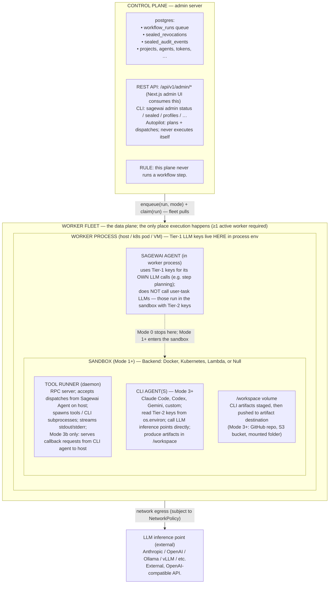

# Sagewai runtime topology

**Status:** authoritative
**Last revised:** 2026-04-25
**Companion docs:** [security-tiers.md](security-tiers.md), [execution-modes.md](execution-modes.md), [execution-backends.md](execution-backends.md)

This document fixes Sagewai's runtime architecture. Every implementation thread reads this first; every spec is checked against it. If reality drifts from this doc, fix the doc OR fix reality — never both at once.

---

## Three invariants

These three statements are non-negotiable. Everything in the platform is structured to make them true.

1. **The worker is the only executor.** The control plane (admin server, CLI, autopilot, registry) plans, persists, queries, and dispatches. It never runs a workflow step. Conversely, no scheduling or persistence happens inside a worker — workers consume work, they don't allocate it.

2. **Mode is per-step, not per-deployment.** A single workflow run can execute step 1 inline on the worker (Mode 0), step 2 in an isolated sandbox with no credentials (Mode 1), step 3 in a sandbox with a customer's identity (Mode 2), and step 4 with a CLI agent like Claude Code (Mode 3). Each step's mode is selected by the workflow author, the autopilot, or runtime escalation logic — independently. See [execution-modes.md](execution-modes.md).

3. **Trust boundary = sandbox boundary, when a sandbox is present.** When a step runs in Mode 1+, the sandbox container is the security boundary. By design, secret values exist inside it (env-injected from Sealed Identity); the worker host knows secret KEY NAMES but never holds plaintext secret values, and the control plane has no access to either. See [security-tiers.md](security-tiers.md). **Status:** the enqueue-time half ships — the worker resolves the Sealed cascade and persists key names. The runtime half that injects the resolved Tier-2 values into a live sandbox is the experimental Sealed runtime path (`SealedSecretProvider` is `None` on the default worker), so live injection — and the redaction, per-key/per-CLI ACL filtering, replay-safe injection, and mid-run hard-revoke abort that build on it — is not yet wired into the default worker. These describe the designed end-state, not a shipped runtime guarantee.

---

## Topology



Workers register with the fleet registry, get approved, advertise capability labels (`sandbox.backend`, `models_supported`, `project_id`, …), and pull runs whose requirements they match.

**Inside the Sagewai Agent (per claimed run):**

1. Claims run; reads execution mode from the row.
2. Resolves Security Identity (Sealed cascade) IF mode ≥ 2. Persists `effective_*_keys` (NAMES) on the run row. Never sees plaintext values. (Cascade resolution + key-name persistence ship today.)
3. Acquires a sandbox from the pool IF mode ≥ 1.
4. Runs the agent loop appropriate to the mode:
   - **Mode 0** — inline on worker
   - **Mode 1** — via tool runner in sandbox (empty env, isolation only)
   - **Mode 2** — designed to add identity in sandbox env (Tier-2 keys, behavior knobs); this runtime injection is the experimental Sealed path, not wired into the default worker
   - **Mode 3** — + CLI agent (Claude Code, Codex, …) + artifact creds
   - **Mode 3b** — designed to add a bidirectional callback for JIT credentials (Sealed-iv); experimental Sealed component, not in the default worker
5. Persists audit + step state.
6. Releases sandbox (`cleanup_run` scrubs env).

LLM calls the Sagewai Agent makes for ITSELF (e.g. step planning) use Tier-1 keys from the worker env; it does NOT call user-task LLMs — those happen inside the sandbox using Tier-2 keys.

---

## Component definitions

| Component | Where | Process boundary | Owns | Does NOT do |
|---|---|---|---|---|
| **Control plane** (admin server) | host process; the operator's "console" | postgres + REST + admin UI | persistence, planning, dispatch, audit query | execute workflow steps |
| **Worker fleet** | logical: a set of Worker processes | n/a — it's a registry | capacity scheduling, capability advertisement, run dispatch | hold creds itself |
| **Worker** | host (k8s pod / VM / bare metal) | one OS process | claims runs, resolves Identity, manages sandbox lifecycle, hosts Sagewai Agent | hold Tier-2 plaintext secrets |
| **Sagewai Agent** | inside the worker process | thread of the worker | reads task + mode → dispatches accordingly; orchestration brain; uses Tier-1 keys for its OWN LLM calls | run user-task LLM calls (those are Tier-2, inside sandbox) |
| **Sandbox** | Docker container / k8s pod / Lambda invocation | depends on backend; **optional** (Modes 1+) | isolation: net policy, fs, env, identity | exist in Mode 0 |
| **Tool runner** | inside sandbox; daemon | OS process inside the sandbox | RPC dispatch, CLI subprocess management, stdout/stderr streaming | hold persistent state across runs (pool reset wipes env between runs) |
| **CLI Agent** | inside sandbox; subprocess of tool runner | OS subprocess; Mode 3+ only | the actual user-task work — code gen, editing, deployment | persist beyond the run |
| **Security Identity** | data → env-injected into sandbox | n/a (it's data, not code) | per-customer/per-workflow Tier-2 keys + behavior knobs | exist outside the sandbox after injection |
| **Artifact destination** | external (GitHub repo / S3 bucket / mounted folder) | the destination's own runtime | receive CLI agent outputs | be readable by the worker host (creds are sandbox-side) |
| **LLM inference point** | external | external | model weights | make tool calls (the agent is the orchestrator; the LLM is the model) |

---

## Data flow per workflow run

The flow varies by mode, but the run-level lifecycle is constant:

```
1. Caller → Workflow.enqueue(input, security_profile_ref?, mode?)
       ↓
2. Control plane writes a workflow_runs row:
       - status = 'pending'
       - security_profile_ref (Mode 2+)
       - effective_env_keys, effective_secret_keys (Sealed cascade — names only)
       - sandbox_mode, image, network_policy
       ↓
3. Worker fleet: a worker matching the run's requirements claims the row
       UPDATE workflow_runs SET status='running', worker_id=…
       ↓
4. Sagewai Agent (in worker process) reads the row, dispatches by mode:

   Mode 0 (Bare):
       Agent runs the task inline using Tier-1 keys.
       No sandbox, no Identity. Step result → postgres → next step.

   Mode 1 (Sandboxed, no Identity):
       Agent acquires sandbox from pool with empty env.
       Dispatches tool calls via tool runner RPC.
       Outputs → postgres.

   Mode 2 (Sandboxed + Identity):
       Agent re-resolves Sealed cascade at sandbox-start time
       (catches rotation drift since enqueue).
       Acquires sandbox; in the DESIGNED runtime path, Tier-2 env
       is injected on container start and tools read os.environ
       for credentials.
       STATUS: cascade resolution ships; the live injection step
       is the experimental Sealed runtime path (SealedSecretProvider
       is None on the default worker) — not enabled by default.

   Mode 3 (Full + CLI agent):
       Same as Mode 2, plus tool runner spawns CLI agent
       (Claude Code / Codex / Gemini / custom) as a subprocess.
       CLI agent reads its LLM key from sandbox env, calls
       LLM inference point directly, writes to /workspace.
       After CLI completes, artifact destination upload runs
       (git push / aws s3 sync / cp), creds also sandbox-side.
       STATUS: the CLI-agent + artifact path ships; the Sealed-driven
       injection of Tier-2 credentials into that sandbox is the same
       experimental runtime path noted for Mode 2.

   Mode 3b (Full + JIT callback):
       Same as Mode 3 plus a bidirectional channel:
       CLI agent or tool runner can request a credential
       it doesn't have ("I need write access to repo X").
       Sagewai Agent on host evaluates against policy
       (Sealed-iv) — auto-approves, denies, or surfaces a
       HITL gate. Approved creds are env-injected at runtime.
       STATUS: experimental Sealed component (Sealed-iv);
       not wired into the default worker.
       ↓
5. Run completes:
       - Audit events persisted (sealed_audit_events: profile.cascade.resolved
         from the enqueue-time path ships; the injection-derived events such as
         profile.injected / secret.decrypted come from the experimental Sealed
         runtime path and only emit when it is enabled)
       - Sandbox released to pool (cleanup_run scrubs Tier-2 env;
         pool discards sandbox if cleanup fails). NOTE: the soft-revoke and
         mid-run hard-revoke abort paths that this cleanup supports
         (Sealed-iii.A) are experimental and have no production caller in the
         default worker.
       - workflow_runs.status = 'completed' or 'failed'
```

---

## Anti-patterns (things this topology forbids)

These are the violations to call out in code review or design review.

1. **Tool execution on the LLM inference point.**
   The inference point is just a model. It cannot execute tools. Anything that talks to the LLM and calls itself a "tool runner" or "function executor" is wrong by name.

2. **Workflow step execution on the control plane.**
   The admin server, autopilot, and CLI never run workflow steps. They write rows; workers read them. If you find yourself writing a step executor in `sagewai/admin/`, redirect to `sagewai/core/worker.py`.

3. **Secrets on the worker host (when a sandbox is in scope).**
   In Mode 1+, Tier-2 secrets must NEVER touch the worker process env. They flow from the Sealed Identity backend → the sandbox container env (via the SecretProvider's `env_for`). The worker only sees key NAMES on `workflow_runs.effective_secret_keys`.

4. **Single mode for an entire workflow when steps differ in cost/risk.**
   A "build a portfolio site, then summarize what you built" workflow is wasteful if it runs the summarize step in Mode 3. Steps have independent modes.

5. **Skipping the worker entirely.**
   No `Workflow.run_inline()` API on the control plane. Even quick tasks go through the queue + a worker (which may execute Mode 0, but it is still a worker).

6. **Long-running state inside the tool runner.**
   The tool runner is per-run (or pooled with reset). Nothing persists across runs except artifacts written to the destination. State that must outlive the run lives in postgres.

---

## Why this topology

In short: **decoupling planning from execution gives Sagewai its operational characteristics**.

- **Planning is cheap.** The control plane can plan a million workflow runs without saturating execution capacity. Autopilot, batch enqueues, scheduled jobs, all flow through the queue.
- **Execution is bounded.** Worker count caps concurrency. Worker capability labels route work to capable executors. A worker pool can scale via k8s without touching the admin server.
- **Security is bounded.** The sandbox is where blast radius lives. Secrets are inside it; tool execution is inside it; CLI agents are inside it. A bug or compromise inside the sandbox cannot reach the worker host or the control plane (modulo backend escape vulnerabilities, which are the backend vendor's problem, not Sagewai's).
- **Observability is uniform.** Every step emits the same audit event shape regardless of mode. Logs and metrics flow through one OTel pipeline regardless of backend.
- **Replay is decidable.** Step inputs + mode + Identity key names at enqueue time are persisted, so a replay can reproduce what was, not what is now. Persisting this enqueue-time state ships; the replay-safe *secret injection* that rehydrates the matching values into a sandbox (Sealed-iii.C) is part of the experimental Sealed runtime path.

---

## What this topology does NOT specify

This document fixes the runtime structure. It does not fix:

- **Which LLM Tier-1 uses.** Operator picks. Local Ollama for cheap planning is common.
- **Which Sandbox backend.** See [execution-backends.md](execution-backends.md). Each deployment picks one (or runs a heterogeneous fleet with capability-routed dispatch).
- **Which Identity backend.** See Sealed-i / Sealed-ii. Builtin file-based store is the default; HashiCorp Vault is the one external backend that ships today (config-gated). The backend interface is pluggable, with 1Password, AWS SM, SOPS, and Bitwarden on the roadmap rather than implemented.
- **Workflow definition syntax.** Workflows are Python-defined today (DurableWorkflow + steps). YAML-defined workflows are a possible future API; the topology is unchanged.
- **What CLI agents are available.** The image variant catalog (`sagewai/sandbox-claude-code`, `sagewai/sandbox-codex`, …) is operator-curated. New CLIs are added by extending the catalog, not the topology.

---

## Glossary cross-reference

This document uses the canonical term for each concept. Other docs and code may use abbreviated forms:

| Canonical | Aliases (for grep) | Defined in |
|---|---|---|
| Sagewai Agent | "the agent", "orchestration agent", "host agent" | this doc + execution-modes.md |
| CLI Agent | "the CLI", "external CLI", "Claude Code" (specific instance) | this doc + execution-modes.md |
| Sandbox | "container", "pod" (backend-specific) | this doc + execution-backends.md |
| Tool runner | "tool-runner daemon", "RPC server" | this doc |
| Identity / Security Identity | "profile" (when referring to the Profile model in code) | security-tiers.md + Sealed-i spec |
| Tier-1 keys | "orchestration keys", "host keys", "operator keys" | security-tiers.md |
| Tier-2 keys | "user-task keys", "sandbox keys", "customer keys" | security-tiers.md |

---

## Change procedure

This doc is the contract between threads. Changes go through:

1. Open a PR with proposed change. Title: `docs(architecture): runtime-topology — <one-line summary>`.
2. CODEOWNERS review.
3. If the change invalidates an in-flight feature plan, mention that plan's PR or design doc in the PR body so the dependent work updates.
4. Merge. Subsequent threads see the new contract on next start.
