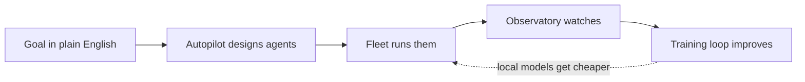

# Sagewai — The Autonomous Agent Platform

> **The factory that runs itself.**
>
> **Sagewai is the autonomous agent platform: describe the goal, we design the agents, run them in production, and fine-tune local models so every run gets cheaper.**

---

## What it is

Sagewai is the autonomous agent platform for developers, infra engineers, production teams, and vertical SaaS founders. You describe the goal; we design the agents, run them in production under per-CLI workload identity, and fine-tune cheaper local models from the outcomes.

## Why it exists

- **Framework fatigue.** Every agent stack today is a stitch-up: LangChain + LangSmith + a vector DB + an orchestrator + a cost tool. You spend more time gluing than building.
- **Productionization gap.** Your agents work in the demo. Ten users later, they don't. Durable workflows, guardrails, observability, and a fleet aren't optional — they're the whole job.
- **Token rent forever.** You pay OpenAI margins on every run. No framework gives you a path to cheaper local models without a second platform to run them on.

## How it works



## What you get — five pillars and one spine

**Autopilot is the north star.** *State the goal, get the agent.* Five pillars are the architectural surfaces that make autopilot real in production. Sealed is the spine that runs through all five.

### The five pillars

| Pillar | What it does |
|---|---|
| **SDK** | Python-native agent runtime — multi-model providers, tools via MCP gateway, typed memory with extraction strategies and per-mission branching and checkpoint save/restore, guardrails, and LLM proxy in one import. |
| **Autopilot** | State the goal in plain English. Autopilot designs the agent graph, extracts the slots, previews the plan, runs the mission, and heals on failure. The headline experience of the platform. |
| **Fleet** | Distributed workers with capability-based dispatch, project isolation, enrollment keys, and isolated execution sandboxes (image families, Kubernetes backend, AgentCore-runtime backend, pooling). Run agents on your hardware, in your network. |
| **Observatory** | OpenTelemetry tracing, VictoriaMetrics metrics, Grafana dashboards, cost tracking, audit trail. Your AI source of truth. |
| **Training Loop** | Curate production runs, export for Unsloth, fine-tune local models, promote the good ones. Agents that get cheaper with use. |

### The spine — Sealed

> **Five pillars hold up the platform; one spine runs through all of them — that's what makes the agent platform safe to give a credit card.**

A defense-in-depth security model that runs across all five pillars. Per-CLI workload identity at the SDK level, externalised secret backends and JIT credentials at the Fleet level, JIT-HITL callbacks at Autopilot, replay-safe audit at the Observatory, ACL-gated retrieval inside the Training Loop. Five phases, twelve specs — built for the threat model agent platforms have been ignoring.

## Versus the field

| Framework | What they give | What they don't | Sagewai |
|---|---|---|---|
| LangChain | Framework, largest ecosystem | Ops, admin, cost tracking (LangSmith is paid), autopilot | Full stack + autopilot + learning loop |
| CrewAI | Role-based multi-agent framework | Memory, ops console, durable workflows, autopilot | Durable workflows + autopilot + observability |
| OpenAI Agents SDK | Thin Python framework, low friction | Persistence, fleet, autopilot, multi-provider neutrality | Multi-provider + fleet + autopilot |
| Google ADK | Code-first multi-agent framework | Ops, durable memory, vendor neutrality, autopilot | Vendor-neutral + ops console + autopilot |
| AWS Bedrock Agents | Managed agents on AWS | Portability, source, autopilot, cost control | Self-host anywhere, open, autopilot |
| Dify | Low-code visual builder | Production engineering, durability, CLI, autopilot | Code-first, durable, autopilot |

## Who it's for

- **Developer building an app.** State what the app should do, let autopilot design the agents, ship the result.
- **Infra engineer deploying agent workloads.** Use the fleet to run agents on your own pods and hardware, with LLM-aware dispatch and Sealed zero-trust workers.
- **Team operating agents in production.** Durable workflows survive crashes; the observatory answers "what did AI cost us this month?"; the training loop drives unit cost down over time.
- **Vertical SaaS founder.** Build the product on Sagewai under the white-label tier — fleet, observatory, training loop and Sealed without building any of it.

## Try it

```bash
pip install sagewai
```

- **GitHub:** https://github.com/sagewai/platform (star the repo)
- **Docs:** https://docs.sagewai.ai
- **Commercial licensing:** licensing@sagewai.ai
