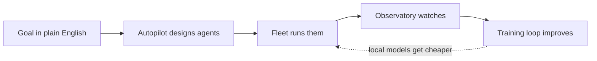

# Sagewai — The Autonomous Agent Platform

> **The factory that runs itself.**
>
> **Sagewai is the autonomous agent platform: describe the goal, we design the agents, run them in production, and fine-tune local models so every run gets cheaper.**

---

## What it is

Sagewai is an open-source platform for building and running AI agents on your own hardware. You write an agent in a few lines of Python, give it tools and memory, and run it — locally or as a fleet of workers in your network. One interface reaches 100+ models (OpenAI, Anthropic, Google, Mistral, local Ollama via LiteLLM), so you are not locked to a provider.

Sagewai is early software: the `sagewai` package is published as `0.1.1` (alpha). The [v1.0 status](#v10-status) section is explicit about what ships today, what is experimental, and what is on the roadmap — so you can decide what to rely on.

## Why it exists

- **Framework fatigue.** Every agent stack today is a stitch-up: LangChain + LangSmith + a vector DB + an orchestrator + a cost tool. You spend more time gluing than building.
- **Productionization gap.** Your agents work in the demo. Ten users later, they don't. Durable workflows, guardrails, observability, and a fleet aren't optional — they're the whole job.
- **Token rent forever.** You pay frontier-model margins on every run. No framework gives you a path to cheaper local models without a second platform to run them on.

## How it works



## What you get

Build your agent with the SDK. Hand it goals with Autopilot. Run them across teams with Fleet. Keep every secret scoped with Sealed. Watch every dollar with Observatory. Then own the model with the Training Loop.

**SDK.** A Python-native agent runtime in one import: 100+ models through a single interface, tools over an MCP gateway, typed memory with extraction strategies, guardrails, and multi-stage workflows. This is where you write the agent.

**Autopilot.** Describe a goal in plain English and Autopilot assembles and runs the agent for you — designing the agent graph, extracting the inputs it needs, previewing the plan, and executing it. Today it runs linear plans end-to-end; branched and conditional plans are in progress.

**Fleet.** Distributed workers with capability-based dispatch, project isolation, and enrollment keys, running agents on your own hardware and in your own network. Execution is sandboxed through Docker (default) or Kubernetes.

**Sealed.** A workload-identity model for agents, with external secret backends (HashiCorp Vault) and admin controls over profiles and secrets. The identity model, the Vault backend, and the admin controls ship today; runtime enforcement — live secret injection, redaction, per-key ACLs, and mid-run revocation — is experimental and maturing. Sealed is a first-class product, not an add-on.

**Observatory.** OpenTelemetry traces, metrics, and a per-model / per-team spend breakdown, with an audit trail. The answer to "what did AI cost us this month?"

**Training Loop.** Capture good production runs so you can fine-tune a cheaper local model from them. Run capture (the Curator) ships today as an experimental component; the closed capture → fine-tune → promote → deploy loop is on the roadmap.

## v1.0 status

The `sagewai` package is published as `0.1.1` (alpha). Here is what is real today, what is experimental, and what is coming.

**Shipped**
- **SDK** — agents, `@tool` calling, 100+ models via LiteLLM, typed memory, guardrails, and multi-stage workflows.
- **Autopilot** for **linear** plans — designs and runs the agent graph end-to-end.
- **Fleet** — capability-based dispatch with project isolation; **Docker** (default) and **Kubernetes** sandbox backends.
- **Observatory** — OpenTelemetry traces, metrics, and per-model / per-team cost tracking.
- **Sealed** — the workload-identity model, an external secret backend (HashiCorp Vault), and admin profile/secret controls.
- **Training Loop — capture** (the Curator).

**Experimental** — built and tested, not yet wired into the default run path
- Autopilot **branched / conditional** plans (today the entry node runs; full routing is in progress).
- Automatic **healing** — the engine surfaces recommended actions; it does not yet act on them.
- Sealed **runtime enforcement** — live secret injection, redaction, per-key ACL, and mid-run revocation.

**Roadmap**
- The **closed cost-down loop** — fine-tune a promoted local model and deploy it via Ollama.
- Per-step execution modes; branch-filtered memory retrieval; durable Fleet persistence.
- Additional sandbox backends (e.g. AWS Lambda).

## Versus the field

| Framework | What they give | What they don't | Sagewai |
|---|---|---|---|
| LangChain | Framework, largest ecosystem | Ops, admin, cost tracking (LangSmith is paid), autopilot | Full stack + autopilot + learning loop |
| CrewAI | Role-based multi-agent framework | Memory, ops console, durable workflows, autopilot | Durable workflows + autopilot + observability |
| OpenAI Agents SDK | Thin Python framework, low friction | Persistence, fleet, autopilot, multi-provider neutrality | Multi-provider + fleet + autopilot |
| Google ADK | Code-first multi-agent framework | Ops, durable memory, vendor neutrality, autopilot | Vendor-neutral + ops console + autopilot |
| AWS Bedrock Agents | Managed agents on AWS | Portability, source, autopilot, cost control | Self-host anywhere, open, autopilot |
| Dify | Low-code visual builder | Production engineering, durability, CLI, autopilot | Code-first, durable, autopilot |

## Who it's for

- **Developers building an app.** State what the app should do, let Autopilot design the agents, ship the result.
- **Infra engineers deploying agent workloads.** Use Fleet to run agents on your own pods and hardware, with capability-based dispatch and per-workload identity.
- **Teams operating agents in production.** Durable workflows survive crashes; Observatory answers "what did AI cost us this month?"; the Training Loop is the path to driving unit cost down over time.
- **Vertical software teams/founders.** Build the product on Sagewai under the commercial license — Fleet, Observatory, Sealed, and the Training Loop without building any of it yourself.

### For investors

> **AI agents need a runtime — and whoever owns it owns the margin. Sagewai is the open-source one: every secret scoped, every dollar tracked, every model yours to own.**

## Try it

```bash
pip install sagewai
```

- **Docs:** https://docs.sagewai.ai
- **Commercial licensing:** licensing@sagewai.ai
