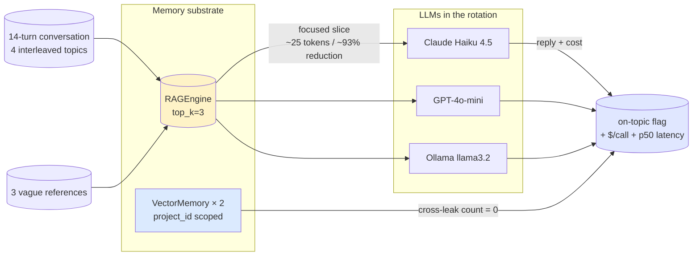
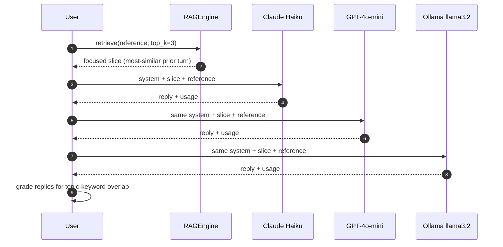

# Example 22 — Memory holds across LLMs

> Three vague references fire against a 14-turn conversation. The
> memory layer retrieves a focused slice that's >90% smaller than
> the full history. The same slice gets handed to Claude Haiku,
> GPT-4o-mini, and a local Ollama model. All three reply on-topic,
> every one of them. **The slice carried the conversation; the LLM
> is interchangeable.**

This is the runnable narrative for the cross-LLM memory invariants
the soak harness in `packages/sdk/sagewai/examples/_soaks/memory_soak.py`
measures and publishes. Soak A's table is the proof; this example
is the story you read in 60 seconds and feel in your bones.

It pairs with **Example 37** (the developer-facing Gap #5 demo —
focused-slice retrieval shown without the cross-LLM grading) and
**Example 04** (the public memory-API tour). Read those first if
you want the substrate; read this one if you want the *"what would
we save?"* answer.

## What this proves

Five invariants you can verify on your laptop in under a minute:

1. **Focused-slice retrieval is real.** A 14-turn / 4-topic
   conversation collapses to a per-turn slice that is **~93%
   smaller** than the full history. A 4K-context model holds the
   thread because it never sees the whole thread.
2. **The slice is what carries the conversation.** Three different
   LLMs (one frontier paid, one mid-tier paid, one local 3B) reply
   on-topic for every vague reference when handed the same slice.
3. **The cost story is concrete, not hand-waved.** Per-call $/call
   plus a monthly forecast at 500 conversation turns/day let your
   CFO point at a dashboard and say *"this is what we'd spend and
   why."*
4. **Cross-tenant isolation holds.** Two `VectorMemory` instances
   scoped to different `project_id`s cannot retrieve each other's
   writes — the security boundary your audit team needs.
5. **No vendor lock-in.** Swap one model for another with zero code
   changes; the retrieval substrate is yours, not the LLM's.

## Architecture



Time-ordered flow per vague reference:



## How to run

### On a clean machine (default — free, runs anywhere)

```bash
pip install sagewai
ollama pull llama3.2
python 22_memory_holds_across_llms.py
```

The substrate proof (focused slices + token reduction +
cross-tenant) prints with no LLM. With Ollama running locally you
also get the cross-LLM table for the local row.

### Full live path (paid + local)

```bash
# Recommended: store the keys in ~/.sagewai/.env so dotenv auto-loads them.
echo 'ANTHROPIC_API_KEY=sk-ant-...' >> ~/.sagewai/.env
echo 'OPENAI_API_KEY=sk-...'        >> ~/.sagewai/.env
ollama pull llama3.2
python 22_memory_holds_across_llms.py
```

This is the run that produces the publishable three-LLM table.
Spend cap is intentionally tight — `$0.10` total — so a CI re-run
cannot accidentally burn a real budget. Estimated paid spend:
**under `$0.005`** for Claude Haiku 4.5 + GPT-4o-mini combined.

You can also force a primary model:

```bash
python 22_memory_holds_across_llms.py --primary openai/gpt-4o-mini
```

### Expected output (proof section, from a 2026-05-03 live run)

```
─── The proof ──────────────────────────────────────────────────────────

  model                                       on-topic   p50ms   $/call    total$
  ------------------------------------------  --------  ------  --------  --------
  claude-haiku-4-5-20251001                   3/3          1368  0.000461    0.0014
  openai/gpt-4o-mini                          3/3          2519  0.000041    0.0001
  ollama/llama3.2:latest                      3/3          1041  0.000000    0.0000

  Monthly forecast at 500 conversation turns/day:
    claude-haiku-4-5-20251001        $ 0.23/day  $  6.91/month
    openai/gpt-4o-mini               $ 0.02/day  $  0.62/month
    ollama/llama3.2:latest           $ 0.00/day  $  0.00/month  (local)

  Cross-tenant isolation:  0 cross-leak between tenant-a and tenant-b
```

## Real-world use cases

The pattern in this script — *focused-slice retrieval + the same
slice handed to several LLMs* — is what a senior engineer at a
50-500-person SaaS will reach for once they decide *"if our LLM
provider raises prices, we are not rebuilding from scratch."* Four
domains where they'll drop it in this quarter:

### 1. Long-running customer-support session

Your support agent talks to one customer across many tickets and
weeks. The whole transcript will not fit in any cheap model.

| Concern | How this pattern solves it |
|---|---|
| The whole conversation does not fit in a cheap model's context window | Focused-slice retrieval surfaces just the relevant prior turns; the cheap model sees ~25 tokens of context, not 5000 |
| Customers ask vague follow-ups: *"what was the issue we discussed last Tuesday?"* | The vague-reference grading scenario in this example IS this case — `top_k=3` over the conversation history pulls the right turn |
| The CFO needs a defensible monthly forecast before signing off | Per-call $/call × your daily turn count gives a clean monthly number; the example prints it verbatim |

### 2. "Ask the wiki" agent over engineering documentation

Your engineers ask Confluence-style questions and the agent grounds
its answers in your runbooks.

| Concern | How this pattern solves it |
|---|---|
| Re-platforming to a different LLM tomorrow has to be a one-line change | Swap `--primary` to a different model and re-run; the retrieval substrate doesn't change |
| Different teams want different cost tiers (Haiku for engineers, GPT-4o for executives) | The example's per-LLM rows are the policy: pick the model whose `on-topic` and `$/call` match each tier's bar |
| Compliance requires "where does each prompt go?" auditability | The retrieved slice is in the JSON output of the soak harness; every answer's evidence is named |

### 3. Multi-tenant LLM gateway

Your product is "memory + RAG as a service" — companies bring their
own corpora and their own keys.

| Concern | How this pattern solves it |
|---|---|
| One tenant's writes must not surface in another tenant's reads, ever | The cross-tenant audit row at the end of this example is the contract you ship to security review — `cross_leak_count = 0` |
| Customers want to see cost-and-latency trade-offs across providers before signing | This example's table IS that demo; re-run with each prospect's representative dataset and hand them the result |
| Adding a new LLM to your routing config must not regress quality | Re-run the example with the candidate model added; the on-topic column is the regression gate |

### 4. Domain-specific assistant where vendor lock-in is a strategic risk

You ship a customer-facing assistant; if your LLM vendor doubled
prices tomorrow, you do not want to be retrofitting an exit plan
under deadline pressure.

| Concern | How this pattern solves it |
|---|---|
| The CTO asks *"if Anthropic raised prices 10×, how badly would we hurt?"* | Run this example. The Ollama row is the answer: same retrieval, same slice, same on-topic reply, $0/call |
| The team wants to A/B test a cheaper model on a percentage of traffic | The on-topic column is the A/B gate — anything below 95% means the cheaper model isn't ready for that traffic class yet |
| Marketing wants a screenshot for *"works with the cheapest LLM"* claims | The `Monthly forecast` block prints the per-model spend at 500 conversation turns/day — defensible pricing copy |

## What you can change

The example is a thin substrate. Things to swap for your own
production reality:

- **Conversation.** `CONVERSATION` and `VAGUE_REFERENCES` are the
  Gap #5 dataset. Replace with your own multi-topic conversation
  + customer-style vague references; keep the
  `expected_keywords` aligned to your topics so on-topic grading
  stays meaningful.
- **Models in the rotation.** `_available_llms()` reads env vars
  and probes Ollama. Replace with an explicit list when you want
  exact reproducibility (e.g. for a CI regression suite).
- **Spend cap.** `TOTAL_SPEND_CAP_USD` at the top of the file —
  tighten for CI; raise for an exhaustive sweep.
- **Forecasting volume.** `_forecast_monthly` defaults to 500 turns
  per day — replace with your own daily volume to match the
  CFO conversation you're actually having.
- **Retrieval depth.** `engine.retrieve(ref, top_k=3)` — for
  noisier conversations, raise `top_k`; the focused-slice token
  count goes up but recall improves.
- **Project IDs in the cross-tenant check.** `ex22-tenant-a` and
  `ex22-tenant-b` are placeholders — swap to your own org's tenant
  identifiers when adapting this for a real multi-tenant audit.

## What's exercised

- `sagewai.memory.RAGEngine.store(content)` and
  `RAGEngine.retrieve(query, top_k=3)` — the focused-slice path
- `sagewai.memory.VectorMemory(project_id="...")` — project-scoped
  retrieval, the cross-tenant guard
- `litellm.acompletion(model=..., messages=..., temperature=0.0)`
  for the model swap
- `litellm.completion_cost(completion_response=...)` for spend
  accounting on paid providers
- The Ollama tag-list endpoint at `127.0.0.1:11434/api/tags` for
  local model discovery
- `dotenv.load_dotenv(Path.home() / ".sagewai" / ".env")` so the
  paid-LLM rows engage automatically when keys are present

## What to read next

- **`packages/sdk/sagewai/examples/04_memory_agent.py`** — the
  public API tour for memory. Read it first if you have not seen
  the memory surface before.
- **`packages/sdk/sagewai/examples/37_semantic_checkpoint_recall.py`**
  — the developer-facing Gap #5 demo without the cross-LLM grading.
  This example builds on it.
- **`packages/sdk/sagewai/examples/29_memory_strategies.py`** — the
  AgentCore-style extraction strategies (semantic facts,
  preferences, summaries) that ride on top of `RAGEngine`.
- **`packages/sdk/sagewai/examples/18_local_llm_routing.py`** — the
  lighthouse-tour example for the LLM-swap claim, framed as a
  routing demo. This one frames the same claim as a memory demo.
- **`packages/sdk/sagewai/examples/_soaks/memory_soak.py`** —
  Soak A. Same fixed dataset, six measured invariants, publishable
  numbers. This example is the story; the soak is the table.
- **`sagewai/atelier:docs/v1.0/memory-soak-report.md`** — the
  canonical report this example's numbers feed into.
