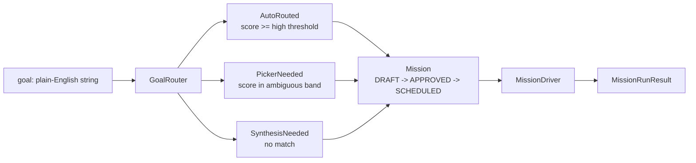
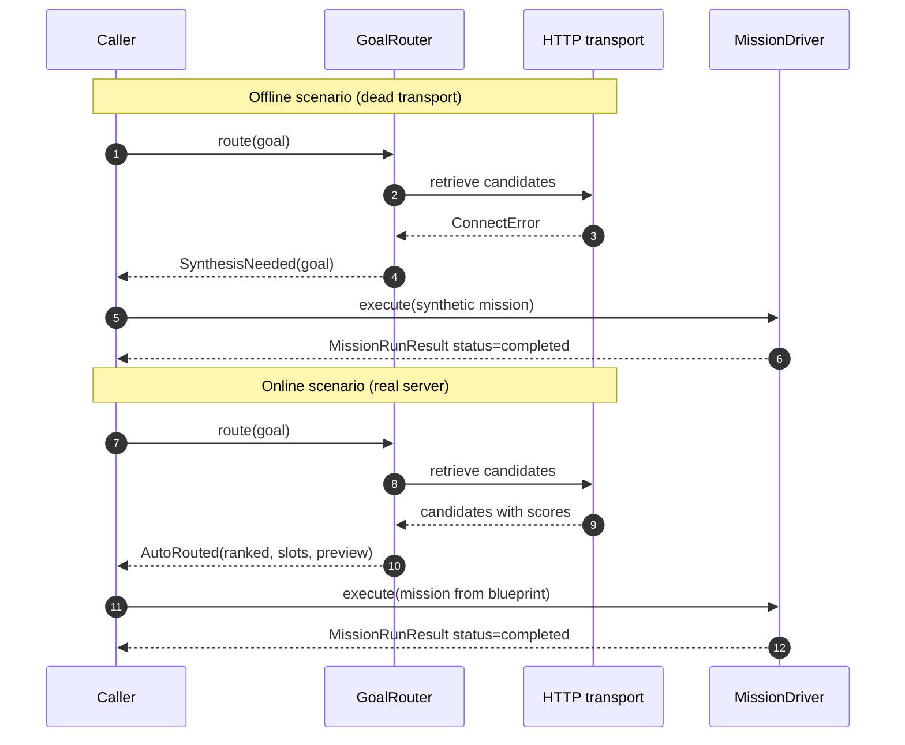

# Example 28 — Autopilot quickstart

Three routing surfaces in 60 seconds: AutoRouted (corpus match),
PickerNeeded (ambiguous band), SynthesisNeeded (no match). The offline
path shows the routing-result handling surface without any service. The
online path shows real corpus retrieval against the hosted service.

This is the entry point to the autopilot pattern. Read it before the
other autopilot examples (30, 35, 36).

## What this proves

The `GoalRouter` always produces exactly one of three outcomes:

1. **AutoRouted** — the top retrieved blueprint scored above the
   high-confidence threshold. The router picked it automatically, slot
   values are extracted, and a plan preview is built. The caller hands
   the blueprint to `MissionDriver` without any human decision required.
2. **PickerNeeded** — the top candidate scored in the ambiguous band.
   The router surfaced up to three ranked candidates so the operator can
   choose. Plan 7 (admin UI) wires this to a picker modal.
3. **SynthesisNeeded** — no candidate met the minimum threshold. The
   caller either asks a clarifying question or calls
   `SagewaiLLMClient.generate_blueprint(goal)` to synthesise a fresh
   blueprint on the server.

The offline path stubs the network with a dead transport so `GoalRouter`
always falls back to `SynthesisNeeded`. The online path hits a real
server and exercises all three variants.

Both paths complete in under 10 seconds on a clean machine.

## Architecture

High-level routing flow:



Two scenarios side by side:



## How to run

### Offline — no env vars needed

```bash
pip install sagewai
python packages/sdk/sagewai/examples/28_autopilot_quickstart.py
```

The offline path uses a dead `httpx.AsyncBaseTransport` that raises
`ConnectError` on every request. `GoalRouter` catches `ClientUnreachable`
and returns `SynthesisNeeded` for all goals. A synthetic mission then
runs end-to-end using `MissionDriver` and a fixture blueprint.

### Online — requires sagewai-llm running locally

```bash
SAGEWAI_LLM_BASE_URL=http://127.0.0.1:8100 \
    python packages/sdk/sagewai/examples/28_autopilot_quickstart.py
```

With a live server the example routes three demo goals and you see one
of each `RoutingResult` variant. The goals are chosen so a corpus
seeded from the Plan C fixtures returns `AutoRouted`, `PickerNeeded`,
and `SynthesisNeeded` in that order.

### Expected output (offline proof section)

```
────────────────────────────────────────────────────────────────────────
 The proof
────────────────────────────────────────────────────────────────────────

  You saw the routing-result handling surface plus a synthetic
  mission running end-to-end. To exercise live retrieval, point
  SAGEWAI_LLM_BASE_URL at a running sagewai-llm server.

  Done.
```

### Expected output (online proof section)

```
────────────────────────────────────────────────────────────────────────
 The proof
────────────────────────────────────────────────────────────────────────

  You saw three routing decisions made against a real server:
  one auto-routed match, one operator-pick fan-out, one synthesis
  fallback. Plus a synthetic mission ran end-to-end locally.

  Done.
```

## Real-world use cases

### 1. Internal helpdesk routing — deterministic for routine tickets, picker for ambiguous, synthesis for novel

Your support team handles 300 tickets/day. 80% are recognisable
categories (password reset, billing question, API integration). 15% are
ambiguous. 5% are genuinely novel.

| Concern | How AutoRouted / PickerNeeded / SynthesisNeeded handles it |
|---|---|
| Routine tickets should route instantly without human review | AutoRouted: the blueprint is pre-built, slot values are extracted, the agent starts immediately |
| Ambiguous tickets should not be silently routed to the wrong workflow | PickerNeeded: your support manager sees the top 3 candidates ranked by score and picks one |
| Novel categories should not fail silently | SynthesisNeeded: the hosted service generates a blueprint on the fly; operator approves before execution |

### 2. DevOps runbook discovery — known runbooks auto-route, near-matches need a pick, new incidents go to synthesis

You have 40 runbooks for known incident patterns. When an alert fires,
the goal string is the alert summary. Known patterns hit AutoRouted.
Ambiguous alerts (e.g. a new error code that resembles two existing
runbooks) surface PickerNeeded. Completely novel alerts trigger
SynthesisNeeded.

| Concern | How the routing tier handles it |
|---|---|
| Known alerts must route to the right runbook without human input at 3am | AutoRouted: score above high threshold, no human approval required |
| Ambiguous alerts should not pick a random runbook | PickerNeeded: on-call engineer sees the top 3 runbook candidates and picks |
| Novel incidents should not fail with "no runbook found" | SynthesisNeeded: hosted service generates a triage blueprint; engineer reviews before running |

### 3. Sales playbook routing — standard objections auto-route, complex deals need a pick, custom industries go to synthesis

Your sales team has 25 objection-handling playbooks. Standard objections
(pricing, security, timeline) hit AutoRouted. Edge cases (two-team
evaluation, partner re-sell, unusual procurement) hit PickerNeeded.
Custom industry verticals without an existing playbook hit
SynthesisNeeded.

| Concern | How the routing tier handles it |
|---|---|
| Sales reps should get the right playbook instantly for routine objections | AutoRouted: blueprint ready, slots extracted, agent starts |
| Complex deals must not silently get the wrong playbook | PickerNeeded: sales manager reviews the top 3 options |
| New verticals should not be blocked on "no playbook exists" | SynthesisNeeded: a fresh playbook is generated; sales manager approves |

### 4. Legal matter triage — NDA review auto-routes, contract negotiation needs a pick, novel dispute goes to synthesis

Your legal team triages incoming matters. NDA reviews, standard service
agreements, and employment contracts hit AutoRouted. Complex contract
negotiations and multi-party deals hit PickerNeeded. Novel disputes in
jurisdictions your playbooks do not cover hit SynthesisNeeded.

| Concern | How the routing tier handles it |
|---|---|
| Standard legal matters should be triaged instantly without partner review | AutoRouted: the right workflow starts automatically |
| Complex matters must not be routed to the wrong workflow | PickerNeeded: senior associate reviews the top candidates |
| Novel disputes should not silently fail | SynthesisNeeded: hosted service generates a triage blueprint; partner reviews before execution |

## What you can change

**Alternate transport.** Replace `_DeadTransport` with any custom
`httpx.AsyncBaseTransport` to simulate partial connectivity, slow
responses, or transient failures in tests.

**Custom RoutingResult handlers.** The `_print_routing_result` function
is the integration point. Replace it with your own handler — for example
a webhook POST for `PickerNeeded`, or an immediate Mission creation for
`AutoRouted`.

**Threshold overrides.** Pass a `ConfidenceConfig` with custom
`high_threshold` (default 0.85) and `low_threshold` (default 0.60) to
tune how aggressively the router auto-routes vs. surfaces a picker:

```python
from sagewai.autopilot import ConfidenceConfig, GoalRouter

router = GoalRouter(
    client=client,
    config=ConfidenceConfig(high_threshold=0.90, low_threshold=0.70),
)
```

**Tier filter.** Once B-delta adds `tier_filter` to the retrieve
endpoint, pass `tier_filter="gold"` to `GoalRouter` to restrict
retrieval to gold-tier blueprints only. Useful when AutoRouted decisions
must only come from your highest-quality corpus entries.

**Goal list.** Replace `_DEMO_GOALS` with goals from your own domain.
Add an `expected` label matching what you expect (`auto_routed`,
`picker_needed`, `synthesis_needed`) and use it to build a smoke test
for your routing configuration.

## What's exercised

- `GoalRouter.route()` — three-outcome discriminated routing
- `AutoRouted`, `PickerNeeded`, `SynthesisNeeded` — all `RoutingResult` variants
- `RoutingResult` — discriminated union pattern
- `RankedBlueprint.quality_tier` — tier field surfaced on routed results
- `ConfidenceConfig` — threshold configuration
- `Mission` lifecycle — DRAFT → APPROVED → SCHEDULED state machine
- `MissionDriver` — runs a blueprint as a mission, returns `MissionRunResult`
- `ClientUnreachable` — graceful fallback when the hosted service is unreachable
- `BlueprintCache` — TTL-bounded local cache for blueprint responses
- `InstanceIdentity` — per-client HMAC identity generation

## What to read next

- **Example 30** (`30_oncall_agent.py`) — the v1.0 lighthouse: a real on-call
  triage mission using four tools, built on the routing pattern this example
  introduces.
- **Example 35** (`35_autopilot_hosted_service.py`) — the hosted blueprint
  service round-trip end-to-end: goal → hosted service → blueprint → mission
  run. The natural next step after this example.
- **Example 29** (`29_memory_strategies.py`) — AgentCore-style memory
  extraction strategies. Useful when missions need to accumulate context
  across runs.
