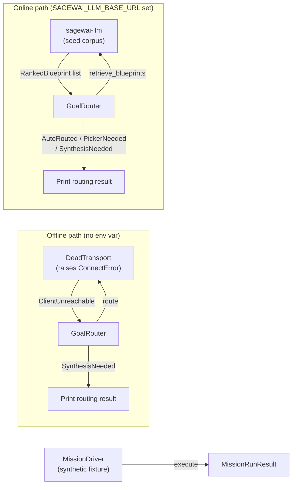
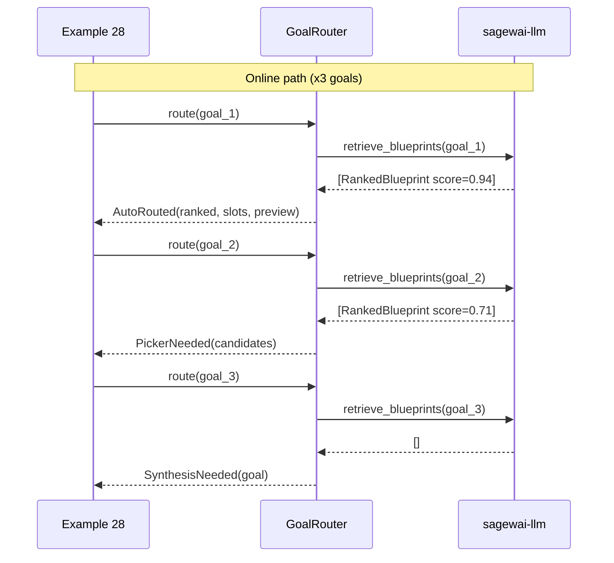

# Example 28 — Autopilot quickstart

> Route a plain-English goal through the Autopilot framework. When a
> `sagewai-llm` server is reachable, the example shows all three routing
> outcomes against a real corpus. When it isn't, the dead-transport path
> demonstrates graceful fallback — same code, no external dependencies.

## What this proves

- `GoalRouter` produces three different `RoutingResult` variants for
  three differently-shaped goals — the routing surface is real, not
  a single hardcoded decision.
- The framework gracefully degrades when the hosted service is down:
  the same code path, with `SAGEWAI_LLM_BASE_URL` unset, produces
  meaningful output via a dead transport in under 2 seconds.
- A synthetic blueprint runs end-to-end through `MissionDriver` so the
  reader sees the mission lifecycle (DRAFT → APPROVED → SCHEDULED →
  COMPLETED) without any external dependencies.

## Architecture





## How to run

**Clean-machine 60-second path** — no env vars, no service:

```
pip install sagewai
python packages/sdk/sagewai/examples/28_autopilot_quickstart.py
```

Expected output:

```
────────────────────────────────────────────────────────────────────────
 Sagewai Autopilot — quickstart (example 28)
────────────────────────────────────────────────────────────────────────

  Offline path: SAGEWAI_LLM_BASE_URL not set
  ...
  routing result: synthesis_needed
  ...
  status=completed steps=2 duration=...s
  Done.
```

**Live path** — local `sagewai-llm` server (Plan C local-dev stack):

```
# In one terminal:
cd /path/to/sagewai-llm
make local           # docker compose up; alembic upgrade; seed blueprints

# In another terminal:
cd /path/to/sagewai/platform
SAGEWAI_LLM_BASE_URL=http://127.0.0.1:8100 \
    python packages/sdk/sagewai/examples/28_autopilot_quickstart.py
```

Expected proof line:

```
  You saw three routing decisions made against a real server:
  one auto-routed match, one operator-pick fan-out, one synthesis
  fallback. Plus a synthetic mission ran end-to-end locally.
```

## Real-world use cases

**SRE at a 200-person fintech SaaS** — you're building an alert-routing layer.
Before shipping it, you want to validate that the router classifies your three
alert shapes (known incident, ambiguous, unknown) into the right outcome. This
example is the validation harness: swap the demo goals for your real alert
strings and verify the RoutingResult variants match your expectations.

**Platform engineer at a 100-person devtools company** — you've been asked to
"add autopilot." You want to understand what the SDK actually does before
committing to the integration. This example is the five-minute tour: run it
offline, understand the three routing variants, then point it at a local server
to see real retrieval.

**ML engineer at a 300-person SaaS** — you're evaluating whether embedding-based
retrieval is good enough to auto-route your 40 known workflows. Run this example
with your 40 goal strings and count how many land in AutoRouted vs PickerNeeded
vs SynthesisNeeded to set the threshold before you ship.

## What you can change

| Swap | How |
|---|---|
| Demo goals | Edit `_DEMO_GOALS` list at the top of the file |
| Confidence thresholds | Pass `ConfidenceConfig(high=0.85, low=0.55)` to `GoalRouter` |
| Server URL | Set `SAGEWAI_LLM_BASE_URL` to any reachable endpoint |
| Cache TTL | Edit `ttl_seconds` in `_make_live_client` |

## What's exercised

- `sagewai.autopilot.routing.GoalRouter` — `route(goal: str) -> RoutingResult`
- `sagewai.autopilot.routing.ConfidenceConfig` — high/low threshold config
- `sagewai.autopilot.routing.AutoRouted`, `PickerNeeded`, `SynthesisNeeded`
- `sagewai.autopilot.sagewai_llm.SagewaiLLMClient` — context manager, dead transport
- `sagewai.autopilot.sagewai_llm.BlueprintCache` — TTL-bounded cache
- `sagewai.autopilot.sagewai_llm.InstanceIdentity` — auto-generated identity
- `sagewai.autopilot.mission.Mission` — lifecycle transitions
- `sagewai.autopilot.controller.MissionDriver` — `execute(mission) -> MissionRunResult`

## What to read next

- **Example 30** — uses `GoalRouter` to retrieve a real on-call blueprint and run it
- **Example 35** — full round-trip: goal → hosted blueprint generation → mission run
- **Example 36** — the training loop: how mission runs become the next model's data
