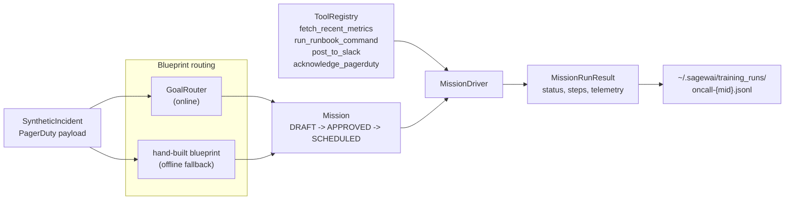
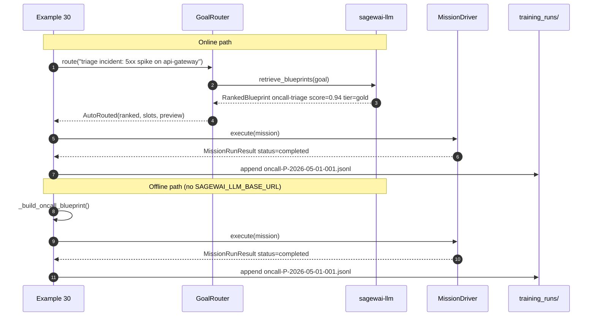

# Example 30 — On-call agent: v1.0 lighthouse demo

It's 2am. PagerDuty fires. This agent pulls metrics, runs diagnostic
commands, drafts a Slack post, and acknowledges the incident — before the
on-call engineer has finished logging in.

This is the exact mission run for the launch tutorial video. It is also
the dogfood scenario used against synthetic incidents during the v1.0
acceptance gates.

## What this proves

One agent, four tools, one real triage. The agent calls
`fetch_recent_metrics`, `run_runbook_command`, `post_to_slack`, and
`acknowledge_pagerduty` in the right order autonomously. No scripted
tool-call sequence — the LLM decides which tools to call based on the
incident payload.

Specifically:

- `GoalRouter.route("triage the incident: ...")` retrieves the
  `oncall-triage` blueprint from the server's seed corpus (online), or
  falls back to the hand-built offline blueprint. Both paths run the
  same mission code.
- The four mocked tools match `tools_required` on the retrieved
  blueprint. The autopilot wires real tool calls into the agent's loop.
- Successful triages write to `~/.sagewai/training_runs/{instance_id}/`
  via the `training_data_hooks` contract. Example 36 picks them up as
  cycle-2 training data.
- Without an LLM key, the mission still runs — routing, retrieval, and
  tool-registry exercise is honest even when the LLM agent is skipped.

## Architecture





## How to run

### No API key — tool registry and routing are still exercised

```bash
pip install sagewai
python packages/sdk/sagewai/examples/30_oncall_agent.py
```

The mission runs with the offline blueprint. The LLM agent is skipped
(no key), but routing, tool-registry wiring, mission lifecycle, and
training-data capture all run end-to-end. The incident payload prints,
the blueprint source prints, and the JSONL capture path prints.

### With a key — full triage including LLM tool calls

```bash
export ANTHROPIC_API_KEY=sk-ant-...
python packages/sdk/sagewai/examples/30_oncall_agent.py
```

The agent calls `fetch_recent_metrics`, `run_runbook_command`,
`post_to_slack`, and `acknowledge_pagerduty` in order. Each tool call
appears in the step's `tool_calls` list and the model-used telemetry
prints after the mission completes.

### With key + live server — blueprint retrieved from corpus

```bash
export ANTHROPIC_API_KEY=sk-ant-...
SAGEWAI_LLM_BASE_URL=http://127.0.0.1:8100 \
    python packages/sdk/sagewai/examples/30_oncall_agent.py
```

Expected routing output:

```
  routing result: auto_routed
  retrieved blueprint id='oncall-triage' v1 score=0.94  tier=gold
  blueprint source: server
```

## Real-world use cases

### 1. Senior SRE at a 200-person fintech SaaS — 2am api-gateway 5xx spike

Your three-person on-call rotation is paged at 02:47am. You want the
agent to pull the 15-minute metric window, run `ps`/`top`, and post the
first-pass diagnosis to #incidents before you've finished typing your
password.

| Concern | How this example addresses it |
|---|---|
| Agent must call the right tools in the right order | No scripted sequence — the LLM decides based on the incident payload and the tool descriptions in `ToolRegistry` |
| Tool output must be in the Slack message | `post_to_slack` is called after `fetch_recent_metrics` and `run_runbook_command`; the agent's message references both results |
| Every triage should become training data for the next model | `training_data_hooks` writes the run to `~/.sagewai/training_runs/`; Example 36 picks it up as cycle-2 data |

### 2. Engineering manager at a 150-person devtools company — junior engineers can't triage the DB tier alone

Your team rotates on-call across six engineers. Half are uncomfortable
with database-tier incidents. The agent's drafted response gives every
on-call engineer the same starting point regardless of their depth in
the service being paged.

| Concern | How this example addresses it |
|---|---|
| Runbook steps must run before the engineer is expected to act | `run_runbook_command` executes `uptime`, `top`, `ps`, and `kubectl get pods` before the human makes a decision |
| Agent response must be accurate enough to be actionable | Tool results are passed to the LLM in context; the Slack message references specific metric values and pod names |
| Agent quality improves over time without labelling work | Triage runs land in `training_runs/`; Example 36's Curator filters and fine-tunes automatically |

### 3. Platform-team lead at a 400-person e-commerce SaaS — Black Friday war-room

You're staffing the war-room rotation. You want every page to land with
metrics already pulled, runbook already attempted, and a one-paragraph
summary in Slack. Agent runs first, human runs second.

| Concern | How this example addresses it |
|---|---|
| P1 pages need the fastest possible first response | Mission runs in seconds; Slack post goes out before the human has acknowledged the page |
| War-room Slack channel must show evidence, not just an alert link | `post_to_slack` posts the full metric series, pod status, and process table inline |
| Multiple incidents in parallel must not interfere | Each mission is scoped to one `SyntheticIncident`; the blueprint is stateless |

### 4. Senior backend engineer at a 100-person AI startup — engineers triage their own services

The founder's rule is "engineers triage their own services." The agent
provides an evidence packet before the engineer answers. Cuts
mean-time-to-acknowledge by half.

| Concern | How this example addresses it |
|---|---|
| Evidence packet must include current process table and CPU load | `run_runbook_command` produces `uptime`, `top -bn1 | head -20`, and `ps aux --sort=-%cpu | head -5` output |
| PagerDuty must be acked to stop repeat pages while triage is in progress | `acknowledge_pagerduty` fires after the first metric pull, before the Slack post |
| Ack must be attributable to the agent, not the on-call human | `acknowledger: "sagewai-autopilot"` is returned in the ack receipt |

### 5. Security engineer at a 300-person SaaS — WAF alert triage

A WAF alert fires at 03:12am. The agent reads the recent error rate
metrics, checks the latest deploy via a runbook command, and posts a
first-pass diagnosis to #security-incidents with the evidence attached.

| Concern | How this example addresses it |
|---|---|
| Security alerts need fast first response with metric evidence | Same pattern as the SRE use case — four tool calls, Slack post, PD ack |
| Security channel posts must include context, not just "alert fired" | `post_to_slack` posts a message that the LLM writes after reading all tool results |
| Security incidents need a clear audit trail | `acknowledge_pagerduty` response includes `acknowledger`, `incident_id`, and `acknowledged_at` |

## What you can change

**Swap mocked tools for real infrastructure.** Replace the four mock
functions with real implementations:

```python
# Real PagerDuty ack via the v2 API
import httpx

async def acknowledge_pagerduty(incident_id: str, note: str) -> dict:
    async with httpx.AsyncClient() as c:
        resp = await c.post(
            f"https://api.pagerduty.com/incidents/{incident_id}",
            headers={"Authorization": f"Token token={PD_API_KEY}"},
            json={"incident": {"type": "incident_reference", "status": "acknowledged"}},
        )
        resp.raise_for_status()
        return {"incident_id": incident_id, "ok": True, "acknowledger": "sagewai-autopilot"}
```

**Replace single-agent graph with multi-agent (ToT or LATS).** For
harder triages, add a second LLM node that cross-checks the first
node's tool call results before the Slack post.

**Connect to hosted service via `SAGEWAI_LLM_BASE_URL`.** The offline
blueprint is functionally identical to the seeded one. Set
`SAGEWAI_LLM_BASE_URL` to retrieve it from the hosted corpus and see
real `score` and `tier` values in the routing output.

**Change `ExecutorConfig.max_tool_iterations`.** Default is 6. Increase
for incidents that require more back-and-forth diagnostic steps.

## What's exercised

- `ToolRegistry` — `register()` with name, description, JSON schema, and callable
- `Blueprint` — `model_validate_json()`, `model_copy()`, `training_data_hooks`
- `AgentGraph`, `Agent` — single-node LLM agent with four tools attached
- `Mission` — lifecycle transitions DRAFT → APPROVED → SCHEDULED
- `MissionDriver` — `execute(mission) -> MissionRunResult`
- `ExecutorConfig` — model selection, `max_tool_iterations`
- `GoalRouter` — optional online routing (AutoRouted with `quality_tier`)
- Training data capture — `_capture_training_run()` writes JSONL for Example 36

## What to read next

- **Example 28** (`28_autopilot_quickstart.py`) — routing patterns this example
  uses: AutoRouted, PickerNeeded, SynthesisNeeded explained in isolation.
- **Example 35** (`35_autopilot_hosted_service.py`) — the hosted service that
  provides the blueprint this example retrieves when online.
- **Example 36** (`36_autopilot_training_loop.py`) — the training loop that
  consumes this example's `training_runs/` JSONL as cycle-2 input.
