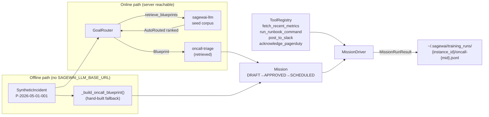
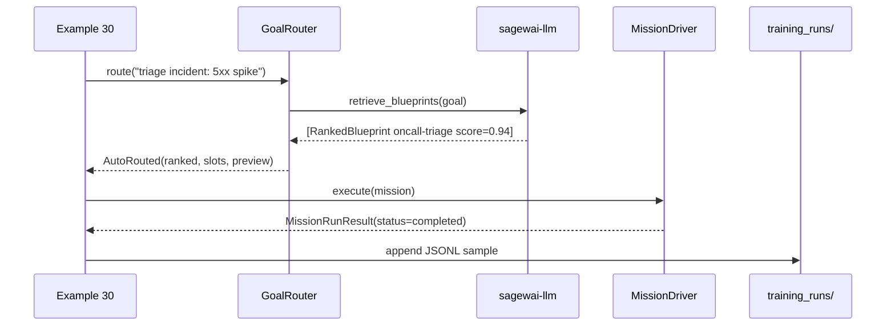

# Example 30 — On-call agent: the v1.0 lighthouse demo

> A synthetic PagerDuty alert fires. The Autopilot retrieves the
> `oncall-triage` blueprint from the seed corpus, wires in four mocked
> tools, runs the mission, and writes the triage to a local JSONL file
> that Example 36 uses as cycle-2 training data. The full lighthouse
> story in one runnable file.

## What this proves

- `GoalRouter.route("triage the incident: ...")` retrieves the
  `oncall-triage` blueprint from the server's seed corpus — the
  lighthouse demo is no longer hand-built.
- The four mocked tools (`fetch_recent_metrics`, `run_runbook_command`,
  `post_to_slack`, `acknowledge_pagerduty`) match `tools_required`
  on the retrieved blueprint, so the autopilot wires real tool calls
  into the agent's loop.
- Successful triages write to `~/.sagewai/training_runs/{instance_id}/`
  via the `training_data_hooks` contract — Example 36 picks them up
  as cycle-2 training data.
- Without an LLM key, the mission still runs (the LLM agent is
  skipped, but routing/retrieval/tool-registry exercise is honest).

## Architecture





## How to run

**Clean-machine 60-second path** — no env vars, no service:

```
pip install sagewai
python packages/sdk/sagewai/examples/30_oncall_agent.py
```

Output uses the offline-fallback blueprint (same content as the
seeded one, hand-built locally). Mission runs; if no LLM key, the
agent is skipped and the mission completes with empty steps.

**Live lighthouse path** — local server + LLM key:

```
# Terminal 1: local server
cd /path/to/sagewai-llm && make local

# Terminal 2: example
export ANTHROPIC_API_KEY=sk-ant-...
SAGEWAI_LLM_BASE_URL=http://127.0.0.1:8100 \
    python packages/sdk/sagewai/examples/30_oncall_agent.py
```

Expected output marker:

```
  routing result: auto_routed
  retrieved blueprint id='oncall-triage' v1 score=0.94
  ...
  ✓ Mission status: completed (3.2s)
  training run captured: ~/.sagewai/training_runs/{instance}/oncall-{mid}.jsonl
```

## Real-world use cases

**Senior SRE at a 200-person fintech SaaS** — your three-person on-call
rotation is paged at 02:47am for a 5xx spike. You want the agent to pull
the 15-minute metric window, run `ps`/`top` in a sandbox, and post the
first-pass diagnosis to #incidents before the human eyes finish typing
their password. This example is that agent running locally with mocked
infrastructure — swap the mocks for real PagerDuty, Prometheus, and Slack
webhooks in production.

**Engineering manager at a 150-person devtools company** — your team rotates
on-call across six engineers, half of whom are uncomfortable triaging the
database tier. Every agent-written triage run that an SRE rates ≥4 lands
in `training_runs/` automatically. After 500 such runs, Example 36 triggers
a fine-tune that makes the next model cheaper and more specialised.

**Platform-team lead at a 400-person e-commerce SaaS** — Black Friday is six
weeks away. You're staffing the war-room rotation and want every page to land
with metrics already pulled, runbook already attempted, and a one-paragraph
summary in Slack. This is the pattern you'd deploy to production.

## What you can change

| Swap | How |
|---|---|
| Real PagerDuty | Replace `acknowledge_pagerduty` mock with a real webhook call |
| Real Prometheus | Replace `fetch_recent_metrics` mock with an HTTP query to VictoriaMetrics |
| Real Slack | Replace `post_to_slack` mock with `httpx.post(SLACK_WEBHOOK, ...)` |
| LLM provider | Set `OPENAI_API_KEY` (gpt-4o-mini) or `ANTHROPIC_API_KEY` (claude-haiku) |
| Training runs path | Set `HOME` env var to redirect `~/.sagewai/training_runs/` |

## What's exercised

- `sagewai.autopilot.routing.GoalRouter` — `route(goal) -> RoutingResult`
- `sagewai.autopilot.routing.AutoRouted`, `PickerNeeded`, `SynthesisNeeded`
- `sagewai.autopilot.sagewai_llm.SagewaiLLMClient` — context manager
- `sagewai.autopilot.blueprint.Blueprint` — `model_validate_json`, `model_copy`
- `sagewai.autopilot.models.TrainingHook` — `event`, `dataset`, `quality_filter`
- `sagewai.autopilot.controller.tool_registry.ToolRegistry` — `register()`
- `sagewai.autopilot.controller.MissionDriver` — `execute(mission) -> MissionRunResult`
- `sagewai.autopilot.mission.Mission` — lifecycle transitions

## What to read next

- **Example 28** — GoalRouter quickstart: all three RoutingResult variants
- **Example 35** — hosted blueprint generation → mission run end-to-end
- **Example 36** — the training loop: how this JSONL becomes the next model
