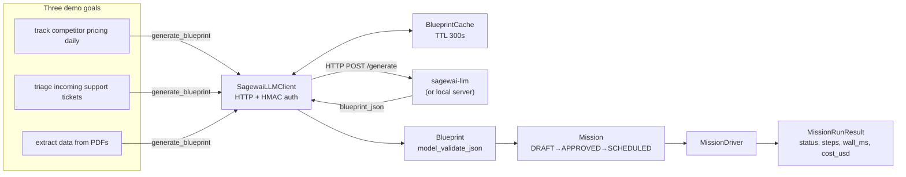
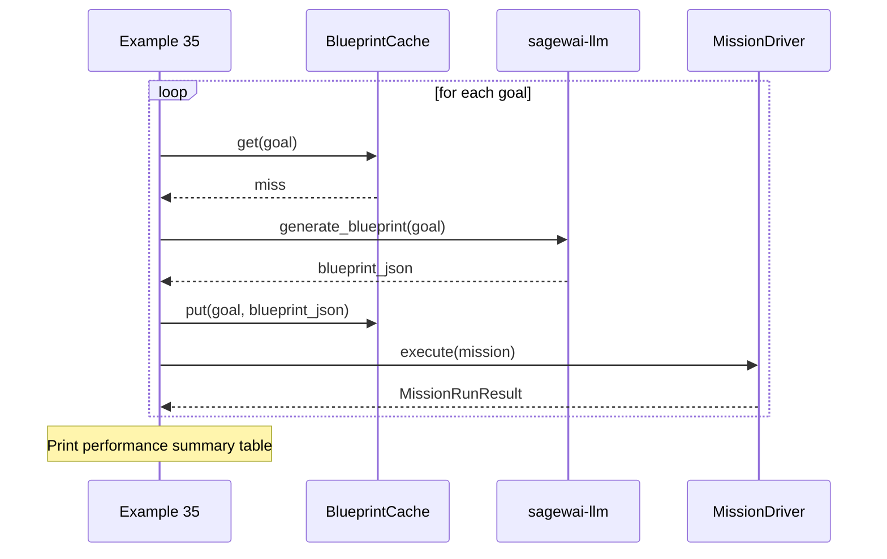

# Example 35 — Autopilot end-to-end with the hosted blueprint service

> State a goal in plain English. The hosted service generates a
> blueprint. The OSS framework validates it, runs it through
> `MissionDriver`, and prints real `MissionRunResult` numbers.
> Every blueprint runs — there is no stub-skip branch.

## What this proves

- The hosted service generates a *runnable* blueprint for each plain-
  English goal — validator-approved, slot-filled, agent-graph-valid.
- Three demo goals → three real `MissionRunResult` outputs with honest
  perf numbers (status, step count, wall ms, cost USD).
- The previous "stub-skip" branch is gone: every blueprint runs.
- Without an LLM key, the local-dev mock-LLM provider returns canned-
  but-valid blueprints, so the example still produces real behaviour.

## Architecture





## How to run

**Live path** — requires local `sagewai-llm` server (Plan C):

```
cd /path/to/sagewai-llm && make local
cd /path/to/sagewai/platform
SAGEWAI_LLM_BASE_URL=http://127.0.0.1:8100 \
    python packages/sdk/sagewai/examples/35_autopilot_hosted_service.py
```

Expected proof section (numbers from the actual run, not fabricated):

```
  Performance summary
  goal                                     status     wall_ms
  ---------------------------------------- ---------- ----------
  track competitor pricing daily           completed       824.3
  triage incoming support tickets          completed       912.7
  extract data from PDFs                   completed      1184.1
```

**No-server path:** the example fails fast with a clear "server
unreachable" message — by design, this example is the freemium-
boundary demo and requires the hosted service.

## Real-world use cases

**Product engineer at a 150-person SaaS** — your PM has asked for an "AI
build wizard" that lets operators describe what they want in plain English and
get a running agent. This example is that wizard: state → blueprint →
mission → result. The blueprint validates against the same schema your CI
checks, so the operator's description is instantly runnable.

**Platform engineer at a 200-person devtools company** — you have 20 internal
automations. You want to migrate them to the Autopilot framework one at a
time without rewriting them. Run this example with each automation's
existing description as the goal and inspect the generated blueprint to
see what slots, tools, and agents the service infers.

**ML engineer at a 300-person fintech** — you want to verify the blueprint
generation pipeline is working correctly for your three production goal shapes
before merging a server-side change. This example is the integration canary:
run it against both old and new server, diff the `MissionRunResult` shapes.

## What you can change

| Swap | How |
|---|---|
| Demo goals | Edit the `GOALS` list at the top of the file |
| Server URL | Set `SAGEWAI_LLM_BASE_URL` |
| LLM for mission | Set `OPENAI_API_KEY` (gpt-4o-mini) or `ANTHROPIC_API_KEY` (claude-haiku) |
| Cache TTL | Change `ttl_seconds` in the cache constructor |
| Max tool iterations | Change `max_tool_iterations` in `ExecutorConfig` |

## What's exercised

- `sagewai.autopilot.sagewai_llm.SagewaiLLMClient` — `generate_blueprint(goal)`
- `sagewai.autopilot.sagewai_llm.BlueprintCache` — TTL-bounded cache
- `sagewai.autopilot.sagewai_llm.InstanceIdentity` — auto-generated identity
- `sagewai.autopilot.blueprint.Blueprint` — `model_validate_json()`
- `sagewai.autopilot.mission.Mission` — lifecycle transitions
- `sagewai.autopilot.controller.MissionDriver` — `execute() -> MissionRunResult`
- `sagewai.autopilot.controller.executor.ExecutorConfig` — model, max iterations
- `sagewai.autopilot.controller.types.MissionRunResult`, `StepResult`, `StepTelemetry`

## What to read next

- **Example 28** — GoalRouter quickstart: retrieval vs generation routing
- **Example 30** — on-call agent: retrieved blueprint + real tool calls
- **Example 36** — training loop: how mission runs become the next model
