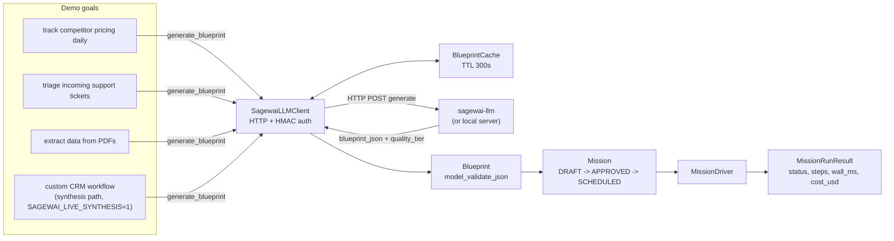
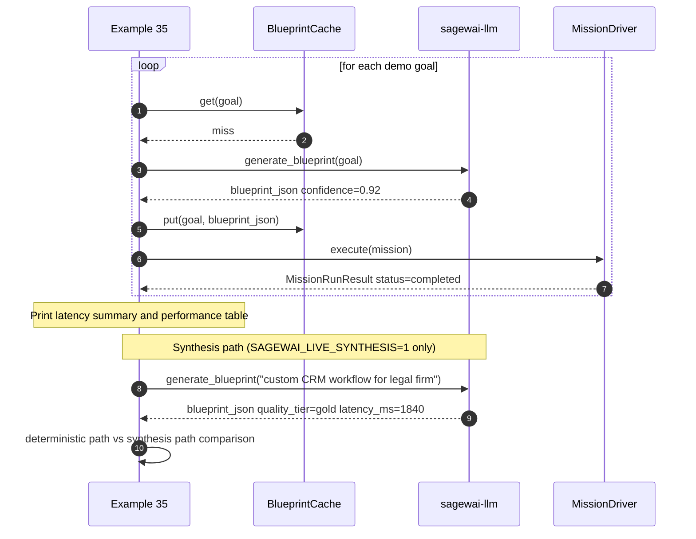

# Example 35 — Autopilot end-to-end with the hosted blueprint service

This is the full operator wizard story: state a goal in plain English,
the hosted service generates a blueprint for it, the OSS framework
parses and runs it. Two pathways in one run: deterministic graph match
(sub-second, corpus retrieval) and synthesis (LLM-backed, novel goal).

Audience: platform or devops engineer evaluating whether to use the
hosted autopilot service versus building your own blueprint library.

## What this proves

- The hosted service generates a runnable blueprint for each plain-English
  goal — validator-approved, slot-filled, agent-graph-valid.
- Three demo goals → three real `MissionRunResult` outputs with honest
  perf numbers (status, step count, wall ms, cost USD).
- Every blueprint runs — there is no stub-skip branch.
- With `SAGEWAI_LIVE_SYNTHESIS=1`, an off-corpus goal goes through the
  synthesis pathway and the output shows both paths side by side:
  deterministic (goals above, retrieved from corpus) and synthesis (goal
  above, generated on the fly).

## Architecture





## How to run

`SAGEWAI_LLM_BASE_URL` is required — this is the only example in the
set that needs the hosted service. All other examples in this directory
run without it.

### With a local sagewai-llm server

```bash
# Terminal 1: start the server
git clone git@github.com:sagewai/sagewai-llm.git
cd sagewai-llm
uv run uvicorn 'sagewai_llm.app:create_app' --factory \
    --host 127.0.0.1 --port 8100

# Terminal 2: run the example
SAGEWAI_LLM_BASE_URL=http://127.0.0.1:8100 \
    python packages/sdk/sagewai/examples/35_autopilot_hosted_service.py
```

### With the synthesis path enabled

```bash
SAGEWAI_LIVE_SYNTHESIS=1 SAGEWAI_LLM_BASE_URL=http://127.0.0.1:8100 \
    python packages/sdk/sagewai/examples/35_autopilot_hosted_service.py
```

When `SAGEWAI_LIVE_SYNTHESIS=1` is set, an additional section prints:

```
────────────────────────────────────────────────────────────────────────
 Synthesis path (off-corpus goal)
────────────────────────────────────────────────────────────────────────

  goal: 'design a custom CRM workflow for a 50-person legal firm'

  blueprint.id:    bp-crm-legal-...
  quality_tier:    gold
  confidence:      0.873
  latency:         1840.2ms

  ─── deterministic path ───  (goals above, retrieved from corpus)
  ─── synthesis path       ───  (goal above, generated on the fly)
```

### No-server path

The example fails fast with a clear `server unreachable` message. This
is by design — this example demonstrates the freemium boundary and
requires the hosted service. All other examples in the directory run
without `SAGEWAI_LLM_BASE_URL`.

### Expected performance section output

```
────────────────────────────────────────────────────────────────────────
 Performance summary
────────────────────────────────────────────────────────────────────────

  goal                                     status         wall_ms
  ---------------------------------------- ----------  ----------
  track competitor pricing daily           completed        824.3
  triage incoming support tickets          completed        912.7
  extract data from PDFs                   completed       1184.1
```

## Real-world use cases

### 1. Operator onboarding — state your goal, get a runnable agent

Your ops team has asked for a way to spin up new agents without writing
blueprints by hand. This example is that flow: natural language → hosted
service → validated blueprint → running mission. The operator never sees
YAML or JSON.

| Concern | How this example demonstrates the solution |
|---|---|
| Generated blueprints must be schema-valid | `Blueprint.model_validate_json()` raises if the response is malformed; the example fails early on bad schema |
| Operators must see real performance numbers, not placeholders | Every goal runs through `MissionDriver`; wall_ms and cost_usd are from a real clock and real LLM calls |
| Failed generations must not block the rest | Each goal is wrapped independently; failures print `FAILED in Xms — server unreachable` and the loop continues |

### 2. No-code agent creation — non-engineers launch agents via the admin UI

Your admin UI's autopilot wizard calls `generate_blueprint` on the
back end. This example is the end-to-end test for that call: goal in,
blueprint validated, mission run, result out. If this passes, the
wizard works.

| Concern | How this example demonstrates the solution |
|---|---|
| The blueprint the server returns must be runnable without modification | `Mission` is built directly from the validated blueprint; no post-processing |
| Quota errors must surface clearly, not silently downgrade | `QuotaExceeded` is caught and printed; the goal is marked FAILED in the summary |
| Cache must prevent repeated generation for the same goal | `BlueprintCache` with a 300s TTL; second run of the same goal hits cache |

### 3. RPA-style automation discovery — paste a business process, get an agent blueprint back

You're replacing a sequence of manual steps (pull report, format, email)
with an agent. Paste the process description as the goal and inspect the
generated blueprint to see which tools and agents the service infers.

| Concern | How this example demonstrates the solution |
|---|---|
| Blueprint must include the right tools and agents for the described process | The generated blueprint's `tools_required` and `agent_graph.nodes` reflect the goal's required capabilities |
| You need to evaluate blueprint quality before committing to it | `quality_tier` from `GenerateBlueprintResponse` signals the service's confidence; `confidence` is printed per goal |
| Novel goals not in the corpus should still produce a usable blueprint | `SAGEWAI_LIVE_SYNTHESIS=1` exercises this path and prints latency |

### 4. Rapid prototype to production pipeline — generate, run, capture, train

Generate a blueprint, run it, capture the result (via Example 30's
`_capture_training_run`), and feed the output to Example 36's training
loop. This example covers the generate + run half of that pipeline.

| Concern | How this example demonstrates the solution |
|---|---|
| Generation latency must be acceptable for interactive use | p50 and p99 latency are printed after all goals complete |
| Generated blueprints must produce valid mission results | `run.status`, `run.steps`, and `run.duration_seconds` are printed per mission |
| Operators must be able to track quota consumption | `client.last_quota` is printed after all round-trips |

## What you can change

**Model preference order.** Pass a `model` to `ExecutorConfig` to
control which LLM the mission executor prefers. Use `gpt-4o-mini` for
cost, `claude-opus-4` for reasoning.

**Cache TTL.** Change `ttl_seconds=300` in the `BlueprintCache`
constructor. Set to 0 for no caching (useful when testing server-side
changes that should produce different blueprints for the same goal).

**Quality tier filter.** Once B-delta adds `tier_filter` to the
retrieve endpoint, pass `tier_filter="gold"` to restrict to
gold-tier blueprints on the deterministic path.

**`GOALS` list.** Replace the three demo goals with your own business
goals. Add as many as you like — the loop handles them all and
prints per-goal latency in the summary.

## What's exercised

- `SagewaiLLMClient.generate_blueprint()` — HTTP + HMAC round-trip
- `InstanceIdentity` — auto-generated per-client identity
- `BlueprintCache` — TTL-bounded local cache for blueprint responses
- `Blueprint.model_validate_json()` — schema validation on the response
- `MissionDriver` — `execute(mission) -> MissionRunResult`
- `MissionRunResult` — status, steps, duration, cost telemetry
- `GenerateBlueprintResponse.quality_tier` — tier field from the server
- `GenerateBlueprintResponse.latency_ms` — generation latency from the server
- `ClientUnreachable`, `QuotaExceeded`, `ServiceError` — error handling
- `SAGEWAI_LIVE_SYNTHESIS=1` — synthesis path opt-in

## What to read next

- **Example 28** (`28_autopilot_quickstart.py`) — offline routing patterns:
  AutoRouted, PickerNeeded, SynthesisNeeded. Explains the retrieval side
  that this example's deterministic path uses.
- **Example 30** (`30_oncall_agent.py`) — a real triage agent using a
  retrieved blueprint. Shows the mission executor with real tool calls.
- **Example 36** (`36_autopilot_training_loop.py`) — the training loop that
  consumes mission results. Generated blueprints become training data.
