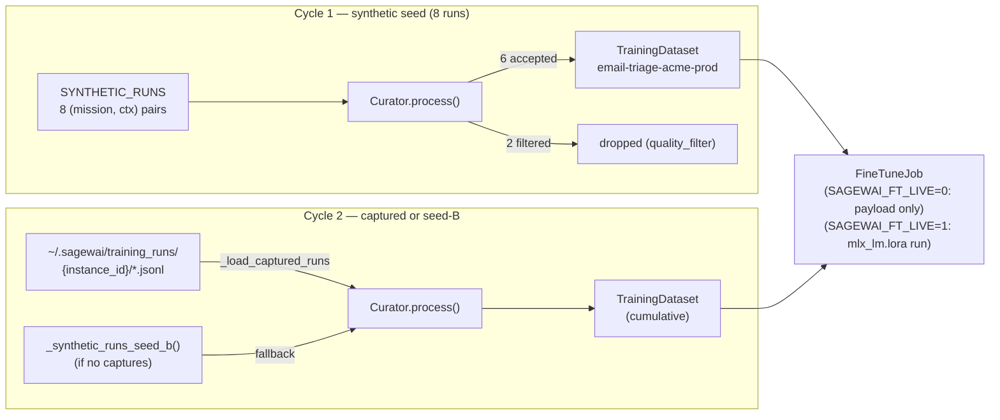
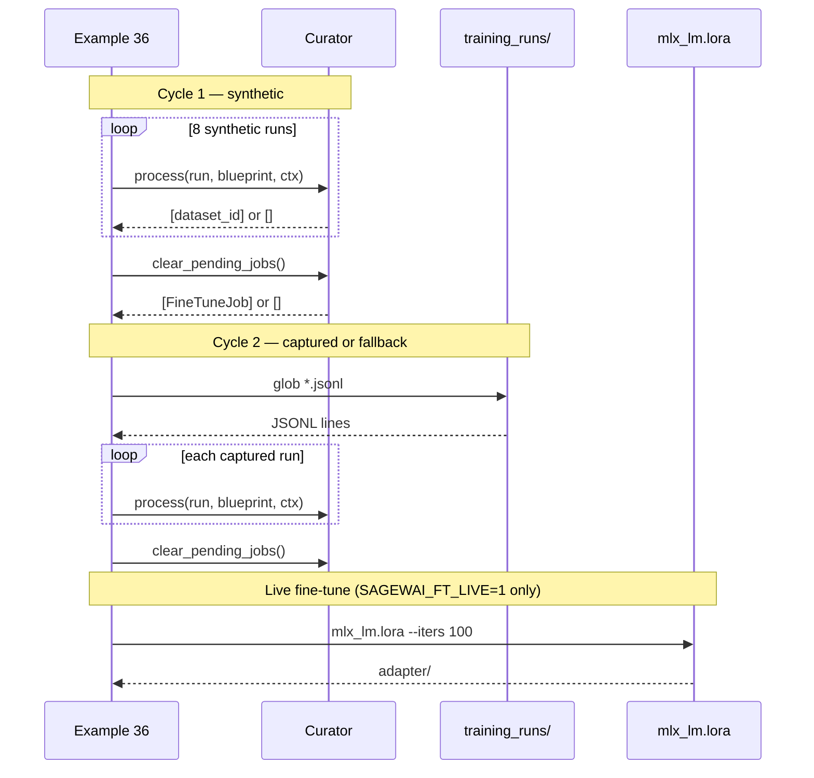

# Example 36 — The autopilot training loop closes

> Mission runs become the next model's training data. Cycle 1 is
> synthetic — the reader sees the Curator pipeline shape. Cycle 2
> ingests real captured runs from Examples 30 and 35. With
> `SAGEWAI_FT_LIVE=1` on Apple Silicon, an actual fine-tune runs.

## What this proves

- Cycle 1 is synthetic (8 runs, 6 pass, 2 filtered) — the reader sees
  the Curator pipeline shape with no external dependencies.
- Cycle 2 ingests **real** captured runs from
  `~/.sagewai/training_runs/{instance_id}/*.jsonl` written by Examples
  30 and 35. Without captured runs, falls back to a second synthetic
  seed so the example still runs cleanly on a clean machine.
- With `SAGEWAI_FT_LIVE=1` on Apple Silicon + `mlx-lm[lora]` installed,
  the example runs an actual 100-iteration `mlx_lm.lora` fine-tune on
  the cycle-2 dataset and prints the adapter path. Without the env var,
  it prints the `FineTuneJob` payload — same proof, no compute.

## Architecture





## How to run

**Clean-machine path** — synthetic both cycles:

```
pip install sagewai
python packages/sdk/sagewai/examples/36_autopilot_training_loop.py
```

**Real-data path** — run Examples 30 + 35 first:

```
# Seed real triage runs (writes to ~/.sagewai/training_runs/)
SAGEWAI_LLM_BASE_URL=http://127.0.0.1:8100 \
    python packages/sdk/sagewai/examples/30_oncall_agent.py

python packages/sdk/sagewai/examples/36_autopilot_training_loop.py
```

Output will show `captured runs loaded from ~/.sagewai/training_runs/{instance_id} (N runs)`.

**Live fine-tune** — Apple Silicon + `mlx-lm[lora]`:

```
pip install 'mlx-lm[lora]'
SAGEWAI_FT_LIVE=1 \
    python packages/sdk/sagewai/examples/36_autopilot_training_loop.py
```

Expected closing lines:

```
  adapter saved to: ~/.sagewai/adapters/{instance_id}-cycle-2/adapter
  ...
  cycle-1 + cycle-2 produced N accepted samples.
```

## Real-world use cases

**Senior platform engineer at a 200-person fintech** — you shipped the
support-ticket triage agent on Haiku in Q1. The CFO asked you to cut
cost 50% in Q3. The Curator's training-data hooks accumulate every
accepted triage decision automatically; once there are 500 accepted
samples a fine-tune job triggers and the cheaper local model lands in
the routing tier.

**ML engineer at a 100-person AI-feature SaaS** — you run agents in
production. Your CTO asked "can we get cheaper, faster, more-specialised
models from our own usage?" without manually labelling anything. This is
the closes-the-loop story: run missions, collect training data, fine-tune,
deploy — and the loop starts again next cycle.

**Engineering manager at a 350-person devtools company** — your support
team rates AI replies 1-5 daily. The training loop turns those ratings
into the quality filter (`user_rating >= 4`) that decides what's worth
fine-tuning on. The team's daily QA work is the training corpus.

## What you can change

| Swap | How |
|---|---|
| Quality threshold | Edit `quality_filter` in `_build_email_triage_blueprint()` |
| Fine-tune trigger count | Edit `trigger_after_labeled_samples` in `LearningLoopConfig` |
| Base model for fine-tune | Edit `_run_live_fine_tune()` — change `--model` arg |
| Training runs path | Set `HOME` env var to redirect `~/.sagewai/training_runs/` |
| Skip live fine-tune | Leave `SAGEWAI_FT_LIVE` unset (default) |

## What's exercised

- `sagewai.autopilot.curator.Curator` — `process(run, blueprint, ctx)`, `clear_pending_jobs()`
- `sagewai.autopilot.curator.CuratorConfig` — curator configuration
- `sagewai.autopilot.models.TrainingHook` — `event`, `dataset`, `quality_filter`
- `sagewai.autopilot.models.LearningLoopConfig` — `trigger_after_labeled_samples`, `base_model`
- `sagewai.autopilot.controller.types.MissionRunResult`, `StepResult`
- `mlx_lm.lora` (optional, gated by `SAGEWAI_FT_LIVE=1`) — 100-iter LoRA fine-tune

## What to read next

- **Example 30** — on-call agent: produces the JSONL that cycle-2 ingests
- **Example 35** — hosted service: generates blueprints this loop trains on
- **Example 38** — Unsloth fine-tune: what to do with the trained adapter
