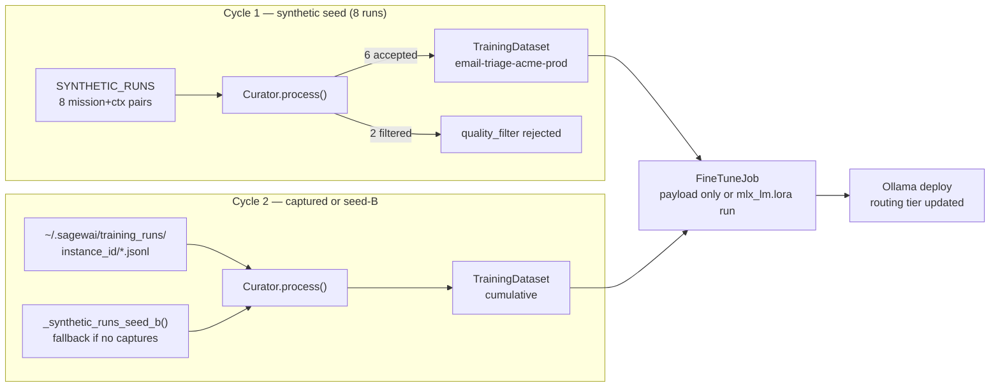
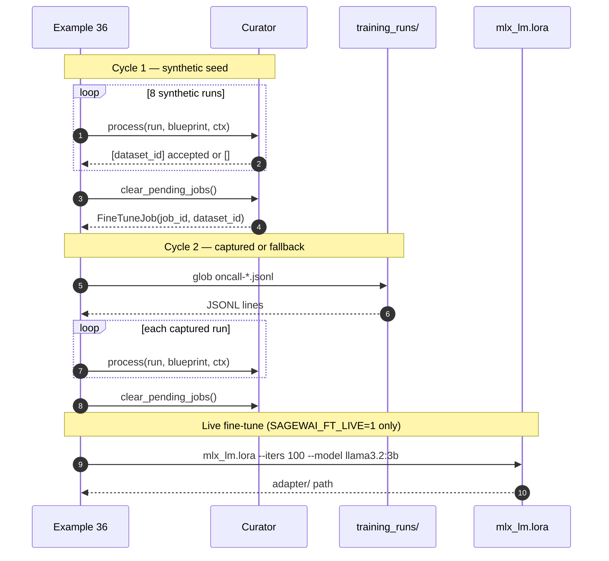

# Example 36 — The autopilot training loop closes

Every mission run becomes training data for the next model. Cycle 1 is
synthetic — the reader sees the Curator pipeline shape. Cycle 2 ingests
real captured runs from Example 30. With `SAGEWAI_FT_LIVE=1` on Apple
Silicon, an actual fine-tune runs.

Audience: ML engineer or senior platform engineer who wants to reduce
per-call LLM costs and build domain-specific model specialization from
production usage.

## What this proves

The complete closes-the-loop story for the Five Pillars:

- **Cycle 1** — 8 synthetic runs, 6 pass the quality filter, 2 are
  filtered. After 5 accepted samples the `Curator` emits a `FineTuneJob`.
  This shows the Curator pipeline shape without any external dependencies.
- **Cycle 2** — ingests real captured runs from
  `~/.sagewai/training_runs/{instance_id}/*.jsonl` written by Example 30.
  Without captured runs, falls back to a second synthetic seed so the
  example still runs cleanly on a clean machine.
- **Live fine-tune** — with `SAGEWAI_FT_LIVE=1` on Apple Silicon and
  `mlx-lm[lora]` installed, the example runs an actual 100-iteration
  `mlx_lm.lora` fine-tune on the cycle-2 dataset and prints the adapter
  path. Without the env var, it prints the `FineTuneJob` payload — same
  proof, no compute.

The Curator's quality filter and training hooks are the same code as
production. The only difference from a live deployment is the absence of
real PagerDuty/Slack I/O.

## Architecture





## How to run

### Dry run — synthetic both cycles

```bash
pip install sagewai
python packages/sdk/sagewai/examples/36_autopilot_training_loop.py
```

Cycle 1 uses `SYNTHETIC_RUNS`. Cycle 2 uses `_synthetic_runs_seed_b()`
fallback. The `FineTuneJob` payload prints at the end. No LLM key
needed, no sagewai-llm server needed.

### With real captured data — run Example 30 first

```bash
# Step 1: run the on-call triage agent — this writes JSONL captures
export ANTHROPIC_API_KEY=sk-ant-...
python packages/sdk/sagewai/examples/30_oncall_agent.py

# Step 2: run the training loop — cycle 2 picks up the captures
python packages/sdk/sagewai/examples/36_autopilot_training_loop.py
```

The cycle-2 section will print:

```
  captured runs loaded from ~/.sagewai/training_runs/{instance_id} (1 runs)
```

### Live fine-tune on Apple Silicon

```bash
pip install 'mlx-lm[lora]'
SAGEWAI_FT_LIVE=1 python packages/sdk/sagewai/examples/36_autopilot_training_loop.py
```

Requires Apple Silicon (M1/M2/M3/M4). Runs 100 iterations of LoRA
on `mlx-community/Llama-3.2-3B-Instruct-4bit`. Takes 2-5 minutes.
Prints the adapter path when done.

Expected closing output:

```
────────────────────────────────────────────────────────────────────────
 The loop closes
────────────────────────────────────────────────────────────────────────

  cycle-1 + cycle-2 produced N accepted samples.
  cycle-1 jobs: 1; cycle-2 jobs: 0.
  Run example 30 first to seed real triage runs into ~/.sagewai/training_runs/.
```

## Real-world use cases

### 1. Platform engineer at a 200-person fintech — 50% cost reduction target

You shipped the support-ticket triage agent on Haiku in Q1. The CFO
asked you to cut cost 50% in Q3 without reducing quality. The Curator's
`training_data_hooks` accumulate every accepted triage decision
automatically. Once 500 samples accumulate, a `FineTuneJob` triggers,
a cheaper local model lands in the routing tier, and the cost drops.

| Concern | How the training loop addresses it |
|---|---|
| Quality of accepted samples must be high before fine-tuning | `quality_filter: "user_rating >= 4 AND human_override == False"` prevents low-quality runs from entering the dataset |
| Fine-tune must not regress model accuracy | `LearningLoopConfig.eval_gate_dataset_id` runs the eval gate before promotion; only models that pass are deployed |
| Training must happen automatically, not require manual labelling | `Curator.process(run, blueprint, ctx)` runs on every mission completion; context carries `user_rating` from the admin UI |

### 2. ML engineer at a 100-person AI-feature SaaS — "can we build specialised models from our own usage?"

Your CTO asked whether you can train domain-specific models from
production usage without manual labelling. This example is that
story: run missions, Curator filters the good ones, dataset grows,
`FineTuneJob` triggers, fine-tuned model replaces the cloud model
for the routine 80% of calls.

| Concern | How the training loop addresses it |
|---|---|
| Dataset must only include high-quality, non-overridden runs | `quality_filter` string handles both rating threshold and human-override flag in one expression |
| Fine-tune trigger must fire at the right sample count, not too early | `trigger_after_labeled_samples=5` (demo); set to 500 for production |
| Training data must be in the right format for fine-tuning | `format="alpaca"` in `TrainingHook`; Curator emits `instruction/input/output` triples |

### 3. Senior backend engineer at a 250-person legaltech SaaS — human overrides improve the next model

Every human override on the contract-clause classifier should improve
the next model version. The training loop turns operator behaviour into
the next training set — every time a lawyer corrects the agent, that
correction is `human_override=True` and is filtered out; every time they
accept it, `user_rating >= 4` keeps it in.

| Concern | How the training loop addresses it |
|---|---|
| Human-corrected runs should not contaminate the training set | `human_override == False` in the quality filter excludes all corrected runs |
| High-quality accepted runs should automatically become training data | `Curator.process()` appends accepted runs to the dataset; no manual curation step |
| Legal domain requires a fine-tuned model, not a generic one | `base_model="ollama/llama3:8b"` with Alpaca-format legal domain data builds a domain-specific SLM |

### 4. Engineering manager at a 350-person devtools company — support team ratings are the training corpus

Your support team rates AI replies 1-5 daily. Those ratings flow into
the quality filter (`user_rating >= 4`) automatically. The team's daily
QA work is the training corpus. No labelling tool, no annotation
budget, no data pipeline outside the normal rating UI.

| Concern | How the training loop addresses it |
|---|---|
| Rating data must flow into training without extra tooling | `ctx["user_rating"]` is passed directly to `Curator.process()`; the admin UI's rating widget populates it |
| Training should only start when there's enough data | `trigger_after_labeled_samples` controls the batch size before a fine-tune fires |
| Deployed model must stay on top of the current support domain | Each cycle adds the latest ratings; the fine-tune re-runs on the full accumulated dataset |

## What you can change

**`quality_filter` string.** Edit the filter in
`_build_email_triage_blueprint()`. The Curator evaluates it as a simple
expression against the `ctx` dict. Use any key your application
populates in the mission context.

**`trigger_after_labeled_samples` count.** The demo uses 5 for speed.
Production should be 500-2000 depending on your domain complexity and
fine-tuning cadence.

**Fine-tune backend.** The live path uses `mlx_lm.lora` (Apple Silicon).
For CUDA (Linux), swap to `unsloth` in `LearningLoopConfig.fine_tune_method`.
For Ollama deployment after training, set `deploy_as="ollama"`.

**`base_model`.** Change `ollama/llama3:8b` to any Ollama-compatible
model name. Smaller models (3B) fine-tune faster; larger models (13B)
generalise better on smaller datasets.

**Dataset format.** Change `format="alpaca"` to `"sharegpt"` (conversation
format) or `"raw"` (passthrough) in the `TrainingHook`. Alpaca is the
default and works with all major fine-tuning frameworks.

## What's exercised

- `Blueprint.training_data_hooks` — `TrainingHook` event + quality filter
- `LearningLoopConfig` — `trigger_after_labeled_samples`, `base_model`, `fine_tune_method`, `deploy_as`
- `Curator` — `process(run, blueprint, ctx)`, `clear_pending_jobs()`
- `CuratorConfig` — curator configuration
- `TrainingHook` — event binding, dataset name, format, quality filter
- `FineTuneJob` — job payload (base_model, method, dataset_id)
- `MissionRunResult` — used as Curator input
- `StepResult` — output and output_preview fields

## What to read next

- **Example 30** (`30_oncall_agent.py`) — produces the `training_runs/` JSONL
  that this example's cycle-2 consumes. Run it first for real captured data.
- **Example 28** (`28_autopilot_quickstart.py`) — the routing tier that
  eventually routes to your fine-tuned model once it's deployed via Ollama.
- **Example 38** (`38_local_slm_training.py`) — full Unsloth fine-tune on a
  real dataset and Ollama deploy. The natural next step after this example.
