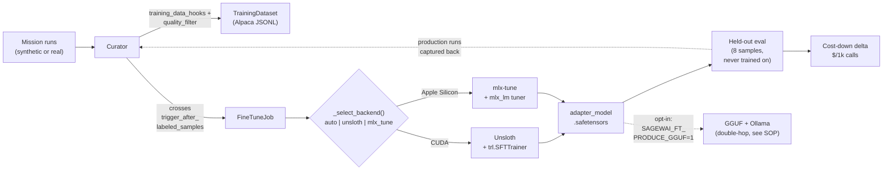
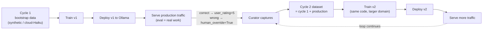
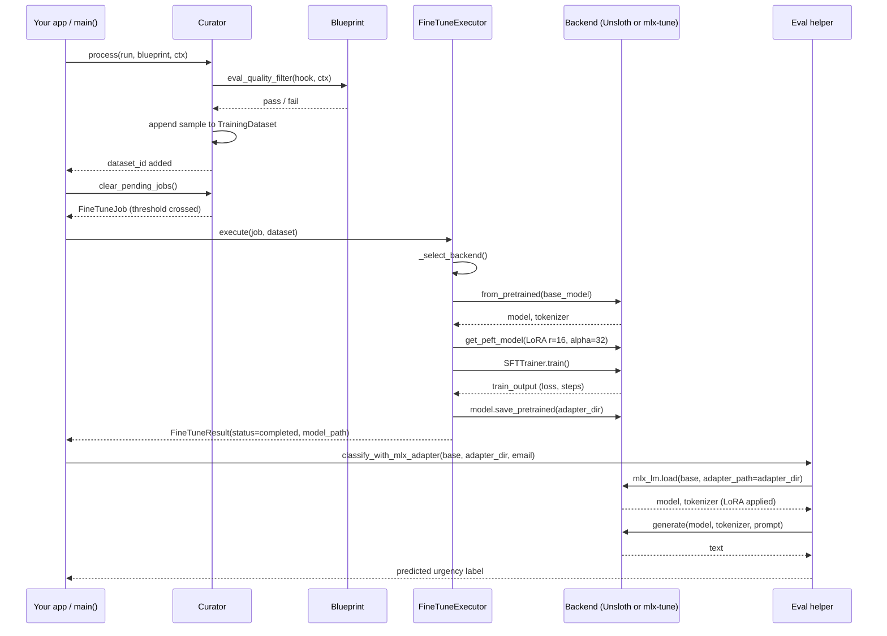
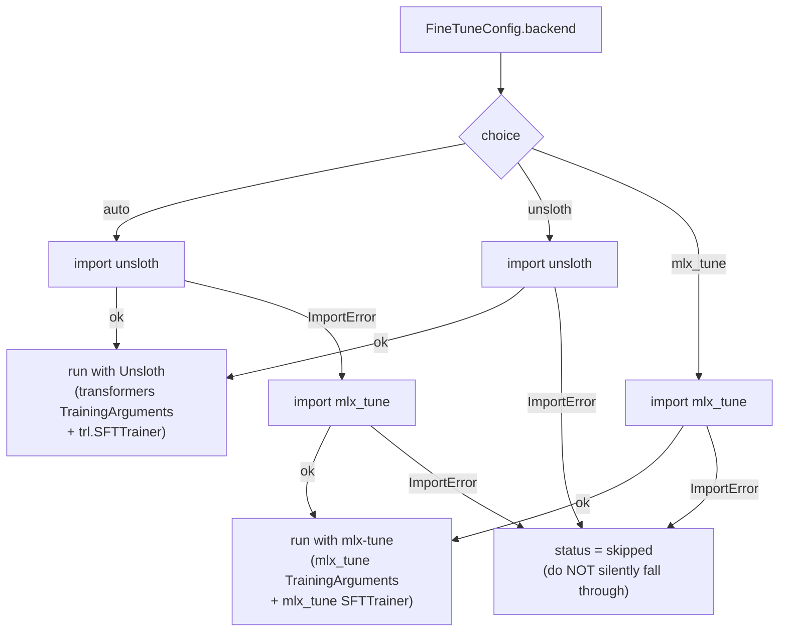
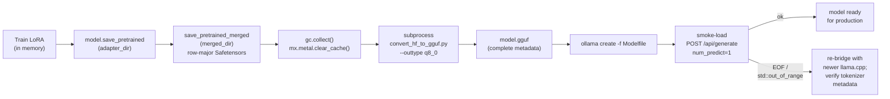

# Example 38 — Real LoRA Fine-Tune (Unsloth on CUDA, mlx-tune on Apple Silicon)

> *"Create learnings and improve usage of own LLMs and train them"* — one of
> the loudest Sagewai promises. This example is the first end-to-end working
> proof: Curator → real LoRA fine-tune → deploy → measured cost-down delta.

A senior SaaS engineer told to "add AI to the product this quarter" with
budget under \$500/month and no research team can run this on their MacBook
or a free Colab T4 and walk away with one fine-tuned model and a number to
pitch their CFO. That's the bar.

---

## What this example proves

| Claim | How it's proven |
|---|---|
| The training loop closes — a Curator-built dataset trains a real model | `FineTuneExecutor` runs Unsloth or mlx-tune end-to-end |
| Same code, two backends | Backend dispatch in `FineTuneConfig.backend` (`auto` / `unsloth` / `mlx_tune`) |
| Apple Silicon is a first-class target | Pipeline smoke-tested live on M-series: 8/8 on the 8-sample synthetic eval (confirms the pipeline runs end to end — not a benchmark of model quality) |
| The cost story is real, not a slide | $0.005/call cloud → $0.000/call local = **\$5/1k calls** = **\$5,000/1M calls** |

**Today's measured numbers** (M4 Pro / 24GB, `mlx-community/Llama-3.2-3B-Instruct`,
10 samples, 5 iterations, batch_size=2, **full double-hop bridge active**):

```
train_loss      : 4.213 → 1.210      val_loss     : 4.024 → 0.951
peak_mem (train): 7.19 GB            throughput   : ~231 tokens/sec
adapter         : adapters.safetensors saved
GGUF            : 3.2 GB (q8_0, via llama.cpp/convert_hf_to_gguf.py)
ollama create   : success (smoke-load passed — Ollama runner loads cleanly)
eval via mlx_lm : 8/8 on 8 synthetic samples (in-process pipeline smoke-test)
eval via ollama : 8/8 on 8 synthetic samples (live, after the bridge)
```

> **What these numbers mean:** The 8-sample eval is a **pipeline smoke-test** —
> 8 hand-written synthetic examples, never seen during the 10-sample training run
> (there is overlap between the 10-training and 8-eval pools; they are drawn from
> the same small synthetic corpus). 8/8 confirms the full pipeline ran end to end
> — dataset → LoRA → GGUF → Ollama → inference — without crashing. It says nothing
> about how well the model generalises. To assess generalisation you need a
> held-out eval set that is strictly separate from training data and large enough
> to measure statistically.

---

## New to LoRA fine-tuning? Start here

If you've never fine-tuned an LLM before, this 90-second primer covers the
concepts the example assumes. The links lead to canonical resources you can
read in 20-40 minutes each.

**What is LoRA?** Low-Rank Adaptation. Instead of updating all 3 billion
parameters of a base model (which would need an A100 and hours of training),
LoRA freezes the base and adds two tiny *adapter* matrices to a small
fraction of the layers. Updating those adapters is what we mean by
"fine-tuning". The base model on disk is untouched; we only ship the
adapter (a few MB) and apply it at inference time. Read:

- IBM, [*What is LoRA?*](https://www.ibm.com/think/topics/lora) — concise
  conceptual intro
- Hu et al. 2021, [*LoRA: Low-Rank Adaptation of Large Language Models*](https://arxiv.org/abs/2106.09685)
  — the original paper
- Hugging Face PEFT docs, [*Conceptual guide to LoRA*](https://huggingface.co/docs/peft/main/en/conceptual_guides/lora)
  — covers `r`, `alpha`, target modules

**What's `r` and `alpha`?** The two key LoRA hyperparameters in
`FineTuneConfig`. `r` is the rank of the adapter matrices — bigger `r`
means more parameters, more capacity, more compute. `alpha` is a scaling
factor; the conventional rule is `alpha = 2 * r`. We default to `r=16`,
`alpha=32` because that's a sane mid-point for a 3B model on small
domain datasets.

**What's SFT?** Supervised Fine-Tuning. You feed the model
input/output pairs and minimise next-token cross-entropy on the output.
This example uses SFT via `trl.SFTTrainer` (Unsloth path) or
`mlx_tune.SFTTrainer` (MLX path). Other methods you'll hear about:

- **DPO** (Direct Preference Optimization) — fine-tune from *pairs* of
  good/bad responses instead of single targets. Useful when you have
  thumbs-up/down feedback. [Rafailov et al. 2023](https://arxiv.org/abs/2305.18290).
- **RLHF** (Reinforcement Learning from Human Feedback) — older,
  heavier alternative to DPO, trains a reward model first.
- **GRPO** (Group Relative Policy Optimization) — recent reasoning-task
  method; both Unsloth and mlx-tune support it. Out of scope here.

**Why 4-bit quantisation?** A 3B fp16 model is ~6 GB; a 3B 4-bit-
quantised model is ~2 GB. For *training*, 4-bit weights stay frozen
while LoRA adapters update in fp16 — you get fp16-quality fine-tuning
at 4-bit-base memory cost. Read [Dettmers et al. 2023, *QLoRA*](https://arxiv.org/abs/2305.14314)
for the full story.

**What's GGUF?** A binary format used by `llama.cpp` and Ollama. It
packs the merged weights + tokenizer + chat template into one file
that runs efficiently on CPU. Sagewai's deploy path uses it because
that's how Ollama loads models. The `q4_k_m` suffix is a specific
4-bit quantisation scheme (k-quants, medium). [llama.cpp GGUF spec](https://github.com/ggml-org/llama.cpp/blob/master/docs/ggml-format.md).

**What's the Alpaca format?** A simple JSONL schema:
`{"instruction": "...", "input": "...", "output": "..."}`. Originated
with Stanford's [Alpaca project](https://crfm.stanford.edu/2023/03/13/alpaca.html).
Sagewai's `Curator` produces Alpaca-format training data by default
because it's the most widely supported by fine-tuning frameworks.

**Want a deeper textbook?** [Hugging Face's *Alignment Handbook*](https://github.com/huggingface/alignment-handbook)
walks through the full SFT → DPO loop with code; once this example clicks,
that's the next level up.

---

## The pipeline at a glance



**The crucial dotted edge** — `Held-out eval → Curator` — is what closes
the training loop. Every prediction the deployed model makes in
production is a potential training sample for the *next* cycle. Section
7 of the example demonstrates this explicitly: the eight live
predictions from Section 5 are wrapped as MissionRunResults and fed
back through Curator. Correct predictions get `user_rating=5`; wrong
ones get `human_override=True` (the human stepped in to fix the label).
After enough cycle-2 samples accumulate, a fresh FineTuneJob queues
automatically — same executor, same blueprint, larger and more
domain-specific dataset.



Each cycle is the same executor, the same blueprint, the same Sagewai
plumbing — but with a dataset that has more of *your* edge cases each
time. The cost-per-call stays at $0 (local Ollama); the quality on
your domain ratchets up.

---

## Deploy options on Mac — pick by stack

Sagewai's training surface is identical across deploy paths. The choice
is about how your team wants to *consume* the trained model. Both paths
are first-class; both are documented; both have a working example.

| Path | Strength | Trade-off | Example |
|---|---|---|---|
| **Ollama + GGUF bridge** | Portable artefact (the GGUF moves to any Linux box); your team already runs Ollama; k-quants for disk savings via `llama-quantize` | One-time `git clone` of llama.cpp + `LLAMA_CPP_DIR` env var | Example 38 (this file) |
| **`mlx_lm.server` native** | Zero external bridge; OpenAI-compat HTTP; one `pip install`; lowest setup friction on a Mac dev box | Mac-only — adapter doesn't move to Linux without going through the bridge | [Example 38a](38a_mlx_lm_server_deploy.py) |
| **Unsloth Studio** | Mac-native UI for browsing models, datasets, and fine-tunes (the desktop app the user pointed Sagewai at originally) | UI + HTTP server; not a Sagewai pipeline target today, but a useful sibling | _not a Sagewai example yet_ |

### Why we don't dockerize the Mac path

Docker on macOS runs inside a Linux VM that has **no Metal GPU
access**. Containerising `mlx_lm.server` would silently drop inference
to CPU and run ~20× slower while looking the same on the outside —
worst-of-both-worlds soft failure. The right managed-service pattern
on Mac is `launchd` / brew services / a Tauri-wrapped desktop app.
Docker is the right pattern for **Linux + CUDA** deployments, where
`apps/backend/`'s Dockerfile + Ollama-in-Docker is the production
target.

### CUDA path — same SDK, different tooling

On a Linux + CUDA box (Colab T4, Lambda Labs A10G, RunPod RTX 4090,
vast.ai, Paperspace), backend dispatch picks Unsloth automatically.
Unsloth's `model.save_pretrained_gguf(...)` does the GGUF export
internally — **it also shells out to `llama.cpp` under the hood**, but
bundles the clone so users don't see it. So:

- llama.cpp is a universal dependency for GGUF, not an
  Apple-Silicon-specific one. Unsloth hides it.
- For a quick CUDA verification: open Colab T4, paste this example
  under `SAGEWAI_FT_BACKEND=unsloth`, capture the resulting numbers.
  Free tier is enough; the whole loop is ~3-4 minutes of compute.
- For sustained CUDA training: rent a Lambda Labs A10G (~\$0.40/hr)
  or RunPod RTX 4090 (~\$0.30/hr). For most Sagewai-domain
  fine-tunes (10s-100s of samples), a single hour pays for itself
  in the first month of saved cloud-LLM bills.

The Sagewai surface (`Curator`, `FineTuneExecutor`, blueprint, the
`quality_filter` that captures cycle-2 production runs) is **byte-for-byte
identical** between Apple Silicon and CUDA. Only the deploy
plumbing differs.

---

## Quick start

### Any machine — safe default

Runs Curator + (if a backend is installed) trains + (if mlx-tune is installed)
runs the in-process MLX eval. No 6GB GGUF write, no risk to your laptop.

```bash
pip install sagewai
python packages/sdk/sagewai/examples/38_unsloth_finetune.py
```

### Apple Silicon — live training + live eval

```bash
pip install sagewai mlx-tune trl peft
# Verified versions: mlx-tune 0.4.25, mlx-lm 0.31.3
python packages/sdk/sagewai/examples/38_unsloth_finetune.py
```

### Apple Silicon — also produce GGUF for an Ollama deploy

Opt-in, double-hop. Saves Safetensors + bridges via `llama.cpp/convert_hf_to_gguf.py`
(produces a 3.2 GB q8_0 GGUF Ollama loads cleanly). Peaks ~12 GB; works
on 24 GB unified memory with headroom. One-time setup:

```bash
git clone --depth=1 https://github.com/ggml-org/llama.cpp ~/.cache/sagewai/llama.cpp
export LLAMA_CPP_DIR=~/.cache/sagewai/llama.cpp
```

Then any time you want the round-trip:

```bash
SAGEWAI_FT_PRODUCE_GGUF=1 MLX_USE_GPU=1 \
  python packages/sdk/sagewai/examples/38_unsloth_finetune.py
```

### CUDA box / Colab T4

```bash
pip install sagewai unsloth datasets trl peft
SAGEWAI_FT_BACKEND=unsloth python packages/sdk/sagewai/examples/38_unsloth_finetune.py
```

---

## Runtime sequence

The exact call shape — useful when you adapt this to your own pipeline. The
sequence diagram messages are plain single-line ASCII so GitHub's renderer
will not balk.



---

## Dual-backend dispatch — how it picks



The strict rule: **`backend=unsloth` and `backend=mlx_tune` never silently
fall through to the other.** Only `auto` does. This catches "I asked for
CUDA, why did it just run on my Mac?" before it costs anyone an hour.

---

## The Apple Silicon SOP — Double-Hop Export

Why this exists: `mlx-lm` 0.31.x's `mx.save_gguf` rejects non-row-major
arrays produced by `permute_weights(...)` for `q_proj`/`k_proj`, AND its
GGUF writer omits tokenizer metadata keys (e.g. `tokenizer.ggml.tokens`)
that Ollama's runner requires. Both bugs hit the same export. We work
around them with a **double-hop**: train → save Safetensors via
mlx-tune → `llama.cpp/convert_hf_to_gguf.py` → GGUF. The Safetensors hop
forces every tensor row-major; `llama.cpp` writes complete tokenizer
metadata; Ollama loads cleanly.



### Setup — one-time

Bridge needs a llama.cpp checkout. The convert script has lightweight
Python deps that should already be in your venv (gguf, numpy,
transformers, sentencepiece):

```bash
git clone --depth=1 https://github.com/ggml-org/llama.cpp ~/.cache/sagewai/llama.cpp
export LLAMA_CPP_DIR=~/.cache/sagewai/llama.cpp
```

Once `LLAMA_CPP_DIR` is set, the executor's bridge path activates
automatically when `SAGEWAI_FT_PRODUCE_GGUF=1`.

### What the executor does for you

When `SAGEWAI_FT_PRODUCE_GGUF=1` is set:

1. `model.save_pretrained_merged(merged_dir, tokenizer)` — fuses LoRA
   into the base in-memory and writes a row-major HF checkpoint.
2. `gc.collect()` + `mx.metal.clear_cache()` — drop ~6GB before the
   subprocess starts so the bridge has Metal memory headroom.
3. Subprocess: `python $LLAMA_CPP_DIR/convert_hf_to_gguf.py merged_dir
   --outfile model.gguf --outtype $SAGEWAI_FT_GGUF_QUANT` (default
   `q8_0`).
4. `ollama create -f Modelfile` + smoke-load via `/api/generate` (with
   `keep_alive: 0s`) — confirms Ollama actually loads the file before
   we trust it for the eval.

### Manual recipe (when you want to drive it yourself)

```bash
# 1. Merge LoRA into the base, save Safetensors (row-major).
python -m mlx_lm.fuse \
  --model mlx-community/Llama-3.2-3B-Instruct \
  --adapter-path /tmp/sagewai-ft/<job-id>/adapters \
  --save-path   /tmp/sagewai-ft/<job-id>/merged

# 2. Bridge to GGUF via llama.cpp.
python $LLAMA_CPP_DIR/convert_hf_to_gguf.py \
  /tmp/sagewai-ft/<job-id>/merged \
  --outfile /tmp/sagewai-ft/<job-id>/model.gguf \
  --outtype q8_0
# (convert_hf_to_gguf.py supports f32/f16/bf16/q8_0/tq1_0/tq2_0/auto.
#  For k-quants like q4_k_m, post-process with llama-quantize from a
#  built llama.cpp binary.)

# 3. Build a Modelfile (Llama-3 chat template).
cat > /tmp/Modelfile <<'EOF'
FROM /tmp/sagewai-ft/<job-id>/model.gguf
PARAMETER temperature 0.1
PARAMETER stop "<|eot_id|>"
PARAMETER stop "<|end_of_text|>"
TEMPLATE """{{ if .System }}<|start_header_id|>system<|end_header_id|>

{{ .System }}<|eot_id|>{{ end }}{{ if .Prompt }}<|start_header_id|>user<|end_header_id|>

{{ .Prompt }}<|eot_id|>{{ end }}<|start_header_id|>assistant<|end_header_id|>

{{ .Response }}<|eot_id|>"""
SYSTEM """You classify customer-support emails into {low, medium, high} urgency. Respond with JSON only: {"urgency": "...", "reason": "..."}"""
EOF

# 4. Create + smoke-load.
ollama create sagewai-triage -f /tmp/Modelfile
ollama run    sagewai-triage 'Subject: outage on /checkout ...'
```

### Quantisation choice

`convert_hf_to_gguf.py` supports `f32`, `f16`, `bf16`, `q8_0`,
`tq1_0`, `tq2_0`, `auto`. We default to **`q8_0`** because:

- ~3.2 GB for a 3B model (vs ~6 GB at fp16) — half the disk + RAM
- Loads cleanly in Ollama on Apple Silicon's unified memory
- Quality regression vs fp16 is negligible for triage-class tasks

For `q4_k_m`-class k-quants (~1.9 GB), build llama.cpp's `llama-quantize`
binary and post-process the produced GGUF. That's a separate cmake
dance; out of scope for the executor.

---

## Memory + hardware guardrails

> The Mac Mini killed our Python process twice during PR development before
> we landed the safety pass. Take these targets seriously.

| Phase | Peak memory | Notes |
|---|---|---|
| Curator + dataset build | < 100 MB | Pure Python |
| MLX LoRA training (3B fp16) | **~7 GB** | Verified: peak_mem 7.19 GB on 10-sample / 5-iter run |
| In-process MLX eval | **~7 GB** | Reuses the trained model |
| `save_pretrained_merged` (Safetensors) | **~7 GB** | Same envelope as training; in-process |
| `convert_hf_to_gguf.py` (q8_0) | **~6 GB** | Subprocess, isolated from the parent's Metal cache |
| `ollama create` + smoke-load | **~3.5 GB** | Ollama runner loads the q8_0 GGUF |
| Total peak (full bridge with `SAGEWAI_FT_PRODUCE_GGUF=1`) | **~12 GB** | Verified clean on M4 Pro / 24 GB |

**Swap awareness:** if Memory Pressure in Activity Monitor turns red the
kernel will kill the Python process. The example's default behaviour
(GGUF off, eval via `mlx_lm.generate` in-process) targets <8 GB peak.

---

## Environment variables

| Variable | Default | Effect |
|---|---|---|
| `SAGEWAI_FT_BACKEND` | `auto` | Force `unsloth` or `mlx_tune`. Strict: explicit choices do not silently fall through to the other |
| `SAGEWAI_FT_MODEL` | per-backend default | Override the base model. CUDA default: `unsloth/Llama-3.2-3B-Instruct-bnb-4bit`. MLX default: `mlx-community/Llama-3.2-3B-Instruct` (fp16, ~6GB) |
| `SAGEWAI_FT_PRODUCE_GGUF` | `0` | Set to `1` to run the double-hop GGUF bridge (Safetensors → llama.cpp). Requires `LLAMA_CPP_DIR` to be set. Peaks ~12GB |
| `LLAMA_CPP_DIR` | unset | Path to a `llama.cpp` checkout. The bridge reads `convert_hf_to_gguf.py` from there. If unset and `convert_hf_to_gguf.py` is also not on `$PATH`, the GGUF step is skipped with a clear message |
| `SAGEWAI_FT_GGUF_QUANT` | `q8_0` | `--outtype` passed to `convert_hf_to_gguf.py`. Supported: `f32`, `f16`, `bf16`, `q8_0`, `tq1_0`, `tq2_0`, `auto`. For k-quants like `q4_k_m`, post-process with `llama-quantize` from a built llama.cpp |
| `ANTHROPIC_API_KEY` | unset | When set, the cloud baseline column in the eval table is computed live against Anthropic Haiku instead of using `RECORDED_BASELINE_ACCURACY` |
| `MLX_USE_GPU` | unset | Set to `1` to tell MLX to prioritise the GPU and avoid Metal/CPU memory-bank contention |
| `MLX_METAL_DEBUG` | `0` | Set to `1` to track leaked Metal buffers across the merge step (mlx upstream knob) |

---

## Versions we have actually verified

These are the pins that produced the 8/8 pipeline smoke-test result noted above:

| Component | Version | Notes |
|---|---|---|
| Python | 3.14.3 | The example runs on 3.10+; 3.14 needed `dill` 0.4.x and a workaround for HF `datasets` fingerprinting (see code comments in `fine_tune.py`) |
| `mlx-tune` | **0.4.25** | Drop-in Unsloth API for Apple Silicon |
| `mlx-lm` | 0.31.3 | Pulled by mlx-tune; the `save_gguf` row-major bug is in this release |
| `mlx` | 0.31.2 | Apple's MLX core |
| `transformers` | 5.7.0 | Bumped from 4.x by mlx-tune install — Sagewai's other tests still pass |
| `trl` | 0.29.1 | Used by Unsloth path; mlx-tune ships its own SFTTrainer |
| `peft` | 0.19.1 | LoRA implementation for the Unsloth path |
| `dill` | 0.4.1 | Pickle backend used by HF datasets — bumped because 0.3.8 plus Python 3.14 broke `Pickler.save_dict` |
| `Ollama` | 0.22.1 | Loads the q8_0 GGUF cleanly when produced via the double-hop bridge. The mlx-lm in-process GGUF writer omits tokenizer metadata and crashes the runner — we use llama.cpp's converter instead |
| `llama.cpp` | latest `main` | Cloned shallow to `~/.cache/sagewai/llama.cpp`. Only `convert_hf_to_gguf.py` is invoked; no native build required |
| Default base model (CUDA) | `unsloth/Llama-3.2-3B-Instruct-bnb-4bit` | ~2 GB download, bnb 4-bit |
| Default base model (MLX) | `mlx-community/Llama-3.2-3B-Instruct` | ~6 GB download, fp16. The `-4bit` variant fails the GGUF round-trip |

---

## Verifying it worked — the parity check

A correct round-trip means MLX and Ollama produce **the same answers** to
the same prompt. If they diverge, the GGUF conversion lost or transposed
weights — re-bridge through `llama.cpp` rather than trusting it.

```bash
# 1. MLX (in-process), the source of truth.
python -c "
from mlx_lm import load, generate
m, t = load('mlx-community/Llama-3.2-3B-Instruct', adapter_path='/tmp/sagewai-ft/<job-id>/adapters')
print(generate(m, t, prompt='Subject: SSO is down\n\nNo one in our org can sign in...', max_tokens=60))
"

# 2. Ollama (after the double-hop bridge).
ollama run sagewai-triage 'Subject: SSO is down\n\nNo one in our org can sign in...'

# 3. They should produce the same urgency label and a similar reason.
```

If Ollama returns gibberish (repetitive tokens, `<|end_of_text|>` loops):

- **Double-BOS bug:** check the Modelfile. The `TEMPLATE` should not add
  `<s>` or `[INST]` if the GGUF already includes one. Use the Llama-3
  template above verbatim.
- **Stop tokens missing:** `ollama show --modelfile sagewai-triage` and
  confirm `PARAMETER stop "<|eot_id|>"` appears. Without it the model
  runs past the assistant turn and starts hallucinating new conversations.
- **Tokenizer metadata gap:** mlx-lm 0.31.x writes incomplete metadata.
  Re-bridge through `llama.cpp/convert_hf_to_gguf.py` (the manual SOP
  above) — it writes the missing `tokenizer.ggml.tokens` keys.

---

## Adapting this to your domain

The Sagewai surface is intentionally generic. To use this example as a
template for your own production fine-tune, change three things:

1. **`SYNTHETIC_RUNS`** — replace the email-triage Alpaca pairs with
   instruction/input/output triples from your own domain. The
   `quality_filter` (`user_rating >= 4 AND human_override == False`) is
   what separates accepted training data from rejected.
2. **`EVAL_SAMPLES`** — your held-out test cases. Keep them strictly
   separate from training data; 8-20 is enough to catch obvious
   regressions.
3. **The system prompt** in `_classify_with_cloud` and
   `_classify_with_mlx_adapter` — replace the `{low, medium, high}`
   schema with your own labels.

What stays identical:
- `Curator`, `FineTuneJob`, `FineTuneExecutor`, `FineTuneConfig`
- The blueprint shape (training_data_hooks + learning_loop_target)
- The Modelfile template (Llama-3 chat format)
- The cost-down math (`$/1k calls` delta)

### Real-world use cases — five people who'd ship this fine-tune this quarter

Each row pairs a named operator with the labels their domain
needs and the reason a $0/call local model wins over a paid frontier
LLM at their volume.

| Who | What they're shipping | Labels (output schema) | Why local fine-tune wins |
|---|---|---|---|
| **Senior platform engineer at a 200-person fintech SaaS** | Customer-support email triage on Zendesk (200 emails/day) | `{low, medium, high}` urgency + reason | The example's own use case. Cuts cloud bill by ~$30/month at 200 emails/day; fine-tune pays back in week one |
| **RevOps engineer at a 100-person vertical-SaaS startup** | Sales lead scoring from contact-form + CRM history | `{hot, warm, cold}` + signal | Fine-tune on your CRM's labelled history; eliminates per-lead cloud spend at the volume your AEs touch daily |
| **Internal-IT lead at a 400-person e-commerce SaaS** | Helpdesk ticket routing for password / software / network requests | `{network, identity, software, hardware, other}` | High-volume, repetitive — perfect for a 3B local model. Compliance also bans third-party LLMs for HR data |
| **Senior eng-platform engineer at a 300-person devtools company** | Code-review priority on every PR diff | `{security, perf, style, tests-missing, lgtm}` | Run on every PR diff (~200/day); cloud cost would balloon, local is free; corpus is private git history |
| **Senior backend engineer at a 250-person legaltech SaaS** | Legal-contract clause flagging during pre-redline | `{termination, indemnity, IP-assignment, non-standard, standard}` | Every clause gets classified pre-redline; price-prohibitive on cloud at the document volume per customer |

Three more drop-in adaptations with the same orchestration shape (a
senior eng at a 50-500-person SaaS swaps the labels and the JSONL):

| Domain | Labels | Why local fine-tune wins |
|---|---|---|
| **Content moderation tier** (community-platform SaaS) | `{auto-approve, human-review, auto-reject}` + reason | Latency-sensitive — local inference is faster than the cloud round-trip |
| **Compliance log review** (regulated-industries SaaS) | `{benign, suspicious, violation}` + signal | Privacy: log content never leaves your network |
| **Survey free-text classification** (any B2B SaaS PM team) | `{feature-request, complaint, praise, churn-risk}` | Long tail — fine-tune captures your customers' specific phrasing |

### Cost-down math, scaled

The pattern is linear: **(cloud `$/call`) × (calls/day) × 30 days = monthly
savings after the one-time fine-tune cost**. For Anthropic Haiku at
$0.005/call:

| Calls / day | Monthly cloud bill | Monthly savings (local) |
|---:|---:|---:|
| 200 | \$30 | \$30 |
| 2,000 | \$300 | \$300 |
| 20,000 | \$3,000 | \$3,000 |
| 200,000 | \$30,000 | \$30,000 |

The fine-tune cost is the same — \$0 on Apple Silicon, \$1-2 on a Colab
T4. Anything beyond a few hundred calls/day pays back in week one.

---

## Known upstream gaps + the watchdog plan

Two upstream issues still bite the GGUF deploy path. Neither blocks the
core training-loop story (which works today end-to-end on Apple Silicon
via the in-process MLX eval).

### Issue 1 — `mx.save_gguf` row-major check (mlx-lm 0.31.x)

`convert_to_gguf` calls `permute_weights(...)` on `q_proj`/`k_proj`,
producing non-contiguous views; `mx.save_gguf` then raises
`ValueError: [save_gguf] can only serialize row-major arrays`.

**Workaround in `FineTuneExecutor`:** monkey-patch `mx.save_gguf` to call
`mx.contiguous(v)` on every tensor before serialising. Verified at the
write level — file is produced.

**Watchdog target:** `mlx-lm >= 0.32.0` (or a patch to
`mlx_lm/gguf.py:313`).

### Issue 2 — incomplete tokenizer metadata in mlx-lm's GGUF writer

`ollama create` accepts the file (storing the blob succeeds), but the
runner crashes on first `/api/generate` with
`libc++abi: terminating due to uncaught exception of type std::out_of_range`.
Cause: a tokenizer metadata key Ollama looks up via `unordered_map::at`
is missing.

**Workaround:** double-hop via `llama.cpp/convert_hf_to_gguf.py` — its
metadata writer is more complete. The SOP above prints the exact commands.

**Watchdog target:** mlx-lm patches that write the missing
`tokenizer.ggml.*` keys, or Ollama's runner does the lookup with
`unordered_map::find` and falls back gracefully.

### Watchdog automation

A scheduled agent should run weekly:

1. `pip index versions mlx-lm` — newest version released.
2. If `> 0.31.x`:
   - Spin up a 1-step "smoke train" with `mlx-community/Llama-3.2-1B-Instruct`.
   - Attempt `mx.save_gguf` directly on the fused weights, no contiguity patch.
   - If it succeeds without `ValueError`, drop the workaround in
     `_mlx_export_gguf_with_contiguity_patch` and re-flip
     `SAGEWAI_FT_PRODUCE_GGUF` to default-on.
3. Run `ollama create` + smoke-load on the produced GGUF.
   - If the runner does not crash, the metadata gap is fixed. Drop the
     llama.cpp manual recipe from the README and from Section 4 of
     Example 38.

---

## Files in this example

```
packages/sdk/sagewai/examples/38_unsloth_finetune.py    # Runnable script
packages/sdk/sagewai/examples/38_unsloth_finetune.md    # This guide
packages/sdk/sagewai/autopilot/curator/fine_tune.py     # FineTuneExecutor
packages/sdk/sagewai/autopilot/curator/curator.py       # Curator
packages/sdk/sagewai/autopilot/curator/types.py         # FineTuneJob, TrainingDataset
packages/sdk/tests/autopilot/curator/test_fine_tune.py  # Unit tests for the executor
packages/sdk/tests/test_smoke.py                        # Smoke (forces fallback path)
```

---

## Further learning

Curated rabbit holes — pick one based on what you're trying to understand.

### Concepts (read these first)

- IBM, [*What is LoRA?*](https://www.ibm.com/think/topics/lora) — plain-English explainer
- Hugging Face, [*Conceptual guide to LoRA*](https://huggingface.co/docs/peft/main/en/conceptual_guides/lora) — `r`, `alpha`, target modules
- Hugging Face, [*PEFT documentation*](https://huggingface.co/docs/peft/index) — the umbrella library; covers LoRA, prefix-tuning, IA3, etc.
- Hugging Face, [*The Alignment Handbook*](https://github.com/huggingface/alignment-handbook) — full SFT → DPO loop with code, the next level up after this example

### Papers (when you want first principles)

- Hu et al. 2021, [*LoRA: Low-Rank Adaptation of Large Language Models*](https://arxiv.org/abs/2106.09685) — the original
- Dettmers et al. 2023, [*QLoRA: Efficient Finetuning of Quantized LLMs*](https://arxiv.org/abs/2305.14314) — 4-bit + LoRA, what makes Colab-T4 training possible
- Rafailov et al. 2023, [*Direct Preference Optimization*](https://arxiv.org/abs/2305.18290) — DPO, the alternative to SFT when you have preference pairs
- Ouyang et al. 2022, [*Training language models to follow instructions with human feedback*](https://arxiv.org/abs/2203.02155) — the RLHF paper (InstructGPT)

### Training frameworks

- [Unsloth docs](https://docs.unsloth.ai/) — the CUDA-side framework. Notebooks for Llama, Mistral, Phi, Gemma; covers SFT, DPO, GRPO, continued pre-training
- [Unsloth blog](https://unsloth.ai/blog) — release notes + technique deep-dives
- [mlx-tune](https://github.com/ARahim3/mlx-tune) — the Unsloth-API-compatible MLX wrapper used on Apple Silicon. README covers SFT, DPO, GRPO, vision, audio
- [Apple's mlx-lm](https://github.com/ml-explore/mlx-lm) — lower-level MLX inference + LoRA training (what mlx-tune wraps)
- [Apple's MLX framework](https://ml-explore.github.io/mlx/) — the underlying array library

### Format + tooling references

- [Stanford Alpaca](https://crfm.stanford.edu/2023/03/13/alpaca.html) — origin of the instruction/input/output JSONL schema we use
- [llama.cpp](https://github.com/ggml-org/llama.cpp) — GGUF specification + the `convert_hf_to_gguf.py` we lean on for the double-hop bridge
- [Ollama Modelfile reference](https://github.com/ollama/ollama/blob/main/docs/modelfile.md) — `FROM`, `TEMPLATE`, `PARAMETER stop` syntax
- [GGUF format spec](https://github.com/ggml-org/llama.cpp/blob/master/docs/ggml-format.md) — what's actually in a `.gguf` file (relevant when chasing the tokenizer-metadata gap)
- [Hugging Face datasets — Alpaca](https://huggingface.co/datasets/tatsu-lab/alpaca) — the original 52K-pair instruction dataset
- [`trl.SFTTrainer` API](https://huggingface.co/docs/trl/sft_trainer) — what the Unsloth path delegates to internally

### Adjacent topics worth a half-hour each

- [*Quantisation explained*](https://huggingface.co/docs/transformers/main/en/quantization/overview) — Hugging Face's overview of fp16/int8/4-bit/GPTQ/AWQ
- [*Llama-3 chat template*](https://huggingface.co/docs/transformers/main/en/chat_templating) — why `<|start_header_id|>` and `<|eot_id|>` matter
- [*Choosing a base model*](https://huggingface.co/blog/llama2) — picking the right size and license for your domain
- [Anthropic's pricing page](https://www.anthropic.com/pricing) — for the cloud-baseline math you'll do at the end of every fine-tune

### Inside Sagewai

- `sagewai/atelier:docs/v1.0/audience.md` — the audience pin this example serves
- `sagewai/atelier:docs/v1.0/lighthouse-tour.md` — Gap #1 spec; this example closes it
- `sagewai/atelier:docs/v1.0/example-build-conventions.md` — file shape, gotchas, workflow rules
- Example 36 — the synthetic predecessor; teaches `Curator` and `FineTuneJob` without the GPU compute
- Example 17 — original stub (now superseded); kept as a reference for the conceptual recipe
- Atelier issue #5 — origin of the requirement
- PR `sagewai/platform#225` — implementation history (commits walk through every step we hit)
