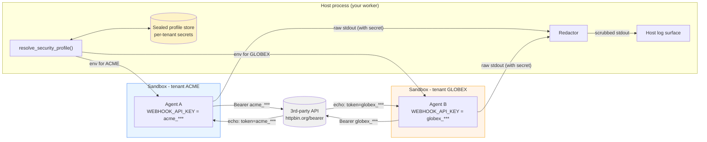
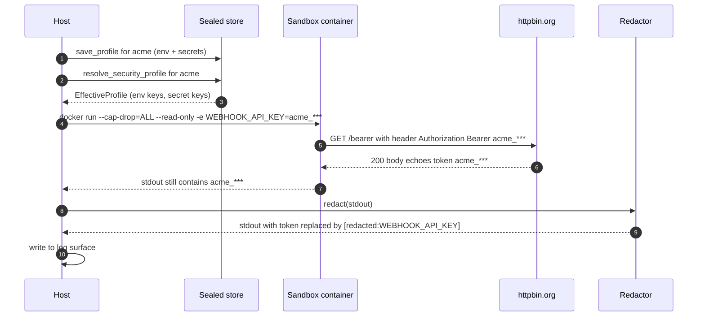

# Example 39 — Sandbox + scoped credentials + 3rd-party call

> Each tenant's agent runs inside its own isolated container, carrying
> only that tenant's Sealed-issued credential. The host process never
> holds the secret. Cross-tenant boundaries hold. Captured output gets
> redacted before it touches any host log surface. Reruns are
> byte-identical so an auditor can replay them.

This is the production-readiness story for v1.0 in one runnable file.
If you ship a multi-tenant SaaS and you're being told to "add AI to the
product this quarter," this is the example that shows your CFO and
your security team the pattern they'll ask for.

## What this proves

Four invariants, end-to-end:

1. **Host process never holds either tenant's token.** The host scans
   its own `os.environ` before, during, and after each container call.
   Both tenants' tokens are absent every time.
2. **Cross-tenant boundary holds.** Tenant A's container only ever sees
   A's `WEBHOOK_API_KEY`. B's container only ever sees B's. Neither
   sees the other's, even though they ran in the same process tree.
3. **Redaction works on the host log surface.** The 3rd-party response
   that comes back to the host carries the live token (httpbin echoes
   it). Before any host-side log line is emitted, the `Redactor`
   built from the tenant's profile rewrites the live token to
   `<redacted:WEBHOOK_API_KEY>`.
4. **Determinism.** Running the same workflow twice produces matching
   `(status, token-prefix, response-shape)` tuples — the proof a CFO
   plus auditor can rerun later and verify.

## Architecture



Time-ordered flow per tenant:



The two pillars touching are **Sealed** (per-CLI workload identity,
scoped credentials) and **Sandbox** (`SandboxMode.PER_RUN`,
`NetworkPolicy`, `ResourceLimits`). The example prints the
`SandboxConfig` up-front so you can see the SDK's view of what's about
to run before the container actually launches.

## How to run

### On a clean machine

```bash
pip install sagewai
python 39_sandbox_scoped_credentials.py
```

The example completes in stub mode in under 5 seconds — no Docker
daemon required. Stub mode uses `NullBackend` (in-process, env-scoped)
so the same isolation invariants still hold and the proof section
still runs end-to-end.

### With a Docker daemon (full live path)

```bash
docker pull python:3.11-slim
python 39_sandbox_scoped_credentials.py
```

The example auto-detects whether `docker ps` succeeds. When it does,
each tenant's call goes through a real `docker run` against
`python:3.11-slim` with the same hardening flags `DockerBackend`
applies internally:

- `--cap-drop=ALL`
- `--security-opt no-new-privileges:true`
- `--read-only` rootfs (with a 64 MiB tmpfs at `/tmp`)
- `--memory`, `--cpus`, `--pids-limit` from `ResourceLimits`
- `--network bridge` (or `none`, depending on `NetworkPolicy`)

### Expected output (proof section)

```
───  The proof  ─────────────────────────────────────────────────────────

  Host process never held tenant tokens:    True
  Cross-tenant leaks:                       0
  Determinism (run1 == run2 per tenant):    True
  Backend used:                             NullBackend (stub)
```

When live Docker is available, the only line that changes is the last
one: `Backend used: live docker`.

## Real-world use cases

The pattern in this example — *one Sealed profile per tenant + one
sandbox per run + redaction on the host log surface* — fits a wide
range of multi-tenant SaaS workloads. Four concrete domains where the
audience-pin person can drop this in this quarter:

### 1. Customer-support email triage on per-customer Zendesk / Intercom

Your support tooling reads each customer's Zendesk via the customer's
own Zendesk API key. You add an LLM-powered triage agent.

| Concern | How this pattern solves it |
|---|---|
| Customer A's Zendesk key never appears in logs visible to your team or to customer B | Each triage run is a separate sandbox; the response gets redacted before it hits Datadog/Loki |
| If a prompt-injection in customer A's tickets tricks the agent into asking for "all keys", the blast radius is one container with one key | `--cap-drop=ALL --read-only` plus the per-tenant Sealed profile means it can only ever see A's key |
| Support managers can audit "what did the agent do for customer A?" | Same workflow + same input → byte-identical network calls (the determinism check) |

### 2. Internal-tools agent at a 50-500-person SaaS

Your internal "ask the platform" bot calls Jira, GitHub, your CRM, and
your billing system on behalf of whichever employee is asking.

| Concern | How this pattern solves it |
|---|---|
| Per-employee OAuth tokens never reach the LLM provider's logs | Sandbox env scope + Redactor scrubs them before any host log surface |
| One employee's bug in a tool prompt can't reveal another employee's tokens | One Sealed profile per employee; one sandbox per request |
| Compliance/security review can verify the redaction works without reading code | `<redacted:JIRA_TOKEN>` placeholders in the log surface are visually obvious; the Redactor's audit trail records every match |

### 3. Multi-tenant LLM gateway you sell to other companies

Your product is "LLM router as a service" — companies bring their own
Anthropic / OpenAI / local-Ollama keys. You run the LLM call on their
behalf.

| Concern | How this pattern solves it |
|---|---|
| Customer A's `ANTHROPIC_API_KEY` must never be in customer B's logs, your support engineer's terminal, or your hosting provider's bill-attribution metadata | Per-tenant Sealed profile materialises the key only into the tenant's sandbox; the host process never sees it; the Redactor strips it from any captured response or error message |
| If a customer compromises your service (worst case), the impact must be bounded to *that customer's* keys | One sandbox per customer per run; cross-tenant boundary verified in this example's output |
| You publish a status page that includes recent error samples | Errors flow through the same Redactor pipeline before they reach the status page; live keys don't escape |

### 4. "Run AI on your own data" feature in a B2B SaaS

You sell a product to customers who store sensitive data with you (HR
records, financial data, healthcare). You're adding an "agent on your
data" feature.

| Concern | How this pattern solves it |
|---|---|
| The agent must only access **this customer's** data, even though all customers share the same compute pool | Per-customer DB credentials (Sealed) + per-run sandbox; the agent has no path to the host filesystem where other customers' data sits |
| SOC 2 / HIPAA / ISO 27001 ask for evidence that compute is isolated and credentials are scoped | The four invariants this example proves are exactly the controls those frameworks ask for; `--cap-drop=ALL`, `--read-only` rootfs, and pid-limit caps each tighten one of the relevant control families |
| Auditor wants to replay a specific request | Determinism check: same input + same sandbox config → identical request shape |

## What you can change

The example is a thin substrate. Things you'll want to swap for a real
deployment:

- **Endpoint.** Replace `https://httpbin.org/bearer` with whichever
  3rd-party API your tenants actually call.
- **More tenants.** The `TENANTS` list scales linearly. The
  cross-tenant boundary check is `O(n^2)` but n is small.
- **Real `DockerBackend`.** Once `ghcr.io/sagewai/sandbox-base:1.0`
  ships, swap the direct `docker run` invocation for
  `from sagewai.sandbox.docker_backend import DockerBackend` with a
  proper `LocalCacheSandboxPool` (see `tests/sandbox/test_isolation.py`
  for the canonical wiring).
- **Network policy.** This example uses `NetworkPolicy.FULL` because
  httpbin needs egress. For a real deployment with known endpoints,
  set `NetworkPolicy.EGRESS_ALLOWLIST` and configure
  `network_egress_allowlist` in `SandboxConfig`.
- **Audit writer.** The example uses `Redactor.redact()` directly. For
  production, wire a real `AuditWriter` (Postgres-backed) and use
  `Redactor.redact_and_audit()` so every secret match leaves an audit
  event with the matched key name and the surface it appeared on.
- **Resource limits.** The example sets 256 MiB / 1 CPU / 64 PIDs. For
  agent workloads you'll typically want 1-2 GiB / 2 CPU / 128 PIDs;
  these are the `ResourceLimits` defaults.

## What's exercised

- `BuiltinAdminStoreBackend` — per-tenant Sealed profiles
- `ProfileWritePayload` — secret materialisation
- `resolve_security_profile()` — cascade resolution
- `SandboxConfig`, `SandboxMode.PER_RUN`, `NetworkPolicy`,
  `ResourceLimits` — the SDK's view of the container config
- `Redactor` — value redaction over the captured response
- `NullBackend` — in-process fallback when Docker isn't running

## What to read next

If you ran this and want to go deeper:

- **Example 33** (`33_fleet_sealed_integration.py`) — Sealed +
  Fleet together. Three customers, five workers, dispatch routes
  by both `project_id` and `sealed_profile`. Shows the same
  invariants at fleet scale.
- **Example 26** (`26_fleet_scoped_dispatch.py`) — pure Fleet view of
  per-project dispatch, no Sealed. Useful when you want the scoping
  story without the credential story.
- **Example 34** (`34_observatory_cost_tracking.py`) — once you're
  running the agent in production, this is how you show the CFO where
  the money goes.
