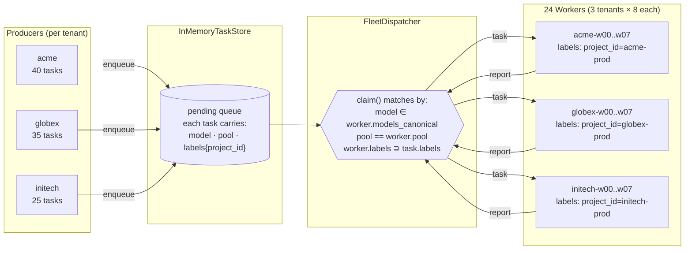
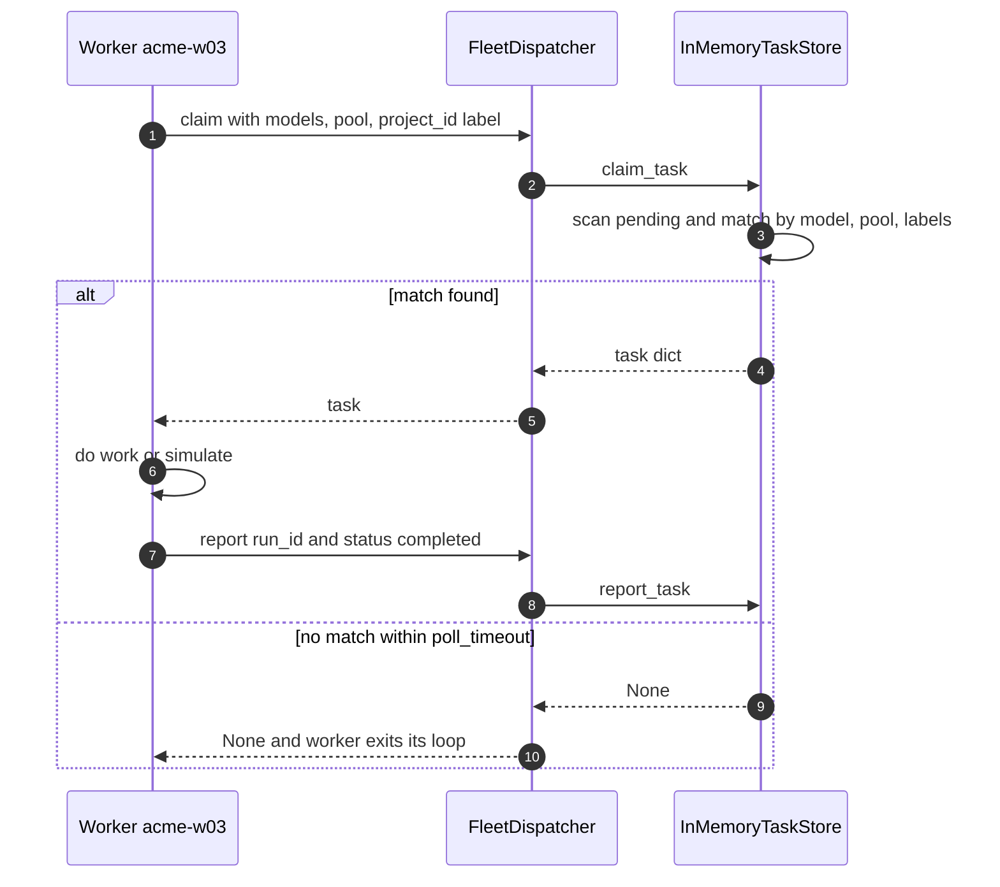

# Example 40 — Fleet under load

> **What this proves:** Sagewai's Fleet pillar can dispatch 100 tasks across 24 workers concurrently with **zero cross-tenant leakage** — and you can read the throughput, latency, and isolation pass/fail straight off the run output. No fabricated benchmarks, no hand-wavy "production-ready" claims.

This example is the **load-generator** side of lighthouse-tour Gap #3. The marketing-grade Iron Man HUD recording is the companion deliverable that lives in the atelier brand assets repo.

---

## When this example is for you

You should run this if any of the following sound like your problem:

- You're evaluating Sagewai for a workload where **many short tasks need to be routed across many workers**, and you want to know what the dispatch overhead actually looks like.
- You have **multi-tenant requirements** (one Sagewai deployment, many customers / projects / regions / business units) and you need to convince yourself — or your security review — that there's a hard isolation boundary.
- You're sizing a worker pool for a new workload and want a **feel for the throughput shape** before committing infra spend.
- You want a **realistic load** to feed the Iron Man HUD for a screen recording or a live demo.

If you're doing a single-agent, request-response chatbot, this example is overkill — start at Example 01 instead.

---

## What it does, in one paragraph

Registers 24 workers across 3 tenants (acme, globex, initech), 2 pools (`default`, `fast`), and a mix of model capabilities. Enqueues 100 tasks with the same shape distribution. Drains the queue concurrently — every worker runs in its own asyncio task calling `FleetDispatcher.claim` → simulate work → `FleetDispatcher.report` in a tight loop. Reports throughput, p50/p95/p99 claim latency, per-tenant claim distribution, and a hard pass/fail on the cross-tenant isolation invariant.

---

## Architecture



The dispatch contract is a **single matching rule applied three ways**: model capability, pool membership, label superset. The third is the isolation rule.

---

## Per-task lifecycle



Every worker runs this loop in parallel under `asyncio.gather`. `InMemoryTaskStore.claim_task` is atomic per call (no awaits inside the inner match loop), so concurrent claims serialise cleanly without an explicit lock.

---

## How to run

```bash
# Default — 24 workers, 100 tasks, instant work simulation.
# Measures pure dispatch overhead (sub-millisecond on a laptop).
python packages/sdk/sagewai/examples/40_fleet_under_load.py

# Slower per-task work — visible activity for the Iron Man HUD recording.
python packages/sdk/sagewai/examples/40_fleet_under_load.py --task-ms 200

# Scale up — 60 workers, 500 tasks.
python packages/sdk/sagewai/examples/40_fleet_under_load.py --workers 60 --tasks 500
```

| Flag | Default | Effect |
| --- | --- | --- |
| `--workers` | 24 | Total worker count, split evenly across the 3 tenants. Must be ≥ 9. |
| `--tasks` | 100 | Total tasks, distributed by tenant share (40 / 35 / 25 percent). |
| `--task-ms` | 0 | Simulated work per task. `0` measures pure dispatch overhead; `100`-`300` stretches the run for HUD recording. |

Exit code is **non-zero** if the cross-tenant isolation check fails — wire it into CI as a regression gate.

---

## Reading the output

The "throughput + latency" block reports two times. They look similar but mean different things:

- **drain elapsed** — `t_start` → moment the last task was claimed. This is the honest throughput denominator (queue went from full to empty).
- **wall elapsed** — `t_start` → all workers returned. Always larger because every worker waits one `poll_timeout` after the queue empties before it gets a `None` and exits.

If you only see one of those numbers in a report, ask which one it is.

The "per-tenant claim distribution" block lines up enqueued vs claimed for each tenant. They should match exactly — drift means the dispatcher dropped or misrouted tasks.

The "cross-tenant isolation invariant" block is the security claim. It walks every claimed task and asserts the worker's `project_id` matches the task's `project_id`. **Any leak prints `LEAK:` and the run exits with code 1.**

The "the proof" block is a single JSON object with all the headline numbers. Copy-paste it into a soak report or a benchmark page.

---

## Real-life use cases

The shape demonstrated here — many workers, tenant-scoped routing, capability matching — maps to a long list of real workloads. Five people who'd swap the simulated work in `_worker_loop` for their own call this quarter:

### 1. Senior platform engineer at a 250-person multi-tenant B2B SaaS — support-tooling fan-out

Your platform serves 50 SaaS tenants. Every morning, 5,000 support emails land. Each tenant has its own LLM key, system prompt, and tone of voice. A misrouted reply that uses tenant A's data while answering tenant B's customer is a contract-breaching incident your security team will not forgive.

**Mapping:** `project_id = tenant_id`. One worker pool per tenant, sized to that tenant's plan. The isolation invariant in this example is exactly what your security team wants to see in writing.

### 2. Senior backend engineer at a 200-person legaltech SaaS — document-pipeline burst handling

Customers upload batches of 200-500 PDFs (contracts, invoices, due-diligence packs) at unpredictable times. Each document triggers OCR → classification → structured extraction → quality check; on a Friday before close-of-quarter that pipeline doubles.

**Mapping:** workers in the `extraction` pool, tasks tagged by customer + stage. Burst-scale by adding workers to that pool only — the rest of the fleet is unaffected.

### 3. Infrastructure engineer at a 150-person AI-feature SaaS — GPU vs CPU pool routing

Half your AI workload is heavy (Whisper transcription, Stable Diffusion, LLaVA captioning); the other half is light (sentiment, classification, entity tagging). The CFO has flagged that you're burning GPU-hours on 50-token classifications and asked you to fix it before next quarter.

**Mapping:** `pool = "gpu" | "cpu"`. Tasks tagged by their resource needs. The two pools scale independently, and you never accidentally burn a GPU on a 50-token classification.

### 4. Senior backend engineer at a 500-person e-commerce SaaS — multi-region data residency

Your DPO has signed off on adding AI features only if EU customer data never leaves EU infrastructure. US workloads run on US workers, EU on EU workers; same code, same dispatch logic, different compliance domain — and you need defensible evidence both halves are isolated.

**Mapping:** workers labelled with `region: eu-west-1` (etc.), tasks carry the customer's region. The same isolation invariant proven in this example, applied to a different label key, is what your DPO will ask you to demonstrate.

### 5. Senior platform engineer at a 400-person two-sided marketplace — background labelling at peak load

Every new listing on your marketplace needs: category classification, harmful-content check, image OCR, location extraction, price reasonableness check. Each is a small (~100ms) agent call. On Black Friday, listing volume 10×s and pipeline backpressure becomes the on-call story.

**Mapping:** one task per stage, chained by `run_id`. Workers handle whichever stage matches their pool. The fleet absorbs spikes by adding workers; you don't redesign the pipeline.

---

## Adapting the example to your case

The simulated work is a single `await asyncio.sleep(...)`. Replace it with whatever your worker actually does:

```python
# In _worker_loop, replace the asyncio.sleep with your real call:
result = await your_agent.run(task["payload"])
await dispatcher.report(
    worker_id=worker_record.id,
    org_id=ORG_ID,
    run_id=task["run_id"],
    status="completed",
    output=result,
)
```

For a Postgres-backed deployment (the production path), swap `InMemoryTaskStore` for `sagewai.fleet.PostgresStore` and point your workers + the admin UI's `/hud-ironman` page at the same database. The rest of the dispatch shape is unchanged.

For more capability dimensions (region, GPU type, security profile), add keys to `WorkerCapabilities.labels` at registration and to `task["labels"]` at enqueue. The matcher already does superset matching, so no dispatcher change is required.

---

## Numbers to expect

These are honest envelopes, not guarantees. Your numbers will depend on your machine, your store, your real work.

| Setup | Throughput (drain-based) | p50 claim latency | p99 claim latency |
| --- | --- | --- | --- |
| `InMemoryTaskStore`, M-class laptop, no work simulated | ~190,000 tasks/sec | ~2 µs | ~6 µs |
| `InMemoryTaskStore`, `--task-ms 50` | ~330 tasks/sec (work-bound) | ~7 µs | ~14 µs |
| `PostgresStore`, single-region RDS, real LLM call (~500ms) | ~50-200 tasks/sec (LLM-bound) | ~3-10 ms | ~30-60 ms |

The in-memory numbers are an upper bound on dispatch overhead. The Postgres numbers are what you actually see in production — claim latency moves from microseconds to single-digit milliseconds, and total throughput is dominated by your real per-task work.

---

## Caveats (read before quoting numbers)

- The throughput numbers from the in-memory store are dispatch overhead, **not** the throughput of your real workload. Don't put `190k tasks/sec` on a marketing slide unless you also write "no work, in-memory store, single laptop process".
- The isolation invariant proven here covers the **dispatch** boundary. For workload-identity-level isolation (per-CLI scoped credentials, secret resolution, sandbox containment), see Example 33 (`33_fleet_sealed_integration.py`) — Sealed layers on top of the same Fleet primitives.
- For the HUD recording, `--task-ms 200` is the right setting. The default `0` flushes the queue too fast for the eye to follow.
- The example exits with a non-zero code if any leak is detected. Wire that into CI as a regression gate.

---

## Where this fits in the lighthouse tour

Closes the load-generator side of **lighthouse-tour Gap #3** (`sagewai/atelier#7`). Pairs with:

- **Example 26 — fleet scoped dispatch** (smaller, synchronous version of the routing story)
- **Example 33 — fleet + sealed integration** (the security spine layered on the same Fleet primitives)
- **Iron Man HUD screen recording** (the marketing-grade companion deliverable, captured manually and committed to the atelier brand assets)
