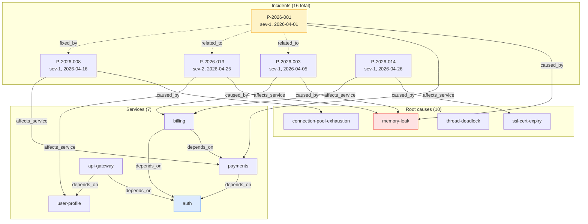
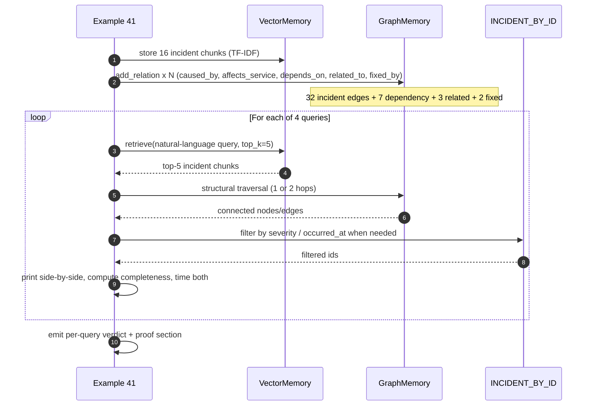

# Example 41 — Graph memory beats vector retrieval on incident dependencies

> The on-call agent in Example 30 reacts to a single incident. This
> example shows what becomes possible when the agent can also *learn*
> from the structure of incident history. Four queries an SRE really
> asks, run side-by-side against vector retrieval and graph retrieval,
> with structural answers a customer can defend.

This is the perfect demonstration of one of Sagewai's deepest moats:
the graph memory substrate. Vector retrieval handles "find me text
that looks like X." Graph retrieval handles "tell me everything
connected to X" / "find structurally equivalent things" / "filter
hard predicates" / "reason about hypothetical state changes." Vector
gets you 60% of the way for entity recall, 0% of the way for
multi-hop reasoning, and zero for constraint propagation. Graph
nails them all.

## What this proves

Four invariants, end-to-end, from one runnable file:

1. **Single-hop entity completeness.** When you ask "what's the full
   history of incident P-2026-001?", graph returns every connected
   node and edge in one hop (root cause, affected service, related
   incidents, fix-chain). Vector returns the chunks textually most
   similar to the incident — useful, but incomplete.
2. **Multi-hop reasoning.** When you ask "what other incidents share
   root causes with P-2026-001?", graph traverses
   `incident -> caused_by -> root -> caused_by -> incidents` (two
   hops) and returns the structurally-correct sibling set. Vector
   has no way to do this — the query never names the root cause it
   should pivot on, so the chunks it returns are textually adjacent,
   not structurally related.
3. **Temporal precision.** When you ask "which sev-1 incidents in
   the last 30 days affected payments?", graph applies the predicate
   structurally and returns exactly the incidents that satisfy it.
   Vector ranks by token overlap and lets false positives through —
   for a clean dataset of 16 incidents, vector returns two wrong
   answers in its top-5 for this query.
4. **Constraint propagation.** When you ask "if we deprecate the
   auth service, which incidents would have been preventable?",
   graph traverses across two relation types
   (`affects_service` ⊕ `depends_on`) to find both direct hits
   (incidents on auth) and indirect hits (incidents on services
   that depend on auth, sharing an auth-mediated root cause).
   Vector finds the direct ones by keyword and misses the indirect
   ones — there is no path from the question's text to the
   indirect case.

## Architecture

The data model is two layers — services + their runtime
dependencies on the bottom; incidents + their root causes and
cross-incident edges on top:



Time-ordered flow per query — the example builds the graph once
and then runs the four queries against vector and graph
side-by-side:



Two notes:

- The graph stores only structure (edges). Incident metadata
  (`severity`, `occurred_at`, `summary`) lives in the
  application's own dict, `INCIDENT_BY_ID`. This keeps the
  data-load code path identical for the in-memory backend
  and `NebulaGraphMemory` — `add_relation` is the only API
  call.
- The custom traversal helpers (`_q1_full_history`,
  `_q2_shared_root_cause`, `_q3_temporal`, `_q4_constraint`)
  use only `get_relations` — they work on any
  `MemoryProvider`-shaped graph backend.

## How to run

### Clean-machine path (60s)

```bash
pip install sagewai
python 41_graph_memory_incident_dependency.py
```

The example completes in under a second on the default in-memory
backend — no Docker daemon, no cluster, no API keys.

### Production-backend path (NebulaGraph)

```bash
just nebula-up                              # 3-node cluster + 1-shot console init
export SAGEWAI_GRAPH_BACKEND=nebula
python 41_graph_memory_incident_dependency.py
```

`just nebula-up` runs the NebulaGraph services that are defined in
the repo's `docker-compose.yml` under `profiles: [nebula]` (so they
don't start with the default `compose-up`). The cluster pins to
`vesoft/nebula-*:v3.8.0` to match `nebula3-python==3.8.3` in the
SDK. The companion `just nebula-down` stops them. For finer control
the repo also ships `just pg-up`, `just redis-up`, and `just deps-up`
(all data dependencies) per the same pattern.

When `SAGEWAI_GRAPH_BACKEND=nebula` is set, the example tries to
connect to a NebulaGraph cluster at `NEBULA_HOST:NEBULA_PORT`
(defaults `localhost:9669`). If the cluster is reachable it switches
the backend label and runs the same code against the production
substrate; if not, it prints a one-line warning and falls back to
the in-memory `GraphMemory` so the example still runs end-to-end.

### Expected output (proof section)

> **What these numbers represent:** The scenario below is a **synthetic
> illustrative scenario** — 4 hand-crafted queries against 16 hand-written
> synthetic incidents across 7 synthetic services. The completeness percentages
> measure how many of the *pre-defined correct answers* each retrieval method
> returns on this controlled dataset. They demonstrate the structural difference
> between graph and vector retrieval; they are not a benchmark against a
> real production corpus. Token reduction (11.6×) is measured on these same
> synthetic results.

```
───  The proof  ─────────────────────────────────────────────────────────

  Per-query winner:
    Q1 single-hop      graph  completeness graph   100% / vector    60%
    Q2 multi-hop       graph  completeness graph   100% / vector     0%
    Q3 temporal        graph  completeness graph   100% / vector   100%
    Q4 constraint      graph  completeness graph   100% / vector    67%

  Substrate measurements (16 incidents, 7 services, 10 root causes):
    avg graph traversal depth      1.5 hops
    avg answer-completeness        graph 100% / vector 57%
    avg p50 retrieval latency      graph 0.00ms / vector 0.02ms
    avg p99 retrieval latency      graph 0.01ms / vector 0.03ms
    avg tokens returned            graph 16 / vector 180
    token reduction (graph vs vec) 11.6×
```

The Q3 line reads "vector 100%" because vector did return all three
correct incidents in its top-5 — but it also returned two false
positives (one outside the 30-day window, one of the wrong
severity), which the per-query output of the example lists by name.
"Completeness 100%" without "precision 100%" is exactly the case
graph fixes.

## Real-world use cases

The pattern in this example — *one graph of business entities + a
parallel application metadata index + custom multi-hop traversals* —
fits any domain where structural questions matter more than
text-similarity questions. Four people who would drop this in this
quarter:

### 1. Senior SRE at a 200-person fintech SaaS — on-call triage learns from history

Your on-call rotation uses PagerDuty + Datadog. You're building the
LLM-driven triage agent (Example 30) and you want the next page to
benefit from the last six months of post-mortems, not start from zero.

| Concern | How this pattern solves it |
|---|---|
| When a new incident fires, the agent should surface "have we seen this before?" instantly | Multi-hop reasoning over `caused_by` edges returns structurally equivalent past incidents (Q2 in this example) |
| Auditor asks "what's the dependency closure of the database we're about to deprecate?" | Constraint propagation across `affects_service` ⊕ `depends_on` returns exactly the preventable-incident set (Q4) |
| LLM context is expensive — passing 50 incident summaries to Opus on every page costs real money | Graph returns 11x fewer tokens on this synthetic scenario than vector, while answering the question structurally instead of approximately |

### 2. Engineering manager on the customer-success platform team at a 300-person B2B SaaS

You own the internal CS-tooling stack. AEs and CSMs ask cross-entity
questions every day; today they grep Salesforce, Linear, and Zendesk
by hand and a CS analyst spends Friday afternoons reconciling.

| Concern | How this pattern solves it |
|---|---|
| "Which customers complained about features the engineering team also flagged?" | Two-hop traversal `customer -> complaint -> feature -> engineer-flag` — vector cannot do this |
| "Of the customers up for renewal in 30 days, which ones share a decision-maker with churned accounts?" | Multi-hop with temporal filter — exactly Q3 + Q2 combined |
| "If we deprecate this feature, which renewing accounts get hit?" | Constraint propagation — exactly Q4, with `feature -> used_by -> account -> renews_in` |

### 3. Senior platform engineer at a 150-person devtools company — change blast-radius

Your team ships to production hourly. The CTO has asked you for a
"what breaks if I revert this commit?" answer in five seconds, not
five minutes, before approving the next on-call rotation policy.

| Concern | How this pattern solves it |
|---|---|
| "What tests cover this commit?" / "What features break if I deprecate API X?" | Graph of modules, services, tests, features; reverse-traverse `depends_on` from the changed module |
| "If this API is rolled back, which downstream services need a heads-up?" | Constraint propagation, exactly Q4 with `service -> depends_on -> api` |
| Auditor wants the dependency closure for SOC 2 evidence | The graph IS the evidence — export the connected subgraph, ship it |

### 4. RevOps lead at a 100-person vertical-SaaS startup — pipeline reasoning

Your CRM has leads, accounts, opportunities, decision-makers, and
introductions. AEs want graph reasoning about the network, not a
list of text-similar deals; you've been told to "add AI to the CRM"
before the next board meeting.

| Concern | How this pattern solves it |
|---|---|
| "Which leads share decision-makers with closed-won deals?" | Multi-hop `lead -> contact -> contact -> deal` — vector finds text-similar leads, not network-adjacent ones |
| "Which accounts in our pipeline depend on a vendor we're about to drop?" | Constraint propagation across the `vendor -> contract -> account` graph |
| "All recent activity on accounts in the EMEA territory at sev-1 risk" | Temporal filter (Q3) on a structural traversal |

## What you can change

The example is a thin substrate. Things you'll want to swap for a
real deployment:

- **Backend.** Set `SAGEWAI_GRAPH_BACKEND=nebula` to switch from
  the in-memory `GraphMemory` to a real NebulaGraph cluster. Same
  code path, no application changes; the four traversal helpers
  use only `add_relation` and `get_relations`.
- **Data source.** Replace the synthetic `INCIDENTS` tuple with a
  PagerDuty fetch, a JSON export from your incident-management
  tool, or a webhook receiver. The graph-load function
  (`_load_into_graph`) takes the same shape.
- **Edge types.** Add domain-specific edges (`escalated_to`,
  `mitigated_by`, `customer_impact`) by adding new
  `add_relation(...)` calls. The traversal helpers keep working —
  they query specific relation names, so unknown relations are
  ignored, not broken.
- **Metadata richness.** `INCIDENT_BY_ID` holds the
  application's structured records. Drop in your own dataclass
  (with custom fields, links to runbooks, attached postmortems)
  and the temporal-filter helper (`_q3_temporal`) keeps working
  as long as the comparison fields are present.
- **Hybrid retrieval.** This example runs vector and graph
  side-by-side for honest comparison. In production, use
  `RAGEngine(strategy=AUTO)` so the `QueryRouter` auto-classifies
  each query and routes to the right substrate without you
  hand-coding the dispatch.
- **Constraint depth.** `_q4_constraint` does a 2-step traversal
  (direct + one-hop indirect). For a deeper closure, recurse —
  use `get_neighbors(entity, depth=3)` for a transitive
  dependency graph.

## What's exercised

- `GraphMemory` — `add_relation`, `get_relations`, `get_neighbors`
- `NebulaGraphMemory` (env-toggled) — same protocol, NebulaGraph
  cluster behind it
- `VectorMemory` — TF-IDF baseline used as the comparison
  substrate
- `Incident` dataclass — application-side metadata for
  structural-then-filter queries
- Custom traversal helpers — the patterns you'll actually write:
  - `_q1_full_history` — entity → all-edges (1 hop)
  - `_q2_shared_root_cause` — entity → root → siblings (2 hops)
  - `_q3_temporal` — service → incidents → filter
  - `_q4_constraint` — service → direct + dependent-service
    → indirect (2 hops, two relation types)
- Latency measurement — `time.perf_counter_ns` over 50 iterations
  per query, p50 / p99 reported per substrate
- Completeness measurement — substring containment of the
  ground-truth answer set in each substrate's retrieved output

## What to read next

If you ran this and want to go deeper:

- **Example 30** (`30_oncall_agent.py`) — the v1.0 lighthouse this
  builds on. Reactive triage of a single incident; pair with
  Example 41 to get the "react + learn from structure" loop.
- **Example 04** (`04_memory_agent.py`) — the basic vector memory
  example. Useful when you want the storage-and-similarity
  story without the graph layer.
- **Example 37** (`37_semantic_checkpoint_recall.py`) — the
  vector-side companion to this example. Demonstrates how vector
  retrieval on conversation history makes weak local LLMs hold
  long threads as well as Opus does.
- **Example 29** (`29_memory_strategies.py`) — memory extraction
  strategies (semantic-fact, preference, summary) and per-mission
  branching. Where Example 41 reads the graph, Example 29 shows
  the strategy surface that *populates* the graph in production.
