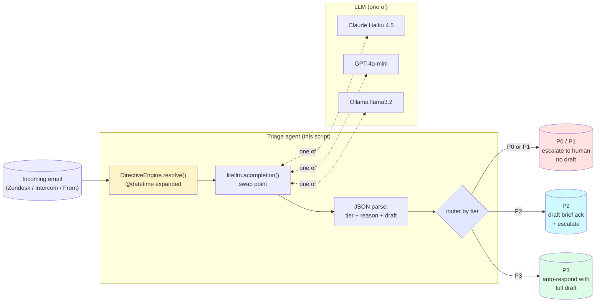
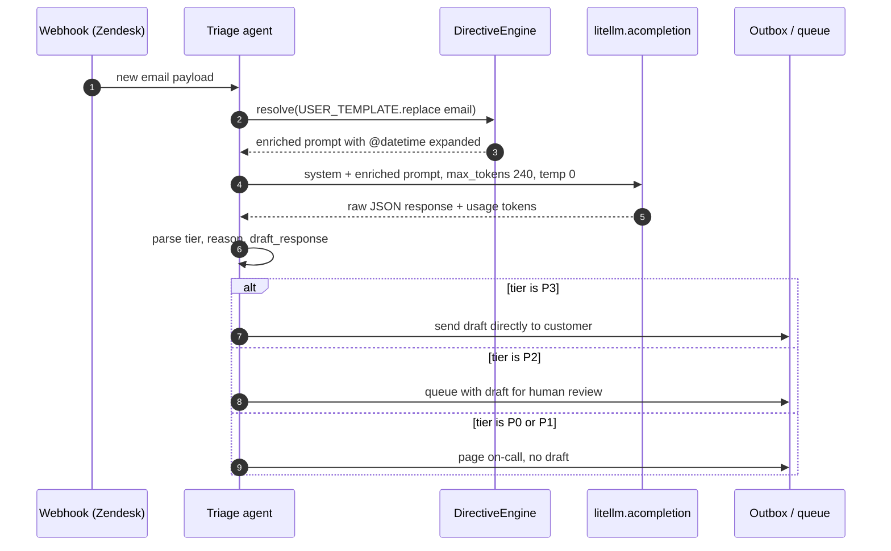

# Example 42 — Customer support triage agent (drop-in for tonight)

> Your CTO told you to "add AI to the product this quarter." You picked
> the most painful inbox on the team — customer support — and you have
> one weekend. This is the agent you ship Monday.

For every incoming email it does three things in one LLM call:

1. **Tiers it** P0 / P1 / P2 / P3 with a one-sentence reason a human
   can audit.
2. **Decides** auto-respond vs escalate based on the tier.
3. **Drafts the response** for the auto-respondable ones — short
   acknowledgement for P2, full reply for P3.

You point it at your inbox tonight. Tomorrow morning the obviously
P3 questions are answered, the obviously P0 incidents are routed
straight to on-call, and the in-between cases land in your queue with
a draft you can edit in 30 seconds. **No new vendor, no new database,
no new platform.** It's a 400-line Python file you swap into your
existing webhook handler.

## What this proves

Four invariants the audience-pin person needs before they trust this
in front of their actual customers:

1. **The output is always a parseable shape.** Every call returns
   strict JSON with `tier`, `reason`, `draft_response`. The soak in
   `_soaks/directives_soak.py` measured **100% JSON validity across
   150 calls on three local 7B-class models** — this isn't aspirational,
   it's measured.
2. **The same code runs on any LLM.** Default path is free Ollama;
   one env-var swap moves to Claude Haiku or GPT-4o-mini. The "swap
   proof" section in the script's output triple-checks two
   representative emails on every alternate model and prints the
   per-LLM agreement count.
3. **The cost is forecastable to the dollar.** The script prints a
   monthly forecast at 200 emails/day for every LLM in the rotation.
   The CFO line falls out of the run, not a vibe.
4. **The decision-making is auditable.** Each triaged email comes
   with a one-sentence reason in the model's own words. When a P0
   gets misclassified as P1, the reason tells you why and the human
   override is one line of code.

## Architecture



Time-ordered flow per email:



## How to run

### On a clean machine (free path, no API key)

```bash
pip install sagewai
ollama pull llama3.2
python 42_support_triage_agent.py
```

Six representative emails run through `ollama/llama3.2:latest` in
about 4 seconds. No paid spend. Expected proof block (real numbers
from a clean-machine run):

```
─── The proof ─────────────────────────────────────────────────────────

  6 email(s) triaged in 4.1s using ollama/llama3.2:latest
    2 auto-respond, 3 escalated, 3 drafted
    JSON validity: 6/6
    Agreement with human-labelled tiers: 6/6
    Total spend: $0.000000

  Monthly forecast at 200 emails/day:
    ollama/llama3.2:latest    $0.00/day  $0.00/month  (local — no per-call cost)
```

(On the curated 6-email inbox, llama3.2 hits 6/6. On the broader
50-sample soak dataset its accuracy is 70% — see
`atelier/docs/v1.0/directives-soak-report.md` for the cases where
boundary-tier judgement gets harder.)

### Full live path (paid + local, the swap proof)

```bash
export ANTHROPIC_API_KEY=sk-ant-...
export OPENAI_API_KEY=sk-...
ollama pull llama3.2
python 42_support_triage_agent.py
```

The script picks the cheapest paid model as primary (Claude Haiku 4.5)
and uses the others for the swap-proof section. Real output from the
production run that authored this README:

```
─── The proof ─────────────────────────────────────────────────────────

  6 email(s) triaged in 7.9s using claude-haiku-4-5-20251001
    2 auto-respond, 3 escalated, 3 drafted
    JSON validity: 6/6
    Agreement with human-labelled tiers: 6/6
    Total spend: $0.004020

  Same code, swap LLMs (2 representative emails per alternate):
    openai/gpt-4o-mini         agreement 2/2  spend $0.000129
    ollama/llama3.2:latest     agreement 2/2  spend free

  Monthly forecast at 200 emails/day:
    claude-haiku-4-5-20251001  $0.13/day  $4.02/month  (at 200 emails/day)
    openai/gpt-4o-mini         $0.01/day  $0.39/month  (at 200 emails/day)
    ollama/llama3.2:latest     $0.00/day  $0.00/month  (local — no per-call cost)
```

### Pin a specific primary model

```bash
python 42_support_triage_agent.py --primary openai/gpt-4o-mini
python 42_support_triage_agent.py --primary ollama/llama3.2:latest
```

## Real-world use cases

The pattern in this script — *one prompt template + directive
preprocessing + LiteLLM-backed swap + tier-driven router* — is what a
senior engineer at a 50-500-person SaaS will reach for once they
decide to ship an LLM-powered feature without locking in a single
provider. Four people who'd drop it in this quarter:

### 1. Senior platform engineer at a 200-person fintech SaaS — Zendesk inbox triage

You read 200 customer-support tickets a day on Zendesk. Half of them
are the same five questions ("how do I rotate my API key?", "why
didn't my webhook fire?"). Your VP-Eng has asked you to triage them
without expanding the on-call rotation.

| Concern | How this pattern solves it |
|---|---|
| The CFO needs a defensible monthly forecast before signing off | The script's monthly-forecast block does the math at 200/day for whatever LLM you pin — paste it into the slide |
| Auto-responding to a P0 by accident is the worst-case outcome | The router never auto-responds to P0/P1. Tier semantics are pinned in `SYSTEM_PROMPT`; flipping any tier to escalate-by-default is a one-line change |
| You want to start cheap and only escalate to a paid LLM if quality slips | Run Ollama as primary; the soak in `_soaks/directives_soak.py` tells you exactly where the local quality gap shows up (boundary tiers); promote to Haiku only for those cases |

### 2. Engineering manager at a 50-person devtools company — GitHub-issue triage on the OSS repo

Your company's open-source repo gets 10-50 issues a week. Most are
duplicates, doc questions, or feature requests. You've told the team
"no AI replies to OSS users" because the community would notice — but
you want the boring sorting work done before standup.

| Concern | How this pattern solves it |
|---|---|
| Weekend-warrior maintainer time gets eaten by re-asking for repro steps on every "doesn't work" issue | The P3 draft can request repro info politely, in your voice; you only see issues with repro already asked |
| You want to keep the "no AI in OSS" crowd happy by keeping the human in the loop on judgment calls | P0/P1 always escalate — your eyes review every "production blocker" and "critical bug" issue. The agent does the boring 80% |
| You don't want to pay anything for OSS tooling | Default Ollama path is $0/month and runs on the same machine as your dev environment |

### 3. Internal IT lead at a 400-person e-commerce SaaS — helpdesk auto-drafts

Your `it@company.com` inbox gets 30-60 tickets a day from sales,
finance, and ops asking for password resets, software access, and
"my laptop is slow." Your three L1s spend half their day on the
repetitive 80%; compliance has banned third-party LLMs for HR data.

| Concern | How this pattern solves it |
|---|---|
| The IT team's L1 work is mostly "click reset password" — you'd rather they fix the broken laptop | The agent's auto-respond pile drains the password-reset and software-access requests with grounded drafts; L1 reviews and clicks send |
| Compliance won't let employee data go to a third-party LLM | Pin `--primary ollama/llama3.2:latest` and the data never leaves the machine; the swap-proof line in the output confirms the same code works on local LLMs |
| You need an audit trail of every triage decision | Every triage result has a `reason` string; log it next to the email ID and the tier — that's your audit |

### 4. Founder-engineer at a 30-person vertical-SaaS startup — contact-form lead qualification

Your `/contact-sales` form fires off 100-300 submissions a week,
mostly junk plus a few real deals. Your two AEs are senior, the
business needs them on real opportunities, and you'd rather not
spend their morning on filtering before pipeline.

| Concern | How this pattern solves it |
|---|---|
| Your AE's day starts by clicking through 80% obvious junk to find the 3 real deals | Re-label tiers: P0 = "real deal, has budget"; P1 = "qualified, needs nurturing"; P2 = "newsletter signup wearing a sales-form mask"; P3 = "spam / wrong fit" — the router does the same routing |
| You want to trial the agent against a frontier model first, then move to a cheaper one when accuracy is good | Run Haiku as primary for week 1; pin to GPT-4o-mini for week 2; compare the swap-proof agreement numbers; pick the cheaper one if it agrees on > 95% of decisions |
| The agent must respond to qualified leads in under a minute or you lose them to a competitor | Sub-10-second p50 on Haiku, sub-1s on local llama3.2 — the latency block in the output is your SLA evidence |

## What you can change

The script is deliberately small so you can fork it. Things you'll
swap when you put it in front of a real inbox:

- **Tier definitions and labels.** `SYSTEM_PROMPT` carries the
  semantics of P0–P3. Re-label as urgency / sentiment / category /
  intent — anything closed-set fits.
- **Routing rules.** `ROUTING` maps each tier to a label, color, and
  auto-respond flag. Flip any tier to escalate-by-default by setting
  `auto_respond=False`.
- **Inbox source.** Replace the `INBOX` constant with your real fetch
  path — Zendesk REST, an IMAP loop, an SQS queue, a webhook handler.
- **Primary model.** `--primary <model>` pins it; the
  `_available_llms()` heuristic picks the cheapest paid model first if
  you don't.
- **Drafting voice.** `SYSTEM_PROMPT`'s "drafting rules" block is the
  voice. Change "friendly" to "concise" or "formal" or paste in your
  brand voice guidelines.
- **Cost forecast assumption.** `_forecast_monthly` uses 200
  emails/day as the per-day baseline. Plug in your real number.
- **Audit destination.** Today the script prints reasons to stdout.
  Swap the `_print_triage` call for an `audit_writer.write({...})` to
  push every decision to your audit table.

## What's exercised

- `sagewai.directives.DirectiveEngine` — prompt preprocessing
  (`@datetime` resolved at call time)
- `litellm.acompletion(model=..., temperature=0.0, max_tokens=240)`
  for the LLM swap
- `litellm.completion_cost(completion_response=...)` for spend
  accounting
- The Ollama tag-list endpoint at `127.0.0.1:11434/api/tags` for
  local-first model discovery (no `requests` dependency — keeps
  the SDK footprint clean)
- A strict-JSON output contract with best-effort bracket extraction
  for code-fence-wrapped responses

## What to read next

- **`packages/sdk/sagewai/examples/_soaks/directives_soak.py`** —
  the soak harness that produced the 100% JSON validity number
  cited above. Run it against your own 50-sample dataset to grade a
  candidate model before promoting it to your primary.
- **`packages/sdk/sagewai/examples/08_directives.py`** — the public
  API tour for `DirectiveEngine`. Read it if you want to add
  `@context`, `@memory`, or `/tool.name` directives to the prompt.
- **`packages/sdk/sagewai/examples/18_local_llm_routing.py`** — the
  tier-routing demo (cheap LLM for simple, frontier for complex).
  Layer this script behind a tier router and the cost line in the
  proof block goes down further.
- **`packages/sdk/sagewai/examples/30_oncall_agent.py`** — the v1.0
  lighthouse on-call agent. Same triage-and-route shape as this
  example but with autopilot blueprint, sandboxed tool calls, and
  the full Sealed credential boundary.
- **`sagewai/atelier:docs/v1.0/directives-soak-report.md`** — the
  publishable numbers across LLMs (Soak B). The section "What this
  enables in production" links back here.
