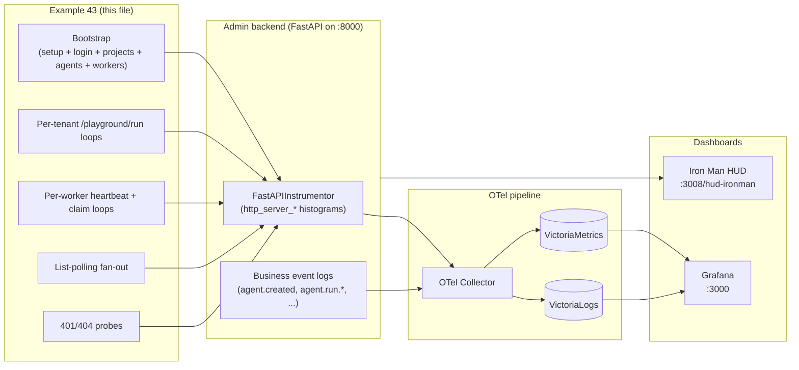
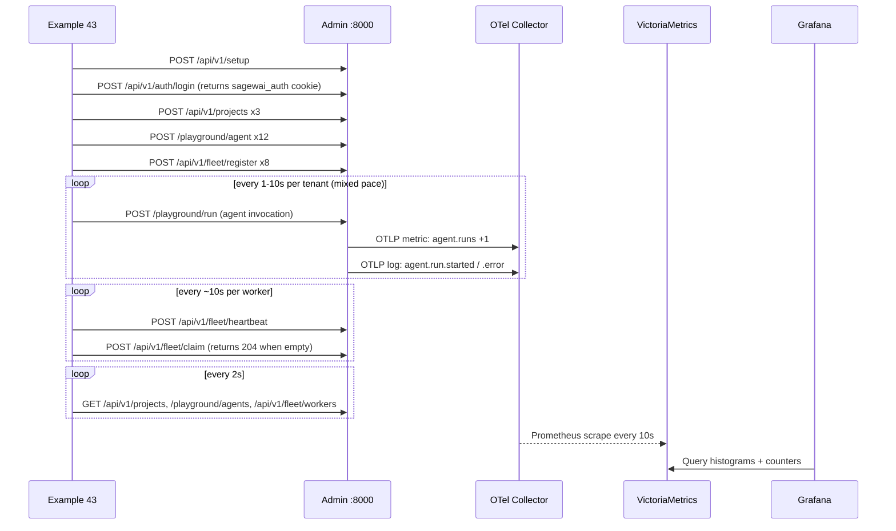

# Example 43 — Observatory live

> **What this proves:** the Observatory dashboards (Iron Man HUD + the
> 5-row Grafana board) are not Photoshop renders or pre-canned demos.
> They populate from real HTTP traffic against the real admin backend
> in about three minutes on a clean machine, and you can reproduce
> every screenshot in the docs site by running this one example.

This is the **load-driver side of lighthouse-tour Gap #4** (Observatory
marketing surface). The example doesn't claim that the platform looks
production-ready — it shows it, with measurable HTTP rates, real
status-code distributions, and a HUD canvas that actually has agents
and tenants on it.

---

## When this example is for you

You should run this if any of the following sound like your problem:

- You're evaluating Sagewai and the marketing screenshots look too
  clean to be real — you want to verify the dashboards work the way
  they're shown.
- You need to drive **realistic mixed-tenant load** at the admin
  backend for a demo, a screen recording, or a soak test, and you
  don't want to set up live LLM calls (costs, flakiness, API keys).
- You're investigating Observatory features (filtering by `project_id`,
  the OTel pipeline, the HUD's project bar) and want a populated
  environment to poke at.
- You're producing marketing collateral and need the HUD running in
  `LIVE` mode (not `DEMO`) with real tenant activity behind it.

If you just want to see that an agent works, start at Example 01 — this
is the dashboards example, not the agents example.

---

## What it does, in one paragraph

Bootstraps the admin backend (setup wizard if needed, login), creates
three tenant projects (`acme-support`, `globex-codereview`,
`initech-sales`), creates twelve agents across them, registers eight
fleet workers, and then drives a mixed-tenant load for the requested
duration (default 3 minutes). The load is a realistic blend: per-agent
`/playground/run` invocations (which fail fast without an LLM key but
still emit the full chain of OTel events and persist run records),
fleet worker heartbeats and claim attempts, list polling that mimics
an admin UI being open, and a few intentional 401/404 probes so the
status-code panel has bands. Every call hits the admin's instrumented
FastAPI routes, the OTel pipeline ships metrics to VictoriaMetrics,
and the dashboards light up.

---

## Architecture





---

## How to run

### Clean-machine 60s path

```bash
# Terminal 1 — observability
docker compose -f docker-compose.observability.yml up -d

# Terminal 2 — admin backend
sagewai admin serve --host 127.0.0.1 --port 8000

# Terminal 3 — drive the load
python packages/sdk/sagewai/examples/43_observatory_live.py
```

For the Iron Man HUD additionally start the admin frontend
(`just admin-dev` in another terminal) and visit
`http://localhost:3008/hud-ironman` after logging in with the
credentials the example printed.

### Full live path (with screenshots)

```bash
python packages/sdk/sagewai/examples/43_observatory_live.py --duration 300
```

Three minutes is the minimum for the panels to settle; five minutes
gives you a wider time window for the timeseries panels.

### Expected output (the proof block)

```
─── The proof ────────────────────────────────────────────
  Wall time           : 200.4s
  HTTP calls          :  1,210  (6.0/s)
  4xx responses       :     56
  5xx responses       :      0
  Tasks enqueued      :    122
  Tasks completed     :      0

  Per tenant:
    acme-support            ███████████·········      52
    globex-codereview       ███·················      14
    initech-sales           ███████·············      36

  Open the dashboards:
    Grafana board       http://localhost:3000
    Iron Man HUD        http://localhost:3008/hud-ironman
```

`Tasks completed` is `0` by design — the example doesn't configure
LLM API keys, so each `/playground/run` errors out before completion.
The `agent.runs` counter, the run-record persistence, and the OTel
event stream still tick, which is what the dashboards consume.

---

## Real-world use cases

The pattern this example demonstrates — a small, multi-tenant HTTP
load driver against an instrumented backend — is what an SRE drops
in for any of these:

| Domain | Concern | How the pattern solves it |
|---|---|---|
| **Pre-launch dashboard verification** | "We added five new panels — do they actually populate?" | Run this driver before opening Grafana; the panels either move or they don't. |
| **Multi-tenant isolation soak** | "If tenant A's load spikes, do tenant B's panels stay clean?" | Single tenant's `task_interval_s` lowered → watch the per-route panels split by `project_id`. |
| **OTel pipeline regression test** | "Did the collector upgrade silently drop a metric class?" | Compare `Spans Processed` and `Log Records Sent` panels before/after the upgrade. |
| **HUD demo prep** | "I'm presenting in 30 minutes — make the dashboards look alive." | Run with `--duration 300` and the HUD is populated when the laptop hits the projector. |
| **Cost-attribution sanity check** | "Are runs being correctly tagged to the right project?" | Each tenant's runs are scoped via `X-Project-ID`; filter the logs panel by `project_id` to verify. |

---

## What you can change

| Knob | Where | Default | Why you'd touch it |
|---|---|---|---|
| Backend URL | `--backend` flag | `http://127.0.0.1:8000` | Point at a remote admin (staging, shared dev) |
| Run duration | `--duration` flag | `180` seconds | `300+` for screen recordings, `30` for smoke tests |
| Tenant mix | `TENANTS` constant | acme/globex/initech, 4/2/2 workers | Match your actual customer mix; rename to your own labels |
| Per-tenant pace | `Tenant.task_interval_s` | varies by tenant | Speed up or slow down individual tenants for hot/cold contrast |
| Agent roles | `AGENTS_PER_TENANT` | triager/drafter/escalator/summariser | Match your actual product's agent vocabulary |
| Heartbeat cadence | `_worker_loop` | 10s | Drop to 1s for stress-testing fleet bookkeeping |
| Error-probe rate | `_error_probes` | every 7s | Increase to make the Status Code panel show more 4xx |

The example deliberately doesn't take a `--no-bootstrap` flag — every
run is reproducible from a fresh admin state because that's how a
clean-machine demo works. If you need to drive load against a
pre-existing admin, point it with `--backend` at the existing URL
and the bootstrap step skips itself when setup is already complete.

---

## What's exercised

- `POST /api/v1/setup`, `POST /api/v1/auth/login` — bootstrap
- `POST /api/v1/projects` — multi-tenant project creation
- `POST /playground/agent` — agent CRUD, emits `agent.created` OTel event
- `POST /api/v1/fleet/register` — worker capability registration
- `POST /api/v1/fleet/heartbeat`, `/api/v1/fleet/claim`, `/api/v1/fleet/report` — worker lifecycle
- `POST /playground/run` — agent invocation, emits `agent.run.started` and `agent.run.error` (no API key configured), persists run record via `sf.save_agent_run`
- `GET /api/v1/projects`, `/playground/agents`, `/api/v1/fleet/workers`, `/api/v1/health/summary` — the list-polling that mimics admin UI activity
- `GET /api/v1/auth/me` (intentionally unauthenticated, expects 401) — Status Code panel variety

---

## What to read next

- [`/docs/observatory`](https://github.com/sagewai/platform/blob/main/apps/docs/app/docs/observatory/page.mdx) — the docs-site Observatory page that uses the screenshots this example produces.
- [Example 34 — Observatory cost tracking](34_observatory_cost_tracking.py) — the cost story (deterministic, no live admin backend needed).
- [Example 40 — Fleet under load](40_fleet_under_load.py) — pure fleet-dispatch load generator (no admin backend, in-memory only).
- [Example 30 — On-call agent](30_oncall_agent.py) — a single complete mission, easier to follow on the HUD graph than dozens of concurrent runs.
