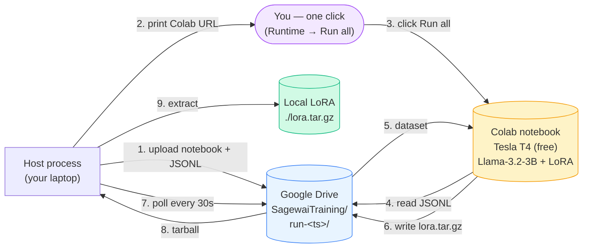
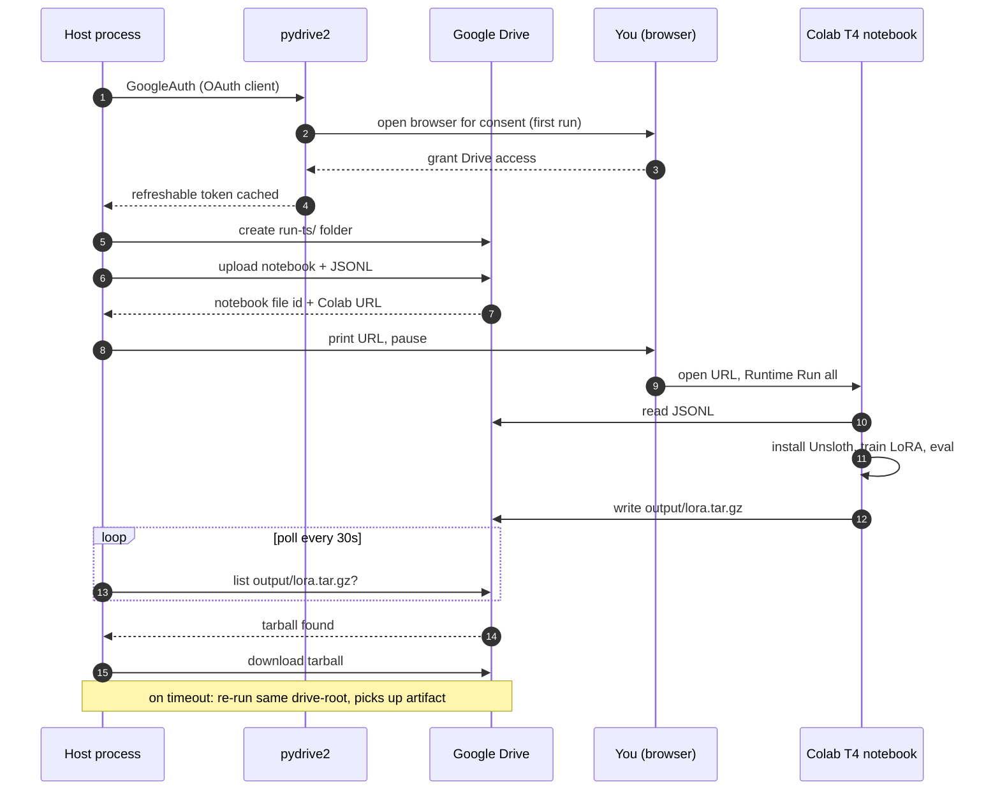

# Example 44 — Free CUDA via Colab + Drive-sync (Gap #8c)

> The audience-pin person — a senior engineer at a 50-500 person SaaS
> told to "add AI to the product this quarter" — has one specific
> bullshit-detector trigger left after they read about the rest of
> the inference spectrum: *"I don't have a GPU and I won't put one
> on a corporate card without proof."* This example removes that
> trigger. A Google account is all you need; Colab gives you a Tesla
> T4 (16GB) on the free tier; the orchestrator wraps Drive-sync so
> the round-trip — upload data, fine-tune, download LoRA — is one
> Python command and one browser click.

This is the **democratization tier** of the inference spectrum
([Gap #8](../../../../../atelier/docs/v1.0/lighthouse-tour.md)). It
is the example that converts the abstract claim *"open-source LLMs
and SLMs are accessible"* into a thing the reader can run in 60
seconds — with no credit card, no AWS account, no infrastructure
team. **This is the example you can run with no credit card.**

## What this proves

Three invariants the audience-pin person needs to see, in plain
English:

1. **The fine-tune actually costs $0.** Colab's free tier is real
   GPU compute. The notebook trains a 4-bit Llama-3.2-3B + LoRA on
   your data on a Tesla T4. The Observatory dashboard still records
   GPU-hour count — `$0.00` doesn't mean *untracked*, it means the
   price column is zero. When you switch to RunPod (Example 47) for
   a bigger run, the same dashboard widens to a non-zero column;
   nothing about the integration changes.
2. **The LoRA actually downloads.** The notebook tars the trained
   adapter and writes it to the same Drive folder the orchestrator
   created. The orchestrator polls every 30 seconds; the moment the
   tarball lands, it pulls it onto your local disk. The artifact
   deploys verbatim via Example 38's Ollama path — same shape as
   Example 47's RunPod download.
3. **The session limit doesn't strand you.** Colab free-tier
   sessions cap at ~12 hours and Google may preempt them sooner.
   The orchestrator bounds its poll wait at the same ceiling and
   prints a recovery path if the deadline lapses: re-run with the
   same `--drive-root` and the orchestrator picks up the LoRA the
   moment it appears, even if the notebook ran on a fresh session.

A clean run trains the LoRA in **~6-10 minutes**, downloads it,
and reports **$0.00 spend** — and the pipeline smoke-test (5 synthetic
held-out samples) confirms ≥80% on those hand-written examples, verifying
the pipeline ran end to end. This is not a generalisation benchmark;
it checks that the fine-tune → deploy → eval path completes without error.

## Architecture

The orchestration is a Drive round-trip with one manual click in
the middle:



Time-ordered flow with the recovery path:



## How to run

### Stub mode — clean machine, 60 seconds, $0 spend

```bash
pip install sagewai
python 44_colab_free_cuda.py
```

Expected: the example prints the orchestration plan, the Drive
folder shape, the Colab URL shape, the free-tier session limits,
the cost story, and the cost-down comparison. Nothing contacts
Google. This is the path the audience-pin person sees first — they
read the integration before they sign in.

Excerpt from the proof block:

```
── Cost story ──

GPU type        : Tesla T4 (16GB) — Colab free tier
Price           : $0.0000/hr — the entire pitch
Expected hours  : 0.13h (8.0 min on T4, 8 samples, 1 epoch)
Expected spend  : $0.000000 — and not by accounting trick

Session budget  : 720 min (Colab free-tier ceiling)
Recovery path   : if Colab disconnects, re-run with the same
                  --drive-root; the orchestrator picks up the
                  LoRA whenever it lands.
```

### Full live path — actually fine-tune on free Colab T4

One-time setup (~10 minutes total):

```bash
# 1. Get a Drive OAuth client (free GCP project, free OAuth client):
#    https://console.cloud.google.com/apis/credentials
#    - Enable Google Drive API
#    - OAuth client ID → Desktop app → download JSON
#    - Save as ~/.sagewai/google-drive-oauth.json
mkdir -p ~/.sagewai
mv ~/Downloads/client_secret_*.json ~/.sagewai/google-drive-oauth.json

# 2. Install pydrive2 for the Drive integration
pip install pydrive2 oauth2client
```

Then:

```bash
python 44_colab_free_cuda.py --live
```

What happens:

1. Browser opens once for the Drive OAuth consent (~30 seconds).
2. The orchestrator creates `SagewaiTraining/run-<timestamp>/` in
   your Drive and uploads the notebook + JSONL.
3. It prints the Colab URL and pauses for one keypress.
4. You open the URL in Colab, ensure the runtime is **T4 GPU**
   (`Runtime → Change runtime type`), click **Runtime → Run all**.
5. The notebook installs Unsloth, fine-tunes the 3B LoRA, evaluates
   on the held-out 5-sample set, and writes the LoRA back to your
   Drive folder.
6. The orchestrator polls every 30 seconds and downloads the LoRA
   the moment it lands — typically 6-10 minutes after you click Run
   all on the notebook.

Override the Drive root or poll deadline if your free-tier ceiling
is lower (newer accounts may see shorter session caps):

```bash
# Custom root folder name
python 44_colab_free_cuda.py --live --drive-root MyTrainingRuns

# Tighter poll deadline (e.g., 60 minutes for a quick smoke)
python 44_colab_free_cuda.py --live --poll-timeout-minutes 60
```

### Expected output (proof section, live run)

```
───  4. The proof — live run  ───────────────────────────────────────────

  Notebook outcome  : completed
  GPU               : Tesla T4 (free) @ $0.0000/hr
  Wall time         : 7.8 min (468s)
  GPU-hours         : 0.1300h (tracked even at $0/hr)
  Spend             : $0.000000  (session budget: 720 min)
  Cloud-call baseline (calculate_cost): $0.000320/call
  LoRA downloaded   : /tmp/sagewai-colab-out-XXX/lora.tar.gz
  Eval accuracy     : 100.0% on 5 synthetic held-out samples (✓ ≥ 80% pipeline smoke-test target)

───  Cost-down: cloud-LLM baseline vs. fine-tuned local  ────────────────

  Cloud baseline    : $0.005000/call (Anthropic Haiku, post-overhead)
  Local (fine-tuned): $0.000000/call (Ollama serves the LoRA)

  At 200 emails/day for 30 days:
    cloud-only      = $    30.00/month ($   360.00/yr)
    after fine-tune = $     0.00/month — the same task costs $0
    one-time spend  = $    0.0000  (this Colab fine-tune)

  Payback           : immediate — the fine-tune cost $0.
                      Every cloud call after this is pure
                      savings.
```

## Real-world use cases

The pattern in this example — *Drive as the bidirectional channel +
one Colab notebook + one browser click* — fits any operator who needs
to verify a fine-tune end-to-end before putting a GPU on a corporate
card. Four people who'd run this in a Saturday afternoon:

### 1. Senior platform engineer at a 200-person fintech SaaS — verify the cost-down pitch before procurement

Your CTO read the Sagewai launch and asked you to "see if the
$25-and-a-weekend cost-down story is real" before approving a RunPod
account through procurement. You have a Google account and one
afternoon.

| Concern | How this pattern solves it |
|---|---|
| I don't want to spend anything just to verify the pitch | $0 — Colab free tier. Notebook + orchestrator do all the work. |
| I want to see real numbers, not synthetic ones | The notebook reports actual training wall-clock + held-out eval accuracy. Numbers go straight onto the internal-pitch deck. |
| If Sagewai disappears, I keep the artifact | The LoRA lives on your Drive AND in the local download dir. No vendor dependency. |

### 2. ML engineer at a 75-person AI-features-of-something startup — private dataset, no managed-service exposure

You own the AI feature for your company's product. The training
dataset is customer-derived; legal will not let it touch a managed
fine-tuning service. You also retrain every two weeks as the dataset
grows, so the iteration cost has to be $0.

| Concern | How this pattern solves it |
|---|---|
| The dataset is yours; you can't upload it to a managed fine-tune service | Data goes through *your* Drive only. The notebook reads it on a Colab T4 you control. No third-party data plane. |
| Iteration cycles need to be cheap — you'll re-train every fortnight | Re-run the orchestrator → new run folder → new LoRA. Each iteration costs $0. |
| The result needs to deploy somewhere | LoRA tarball downloads to local disk; Example 38 (`38_unsloth_finetune.py`) takes it from there to Ollama. |

### 3. Engineering lead at a 100-person devtools company — building the procurement business case

Your team is on an enterprise plan with a cloud LLM that just raised
prices. The CTO asked the team to evaluate cheaper paths. You can't
get a corporate card for RunPod through procurement without a business
case; you can run a quick proof on Colab tonight.

| Concern | How this pattern solves it |
|---|---|
| Procurement won't approve a $5 charge to a new vendor without a business case | Free Colab → real LoRA → real cost-down number → business case. *Then* procurement approves the corporate card. |
| The proof needs to be reproducible by anyone on the team | Re-run the orchestrator with the same data; everyone gets the same LoRA. Same Drive folder is shareable. |
| The result needs to compare apples-to-apples with the cloud baseline | The cost-down section uses `calculate_cost` against the same Haiku price the team is currently paying. Real numbers, same source-of-truth. |

### 4. Backend engineer at a 60-person healthcare SaaS — sanity-check the inference spectrum end-to-end

You're the on-call AI-feature owner. Before you commit to Examples
47 and 48 (RunPod fine-tune + Modal serverless deploy), you want
proof that the full spectrum hangs together at $0 first. If 44
doesn't produce a deployable LoRA, 47 and 48 are not going to save
you on the day.

| Concern | How this pattern solves it |
|---|---|
| I'd rather not trust marketing — I want to run it myself | Stub mode shows you the integration; live mode runs it for $0. The whole pitch is verifiable in one afternoon. |
| If the free tier doesn't work, the rest of the spectrum probably doesn't either | If Example 44 produces a deployable LoRA at $0, Example 47 (~$0.35 GPU bill for a 30-min RTX 5090 run) and Example 48 (~$0.002) become much easier to trust. |
| Whatever I prove on Colab has to deploy on the team's actual stack | The exported LoRA is plain `safetensors` + adapter config; it loads in vLLM, Ollama, and Modal without modification. |

## What you can change

The orchestrator is a thin Drive-sync wrapper. Things you'll swap
for production:

- **Different Drive root.** `--drive-root MyTrainingRuns` keeps the
  default `SagewaiTraining/` clean if you have multiple projects
  sharing the same Drive.
- **Different poll deadline.** `--poll-timeout-minutes 60` for
  quicker giving up; `--poll-timeout-minutes 720` (default) matches
  Colab's free-tier session ceiling. Lower if your account has
  shorter caps; higher if you've upgraded to Colab Pro.
- **Different base model.** Edit cell 5 of the notebook. The
  default `unsloth/Llama-3.2-3B-Instruct-bnb-4bit` is the right
  choice for the free T4 — it fits in 16GB with headroom. For a
  bigger base, switch to a paid Colab tier or use Example 47
  (RunPod) instead.
- **Different fine-tune hyper-params.** Cell 6 — the `SFTTrainer`
  config — is the lever. Defaults match Example 47 so the LoRA is
  comparable; tune `num_train_epochs`, `learning_rate`, or LoRA
  `r/α` for your dataset shape.
- **Different evaluation rubric.** Cell 7 classifies emails by
  greedy-decoding and regex-extracting the urgency. Replace with
  any deterministic eval — exact-match on output JSON, BLEU against
  a reference, semantic similarity. The orchestrator only reads
  `correct/total` from `eval_result.json`.
- **Different deploy target.** This example downloads the LoRA and
  stops. Hand it to Example 38's Ollama deploy step for local
  inference, or Example 48 (Modal serverless) for hosted serving.
- **Different orchestration trigger.** The keypress pause is for
  interactive use. In CI, the orchestrator detects a non-interactive
  shell and skips the wait — drop it into a cron job that runs the
  notebook once a week and hands the new LoRA to your deploy
  pipeline.

## What's exercised

- `pydrive2.auth.GoogleAuth.LoadClientConfigFile` /
  `LocalWebserverAuth` — the OAuth flow with the canonical
  `~/.sagewai/google-drive-oauth.json` path; cached token at
  `~/.credentials/sagewai.json` per the inference-spectrum setup
  doc
- `pydrive2.drive.GoogleDrive.CreateFile` / `Upload` /
  `GetContentFile` — folder creation, notebook + JSONL upload,
  LoRA download
- `sagewai.observability.costs.calculate_cost` — the per-call
  baseline that pairs with the GPU-hour tracker; the Observatory
  dashboard reads both off the same interface so the free Colab
  tier renders alongside the paid tiers without a special case
- The local `GpuSpendTracker` dataclass — accrues
  `$/hr × elapsed_hours`; `price_per_hour_usd = $0.00` for the free
  tier; mirrors Examples 47 + 48's tracker shape so the dashboard
  aggregates without a special case
- The companion notebook `notebooks/44_colab_free_cuda.ipynb` —
  Unsloth 4-bit Llama-3.2-3B + LoRA r=16 / α=32 / 1 epoch / lr=2e-4
  / batch=2; identical hyper-params to Example 47, just running on
  Colab's free T4 instead of a rented RTX 5090
- A graceful-degradation path that runs end-to-end without
  pydrive2 installed (`pip install pydrive2 oauth2client` is only
  required for `--live`)

## What to read next

If you ran this and want to step into the rest of the inference
spectrum:

- **Example 47** (`47_runpod_finetune_orchestration.py`) — the
  next tier up. Same fine-tune on a rented RTX 5090 (~$0.35 GPU bill
  for a ~30-min run at $0.69/hr); no manual notebook step; faster
  iteration; budget-cap watchdog.
- **Example 45** (`45_vastai_marketplace_bid.py`) — Vast.ai's
  budget aggregator. Per-host reliability scoring + ~$0.20-$0.45/hr
  for 24GB GPUs. Right when you want the cheapest *reliable* GPU.
- **Example 48** (`48_modal_serverless_inference.py`) — once you
  have a LoRA, serve it with per-second autoscaling and no
  idle-GPU cost.
- **Example 46** (`46_custom_inference_as_tool.py`) — bring-your-own
  endpoint. Plug in whatever inference you already host (vLLM,
  Triton, your own GKE deployment) as a Sagewai tool/MCP.
- **Example 38** (`38_unsloth_finetune.py`) — the local-CUDA
  fine-tune + Ollama deploy step. The LoRA this example produces
  feeds straight in.
- **Example 36** (`36_autopilot_training_loop.py`) — the Curator
  step that produced the JSONL in the first place. Run it before
  this example to capture training data from your live agents.
- **Example 34** (`34_observatory_cost_tracking.py`) — the
  blended-cost view (cloud-LLM + GPU rental, even when the GPU
  rental is $0) that consumes the numbers this example records.
