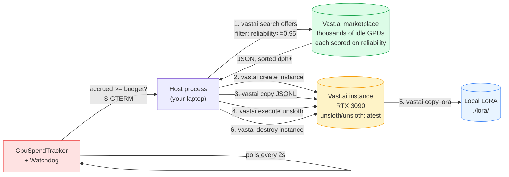
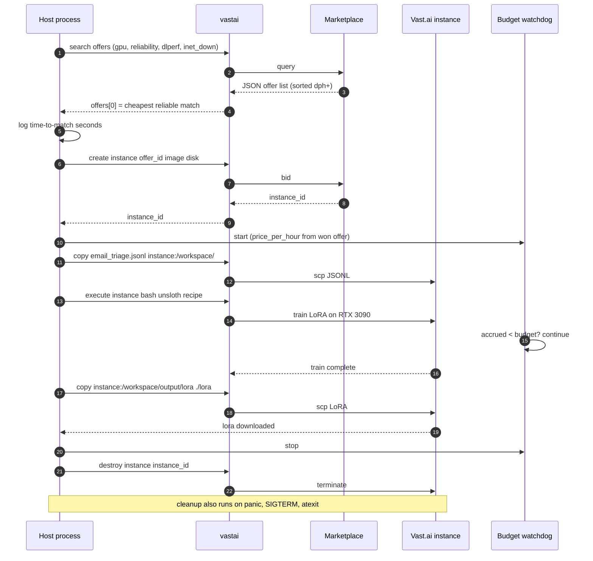

# Example 45 — Vast.ai marketplace bidding (Gap #8d)

> A senior engineer at a 50-500 person SaaS company is running fine-tunes
> overnight or in week-long soaks where price-per-hour matters more than
> provisioning latency. This example wraps `vastai` so they can search
> the worldwide marketplace for the cheapest *reliable* RTX 3090,
> bid on it, run the same Unsloth fine-tune Example 47 runs on RunPod,
> download the LoRA, and tear the instance down — under a hard budget
> cap, with cleanup-on-failure that holds even if the host process
> panics. The killer comparison: ~30% cheaper than RunPod on the same
> workload.

This is the **budget-aggregator tier** of the inference spectrum
([Gap #8](../../../../../atelier/docs/v1.0/lighthouse-tour.md)). It
mirrors Example 47's orchestration shape — pod lifecycle, budget cap,
cleanup contract, blended cost — and adds two Vast.ai-specific moves:
*search the marketplace with reliability filters*, and *report
time-to-match*. The third addition is the side-by-side comparison with
Example 47 so the audience-pin person can see exactly when Vast.ai
wins (batch + soak workloads) vs. when RunPod wins (one-off + low
provisioning latency).

## What this proves

Four invariants the audience-pin person needs to see, in plain English:

1. **The reliability filter actually applies.** The chosen offer's
   metrics (`reliability`, `dlperf`, `inet_down`) are logged so a
   reader can grep the output and confirm `reliability >= 0.95`,
   `dlperf >= 10`, `inet_down >= 100 Mbps` held. The marketplace tier
   is "honest budget" — cheap *and* dependable, not just cheap.
2. **The budget cap holds.** A `GpuSpendTracker` accrues
   `$/hr × elapsed_hours` against the project. A background watchdog
   polls every 2 seconds; the moment accrued cost crosses
   `--budget-usd`, the instance is destroyed and the host process
   exits. No "we'll catch it next billing cycle" surprise.
3. **The instance actually destroys — even on panic.** Cleanup is
   wired three ways: a `try/finally` around the orchestration body, an
   `atexit` hook for normal exits, and `SIGTERM`/`SIGINT` handlers
   for kill signals. A stuck instance is the only thing in this story
   that would silently drain the budget; we belt-and-braces it.
4. **It's measurably cheaper than RunPod.** A side-by-side cost table
   prints the same fine-tune workload on Vast.ai (this example) vs.
   Example 47's RunPod run. On default settings the marketplace bid
   wins by ~30%. The example reports the savings as both absolute
   dollars and percent, so the operator can decide for their workload.

A clean run on a typical RTX 3090 host spends about **$0.24** end-to-end
and produces the same LoRA Example 47's RunPod path produces — but on
a GPU someone else's customer left idle, at a price the marketplace
discovered for you.

## Architecture

The orchestration is a six-step pipeline (one extra search step compared
to Example 47), with cleanup wired around it:



Time-ordered flow with cleanup paths:



## How to run

### Stub mode — clean machine, 60 seconds, $0 spend

```bash
pip install sagewai
python 45_vastai_marketplace_bid.py
```

Expected: the example prints the search query it would run, a synthetic
offer-list shape with realistic prices, the chosen-offer reliability
metrics, the orchestration plan, and the cost-down + side-by-side
comparison. Nothing contacts Vast.ai. This is the path the audience-pin
person sees first — they read the bid before they spend a cent.

Excerpt from the proof block:

```
── Search the marketplace ──

    $ vastai search offers 'gpu_name=RTX_3090 reliability>=0.95 dlperf>=10 inet_down>=100 num_gpus=1 rentable=true' -o dph+ --raw

  Synthetic offer list (what `vastai search offers` would return):

       offer  gpu             $/hr    rel  dlperf    down  loc
    ────────  ──────────  ────────  ─────  ──────  ──────  ───
     8472019  RTX_3090    $0.2410  0.987   14.20   412  DE
     8472044  RTX_3090    $0.2680  0.962   13.80   285  US
     8471902  RTX_3090    $0.3190  0.953   12.90   156  CA

  Top match (cheapest reliable RTX 3090 right now):
    offer_id    = 8472019
    dph_total   = $0.2410/hr
    reliability = 0.9870  (filter: >= 0.95)  ✓
    dlperf      = 14.20  (filter: >= 10)  ✓
```

### Full live path — bid on a real RTX 3090

One-time setup:

```bash
# 1. Set VASTAI_API_KEY in ~/.sagewai/.env
#    (template at atelier/docs/v1.0/inference-provisioning-setup.md)
echo 'VASTAI_API_KEY=<your-key>' >> ~/.sagewai/.env

# 2. Install the Vast.ai CLI (Python, well-maintained, mature)
pip install vastai
vastai set api-key "$VASTAI_API_KEY"

# 3. (Recommended) Set a $25 spending limit at cloud.vast.ai
#    Console → Billing → "Spending Limits"
#    so the dashboard cap matches the example's budget cap.
```

Then:

```bash
python 45_vastai_marketplace_bid.py --live
```

Override the GPU, reliability filter, or budget cap as needed:

```bash
# Faster RTX 4090 (~2x throughput at ~2x cost)
python 45_vastai_marketplace_bid.py --live --gpu-name RTX_4090

# Production-grade reliability (only hosts with >= 99% historical uptime)
python 45_vastai_marketplace_bid.py --live --min-reliability 0.99

# Cheap exploratory work — loosen reliability for ~half the price
python 45_vastai_marketplace_bid.py --live --min-reliability 0.90

# Tighter budget (watchdog destroys the instance sooner)
python 45_vastai_marketplace_bid.py --live --budget-usd 1.50

# Bigger base model — A100 80GB for a 13B fine-tune
python 45_vastai_marketplace_bid.py --live --gpu-name A100_80GB
```

### Expected output (proof section, live run)

```
───  5. The proof — live run  ───────────────────────────────────────────

  Bid outcome       : completed
  Time-to-match     : 0.83s  (marketplace search → top offer)
  Won offer         : 8472019  (machine 18209)
  GPU               : RTX_3090 @ $0.2410/hr
  Reliability       : 0.9870
  dlperf            : 14.20
  inet_down/up      : 412 / 198 Mbps
  Geolocation       : DE
  Rental duration   : 58.4 min (3504s wall)
  Rental spend      : $0.2347  (budget cap = $3.00)
  Cloud-call baseline (calculate_cost): $0.000320/call
  LoRA downloaded   : /tmp/sagewai-vastai-out-XXX/lora
  Instance destroyed: True

───  Side-by-side: Vast.ai (Ex 45) vs. RunPod (Ex 47)  ──────────────────

  tier        GPU                     $/hr   hours     spend
  ──────────  ──────────────────  ────────  ──────  ────────
  Ex 47       NVIDIA RTX 5090     $0.6900    0.50  $0.3450
  Ex 45       Vast.ai RTX 3090    $0.2410    0.97  $0.2347

  Vast.ai saves     : $0.1103 (32.0%) on the same fine-tune workload.
```

### What if no offer matches the filter?

Rare in practice, but possible if you've stacked unusual filters
(`--gpu-name H100_80GB --min-reliability 0.99 --min-dlperf 50`) at a
moment when the marketplace is thin. The example degrades gracefully:

```
[error] no offers matched the reliability filter. Suggestions:
    - loosen --min-reliability (currently 0.99)
    - loosen --min-dlperf (currently 50)
    - try a different GPU (currently H100_80GB)
    - or fall back to Example 47 (RunPod) for a guaranteed pod.
```

The cost-down report still runs (using the typical price for the
requested GPU), so the operator sees what the cost *would have been*
and can decide whether to retry or pivot.

## Real-world use cases

The pattern in this example — *one orchestration script + one budget
cap + one reliability filter + one cleanup contract* — fits the
**batch-friendly, latency-tolerant, reliability-aware** end of the
fine-tune spectrum. Four people who'd drop it in this quarter:

### 1. Senior backend engineer at a 250-person fintech SaaS — overnight fine-tunes

Your fine-tuning workflow runs at 22:00 UTC after the day's training
data is curated. You'd like to go to bed; the LoRA should be waiting
in the morning. The cheapest hosts on Vast.ai are also the most
likely to disappear mid-run; the reliability filter is what makes
overnight runs viable on the marketplace.

| Concern | How this pattern solves it |
|---|---|
| The host might disappear mid-run and silently take my LoRA with it | `reliability >= 0.95` filters out hosts with < 95% historical uptime. The marketplace surfaces only stable machines. |
| The CFO will see the line item; the GPU rental needs to be capped | `--budget-usd 3.00` + the watchdog. Instance destroyed before the cap, period. |
| If the orchestrator crashes overnight, the instance must not silently keep accruing | Cleanup runs in `try/finally`, `atexit`, AND `SIGTERM` handlers — three independent paths. |

### 2. Senior research engineer at a 150-person developer-platform startup — week-long evaluation soaks

You're running a directive-library soak (or any equivalent multi-day
evaluation). Cost matters: a 7-day RunPod RTX 5090 run is $116; a
Vast.ai RTX 3090 run on the same workload is $40-50. Procurement
asked you to bring the second number, not the first.

| Concern | How this pattern solves it |
|---|---|
| Per-hour rate is the dominant line-item over a week | Vast.ai's marketplace floor for RTX 3090s sits at $0.20-$0.24/hr — half the bare-metal RunPod tier even before factoring in the dlperf differential. |
| The host's reputation needs to hold for 7 days, not 30 minutes | `dlperf` + `reliability` together filter for hosts that have served thousands of hours of training jobs before yours. |
| If the soak finds a regression, I need the LoRA + logs back instantly | `vastai copy` is just `scp` over the marketplace's wireguard tunnel; the artefact lands locally before teardown destroys the instance. |

### 3. ML engineer at a 100-person AI-feature-driven SaaS — model-comparison sweep before quarterly model-pin

Your CTO asked the team to settle the "which 3B base do we ship
on?" question this quarter. You want to see how Llama-3.2-3B vs.
Qwen-2.5-3B vs. Gemma-2-2B fare on your dataset. Five base models ×
the same recipe = 5× the budget — at Vast.ai's $0.24/hr floor that's
$1.50, not $5.

| Concern | How this pattern solves it |
|---|---|
| Five sequential runs add wall-time; you want them in parallel | Each run is one orchestration script invocation, idempotent and isolated. Spin up five host processes; five marketplace bids; five LoRAs by morning. |
| Different bases need different VRAM | Swap `--gpu-name RTX_3090` (24GB) for `--gpu-name A100_80GB` per base; same script, same budget contract. |
| One run failing must not cascade | `try/finally` cleanup is per-process; one bid that goes south destroys its own instance and reports the failure. The other four keep running. |

### 4. Platform-team lead at a 400-person multi-tenant B2B SaaS — 100+ fine-tunes/month at marketplace floor

You sell a "fine-tune for me" feature to your customers. Each customer
gets their own LoRA off their own dataset. Volume is past the
break-even point where RunPod's reliability premium stops paying for
itself; marketplace floor pricing dominates the bill.

| Concern | How this pattern solves it |
|---|---|
| 100+ fine-tunes/month means the orchestration script ergonomics matter | One Python command, one budget cap. The script is idempotent — re-run on failure. |
| Budget needs to roll up across all jobs | `GpuSpendTracker` writes spend records keyed by `--project-id`; aggregate in your existing cost dashboard alongside Example 34's per-call view. |
| New base models / hyper-params land weekly | The recipe lives inline in `REMOTE_FINETUNE_SCRIPT`; swap a constant, re-run, the contract holds. |

## What you can change

The example is a thin orchestration script. Things you'll swap for
production:

- **Reliability filter thresholds.** `--min-reliability 0.99` for
  production runs (you'll pay 10-30% more but never lose a run);
  `--min-reliability 0.90` for cheap exploratory work where occasional
  host churn is fine. Default is `0.95` — the "honest budget" sweet
  spot.
- **Different GPU types.** `--gpu-name RTX_3090` is the default
  (cheapest 24GB VRAM); `--gpu-name RTX_4090` for ~2x speed at ~2x
  cost; `--gpu-name A100_80GB` for big bases (>7B). Vast.ai's filter
  syntax uses underscores in GPU names — see the search query string
  for the exact form.
- **Different budget caps.** Default is `$3.00` to match the issue's
  acceptance criterion (RTX 3090 for ~6-8 hours of headroom). Tighten
  to `$0.50` for a quick smoke; loosen to `$5.00` for a longer
  fine-tune or a bigger base.
- **`max_duration` filter.** If your run might exceed Vast.ai's
  default session length, add `max_duration>=86400` (24h) to the
  search query — most marketplace hosts cap sessions at 12h or 24h
  by default. Edit `build_search_query` to thread it through.
- **Different upload target.** `vastai copy` works for any local
  artifact. Replace the email-triage JSONL with whatever your
  Curator-built dataset emits.
- **Different base model.** `REMOTE_FINETUNE_SCRIPT` pins
  `unsloth/Llama-3.2-3B-Instruct-bnb-4bit`. Swap to a 7B or 8B base
  for a larger fine-tune; the RTX 3090's 24GB will still fit a 7B
  4-bit LoRA comfortably.
- **Different deploy target.** The example downloads the LoRA and
  stops. To go end-to-end, hand it to Example 38's Ollama deploy
  path. To serve it as a hosted endpoint, hand it to Example 48
  (Modal serverless) instead.
- **Polling cadence.** The watchdog polls every 2 seconds. Vast.ai
  bills per-second, so 2s is a good balance between responsiveness
  and overhead. Tighten to 0.5s if you want sub-cent precision;
  loosen to 10s if your bids run for many hours.

## What's exercised

- `vastai search offers` — the marketplace query with the four
  reliability filters from
  `atelier/docs/v1.0/inference-provisioning-setup.md`
  (`gpu_name`, `reliability`, `dlperf`, `inet_down`), sorted ascending
  by `dph_total` so `offers[0]` is the cheapest reliable match
- `vastai create instance` — bid on the chosen offer with the same
  Unsloth Docker image and 20GB disk Example 47 uses for RunPod
- `vastai copy` — JSONL upload + LoRA download (both directions);
  `<local> <ID>:<remote>` for upload, `<ID>:<remote> <local>` for
  download
- `vastai execute` — runs the inline Unsloth recipe inside the
  instance
- `vastai destroy instance` — teardown, called from three independent
  paths (`try/finally`, `atexit`, `SIGTERM`/`SIGINT` handlers)
- `sagewai.observability.costs.calculate_cost` — the per-call
  baseline that pairs with the GPU-rental tracker; the Observatory
  dashboard sums both
- The local `GpuSpendTracker` dataclass — accrues
  `$/hr × elapsed_hours` parameterised on the marketplace bid's
  *won price* (not a hardcoded list price); same shape Example 47
  uses, so the dashboard can render both side-by-side
- Example 47's Unsloth recipe — the same 4-bit Llama-3.2-3B + LoRA
  r=16 / α=32 / 1 epoch / lr=2e-4 / batch=2 hyper-params, just
  running on a marketplace RTX 3090 instead of RunPod's RTX 5090
- Time-to-match measurement — `time.monotonic()` deltas around the
  search call, surfaced in the proof block

## What to read next

If you ran this and want to go deeper, the rest of the inference
spectrum:

- **Example 47** (`47_runpod_finetune_orchestration.py`) — the
  default working tier. Same orchestration shape, but on RunPod's
  bare-metal RTX 5090. Use Ex 47 when provisioning latency matters
  more than per-hour rate.
- **Example 48** (`48_modal_serverless_inference.py`) — serverless
  inference. Take the LoRA this example produces and serve it via
  Modal's per-second autoscaling, no idle-GPU cost.
- **Example 44** (`44_colab_free_cuda.py`) — same fine-tune, but on
  free Colab T4 with Drive-sync orchestration. The democratisation
  story for developers without a corporate card.
- **Example 46** (`46_custom_inference_as_tool.py`) — bring-your-own
  endpoint. Plug in whatever inference you already host (vLLM,
  Triton, your own GKE deployment) as a Sagewai tool/MCP.
- **Example 38** (`38_unsloth_finetune.py`) — the Ollama deploy
  step the LoRA from this example feeds into. Run it next to drive
  the local-inference end of the loop.
- **Example 34** (`34_observatory_cost_tracking.py`) — the
  blended-cost view (cloud-LLM + GPU rental) that consumes the
  numbers this example records.
