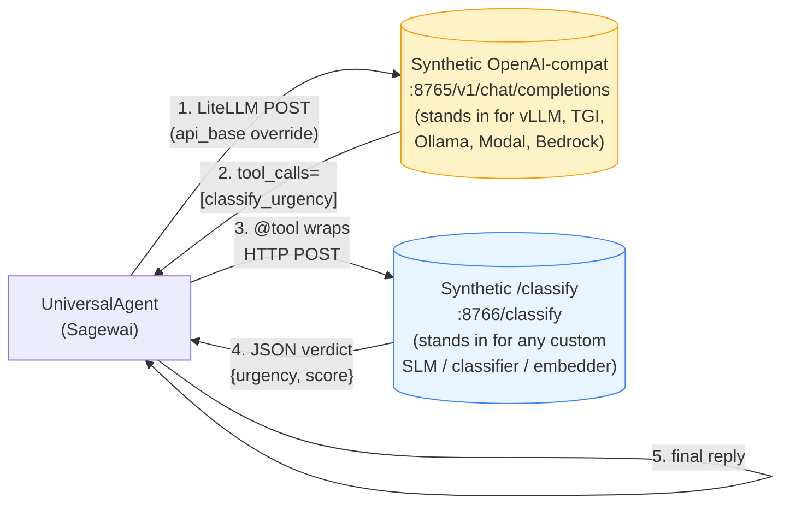
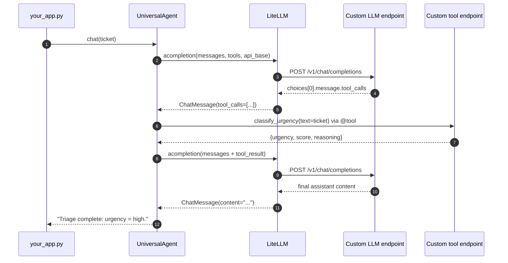

# Example 46 — Custom inference as tool / LLM (Gap #8e)

> A senior engineer at a 50-500 person SaaS already pays for inference
> somewhere — vLLM on GKE, an Ollama on a beefy mini-PC, a TGI on
> HuggingFace Endpoints, a Modal-served LoRA, an AWS Bedrock proxy,
> a Lambda Labs / Vast.ai / Paperspace pod. They will not migrate
> that infrastructure to use Sagewai. Sagewai must integrate with what
> they already have. This example proves it does, two ways: as the
> LLM (LiteLLM-shaped passthrough) and as a tool (MCP-style adapter).

This is the **bring-your-own** tile of the inference spectrum
([Gap #8](../../../../../atelier/docs/v1.0/lighthouse-tour.md)). The
shipped vendors (RunPod, Modal, Colab, Vast.ai) cover the realistic
spread of *"where would a person without a GPU run this?"*. Example 46
covers the operator who already answered that question with their own
endpoint — and now wants to plug it in without rewriting the agent.

## What this proves

Three invariants the audience-pin person needs to see, in plain English:

1. **A custom LLM endpoint is a one-line swap.** Set `api_base` and
   `api_key` on `UniversalAgent`; the agent code stays byte-identical
   to Example 02 (`02_tool_agent`). Works with anything that speaks the
   OpenAI chat-completions protocol — vLLM, TGI, Ollama (OpenAI-compat
   mode), Modal, AWS Bedrock (OpenAI-compat path), self-hosted Triton
   with the OpenAI shim.
2. **A custom tool endpoint is a `@tool` away.** Wrap a non-OpenAI
   inference service — a domain classifier, an embedding service, a
   structured-output SLM — as a Sagewai `@tool`. The agent calls it
   through the same loop it uses for `calculate` or `get_weather`.
   JSON Schema is auto-generated from the type hints.
3. **The two shapes mix.** A single agent uses a custom LLM (cheap
   reasoning) AND a custom tool (specialised classifier) in one run.
   No re-architecture. No second SDK. The agent code does not change.

A clean run on `pip install sagewai` finishes the full three-scenario
demo in **under 3 seconds**, with zero external services and zero API
keys. Two stdlib `ThreadingHTTPServer` instances stand in for the real
production endpoints; the README's configuration matrix below shows
how to swap each one for vLLM / Ollama / TGI / Modal / Bedrock without
changing the agent's Python.

## Architecture

The example boots two synthetic in-proc HTTP servers — one OpenAI-
compatible LLM, one domain-specific classifier — and routes a single
`UniversalAgent` through both:



Time-ordered flow for the mix-and-match scenario:



The synthetic servers exist purely so this README is runnable without
external setup. The `api_base` URL on the agent is the only thing that
changes when you swap them for real production endpoints.

## How to run

### Default — clean machine, ~3 seconds, $0 spend

```bash
pip install sagewai
python 46_custom_inference_as_tool.py
```

Expected: the example boots two stdlib HTTP servers, runs three agent
scenarios (LLM-shape, tool-shape, mix-and-match), and prints the
transcript. Nothing contacts the network. No API keys required.

Excerpt from the proof block:

```
───  The proof — agent transcripts  ─────────────────────────────────────

  Total agent turns recorded : 5  (scenarios A + B + C)
  Custom LLM endpoint        : http://127.0.0.1:8765/v1
  Custom tool endpoint       : http://127.0.0.1:8766/classify
  External services used     : 0 (everything is in-proc)
  API keys required          : 0

  ── Transcript ──

  [A] Cannot log in. My account is locked. I have a deadlin…
      → Reading the ticket as written, urgency is high (high-…
  [B] Cannot log in. My account is locked. I have a deadlin…
      → Triage complete: classifier reported urgency = high.
  [C] You charged me twice for the May invoice. Please refu…
      → Triage complete: classifier reported urgency = high.
```

### Run a single scenario

```bash
# Just the LLM-shape demo (no tool)
python 46_custom_inference_as_tool.py --only llm

# Just the @tool demo
python 46_custom_inference_as_tool.py --only tool

# Just the mix-and-match (custom LLM + custom tool together)
python 46_custom_inference_as_tool.py --only mix
```

### Override the synthetic ports

```bash
python 46_custom_inference_as_tool.py --llm-port 18765 --tool-port 18766
```

The example also auto-falls-back to OS-picked ports if `8765` or
`8766` are busy on your machine — useful when a stale local dev
process is squatting on them.

## Real-world use cases

The pattern in this example — *one `api_base` swap for the LLM, one
`@tool` for non-OpenAI inference* — fits any operator who already runs
inference somewhere Sagewai doesn't ship a vendor for. Three people
who'd drop it in this quarter:

### 1. Senior platform engineer at a 300-person healthcare SaaS — call the in-VPC vLLM cluster

Your SRE team already runs vLLM on a Kubernetes cluster behind your
VPC because compliance won't let patient data touch Anthropic or
OpenAI. You're being asked to ship the AI feature without standing up
a second managed service.

| Concern | How this pattern solves it |
|---|---|
| Compliance won't approve sending data to a third-party LLM provider | The agent points `api_base` at your in-VPC vLLM URL. Data never leaves your perimeter. Same agent code as if it were calling Anthropic. |
| Engineering already standardised on the model name `my-finetune` | LiteLLM accepts any model name with `openai/<name>` prefix; the agent passes it straight through. |
| The vLLM cluster is the cost story; we don't want a second managed service | This integration is one kwarg. There is no managed-service surface area to add. |

### 2. Senior backend engineer at a 200-person legaltech SaaS — TGI + a fine-tuned PII classifier

You serve your main reasoning LLM on TGI (HuggingFace Endpoints,
OpenAI-compatible API), and you've got a fine-tuned BERT-style PII
classifier the security team requires on every legal document. The
classifier costs roughly $0.01/call so you can't blanket-run it.

| Concern | How this pattern solves it |
|---|---|
| The classifier returns JSON, not chat-completions text | It's a `@tool`. JSON in, JSON out. The LLM doesn't need to know the wire format. |
| The classifier costs ~$0.01/call; we shouldn't run it on every prompt | Tools are called only when the LLM decides to. The reasoning model gates the expensive classifier. |
| HuggingFace requires a Bearer token | TGI's OpenAI-compat path takes the bearer via `api_key`. One kwarg, one secret, no SDK shimming. |

### 3. Cloud platform engineer at a 500-person regulated-industries SaaS — AWS-only Bedrock + Lambda-SLM

Your shop is AWS-only by procurement policy: Bedrock for the LLM
(OpenAI-compat shim), Lambda for the custom embedding model. You
have to ship the AI feature without a non-AWS vendor on the bill,
and CloudWatch is the existing observability surface.

| Concern | How this pattern solves it |
|---|---|
| Procurement only approves AWS-native LLM vendors | `api_base` points at the Bedrock OpenAI-compat URL. Everything stays in AWS. |
| The embedding service is HTTP, not OpenAI-shaped | Wrap the Lambda URL as a `@tool`. The agent treats it as a tool call, retry policy and all. |
| We need observability tied into our existing CloudWatch dashboards | Sagewai's observability surface (Example 34) records per-call latency + cost regardless of which `api_base` you use. The CloudWatch side hooks the same OTel exporter. |

## What you can change

This is the **configuration matrix** the issue's acceptance criteria
require. Each row maps a real production endpoint to the exact
`api_base`, model name, and auth scheme to drop into `UniversalAgent`.

### As an LLM (LiteLLM-shaped passthrough)

| Endpoint type | `api_base` example | Model name (kwarg) | Auth |
|---|---|---|---|
| **vLLM** (self-hosted) | `http://your-vllm-host:8000/v1` | `openai/my-finetune` | `api_key="not-required"` (vLLM ignores it) |
| **Ollama** (remote, OpenAI-compat mode) | `http://gpu-box:11434/v1` | `openai/llama3.2:8b` | `api_key="ollama"` (any non-empty) |
| **TGI / HuggingFace Inference Endpoints** | `https://abc-xyz.endpoints.huggingface.cloud/v1` | `openai/tgi` | `api_key=hf_<token>` (Bearer) |
| **Modal-served LoRA** (Example 48) | `https://your-app.modal.run/v1` | `openai/my-lora` | `api_key=<modal-token>` (Bearer) |
| **AWS Bedrock** (OpenAI-compat path) | `https://bedrock.<region>.amazonaws.com/v1` | `openai/anthropic.claude-3-haiku` | SigV4 (via boto + LiteLLM's `bedrock` provider) |
| **Lambda Labs** (Inference API) | `https://api.lambdalabs.com/v1` | `openai/llama-3.2-90b-vision` | `api_key=<your-key>` |
| **Vast.ai vLLM pod** | `http://<host>:<port>/v1` (the host's public IP) | `openai/<model>` | `api_key="anything"` |
| **Paperspace deployment** | `https://<deployment-id>.paperspacegradient.com/v1` | `openai/<model>` | `api_key=<paperspace-key>` |
| **Together AI / Fireworks / Anyscale / Groq** | each provider's `api_base` | `openai/<their-model-id>` | `api_key=<provider-key>` |

Drop into the agent like this:

```python
from sagewai import UniversalAgent

agent = UniversalAgent(
    name="my-agent",
    model="openai/my-finetune",
    api_base="http://your-vllm-host:8000/v1",   # ← only thing that changes
    api_key="<your-key-or-anything-for-self-hosted>",
    system_prompt="...",
    tools=[...],
)
```

The `openai/` prefix tells LiteLLM to dispatch through its OpenAI
client; combined with `api_base`, that client POSTs to your endpoint
instead of `api.openai.com`. The agent never knows the difference.

### As a tool (MCP-style adapter)

When the inference endpoint is *not* OpenAI-shaped — it returns plain
JSON, or scores, or embeddings, or PII annotations — wrap it as a
`@tool`. The agent calls it through the same loop it uses for any
other tool.

| Endpoint type | What it returns | How to wrap |
|---|---|---|
| **Sentiment / classification** | `{label, score}` JSON | `@tool` POSTs the text, returns the JSON |
| **Embedding service** | `{embeddings: [[...]]}` JSON | `@tool` returns a stringified vector or top-k label |
| **PII / safety classifier** | `{has_pii: bool, types: [...]}` | `@tool` returns the structured verdict |
| **Custom SLM with structured output** | task-specific JSON | `@tool` calls the endpoint, returns the JSON |
| **gRPC / Triton / KServe service** | task-specific Protobuf or JSON | `@tool` does the gRPC call, returns the result |

```python
import urllib.request, json
from sagewai import tool

@tool
async def classify_urgency(text: str) -> str:
    """Classify the urgency of a customer-support ticket."""
    req = urllib.request.Request(
        "https://your-classifier.internal/classify",
        data=json.dumps({"text": text}).encode(),
        headers={"Content-Type": "application/json"},
        method="POST",
    )
    with urllib.request.urlopen(req, timeout=5.0) as resp:
        return resp.read().decode()
```

### Other knobs

- **The synthetic servers themselves.** Production replaces them with
  real vLLM / TGI / Modal endpoints; in-proc stdlib HTTP is here only
  so this README runs on a clean machine.
- **The agent's `system_prompt` and `tools` list.** Same as Example 02
  — the example proves the agent shape transfers verbatim.
- **The classifier rules in `_classify_urgency`.** In production this
  is your fine-tuned model; here it's pure-Python so the demo's output
  is reproducible.
- **The ports.** `--llm-port` / `--tool-port` flags or auto-fallback
  if 8765/8766 are busy.

## Verified live on a real Vast.ai vLLM endpoint

The synthetic in-proc stub is the default path for the audience-pin
"clean machine, 60s, $0 spend" promise. To prove the integration also
works against a *real* Vast.ai-rented vLLM, this section records the
end-to-end run that landed alongside the example.

**Setup that worked** (Vast.ai, 2026-05-03):

```bash
# 1. Find a host with a CUDA driver that vllm/vllm-openai:latest accepts.
#    The image needs cuda_max_good >= 12.7 in 2026-05; older drivers
#    crash with "CUDA Error 804: forward compatibility was attempted on
#    non supported HW".
vastai search offers \
  'gpu_name=RTX_3090 reliability>=0.97 cuda_vers>=12.7 \
   inet_down>=200 num_gpus=1 disk_space>=30 rentable=True verified=True' \
  -o 'dph+'

# 2. Avoid CN-region hosts — many can't reach huggingface.co reliably,
#    and the model download stalls forever.

# 3. Create with vLLM tool-calling explicitly enabled. Without
#    --enable-auto-tool-choice + --tool-call-parser, vLLM rejects the
#    LiteLLM tool_choice=auto request with HTTP 400.
vastai create instance <OFFER_ID> \
  --image vllm/vllm-openai:latest \
  --disk 30 \
  --env '-p 8000:8000' \
  --args --model Qwen/Qwen2.5-1.5B-Instruct \
         --host 0.0.0.0 --port 8000 --max-model-len 4096 \
         --enable-auto-tool-choice --tool-call-parser hermes

# 4. Poll /v1/models for HTTP 200 — that is the only reliable readiness
#    signal. `vastai show instance` reports actual_status=running while
#    the inner vLLM process is still loading the model from HF.
until [ "$(curl -s -o /dev/null -w '%{http_code}' http://$IP:$PORT/v1/models)" = "200" ]; do sleep 5; done
```

**Pointing the agent at the live endpoint** (drop-in for the example's
synthetic LLM):

```python
agent = UniversalAgent(
    name="vastai-vllm-only",
    model="openai/Qwen/Qwen2.5-1.5B-Instruct",
    api_base=f"http://{IP}:{PORT}/v1",
    api_key="not-required-for-self-hosted",
    tools=[classify_urgency],
    system_prompt="...",
)
```

**Reference run** (Quebec RTX 3090, Qwen2.5-1.5B-Instruct, vLLM 0.20.0):

| Scenario | Latency | Result |
|---|---|---|
| **A — LLM-only** ("Cannot log in. My account is locked. Deadline at 5pm.") | 1.6s (cold) | `Reply: High` |
| **B — LLM + custom `@tool`** (same ticket) | 0.29s (warm) | `"The ticket requires immediate attention due to the urgent need to unlock the account before a critical deadline."` (tool called: `classify_urgency` → `{"urgency": "high"}`) |
| **C₁ — mix-and-match** (locked-out ticket) | 0.29s | classified high |
| **C₂ — mix-and-match** ("dark-mode option, no rush") | 0.25s | classified low |
| **C₃ — mix-and-match** ("charged twice for May invoice") | 0.49s | classified high |

Total spend across all attempts (including three host failures —
CUDA-driver too old, missing vLLM tool-call flags, China-host
HF-network stall): **under $0.10**.

**vLLM tool-call parser names** (worth memorising for the swap):

| Model family | `--tool-call-parser` |
|---|---|
| Qwen2.5 (Hermes-format) | `hermes` |
| Llama 3.1+ | `llama3_json` |
| Mistral | `mistral` |
| Granite | `granite` |
| Phi-4 | `phi4` |

Full troubleshooting table for the Vast.ai path (driver/CUDA matrix,
quoting gotchas in `~/.sagewai/.env`, interactive `destroy` prompt,
`--args` positioning) lives in
[`atelier/docs/v1.0/inference-provisioning-setup.md`](../../../../../atelier/docs/v1.0/inference-provisioning-setup.md).

## What's exercised

- `UniversalAgent(api_base=..., api_key=..., model="openai/<name>")` —
  the LiteLLM-passthrough surface for any OpenAI-compatible endpoint;
  the *only* thing that changes when swapping vendors
- `@tool` decorator from `sagewai.models.tool` — wraps a typed Python
  function (here doing an `httpx`/`urllib` POST) into a `ToolSpec` with
  auto-generated JSON Schema; the agent loop hands tool calls to it
  the same way it hands them to `calculate` or `get_weather`
- `http.server.ThreadingHTTPServer` — stdlib only. The synthetic LLM
  emits OpenAI-shaped chat-completions envelopes (including
  `tool_calls` with proper `id` / `function.name` / `function.arguments`
  fields); the synthetic classifier returns a JSON urgency verdict
- Cleanup-triple-redundancy: `try/finally` around the demo body, an
  `atexit` hook, and `SIGTERM` / `SIGINT` handlers — three independent
  paths that close the spawned `ThreadingHTTPServer`s and join their
  threads. No port hangs, no leaked threads on the next run.

## What to read next

- **Example 02** (`02_tool_agent.py`) — the agent shape that this
  example proves transfers verbatim to custom LLMs. Run that next to
  see the same code paying for Anthropic instead of a self-hosted
  endpoint.
- **Example 18** (`18_local_llm_routing.py`) — auto-discovery of local
  Ollama / vLLM / Unsloth servers and tier-based routing. The
  policy-driven half of "use my own inference."
- **Example 07** (`07_mcp_tools.py`) — when your custom tool endpoint
  speaks MCP rather than plain HTTP, this is the canonical bridge.
- **Example 47** (`47_runpod_finetune_orchestration.py`) — train the
  LoRA you serve here on a rented RTX 5090 in under $1.
- **Example 48** (`48_modal_serverless_inference.py`) — the bring-
  your-own pattern in this example pairs naturally with Modal-served
  LoRAs from 48: train on RunPod, serve on Modal, plug the Modal URL
  in here as `api_base`.
- **Example 38** (`38_unsloth_finetune.py`) — the local Ollama deploy
  step the LoRA from Example 47 feeds into. Run it next, then point
  Example 46's `api_base` at your local Ollama for the full BYO loop.
